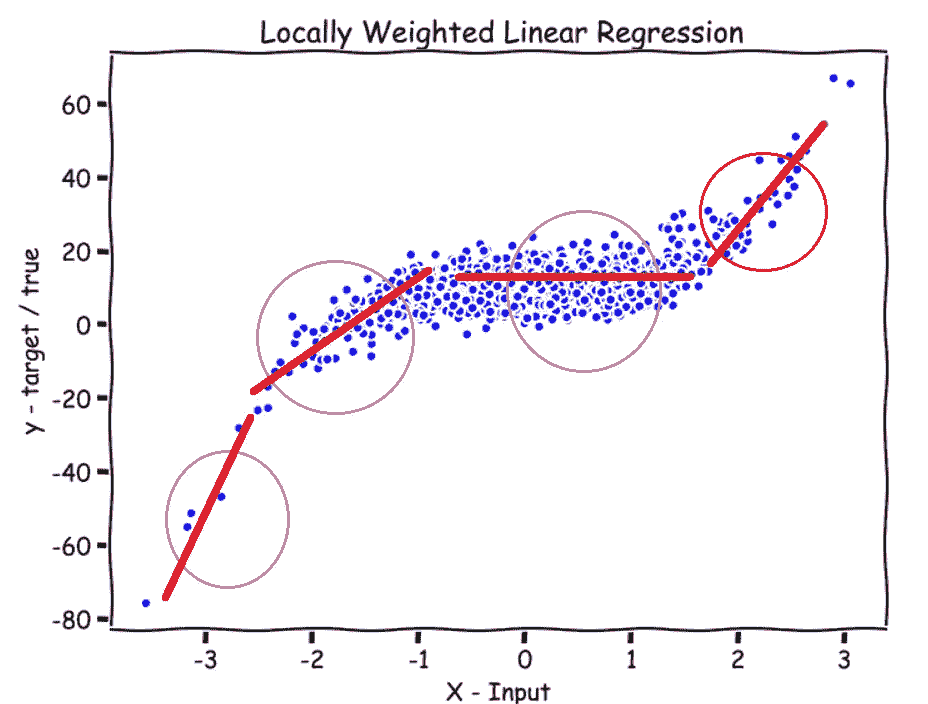
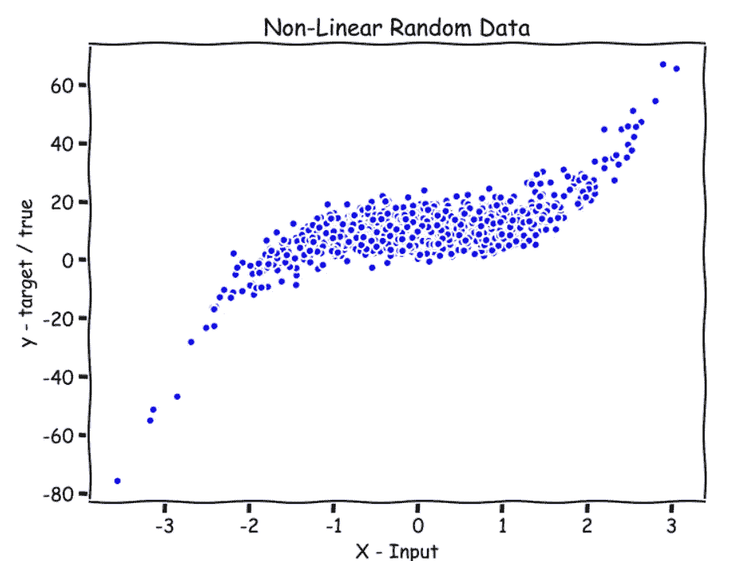
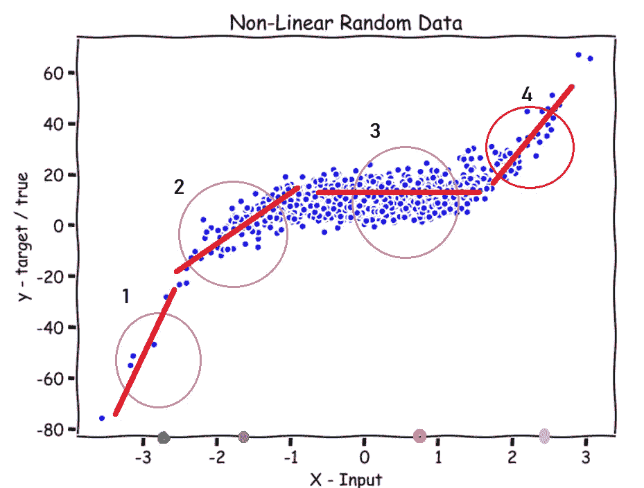
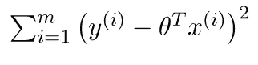
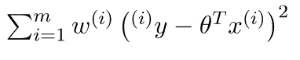
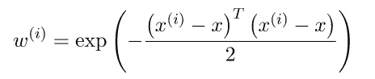
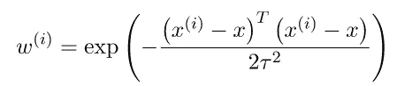
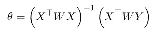
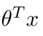
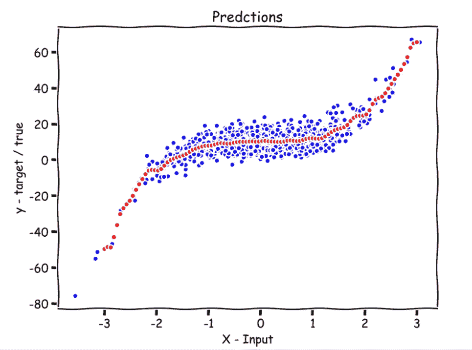

# Python 中的局部加权线性回归

> 原文：<https://towardsdatascience.com/locally-weighted-linear-regression-in-python-3d324108efbf?source=collection_archive---------4----------------------->

## 从零开始的机器学习:第 2 部分



作者图片

在本文中，我们将实现一个名为*局部加权线性回归*的非参数学习算法。首先，我们将看看*参数化和非参数化*学习算法之间的区别，然后理解*加权函数*、*预测函数*，最后*使用 Python NumPy 和 Matplotlib 绘制*预测。

[](https://medium.com/analytics-vidhya/linear-regression-from-scratch-in-python-b6501f91c82d) [## Python 中从头开始的线性回归

### 从零开始的机器学习:第 1 部分

medium.com](https://medium.com/analytics-vidhya/linear-regression-from-scratch-in-python-b6501f91c82d) [](/normal-equation-in-python-the-closed-form-solution-for-linear-regression-13df33f9ad71) [## 使用 Python 的正规方程:线性回归的封闭解

### 从零开始的机器学习:第 3 部分

towardsdatascience.com](/normal-equation-in-python-the-closed-form-solution-for-linear-regression-13df33f9ad71) 

**机器学习从零开始系列—**

*   部分 **1:** [**从零开始线性回归用 Python**](https://medium.com/analytics-vidhya/linear-regression-from-scratch-in-python-b6501f91c82d?source=your_stories_page-------------------------------------)
*   部分**2:**[**Python 中的局部加权线性回归**](/locally-weighted-linear-regression-in-python-3d324108efbf?source=your_stories_page-------------------------------------)
*   部分 **3:** [**正规方程使用 Python:线性回归的闭式解**](/normal-equation-in-python-the-closed-form-solution-for-linear-regression-13df33f9ad71?source=your_stories_page-------------------------------------)
*   部分 **4:** [**多项式回归从零开始用 Python**](/polynomial-regression-in-python-b69ab7df6105)
*   部分 **5** : [**逻辑回归从零开始用 Python**](https://medium.com/p/ec66603592e2?source=post_stats_page-------------------------------------)

# 参数与非参数学习算法

**参数** —在参数算法中，我们有一组固定的参数，如`theta`，我们在训练数据时试图找到(最佳值)。找到这些参数的最佳值后，我们可以将数据放在一边或从计算机中删除，只使用带参数的模型进行预测。记住，模型只是一个函数。

**非参数化** —在非参数化算法中，你必须将数据和参数保存在你的计算机内存中，以进行预测。这就是为什么如果你有一个非常非常大的数据集，这种类型的算法可能不是很好。

# 局部加权线性回归

让我们使用以下随机生成的数据作为动机示例来理解局部加权线性回归。

```
**import numpy as np****np.random.seed(8)****X = np.random.randn(1000,1)
y = 2*(X**3) + 10 + 4.6*np.random.randn(1000,1)**
```



随机数据；作者图片

在*线性回归*中，我们将对该数据拟合一条直线，但这在这里行不通，因为数据是非线性的，我们的预测最终会有很大的误差。我们需要拟合一条曲线，使我们的误差最小化。

# 符号—

`n` →特征数量(本例中为 1)

`m` →训练示例的数量(在我们的示例中为 1000)

`X`(大写)→特征

`y` →输出序列

`x`(小写)→我们要进行预测的点。代号中简称`point`。

`x(i)`→带训练示例

在局部加权线性回归中，我们给模型一个我们想要预测的`x`，然后模型给这个`x`周围的所有`x(i)`一个接近于 1 的较高权重，而其余的 `x(i)`得到一个接近于 0 的较低权重，然后尝试对那个加权的`x(i)`的数据拟合一条直线。

这意味着，如果要预测 x 轴上的绿点**(见下图-1)**，模型会赋予输入数据更高的权重，即`x(i)`接近或围绕绿点上方的圆，而所有其他数据`x(i)`的权重接近于零，这导致模型仅对接近或靠近圆的数据拟合直线。x 轴上的紫色、黄色和灰色点也是如此。



图-1；作者图片

## 读完之后，我想到了两个问题

1.  **如何分配权重？**
2.  **圈子应该有多大？**

# 加权函数(w(I)→第 I 个训练示例的权重)

在线性回归中，我们有以下损失函数—



线性回归的损失函数；资料来源:geeksforgeeks.org

局部加权回归的修正损失—



局部加权线性回归的损失函数；资料来源:geeksforgeeks.org

`w(i)`(第 I 个训练例子的权重)是唯一的修改。

在哪里，



加权函数；资料来源:geeksforgeeks.org

`x`是我们要进行预测的点。`x(i)`是第 I 个训练例子。

***这个函数的值总是在 0 和 1 之间。***

所以，如果我们看这个函数，我们会看到

*   如果`|x(i)-x|`很小，`w(i)`就接近 1。
*   如果`|x(i)-x|`很大，`w(i)`接近 0。

远离`x`的`x(i)`使`w(i)`接近零，靠近`x`的`w(i)`接近 1。

在损失函数中，它转化为误差项，对于远离`x`的`x(i)`几乎乘以零，对于靠近`x`的`x(i)`几乎乘以 1。简而言之，它只对接近`x`的`x(i)`的误差项求和。

# **圈子应该有多大？**

我们在加权函数中引入了一个超参数`tau`，它决定了圆应该有多大。



使用`tau;` 的加权函数来源:geeksforgeeks.org

通过改变`tau`的值，我们可以为圆选择更宽或更窄的宽度。

***对于这里的数学人来说，*** `***tau***` ***是加权函数的高斯钟形曲线的带宽。***

让我们对加权矩阵进行编码。请参见注释(#)。

```
# Weight Matrix in code. It is a diagonal matrix.**def wm(point, X, tau):** 

  # tau --> bandwidth
  # X --> Training data.
  # point --> the x where we want to make the prediction.

  # m is the No of training examples .
   **m = X.shape[0]** 

  # Initialising W as an identity matrix.
    **w = np.mat(np.eye(m))** 

  # Calculating weights for all training examples [x(i)'s].
    **for i in range(m): 
        xi = X[i] 
        d = (-2 * tau * tau) 
        w[i, i] = np.exp(np.dot((xi-point), (xi-point).T)/d) 

    return w**
```

# 最后，算法

实际上，该算法存在一个封闭形式的解，这意味着我们不必训练模型，我们可以使用下面的公式直接计算参数`theta`。



θ的闭式解；资料来源:geeksforgeeks.org

**怎么算** `**theta**` **你问？**

取修正损失函数相对于`theta`的偏导数，并将其设置为零。然后，做一点线性代数，得到`theta`的值。

供参考— [局部加权线性回归的封闭解](http://www.dsplog.com/2012/02/05/weighted-least-squares-and-locally-weighted-linear-regression/)

而计算完`theta`之后，我们就可以用下面的公式来预测了。



预测公式；资料来源:geeksforgeeks.org

让我们编写一个预测函数。查看评论(#)

```
**def predict(X, y, point, tau):** 

   # m = number of training examples. 
   **m = X.shape[0]** 

   # Appending a cloumn of ones in X to add the bias term.
## # Just one parameter: theta, that's why adding a column of ones        #### to X and also adding a 1 for the point where we want to          #### predict. 
 **X_ = np.append(X, np.ones(m).reshape(m,1), axis=1)**    
   # point is the x where we want to make the prediction. 
 **point_ = np.array([point, 1])**    
   # Calculating the weight matrix using the wm function we wrote      #  # earlier. 
 **w = wm(point_, X_, tau)**    
  # Calculating parameter theta using the formula.
 **theta = np.linalg.pinv(X_.T*(w * X_))*(X_.T*(w * y))**    
  # Calculating predictions.  
 **pred = np.dot(point_, theta)**    
   # Returning the theta and predictions 
 **return theta, pred**
```

# 绘制预测

现在，让我们为大约 100 个点(`x`)绘制我们的预测，这些点在`x`的域中。

查看评论(#)

```
**def plot_predictions(X, y, tau, nval):** # X --> Training data. 
   # y --> Output sequence.
   # nval --> number of values/points for which we are going to
   # predict. # tau --> the bandwidth.     
    # The values for which we are going to predict.
   # X_test includes nval evenly spaced values in the domain of X.
 **X_test = np.linspace(-3, 3, nval)**    
   # Empty list for storing predictions. 
 **preds = []**    
   # Predicting for all nval values and storing them in preds. 
    **for point in X_test: 
        theta, pred = predict(X, y, point, tau) 
        preds.append(pred)**

   # Reshaping X_test and preds
   ** X_test = np.array(X_test).reshape(nval,1)
    preds = np.array(preds).reshape(nval,1)**

   # Plotting 
   ** plt.plot(X, y, 'b.')
    plt.plot(X_test, preds, 'r.')** # Predictions in red color. **plt.show()****plot_predictions(X, y, 0.08, 100)**
```



**对-3 和 3 之间的 100 个值的预测显示为红色；作者图片**

**红点是对-3 到 3 之间的 100 个均匀分布的数字的预测。**

看起来不错。摆弄一下`tau`的数值。

# 何时使用局部加权线性回归？

*   当`n`(特征数量)较小时。
*   如果你不想考虑用什么功能。

对于问题、评论、顾虑，请在回复部分进行讨论。更多的 ML 从零开始即将推出。

看看从零开始的机器学习系列—

*   第 1 部分:[Python 中从头开始的线性回归](https://medium.com/analytics-vidhya/linear-regression-from-scratch-in-python-b6501f91c82d?source=your_stories_page-------------------------------------)
*   第 2 部分:[Python 中的局部加权线性回归](/locally-weighted-linear-regression-in-python-3d324108efbf?source=your_stories_page-------------------------------------)
*   第 3 部分:[使用 Python 的正规方程:线性回归的封闭解](/normal-equation-in-python-the-closed-form-solution-for-linear-regression-13df33f9ad71?source=your_stories_page-------------------------------------)
*   第 4 部分:[Python 中从头开始的多项式回归](/polynomial-regression-in-python-b69ab7df6105)