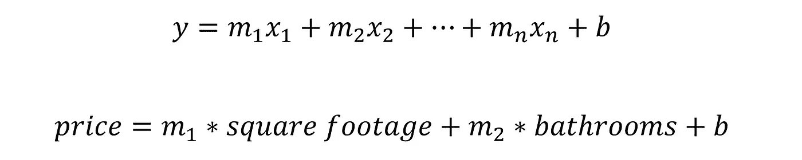
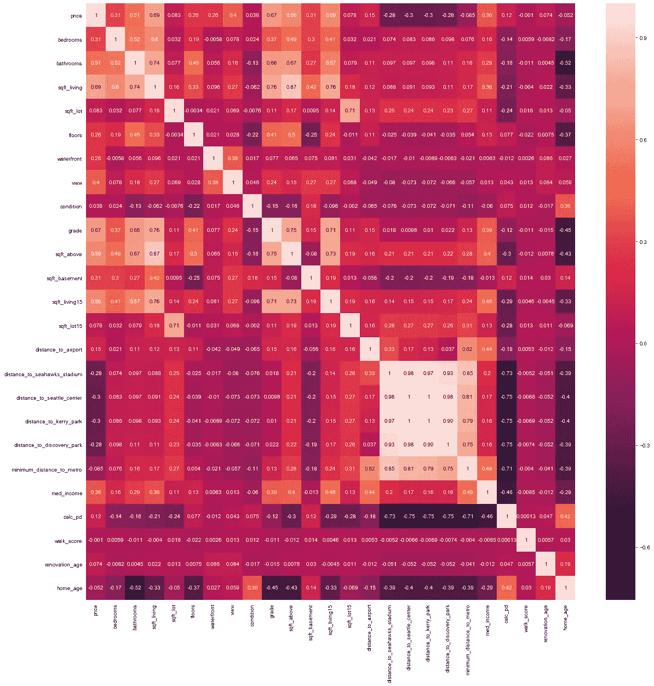
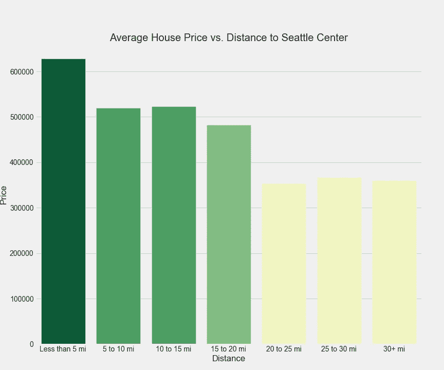
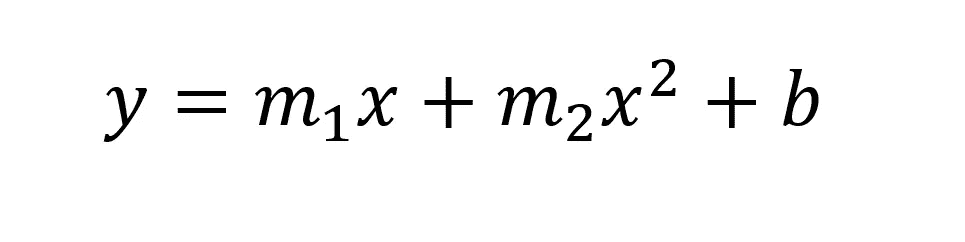
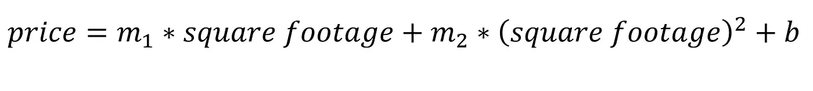

# 位置！位置？位置…

> 原文：<https://towardsdatascience.com/location-location-location-9463f4fe8952?source=collection_archive---------36----------------------->

## 使用回归法对决定房价的最重要特征进行排序

在 [Unsplash](https://unsplash.com/?utm_source=unsplash&utm_medium=referral&utm_content=creditCopyText) 上由[马克西米利安·康纳](https://unsplash.com/@maxconacher?utm_source=unsplash&utm_medium=referral&utm_content=creditCopyText)拍摄的照片

因此，当谈到房地产时，你可能会听到一句古老的谚语“位置，位置，位置”。我知道我在和一个做了几年房地产经纪人的父亲一起长大的过程中听过不止一次。这个短语最早是由哈罗德·塞缪尔在 1944 年创造的，意思是房子的位置极大地影响了它的价格。如果你看过一集《寻房者》,你可能会注意到，靠近市中心的房子可能比市郊的房子贵。当然，我们可以说这个短语的习惯性重复使我们得出结论，位置是决定房价的主要因素。

但是如果位置不是最重要的事情呢？如果我们应该说“平方英尺，平方英尺，平方英尺”或“浴室，浴室，浴室”呢？事实证明，我们可以使用回归来找出哪些特征对确定房子的价格最有影响。我将使用华盛顿金县的住房数据集来调查和回答这个问题。

# 了解简单线性回归

首先，让我们回顾一下回归的一些基础知识。最简单的回归形式可能你已经见过了: ***y = mx + b*** 。我们来分解一下这个公式: ***y*** 是目标变量， ***x*** 是输入变量，m 是斜率， ***b*** 是 y 截距。当应用于我们的住房问题时， ***y*** 是房子的价格， ***x*** 可能是房子的一些特征，比如平方英尺。如果我们继续这个例子，那么我们需要找到斜率 ***m*** 和 y 轴截距 ***b*** 的一些数字，这样将 ***m*** 乘以平方英尺，再加上 ***b*** 就会得到房子的价格。我们如何着手选择一个合适的 m 和 b？我们简单地从猜测开始，将对这些值的猜测代入公式中，得到一个价格。我们的计算价格和实际价格之间的差异就是误差。然后，我们可以用另一栋房子试着用这个等式来计算它的价格，并测量误差。然后，我们可以更新 ***m*** 和 ***b*** 的值，以便尽量减少我们计算的房价中的误差。为了优化最佳拟合线，我们常常希望最小化误差平方和。查看这篇维基百科[文章](https://en.wikipedia.org/wiki/Residual_sum_of_squares)，了解更多关于误差平方和的知识！

# 从简单线性回归到多元线性回归

现在，我们显然不想仅仅用两个例子来定义我们的最佳拟合线。我们也不想仅仅依靠面积，因为我们知道影响价格的因素有很多。因为我们想要合并多个特性，所以我们需要使用多元线性回归。多元线性回归的公式只是简单线性回归的扩展。

多元线性回归(图片由作者提供)

我们可以看到，不是一个斜率 m 和一个输入 x，而是多个斜率和多个输入。有时这些斜率被称为权重，通过检查这些权重的大小，我们可以开始了解哪些特征是最重要的。给定变量的权重越大，该变量对房屋总价格的影响就越大。

# 快速浏览住房特征

为了不使这篇博客太长，我将只解释我们如何确定最重要的特征。让我们先来看看我们开始时的所有变量:

金县房屋特征的相关热图(图片由作者提供)

上面显示的变量使用热图显示。热图向我们展示了每对变量之间的皮尔逊相关系数。数据集提供了每个地产的经度和纬度，我使用 [geopy](https://geopy.readthedocs.io/en/stable/#module-geopy.distance) python 库计算了到金县不同地点的测地距离。到不同地点的距离是我在这个项目中定义地点的方式。您可以看到在热图的右下角有一组米色的高度相关的变量。这些基于位置的变量中的每一个都彼此高度相关，这意味着为了尝试并满足多重共线性的假设，必须丢弃一些变量。我还查看了方差膨胀因子来评估变量之间的多重共线性，并决定使用房子到西雅图中心的距离作为最终的位置度量。同样值得注意的是，在运行一些常规模型和评估 p 值后，热图中的许多其他变量后来都被删除了。

让我们来看看到机场的距离与房价的关系。

相对于位置的住房成本(图片由作者提供)

我们可以看到，当我们考虑房子的价格与受欢迎的市中心和聚会场所的邻近程度时，条形图与我们的直觉相符。离西雅图中心很近的房子比那些离得远的房子要贵。有一个明确的趋势是，随着离西雅图中心的距离增加，房价会下降。虽然我们能够观察到一个趋势，但这不足以决定这个位置指标对决定房子的价格最有影响。

# 关于建模的快速讨论

在我们回答位置是否是房价最重要的因素这个问题之前，我们需要了解我们是如何得出最终模型的。

理解模型构建和模型评估是一个非常迭代的过程是很重要的。选择不同的变量集或不同的阈值来消除异常值将导致完全不同的模型。我们需要对看不见的数据进行重复测试，以便有把握地得出一个模型比另一个更好的结论。

在这篇博客中，我不会详细讲述我为得出最终模型所做的每一个决定，但我发现线性模型实际上并不是最适合我的数据的模型。我选择使用的一些变量不符合同质性假设。我也可以选择使用更严格的阈值和更大百分比的异常值，从而使数据的残差更加正态分布(线性回归的另一个重要假设)。尽管如此，我还是能够使用多项式回归建立一个我认为足够的模型。具体来说，这是一个二次多项式拟合我的数据最好。幸运的是，即使是非线性模型，与变量相关的权重大小仍然会告诉我们哪个变量最有影响力。

让我们来看一个多项式回归的示例公式:

多项式回归的一般示例(图片由作者提供)

如果我们将上面的公式应用到我们之前使用价格和平方英尺的示例中，则结果如下:

多项式回归应用于我们的住房例子(图片由作者提供)

一旦我们确定了这些输入变量的系数，我们就会知道平方英尺或平方英尺的二次幂在决定价格时更有影响力！

# 那么地理位置到底有多重要呢？

让我们首先来看看我们将用来实例化和拟合数据的二次多项式的代码:

我们现在有了一个带有`.coef_`属性的线性回归对象。我们可以将这些系数存储在一个变量中，并从`PolynomialFeatures`对象中获取相应的特性名称。然后我们要做的就是按照系数的绝对值对特征进行排序(我们只关心幅度来确定最重要的特征)。

对于该模型，三个最重要的特征(总共 55 个特征)是:

1.  地上平方英尺
2.  到西雅图中心的距离提高到 2 次方
3.  中等收入

看来哈罗德·塞缪尔是对的！虽然这不是最重要的特征(至少对于这个模型来说)，但靠近西雅图中心是一个很好的指标，可以表明国王县的房子可能有多贵。结果是，第七个最重要的特征恰好是到西雅图中心的距离的一次幂，这只能用来加强 Samuel 所做的陈述。

# 最后的想法

这篇博文中引用的模型只是众多模型中的一个！我可以很容易地选择一个不同的距离度量，看看它作为房价的预测指标有多重要或不重要。靠近交通枢纽或绿地很可能在某种程度上也与房价相关。我们也不必把位置看作是两个地方之间的接近程度。我们可以使用邮政编码作为分类变量，或者使用地理坐标来检查 King County 的房屋是否位于断层带内。另一个关于位置如何影响房价的现代调查可以在这里找到，作者在这里调查了优步是否对某些社区收取更高的乘车费用。

我希望这篇博客能提供一些见解，让我们了解如何利用回归不仅进行预测，还能帮助我们更好地理解某些变量在构建模型时的影响。

感谢阅读！

你可以在这里找到我的整个回归项目[的回购协议。我在这个项目中使用的数据集可以在这里](https://github.com/jeremy-lee93/king-county-housing-regression)找到[。](https://www.kaggle.com/harlfoxem/housesalesprediction)

欢迎任何反馈！欢迎在 [Twitter](https://twitter.com/JALee93) 或 [LinkedIn](https://www.linkedin.com/in/jeremyalee1/) 上与我联系！