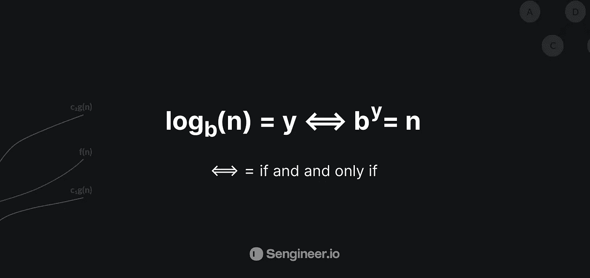

# 复杂性分析中的对数和指数

> 原文：<https://towardsdatascience.com/logarithms-exponents-in-complexity-analysis-b8071979e847?source=collection_archive---------1----------------------->

## 自学成才的软件工程师✨在复杂性分析中掌握对数

来源:[@洛伦佐·埃雷拉](https://unsplash.com/@lorenzoherrera)

# 目录

1.  [对数 101](https://medium.com/@humamaboalraja/logarithms-exponents-in-complexity-analysis-b8071979e847#5ad2) 🧮
2.  [我们需要了解的先决条件](#dbb3)📚
3.  [计算机科学和二进制对数](#26d2)💻
4.  [为什么计算机科学中的对数大多是二进制对数](#9600)？
5.  [该关系及其在复杂性分析方面的意义](#e39a)⏱
6.  [比较渐近线图上的对数函数和线性函数](#9063)📈
7.  [最后的金例:✨二分搜索法](#237c)
8.  [结论](#559a)
9.  [参考文献](#b53a)

我为那些对数学及其与计算机科学、复杂性分析、竞争性编程、编码面试等的关系感到不知所措的人写了这篇文章…我试图解释你在复杂性分析方面理解对数所需要的每一个细节，它特别针对自学的软件工程师/开发人员和任何没有扎实数学背景的人！这将是我的第一篇媒体文章，它将是一系列其他即将到来的文章，所以请原谅我，希望你喜欢它💜

# 1 -对数 101 🧮

**对数或对数:**一个在计算机科学中经常使用的数学概念/表达式，它是指数的逆(翻转)，它们被用来回答这样一个问题:一个“基数”数必须乘以多少次才能得到另一个特定的数**或**(你必须提高到什么幂，才能得到另一个数)**或**我们也可以把它定义为**的幂**(或指数)

**举例**:20 的基数要乘以多少次才能得到**8000**？答案是**3**(**8000*= 20×20×20***)。所以**8000**的对数底数 20 就是 **3** 。它是用基数右下角的下标(小数字)来表示的。所以语句应该是 **log20(8，000) = 3** 。

*   **log20(400)** 就像问“我们乘以多少个**20**才能得到 **400** ？也就是 2(20 * 20)。所以 **log20(400) = 2**

对数使用以下公式定义:

b =底数| y =指数| n =幂(b 乘以 y 的幂得到的结果)

# 2 -我们需要了解的先决条件📚

*   **指数:**一个数字，标识该基数或表达式必须乘以自身的次数，它显示为一个上标(某个其他“基数”或数学表达式右上角的微小数字)。
*   **基数**:在对数语句中，一个基数是一个要被自身相乘的数学对象，它被表示为该基数右下方的一个下标，或者被一个指数所要求的次数，该指数被写为该基数右上方的一个上标
*   常用对数:以 10 为基数的对数。它用于测量声音、电和光等。
*   **log:** (数学中)对数的缩写。
*   **二进制对数:**底数为 2 的对数。二进制对数是二进制数字系统的基础，它允许我们只用零和一的数字来计数，它们非常重要&在计算机科学中非常普遍。

# 3 -计算机科学和二进制对数💻

最初，我们必须理解一些可能不明显的东西，如果你以前见过表达式***O*(*log n*)**关于复杂性分析，当我们谈论对数时，我们必须指定一个底数。

所以这里的底数是“***”b****”*它就像一个小小的“***”b****”*就在圆木的正下方，这一点非常重要。

*   因为举例来说，如果我们写 10 的以 5 为底的对数，然后我们写 10 的以 10 为底的对数，我们会得到非常不同的结果，因为等式会不同。这里的“***b****”*不是 5 就是 10。

这就是我们必须理解/认识到的地方，在计算机科学和编码面试中，当我们说 log n of 时，我们总是假设底数是 2，假设我们处理的是所谓的**二进制对数**，它是底数为 2 的对数(正如我们在先决条件中提到的)，除非它被指定为其他底数。

# 4 -为什么计算机科学中的对数大多是二进制对数？

因为在计算机科学中，对数大多是通过将一些**数据输入**(如列表、数组等)重复分成两半来实现的，这通常发生在如下算法中:

*   像二分搜索法、快速排序、最近点对、合并排序等分治算法…

在这些情况下，在使用单元素数组之前，将长度为 **n** 的**数据输入**(如列表、数组等)分成两半的次数是 log₂ n

在计算机科学中，指数增长通常是我们提到的分而治之这样的离散过程的结果。因此，我们通常使用 log2 n 作为对数函数，因为它出现得如此频繁。

但是澄清一下，不要混淆任何人，我们大多数时候使用二进制对数的事实并不意味着我们在计算机科学中总是只使用以 2 为底的对数。只是处理二进制数或将输入数据分成两半的情况很常见，这就是为什么以 2 为底的对数在很多情况下最终会成为默认对数，而且一般来说，**你选择哪个底真的无关紧要**。因为例如:

*   在 Big-O 符号(上限增长)中，所有对数都是渐近等价的(唯一的区别是有乘法常数因子)；

所以我们通常在写 O(log n)这样的东西时甚至不指定底数，因为我们总是假设对数是二进制对数，意思是以 2 为对数底数的对数，所以这里甚至不写底数 2。

> P 。对于那些有数学背景的人来说，当你说 N 的对数时，你可能习惯于使用基数 **10** ，这是数学中常用的。
> 
> 如果你已经习惯了这一点，请记住，对于计算机科学和编码面试来说，除非另有说明，否则你通常会处理以 2 为底的对数。

# 5 -关系及其在复杂性分析方面的意义

正如我们之前提到的，它基本上意味着 log(n)是你需要将 2 乘以的幂，从而得到"***" n "***。

> **因此，当且仅当数字 2 的 y 次方等于 n 时，n 的以 2 为底的对数等于 y。**

*   例如，这意味着 1 等于我们需要用 2 来得到 1 的幂。这个幂是 0。***log*(*1*)*= 0***因为 2 的 0 次方等于 1: **log(1) = 0，2⁰ = 1** ，其他例子:
*   8 的 log 将是:***log*(*8*)*= 3，2 = 8***
*   16 的日志将是: ***日志* ( *16* ) *= 4，2⁴ = 16***

因此，要找到对数或二进制对数，我们必须问自己，2 的幂等于多少？如果我们解决了这个问题，那么我们会找到 ***日志*** ***n*** 。

那么这意味着什么呢？🙄

让我们来看看 2 的幂，当我们增加 2 的幂时，我们实际上是在把之前的数翻倍，对吗？！

如果我们有数字 ***2*** 的 ***x*** 的次方，我们有 **2** 的 **(x+1)** 的次方，我们就是把那个数字乘以 2 或者加倍，对吗？

*   **举例**:***2⁷=2⁶******2***2 的 6 次方是 64。64 乘以二是 128，也就是 **2** 的 **7** 次方。所以，每当我们把 2 的指数增加到 1 的幂，我们就把这个数字翻倍了。那真的很重要。

换句话说，当我们把数字 ***N*** 翻倍的时候，我们只是把这个问号增加了一个。太简单了，对吧！🤞🎸

*   **例#2:** 假设我们有 **2⁴ = 16** ，现在你把 16 翻倍，也就是上图中这里的数字 n，我们把 16 翻倍到 32，我们要做的就是把指数加 1**2⁵= 32**

**重述**:所以在这张关系图中我们可以看到，问号的 2 次方等于 ***N*** 。随着 ***N*** 翻倍问号只增加一个。甚至当 ***N*** 很大的时候。如果我们试着把指数再提高一点，我们会看得更清楚。例如，如果我们写出 2 的 20 次方。例如

*   2 ⁰ =1，073，741，824 | **2⁴⁰ = 1，099，511，627，776** 我们只增加了 10 个指数。

所以展示所有这些例子的目的是，N 增加得越多，图中的指数或问号就会增加一点点，因为这个关系， **2** 的**次方？**等于 ***N*** ，相当于***log(N)*****=****？**，这就告诉我们 *log(n)* 到底代表了什么！😀❤️

***log(n)*** 只随着 **N** 的增加而少量增加。当 **N** 翻倍时， ***log(n)*** 只增加 1。这就是为什么，当我们有一个时间复杂度为 *log(n)* 的算法时，如果我们将其与复杂度分析联系起来，这是非常好的，因为这意味着随着输入的增加/加倍，我们在算法中执行的基本运算的数量只增加一个。

> **对数时间复杂度** ***log(n)*** :用大 O 符号表示为 **O(log n)** ，当一个算法的运行时间为 O(log n)时，表示随着输入大小的增长，运算次数增长非常缓慢。**例子:**二分搜索法。

所以我想现在你很清楚了，一个 ***【对数(n)*** 复杂度比一个**线性复杂度 O(n)** 要好得多。即使 **O(n)** ，线性时间对于一个算法来说已经很不错了。***【log(n)***随着输入量的增加，时间会变得更好。

# 6 -在渐近线图上比较对数函数和线性函数📈

如果你熟悉 Big-O 复杂度图，你可以看到这里的 x 轴代表数字 **N** 。

线性函数的复杂度看起来类似于 ***O(n)*** ，其中复杂度随着 **N** 线性增加。

*   所以当 **N** 等于比方说十亿。这条线会有 10 亿。
*   而 O(log n)函数，正如你在渐近图中看到的，它在最开始时上升，正如我们前面提到的，**log(1)= 0—****log(4)= 2—****log(8)= 3**。
*   因此，一开始它会适度增加，但这里输入越大，(N 增加越多)，log(n)函数变化越小。就像我们上面说的，当 N 是一百万时，log(n)只有 20。
*   即使 N 是 10 亿，log(n)仍然只有 30。只会增加 20 英镑。

这就是 log(n)如此强大的原因，因为 log(n)的复杂性实际上代表了一种不会随着输入大小的增加而快速增加的复杂性。

# **7 -最后的金例:✨二分搜索法**

> 二分搜索法只能处理排序后的数据(列表、数组等)

**二分搜索法**是一种高效的区间搜索算法，可以在有序列表中搜索想要的目标。

示例:

*   让我们假设我们有一个**1024**元素的列表，我心里有一个数字，你必须尽可能少地猜出来
*   每猜一次，你就会知道，你的猜测是过高、过低还是正确。

*   您可以使用的一种方法是以线性方式开始猜测，比如说:它是 0 吗，如果太低，您会说 1，如果太低，您会说 2，以此类推，这种方法被称为线性方法，基于我们目前所知的线性时间和对数时间之间的差异，我们可以做得更好，对吗？！

另一种(更好的)方法是，我们从中间元素开始，而不是从第一个元素开始，如果它太低，那么我们可以去掉一半的输入，对吗？！😀

*   现在，在我们的猜测低于干燥的数字之后，因为我们知道 0 到 512 都低于我们想要猜测的数字，我们的下一个猜测将遵循相同的方法，我们将搜索空间剩下的一半，在这种情况下，我们的第二个猜测将是 **768**
*   768 太高了，但再次发生的是，我们从搜索空间的数字中削减了一半

这就是二分搜索法的工作方式，它开始在输入(数组、列表等)的中间搜索想要的元素..)，然后向右或向左移动，这取决于您要查找的值是更大还是更小，正如我们看到的，它在每次迭代中减少搜索空间中剩余数字的一半。

*   所以现在在这种情况下，我们的下一个猜测是在 **512** 和 **768** 之间
*   因此，现在我们看到，在线性搜索的情况下，使用具有对数时间复杂度的二分搜索法，最多需要 **10** 步来获得我们想要的期望值，而不是 **1，024** 线性运算
*   另一个例子:假设我们在一个 **1，073，741，824 个**项目列表中寻找想要的值，如果我们想要寻找我们想要的值，并且它在列表的末尾，如果我们想要使用线性方法，那么我们必须迭代 **1，073，741，824 次**才能得到想要的值。另一方面，如果我们想以一种**对数**的方式使用二分搜索法来做这件事，那么我们最多需要 **log₂n** **30** **的猜测，**令人吃惊吧！🤯 🎉

现在我们已经知道了二分搜索法是如何工作的，让我们看一个代码示例，来巩固我们对算法的理解:

最后，因为二分搜索法在每次迭代中把输入分成两半，所以它运行在对数运行时:O(log n)。

一般来说，当我们有一个在每次调用时将数据分成两半的算法时，我们最有可能处理的是对数运行时:O(log n)。

# 结论

[https://giphy.com/gifs/filmeditor-宿醉电影-3 owzw 5 C1 tpq 63 pmwk](https://giphy.com/gifs/filmeditor--the-hangover-movie-3owzW5c1tPq63MPmWk)

好了，各位，希望这篇文章很有见地，你们读得很开心，并且没有让你们不知所措，这篇文章将是我很快会写的一系列关于计算机科学主题的文章，比如(复杂性分析、软件工程、分布式系统等等..)，如果您有任何意见、反馈或您只是喜欢它，一般来说，您的反馈是值得赞赏的。祝您好运💫

# 参考资料:

<https://stackoverflow.com/questions/42568658/why-are-logarithms-in-computer-science-presumed-to-be-base-2-logarithms>  <https://www.sciencenewsforstudents.org/article/explainer-what-are-logarithms-exponents> 