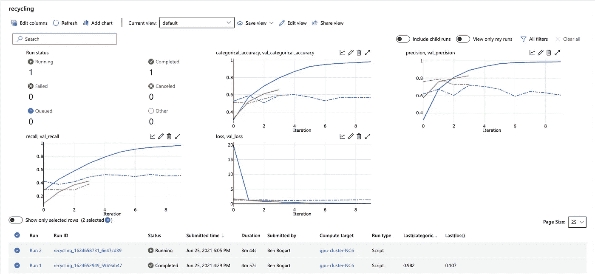
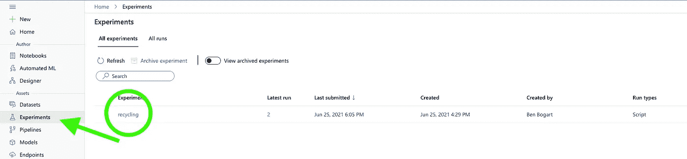
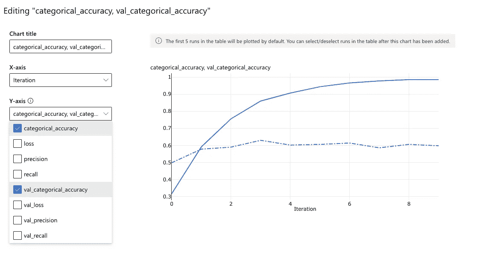
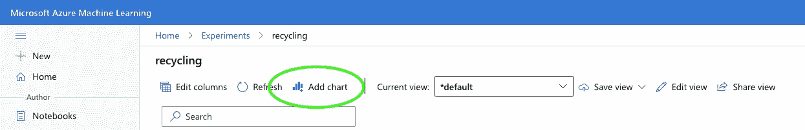

# 将张量流(Keras)度量记录到 Azure ML Studio

> 原文：<https://towardsdatascience.com/logging-tensorflow-keras-metrics-to-azure-ml-studio-in-realtime-14504a01cad8?source=collection_archive---------17----------------------->

## 使用自定义 Keras 回调的实时方法。



作者图片

在 Azure 的机器学习工作室上训练一个 TensorFlow/Keras 模型可以节省很多时间，尤其是在你没有自己的 GPU 或者数据集很大的情况下。似乎应该有一种简单的方法可以在 Azure ML Studio 的仪表盘中跟踪你的训练指标。嗯，有！它只需要一个简短的自定义 Keras 回调。

如果你是在 Azure 上训练 TensorFlow 模型的新手，可以看看我的文章“[使用 Azure Machine Learning SDK for Python 在云 GPU 上训练](/train-on-cloud-gpus-with-azure-machine-learning-sdk-for-python-967c99418df1?source=your_stories_page-------------------------------------)”它从头开始，从头实施整个培训工作流程。然而，这篇文章假设你了解基础知识，并将只关注将你的指标记录到 Azure 的必要工具。

在该项目的 GitHub 资源库的`examples`文件夹中有一个工作代码示例，演示了本文中的工具。回调本身在`log_to_azure.py`文件中。

[](https://github.com/benbogart/azure-tensorflow-callback) [## 本博加特/azure-tensor flow-回调

### 此时您不能执行该操作。您已使用另一个标签页或窗口登录。您已在另一个选项卡中注销，或者…

github.com](https://github.com/benbogart/azure-tensorflow-callback) 

# azureml.core.Run 对象

在查看回调之前，您需要一个`azureml.core.Run`对象来告诉您的回调在哪里记录指标。从 azure 训练脚本中获取 Run 对象非常简单。下面的代码完成了这个任务。

```
from azureml.core import Run
run = Run.get_context()
```

这只有在模型运行在 azure 上时才有效。如果你在本地运行你的脚本，你会得到一个错误。

# 回电

剩下的就是实现一个简单的 Keras 回调，在每个训练期结束时将我们的指标记录到 Azure ML Studio。这种方法几乎等同于使用 TensorBoard 回调来存储 TensorBoard 的日志文件，只有一个例外:您需要传入一个`azureml.core.Run`对象，该对象告诉我们的类将日志发送到哪里。幸运的是，你已经从上面的部分！

我帮你写了回电😁。在这里。

# 履行

像任何其他 Keras 回调一样实现回调。

1.  首先下载 log_to_azure.py 文件到你的`training_script`目录。
2.  导入`LogToAzure`回调类。
3.  将 LogToAzure 回调添加到您的培训脚本中。

```
from log_to_azure import LogToAzure...# add LogToAure custom Callback
callbacks = [LogToAzure(run)]# fit model and store history
model.fit(train_generator, 
          validation_data=val_generator,
          callbacks=callbacks,
          epochs=10)
```

# 在 Azure ML Studio 中查看指标

现在，当您运行您的模型时，您的指标将被记录到 Azure ML Studio 中。最后一步是在*实验仪表板*中设置您的“图表”,以便您可以可视化指标。

您发送到 Azure 的指标在至少记录一次后才能在图表中使用，因此您**必须等到第一个纪元完成**后才能执行以下操作。

*   转到您的实验页面。我们称我们的实验为`recycling`。



作者图片

*   您可以从编辑实验仪表板上已经存在的图表开始。单击图表右上角的铅笔图标。
*   当然，你可以以任何对你有用的方式修改图表。但是我想在同一张图表上看到培训和验证的准确性，所以我将选择 y 轴上的那些指标，如下所示。可以把`iterations`留在 X 轴上。如果您愿意，可以给图表取一个聪明的名字。



作者图片

*   编辑完现有图表后，您可以在页面顶部添加一个带有`Add chart`图标的新图表。



作者图片

最后，**不要忘记保存视图。**如果不保存视图，下次查看页面时，您必须重新设置图表。点击`Save view.`保存到默认视图

# 结论

就是这样。现在你可以在 azure 上实时跟踪和比较你的模型的训练进度。它看起来像这样:


如果你需要帮助来开始在 Azure 上训练你的模型，可以看看我的另一篇文章:“[使用 Azure Machine Learning SDK for Python](/train-on-cloud-gpus-with-azure-machine-learning-sdk-for-python-967c99418df1?source=your_stories_page-------------------------------------)在云 GPU 上训练。”

现在去做点好事吧。