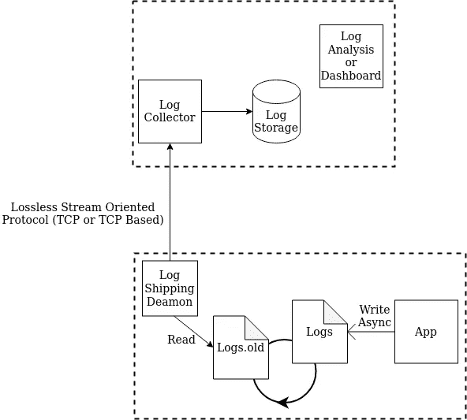
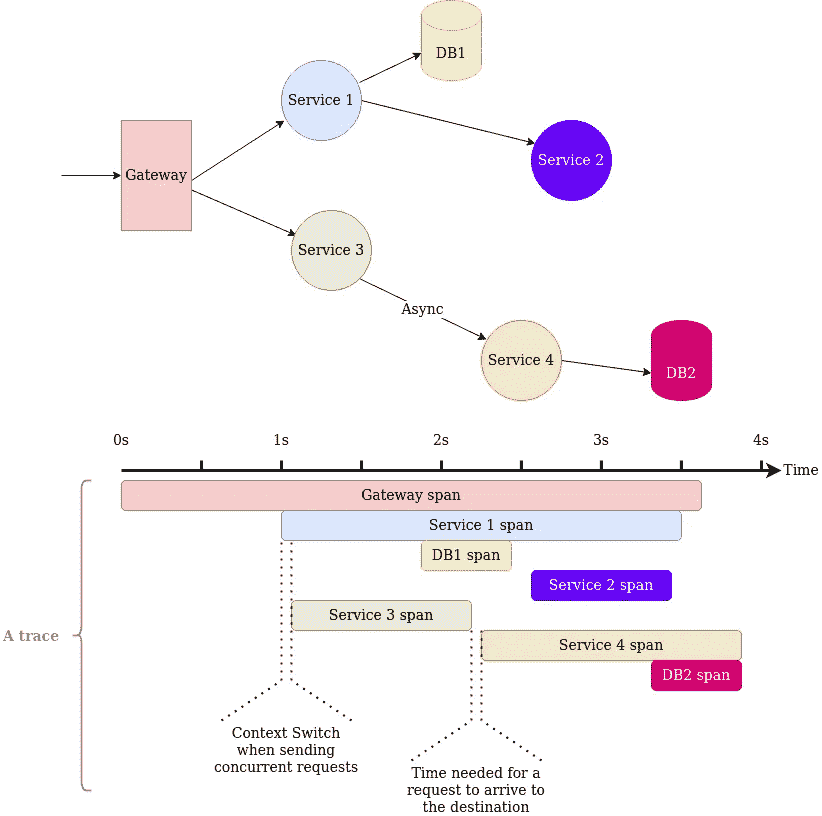
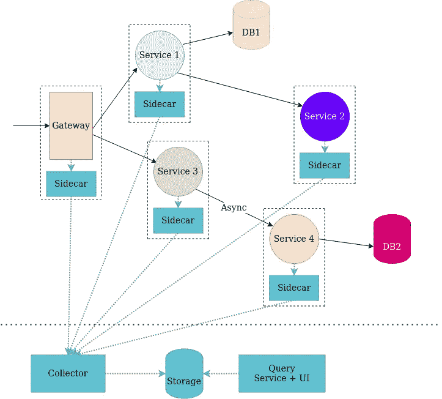

# 记录、追踪、监控等。

> 原文：<https://towardsdatascience.com/logging-tracing-monitoring-et-al-2da0b50d646b?source=collection_archive---------28----------------------->

## 那么，你想在生产中发布你的代码/应用/系统吗？

等等，在你这么做之前，问问你自己这个问题:*如果事情变糟了，我怎么知道***到底发生了什么？**

*的确是个好问题。*

*更有经验的工程师可能会说: ***我会用日志！！！但是如果我告诉你，圆木只是乞讨呢？****

> **【免责声明时间】*这篇文章不是关于一些具体的技术、框架或库，虽然它引用了其中的一些。它更多的是关于什么是日志/跟踪等以及在设计和操作软件系统时如何处理这些的概述/技巧。这里的信息主要基于我自己的经验，但也来自论文和行业博客帖子中的信息。你可能需要在阅读时/阅读后谷歌一些资料，尤其是如果你从未在生产中运行过系统。*

# *第一幕:我会建立日志，好吗…*

*那么，究竟什么是日志呢？*

**

*资料来源:https://media.giphy.com/media/xUOxfbAOLZmR356YgM/giphy.gif*

*从技术上来说，这是一个日志，但我想谈谈其他种类的日志。*

> ****日志是关于系统中某个事件的记录****

*很抽象，是吧？日志就像日记中关于发生的事情的条目，可能有一些上下文。有点像苹果记者在 WWDC 发布会上的推特。你有时间，你有刚刚发生的事情的记录，也许你也有背景。现在，玩笑归玩笑，日志对于在生产中运行的系统是必要的。它们可以帮助您发现应用程序崩溃前发生了什么。或者恶意活动。或者其他东西。但是我们如何制作好的 T21 原木呢？*

# *优秀日志消息的原则*

*那么，我们应该如何设计我们的日志呢？以下是一些原则:*

*   *你的日志必须是分层次的:我们需要尊重和其他层次的区别。当`INFO`或`DEBUG`日志更合适时，我们不应该用`WARNING`日志来塞满系统。拥挤也指日志包含多少信息。也就是说，`ERROR`日志的一个好主意是记录尽可能多的信息以帮助调试。使用`DEBUG`级日志来记录关于程序正在使用什么设置的信息，甚至一些子程序正在使用多少时间或资源，但是不要滥用它。至于`INFO`日志，介于两者之间。比如关于对 HTTP 服务器中的顶级路由处理器的调用的信息。另外，`INFO`日志是在系统中使用打印的正确方式。*
*   *你的日志必须是信息丰富的:一个好的经验法则是记录所有可能帮助你调试系统的事情。如果发生错误，您会希望记录回溯。此外，记录错误发生的上下文将被证明是有用的。关于上下文，我指的是一些周围的变量，这些变量可能与失败有关。如果您的系统正在运行多个进程，或者是多线程的，或者不管是什么，请帮自己一个忙，记录 PIDs 线程 id。最后，要非常小心你表示时间的方式，解释为什么需要一整个博客，但是计算机系统中的时间是一种痛苦，[自己看吧](https://www.youtube.com/watch?v=-5wpm-gesOY)。*

```
*ERROR: Error name, message, traceback, variables in scope is possible
WARNING: Warning name, message
INFO: Calls to top-level functions/handlers, like: [2021-05-17 00:06:23] INFO: GET /posts 200 OK
DEBUG: Program setup/initialization info, possibly memory or performance information*

*: more on that later*
```

*   *你的日志必须是**可过滤的**:日志是用来分析的。尽可能让它们变得可搜索。考虑将它们格式化为 JSON 文档，不要滥用嵌套。*

*为什么不呢？如果 JSON 嵌套太多，那么搜索/分析就会变得很困难，违背了它的目的。*

*例如，Elasticsearch 无法正确索引具有两层或多层嵌套的 JSONs。也就是说，可以对类似以下示例的内容进行索引:*

```
*{"timestamp": "2021-05-18T21:09:54Z", "level": "error", "msg": "bad thing happened"}*
```

*甚至像这样的事情:*

```
*{"timestamp": {"date": "17th May, 2021", "time": "11:30:30am"}, "level": "error", "msg": "bad thing happened"}*
```

*但是像这样做:*

```
*{"timestamp": {
    "date": "17th May, 2021",
    "time": [11, 30, 30, 124]
    },
 "level": "error",
 "msg": "bad thing happened",
 "context": {
    "some_key_for_multiple_values": []
    }
}*
```

*而 Elastic 会像对待字符串一样对待你深度嵌套的元素，然后好运过滤和聚合这些日志。所以尽可能保持平坦。*

*另一种好的格式是 NCSA 通用日志格式，但是如果可能的话，请选择 JSON。为什么？大多数日志分析工具都使用 JSON。类似 NCSA 通用日志格式的东西对较小的系统更好，在那里你可以用`grep`和朋友搜索你的日志。最后:*无论你选择什么格式，在你的整个系统中保持一致**

```
*Bad log (1): [2021-05-17 12:30:30] ERROR: KeyError // JSON version would be just as badBad log (2): {"datetime": {"date": "17th May, 2021", "time": "11:30:30am"}, "type": "ERROR", "msg": "A KeyError error occured in function some_function"}Better log: {"timestamp": "2021-05-18T21:09:54Z", "level": "error", "pid": 1201, "traceback": <your traceback as a string>, "msg": "KeyError: 'key_name'"}*
```

# *伐木作业的一些智慧*

*所以你有写得很好的日志。太好了！！*

*但是现在你必须决定如何访问和分析它们。有趣的是，这些决定也应该由系统的阶段和规模来决定。换句话说，如果你有一个为几百人服务的应用，我建议不要使用复杂的基础设施。*

*现在我们应该深入细节。*

*你大致会有三个阶段。*

*   *原木收集/装运*
*   *日志存储*
*   *日志处理/分析*

*首先，日志收集。我们希望将日志保存在某个地方，而不只是让它们打印到 stderr/stdout。所以，现在我们必须考虑把它们写在哪里。例如，它可以是一个文件或系统日志，或者我们甚至可以将它们写入 TCP 或 UDP 套接字，将它们发送到某个日志服务器。说实话，所有的选择都有些不错。只要你没有阻塞发生动作的线程，你应该没问题，否则，准备好迎接性能冲击吧。*

*关于存储，对于一个简单的应用程序来说，让它们保持文件格式应该可以工作一段时间，但最终，一个支持索引或任何可以帮助你快速搜索日志的存储解决方案将会被推荐。*

*一旦您有了多个服务，您可以考虑一个集中式日志服务器，类似于一个 ELK (Elasticsearch，Logstash，Kibana)集群，在一个集群设置中有一个或几个 Elastic 实例。*

*所以我的个人观点是:你应该从登录到一个文件开始，并强制确保日志文件轮换，因为你不想要一个 10GB 的文本文件。相信我…你不知道。在某种程度上，您还必须考虑日志压缩和可能的日志传送。日志传送意味着将日志从创建位置转移到将被长期分析和存储的位置。*

**

*来源:我自己的画*

*谈到日志传送，我强烈建议使用 TCP 或 HTTP，而不是 UDP 和其他协议。你可能会问，为什么？首先，使用 UDP 传输日志时，您可能会因为以下原因而丢失日志:(1)无法重新传输丢失的数据包，(2)没有流量控制，这可能是丢失数据包的原因，但也因为使用 UDP 时，消息大小被限制为 65KB 的数据，甚至更少，这取决于网络设置，坦率地说，这远远不够。此外，您公司的防火墙可能会阻止这种流量。所以，很麻烦。*

*有了集中式日志记录解决方案，您现在绝对需要发送日志，并且将它们首先写入文件将被证明是一个非常好的想法，因为现在您的日志不会在网络中断、服务器故障、日志记录系统故障或上述任何太慢的情况下丢失。*

*很好。*

**

*来源:https://media.giphy.com/media/k0hKRTq5l9HByWNP1j/giphy.gif*

# *第 1.1 幕:嘿，我想我可以做一个聊天机器人，在有东西爆炸时通知我*

*是的，你可以。如果你想减少 MTTR，你很可能应该这样做。只需考虑几件事。*

*   *首先，如果可能的话，设置警报阈值。你不想每隔一段时间就收到哪怕是一点点异常的通知。单身。时间。也许这是一些独特的(非关键的)事件，没有必要麻烦，而如果问题经常发生，你最好得到通知。*
*   *另一个需要考虑的问题是，在警报方面，有可能会出现**升级警报**。首先，通过电子邮件发送警报。如果没有采取行动，现在将其发送到负责团队的聊天组。还是没动静？用 DM 发给工程师，甚至是技术经理。*
*   *最后，只要把这些东西汇总起来，不需要 12 个或 100 个相同问题的电子邮件/垃圾信息。类似于一条日志消息和一些类似于`X occurred 25 times in the last Y seconds`的文本应该是不错的。*

*说到使用什么工具来警戒，嗯，你有哨兵，据我所知，在基巴纳设置警戒是可能的，虽然我不知道这是付费的还是免费的，当然还有其他工具。*

*这绝不是如何做的权威指南，只是一些需要记住的事情。如果你还没有注意到的话，这篇博文并不是权威指南。*

# *第 2 幕:我的系统很慢，我想我会记录执行时间，请求数，还有…*

**

*来源:https://knowyourmeme.com/photos/1246726-fallout*

*…只是。停下来。求你了。你**能**做这件事，并不意味着你应该做。欢迎来到遥测和性能监控的世界，在这里您最初会想，为什么不直接使用日志呢？我的意思是，原则上你可以这样做，但最好有一个不同的基础设施，不要把一切都搞砸了。*

*怎么搞砸？如果您和我一样，您可能希望不仅仅在路由控制器级别设置性能监控，以查看处理和响应请求需要多少时间(假设一个服务器)。您还需要跟踪对数据库的查询执行需要多长时间，甚至是函数！现在您有了大量非常细粒度的信息，这肯定会使日志记录基础设施过载。你不想那样。此外，即使一切顺利，您的读写模式也会有所不同。日志分析查询可能比性能监控所需的分析复杂得多。此外，性能监控通常包含较小的消息，需要以较低的延迟记录。总而言之，最好为此建立一个专用的基础设施。*

*最简单的事情当然是使用`TRACE`级别的日志记录，如前所述，专用于性能监控的基础设施。但是这只在小范围内有效，坦率地说，你甚至不需要性能监控。*

*随着系统的扩展，您可能会开始关注更受限制的日志类型，可能是一些二进制协议，因为您会非常频繁地立即发送小数据包信息。*

*性能监控的写入和查询模式与日志分析略有不同(ik，前面说过)，因此建议使用不同的存储。查询更简单，主要显示趋势、时间序列、当前值或一些简单的聚合值，如计数、平均值、中位数和百分位数，写入非常频繁，但与日志记录回溯和上下文之类的东西相比，数据很少，只有几个指标。*

*这就是为什么 ELK stack 在日志记录基础设施中更常见，其中 Elasticsearch 甚至可以索引和分析非常非结构化的数据，Grafana + Prometheus 之类的东西更常用于性能监控。除了其他功能，Prometheus 还包含一个时间序列数据库，正好可以存储和快速查询性能指标。*

*此外，在进行性能分析时，您会希望监控您的系统利用率，而不仅仅是代码中固有的东西。如果你使用普罗米修斯，这很容易做到。*

# *第三幕:我的微服务系统很慢，但是我想不出为什么*

*首先，一个关于网络和动态系统的速成班:与我们的直觉相反，计算机网络是一个容量有限的共享资源。这基本上意味着，如果一个服务非常健谈，它将影响所有其他服务的吞吐量和延迟。此外，假定网络先验地不是 100%可靠的，并且我们主要使用基于 TCP 的流量，在网络中，将会有大量的分组(数据块、重传、来自管理协议的分组)。然而，这只是问题的一半。还有更多😉*

*我们的服务相互依赖，也依赖于第三方。因此，如果一个服务很慢，它可能会影响其他服务，甚至是那些不直接与之交互的服务。一个可以帮助你想到它的比喻是蜘蛛网。当你触摸它的一边时，它会在另一边产生波纹。有点像蝴蝶效应。这不仅仅是一个简单的比较，您确实可以看到由于其他服务速度稍慢而导致的失败。*

*那么，我们如何对此进行监控呢？*

*或许是原木？或者类似于上一幕的表演监控？*

*嗯，我是说，这是个开始，但只有木头不够。因为我们没有看到全貌，具体来说，我们没有看到服务之间的交互，只有每个个体的表现。我们需要更多的东西。进入**追踪**。*

*首先，关于跟踪的一个好的心理模型是，它类似于日志记录，但是有一个[相关标识符](https://www.enterpriseintegrationpatterns.com/patterns/messaging/CorrelationIdentifier.html)，这使得将所述日志组合成一个“跟踪”成为可能。像这样的跟踪现在可以向我们展示，例如，一个请求如何跨越多个服务，每个步骤需要多少时间，甚至在通信上花费了多少时间。所有这些都有助于发现错误和性能瓶颈，而这是一个简单的性能监控工具或仅仅是日志无法做到的。跟踪将帮助您找到瓶颈服务，有时甚至帮助您调试分布式系统。*

**

*来源:我自己的画，灵感来自耶格建筑*

*应该将跟踪视为性能监控工具的扩展，而不是日志。Traces 的主要目的是发现性能问题，有时也能找出特定操作失败的原因。您可以将它们用作日志，但不要让信息超载，否则，您的收集、存储和分析基础架构将不堪重负。*

*如何构建您的痕迹？最简单的方法是使用自动修补依赖关系的工具，比如数据库客户端、web 服务器和 HTTP/RPC 客户端，然后就可以使用它了。你知道，合理的违约。如果你想有更多的控制，准备写一些样板，特别是如果你想手动控制哪些东西将在服务之间传播。当涉及到将信息添加到您的范围时(这些部分结合在一起形成了一个轨迹),并不会添加您的整个应用程序上下文，只添加最重要的东西，例如，您的系统的当前配置。*

*此外，有时将跟踪与日志相关联也很重要，为此，您可以使用另一个相关标识符来更深入地分析您的系统，将跟踪与单个日志结合起来。*

*有一些现有的开源工具得到了很大的支持，比如[耶格](https://www.jaegertracing.io/)和[齐普金](https://zipkin.io/)，也有一些行业倡议，比如 OpenTracing、Open 普查和“它们的组合”Open 遥测，更不用说一些跟踪格式了，比如 [W3C 跟踪上下文](https://w3c.github.io/trace-context/)和[齐普金 B3](https://github.com/openzipkin/b3-propagation) 格式。*

**

*来源:我自己的画，灵感来自耶格建筑*

*跟踪子系统的一个常见体系结构是 sidecar、collector、storage 和“presenter”组件的组合，更不用说客户端库了。当谈到在无服务器设置中使用跟踪时，这变得很棘手，一个解决方案是绕过边车，直接将数据发送到收集器，[但是您会失去一些好的功能](https://www.jaegertracing.io/docs/1.22/faq/#do-i-need-to-run-jaeger-agent)。*

*总的来说，追踪是一个很大的话题，涉及它至少需要一篇阅读时间很长的文章。这就是为什么，为了获得更多信息，我想把你引向[的这些](https://static.googleusercontent.com/media/research.google.com/en//archive/papers/dapper-2010-1.pdf)两篇[文章](https://www.pdl.cmu.edu/PDL-FTP/SelfStar/CMU-PDL-14-102.pdf)和[这篇来自优步](https://eng.uber.com/distributed-tracing/)的文章。在这些文章中，你会发现更多关于这些系统是如何实现的“战争故事”(第一篇文章和优步的文章)，以及跟踪采样策略和跟踪可视化等重要主题(第二篇文章)。*

# *最后一幕:欢迎来到可观察性！！！*

*可观察性，什么？*

*可观察性是要理解的系统的属性。这是一种从外部输出推断事物内部状态的能力。这是一个范围，根据您的系统所处的位置，您可以或多或少地有效使用监控和警报。换句话说，如果一个系统是可观测的，你就可以从它的输出中了解它内部发生了什么。*

*我们需要在设计系统时考虑到可观测性。有了上面概述的所有东西，这应该成为一个可行的任务。*

*当然，我更愿意将可观察性与适当的事件响应程序视为使所述系统抗脆弱的一种方式(参见 Nasim Taleb 的著作)，因为随着每一次失败和问题的发生，它在组织层面上“学习”变得更好。或者有人会说，恰恰相反，这个体系现在变得更加脆弱，因为随着每一次修复，我们越来越相信这个体系现在是不可摧毁的，但它永远不会被摧毁。*

*自己挑，但是别忘了用伐木。至少你会知道事情变糟的时间和原因，这很了不起。*

# *收场白*

*你成功了！恭喜你。现在你有了一些非常重要的知识，知道当粪肥在生产中遇到众所周知的麻烦时应该如何准备。这些知识应该帮助您调试甚至是非常难以理解的错误。当然，这并不容易，另外，您现在有一个完整的基础架构需要管理，但是，如果这有助于将解决问题的时间从 1 周(或更长时间)减少到 1 天，或者 2 天，这可能是值得的。*

*我知道这对我来说是值得的，一次又一次，当它帮助我快速识别边缘情况、愚蠢的错误配置和性能瓶颈时。*

*所以是的，现在就这样。不可思议的是，从我上一篇博文到现在没花多少时间。*

*最后，如果你正在读这篇文章，我想感谢你。现在，让我知道你对它的想法，直到我插入某种形式的评论部分。你的反馈对我很有价值。*

**原载于 2021 年 5 月 20 日*[*https://alexandruburlacu . github . io*](https://alexandruburlacu.github.io/posts/2021-05-20-logs-traces-how-to)*。**