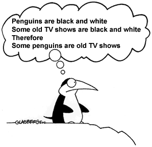
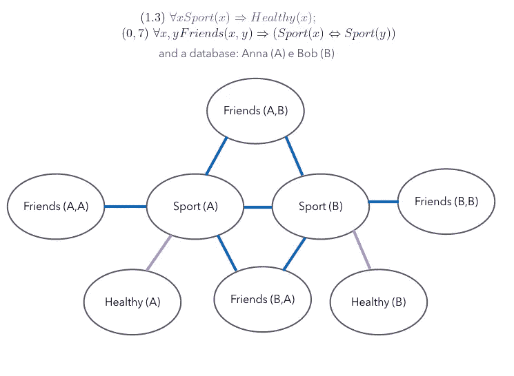
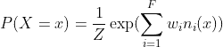

# 逻辑与统计:马尔可夫逻辑网络的喜与悲

> 原文：<https://towardsdatascience.com/logic-and-statistics-joys-and-sorrows-of-markov-logic-networks-bba1e6726358?source=collection_archive---------19----------------------->

## 统计推理

## 最好的统计思维模式？

胡安·鲁米普努在 [Unsplash](https://unsplash.com/s/photos/thinking?utm_source=unsplash&utm_medium=referral&utm_content=creditCopyText) 上的照片

> 我们正在经历一条艰难的进化之路。

我们许多人都希望并努力实现人工智能，其中智能一词比人工一词更有意义。已经向前迈出了许多步。许多缺点仍有待解决。

沿着这条路，更令人兴奋的模型之一是**马尔可夫逻辑网络** (MLN)，它希望在现实推理的两个非常强大的分支——逻辑和统计——之间架起一座桥梁，并确保结果将是一种更加强大和有效的推理技术。

## 神奇组合

有许多方法可以创建能够推理的模型，或者换句话说，实现人工智能的“智能”部分。然而,“逻辑-统计魔术组合”已被证明是最有用的一个，无论是从理论部分的美感来看，还是从我们希望人工智能解决的问题的实际应用来看。复杂场景中演绎思维的力量和不确定性的管理，现实的相关部分。

在这个神奇的组合中，mln 位于统计关系学习领域。特别是，它们结合了一阶逻辑和概率图形模型(马尔可夫网络，也称为马尔可夫随机场)，并已被证明是许多应用中更强大的模型。

其他模型或语言(ProbLog 等。)在实际应用中受到严重问题的影响。如果你想更多地了解其他方法，以及为什么它们需要一些它们没有的关键成分，你可以在 Medium 上了解它们:

 [## 知识图上的概率推理

### 希望，感谢“神话般的五人组”，会有事情发生！

towardsdatascience.com](/probabilistic-reasoning-on-knowledge-graphs-d510269f5cf0) 

MLNs 的工作方式，Markov Logic 的方式本质上是:**语法上**通过给逻辑公式附加权重来扩展一阶逻辑，**语义上**将那些加权公式视为构建 Markov 网络的模板。

我一会儿会再讲一遍！

如果**一阶逻辑**对你什么都不说，大概你就是一只企鹅。不过不用担心，你可以在这里开始弥补[。](https://en.wikipedia.org/wiki/First-order_logic)

*图片经 Glasbergen.com 授权给作者*

如果你想了解一些关于概率图形模型的基础知识，你可以阅读这篇由 Branislav hollander 撰写的关于数据科学的有趣的 T2 文章。

相反，如果你不知道或者不想知道任何关于的事情，你可以重新考虑阅读这篇文章…

计划是这样的:

*   我们回忆一下**马尔可夫网络**的一些基本原理，这对于更好地理解整个主题的核心至关重要:
*   **马尔可夫逻辑**。
*   这会让你非常清楚地了解马尔可夫逻辑网络
*   …我们将了解它们是否是可用的最佳统计思维模型！

## 马尔可夫网络

马尔可夫网络是一种对数线性模型，表示对应于无向图中节点的一组随机变量的联合分布，该无向图具有所需的[马尔可夫特性](https://wiki.ubc.ca/Course:CPSC522/Markov_Networks#Markov_Properties)。这些属性允许使用特定的语义来告诉我们哪些变量变得独立于其他变量，并允许我们将图形视为独立的结构。

如果我们察觉到它们之间的直接连接，某种形式的对称“亲和力”，则无向边连接每个节点(每个随机变量)。换句话说，边捕捉两个节点之间的关系。模型参数是所谓的**势函数**，每个势函数都与图的一个最大团(每个完全连通的子图)相关联，并且可以取任何非负值。这些参数不是概率，而是可以被解释为某种程度的规律性，自然状态的值。

> 这种密切关系可以被看作是一种众所周知的因果关系，某种相互影响、关联、相关，或者其他什么，这取决于模型的设计者如何使它正确无误。

每个变量的特定值的整个赋值是一个**状态或世界**。一个状态的概率是所有潜在函数的乘积的结果，是归一化的。在这里，我们是注定的，因为:如果集团很大，这变得难以处理，因为潜在函数的大小在变量/值域的组合中是指数的。

但是我们说马尔可夫网络是对数线性模型，因此我们可以将全联合分布重新表述为标准形式的指数族模型，以便在实践中使用。因此，代替势函数的乘积，我们可以切换到具有加权**特征**的指数和的马尔可夫网络的表示。不管怎样，我们将不得不处理复杂性问题，尽管不那么严重。

## 马尔可夫逻辑

将我们的注意力转向这种表示，理解对 MLNs 至关重要的马尔可夫逻辑将变得更容易。

> 特征可以是团或团的一部分上的状态的任何实值函数(例如逻辑函数),并且通过相应势的对数来加权。例如，与小团体 A-B-C 相关的二分法特征可以用以下术语建模:1 如果不是 A 或 B 或 C；否则为 0。或者如果 A 和 C 被建模为 1；否则为 0。

这是马尔可夫网络的另一个优点！好的，他们通过小团体在变量群中建立了某种相似性的模型。使用指数表示法，即使您有包含许多状态的非常大的集团，如果您知道您感兴趣的一组状态以及对其有贡献的要素子集，您可以只关注那些具有权重的要素！您得到的是一个更紧凑的模型，其中只有对您的分析有影响的项目。

我不想打断你，但即使你可以使用比势函数形式更紧凑的表示，指定更少数量的状态和特征(例如我们在上面的例子中看到的逻辑函数)，规范形式表示也是集团规模的指数形式。

> 一般来说，马尔可夫网络中的推理是# P-完全的。

所以一般来说，你被迫在马尔可夫网络中使用近似推理。马尔可夫链蒙特卡罗方法，特别是吉布斯抽样，是这里的标准。它对给定其[马尔可夫毯](https://en.wikipedia.org/wiki/Markov_blanket)的每个变量进行采样，马尔可夫毯在马尔可夫网络中只是图中节点邻居的集合。边际概率是通过对这些样本进行计数来计算的，而条件概率是通过运行 Gibbs 采样器来计算的，其中条件变量被箝位到它们的给定值。

> 上面的二分法特征的例子，看起来不像是一组复杂的利益现实的约束吗？

这难道不是一个逻辑知识库，一个逻辑理论的描述吗？对一组可能世界的一组硬约束，这些可能世界只不过是所有相关变量的赋值、知识库解释或状态或所谓的基础。

在逻辑知识库中，约束是很难的。当然，这样的规则并不总是正确的。如果你违反了哪怕一个约束，也就是说，如果你违反了一个单一逻辑公式的单一基础，那么这个世界就变得虚假。非常讨厌！

> 语义网的人非常清楚，把越来越多的硬约束放在一起会导致那些逻辑规则(称为模型)的真正解释空间非常狭窄...如果不是一个悖论(根本没有模型)。

但这就是我们的想法:如果我们放松真正的解释必须满足所有约束的概念，会怎么样？

马尔可夫逻辑的基本思想是软化这些约束:当一个世界违反一个约束时，对这些约束进行概率推理的可能性较小，但并非不可能。这发生在 MLNs 上。让我们看看如何！

## 马尔可夫逻辑网络

MLN 是一组对(F，w ),其中 F 是一阶公式，w 是一个实数，一个正的或负的权重。那么，马尔可夫网络去哪儿了？！在语义上！

MLN 定义了使用马尔可夫网络的模板，其特征是约束的基础，一阶逻辑公式的赋值。更准确地说，给定一组对(F，w)和一个数据库，一组值，MLN 以这种方式定义马尔可夫网络:

*   MLN 中每个谓词的每个基础都有一个节点
*   MLN 中每个公式 F 的每个基础的一个特征具有相应的权重 w
*   所有基于相同公式的特征都具有相同的权重

看比读容易！

此示例显示了由两个公式和两个权重组成的 MLN:紫色的表示进行体育运动的人是健康的，权重为 1.3，蓝色的表示对于每对朋友 x 和 y，这两个朋友都将进行体育运动，权重为 0.7。此外，我们有一组值 A 和 b。从 MLN 导出的马尔可夫网络如下所示:

马尔可夫逻辑网络的一个很好的例子。—作者图片。

*   作为布尔随机变量的每个谓词的每个基础的节点，对于包含该基础谓词的解释，其值为 1，否则为 0。
*   每一个公式的每一个根基都有一个特征(一个团),所以在这个团的任意两个节点之间有一条边，这两个节点在同一个逻辑公式中。边缘具有它们来自的相对公式的颜色。

> 由此我们看到，MLN 是马尔可夫网络的一个很好的模板制造者。

一个**地**马尔可夫网络是一个填充了每个节点相对值的模板。

你们当中最精确的人会注意到…A 和 B 之间的友谊有两个基础，甚至自我友谊也有两个基础！

> 好吧，相信我或者问问你的治疗师:友谊是不对称的，自尊永远是个大问题！

## **最佳统计思维模式**

MLNs 背后的想法是创建一个可能世界的分布，也就是知识库上的解释(不一定是真实的解释),这些解释基于它们有多“好”,或者换句话说，它们有多“重”。

解释满足的约束越多，就越“好”。因此，在这个例子中，越多的人进行体育锻炼，他们就越健康，相对的世界就变得越有可能。

随着公式权重的增加，MLN 越来越像一个纯粹的逻辑知识库，变得等同于所有无限权重的极限。但是请记住，权重也可以是负的。

准确地说，单个马尔可夫逻辑网络实际上并不代表单个分布，而是一整个家族的马尔可夫网络及其分布，这取决于数据。但是这些分布都是基于相同模板的重复。

对统计学家来说，还有一件有趣的事情:

> 这些分布的峰值存在于分布的模式中，它们是最可能的真实世界(*满足它们的所有约束)。*

由地面马尔可夫网络指定的可能世界 x 上的概率分布由以下公式给出，其中 F 是 MLN 中公式的数量，i-th w 是公式 i-th 的权重，n_i 是 x 中公式 I 的真实地面的数量:

作者图片

不幸的是，这看起来一点也不实际:我们仍然有指数数量的节点，再次提醒您，一阶逻辑中的可满足性是不可判定的，概率模型中的推理是#P 完全的。那又怎样？

通常，您的最终数据分析目标将是在给定一些证据的情况下找到世界最可能的状态，或者找到边际概率。所以这似乎不是一个快乐结局的故事，因为公式的概率是它所在世界的概率之和，通过蛮力计算它需要可能的基态原子数量的时间指数。但是不要担心，有很多方法可以在 mln 上实际执行推理任务。

首先，有很多有用的预先假设你可以做:i) **使用唯一的名字**(不同的常数指不同的对象)；ii) **域闭包** **和有限性**(域中唯一的对象是那些可以用常量和函数符号表示的)；iii) **已知函数**(每个自变量元组的每个函数的值总是一个已知常数)。逻辑表示中的这些假设确保了可能世界的数量是有限的，并且马尔可夫逻辑网络将给出明确定义的概率分布。此外，它们在大多数实际应用中相当合理，并且大大简化了 mln 的使用。

然后，有许多(近似的)程序可以使用，例如，马尔可夫链蒙特卡罗推断，它根据概率对网络的状态序列进行采样，并计算公式所包含的采样状态的分数。

此外，请记住被称为**提升推理方法**的整个可爱方法家族。他们减少了概率推断的空间，或者说是抽样空间，减少了要分析的模型数量。这些方法通过在一阶层次上对不可区分的对象组或接地图结构中的对称性进行推理来加速推理。

## 欢乐和悲伤

那么，马尔可夫逻辑网络实际上有资格被认为是最好的统计思维模型吗？让我想想…

💚mln 是一个奇妙的机器学习模型，使用了**魔术组合**:一阶逻辑中复杂推理的力量和概率图形模型的不确定性管理。

💚它们非常**紧凑**。与马尔可夫网络相比，它们将整个图形结构简化为对数据分析真正重要的相互关联的实体组。

💔虽然 mln 是非常**紧凑的**概率图形模型，但是它们产生**指数大的**图形，其接近现实的方式是完整的，但是在计算上是不可持续的。

💚你可以在实践中真正使用 MLNs **因为有一套广泛的(近似的)算法和技术来帮助处理所有这些冗长。**

💚在一阶逻辑中矛盾是一个问题，而在 MLNs **中矛盾不是问题**。马尔可夫逻辑允许公式之间的矛盾，它只需通过权衡双方的证据来解决，这样你就可以平滑逻辑公式的“坚韧性”。

💔*‘Ex falso sequitr quodlibet’*，即从虚假中你可以推导出一切。**矛盾不是问题的事实**才是问题。这确实是从一阶逻辑继承下来的行为。一阶蕴涵可能不是你想代表你的域。别忘了下雨- > take_umbrella(x)暗示即使是晴天也要带伞！在处理这种推理时，你必须非常准确和有意识。不同的是，你很容易因为你的模型的思维方式而陷入困境。

💚MLNs 可以处理**非 iid 数据**，即通过利用一阶逻辑的能力来紧凑地表示对象和关系之间的依赖性的非独立且同分布的数据。这在许多实际应用中至关重要。

💔mln 受益于一阶逻辑语法的一个基本元素:**存在量化**。但是，尽管存在扩展，MLNs 的可行版本只支持有限域，所以**存在**量化不能真正在话语域中创建新对象。这些模型不能“创建”新的空值，这是其他形式中的标准机制。这方面的破坏性后果的一个例子是，你甚至不能断言每个人都有一个父亲，这是你已经不知道的(从你的逻辑 1.0 书中)。

💔MLN 语义学不能够表达**归纳**。归纳定义非常著名的例子是斐波那契数列和阶乘，归纳定义最简单的例子是**传递闭包**。如果一个系统甚至不能执行二元关系的传递闭包，你可以肯定它不会帮助你推理！显然，所有的日常生活问题都源于此:评估网络内的传染传播只是一个例子。

💔mln 没有**递归**。你能想象一个推理模型不能表达需要递归的概念吗？你甚至不能表达一个推理树或者简单地遍历一个图。

*继续下面部分的对话！让我知道你是否认为马尔可夫逻辑网络是人工智能的最佳统计思维模型。更重要的是，让我知道为什么！:-)*

关注我的 [Medium](https://eleonora-laurenza.medium.com/) 了解更多信息。

让我们也在 Linkedin 上保持联系吧！

*如果你问的是被称为“女人”的未知动物是否也对科学有所贡献，甚至是这种科学，特别是马尔可夫链蒙特卡罗方法，请在这里阅读最近的一个重大损失:*

 [## 阿里安娜·罗森布鲁斯去世，享年 93 岁；数据科学的先驱人物

### 罗森布鲁斯博士在 21 岁时获得了物理学博士学位，他帮助创建了一种算法，这种算法已经成为…

www.nytimes.com](https://www.nytimes.com/2021/02/09/science/arianna-wright-dead.html) 

# 参考

[1] M .理查森和 p .多明戈斯；[马尔可夫逻辑网络](https://homes.cs.washington.edu/~pedrod/papers/mlj05.pdf)(2006)；机器学习，斯普林格。

[2] P. Domingos、S. Kok、D. Lowd、H. Poon、M. Richardson 和 P. Singla[马尔可夫逻辑](https://homes.cs.washington.edu/~pedrod/papers/pilp.pdf)(2008)；概率归纳逻辑程序设计，计算机科学讲义。

[3] R. Braz、E. Amir 和 D. Roth[提升一阶概率推理](http://www.ai.sri.com/~braz/papers/srl-chapter.pdf)(2005)；第十九届国际人工智能联合会议论文集。