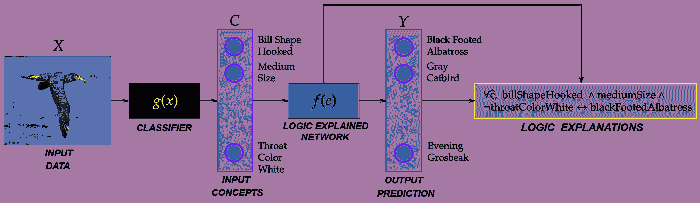
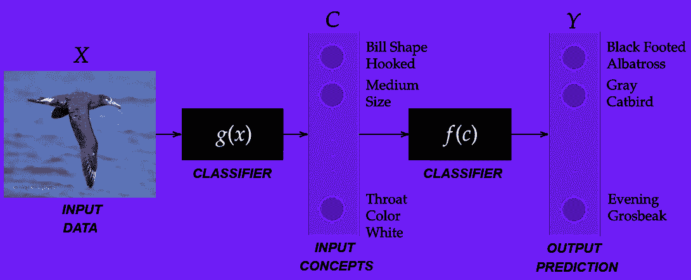
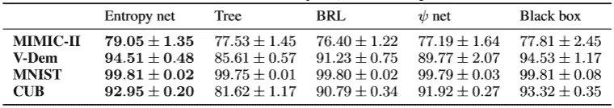
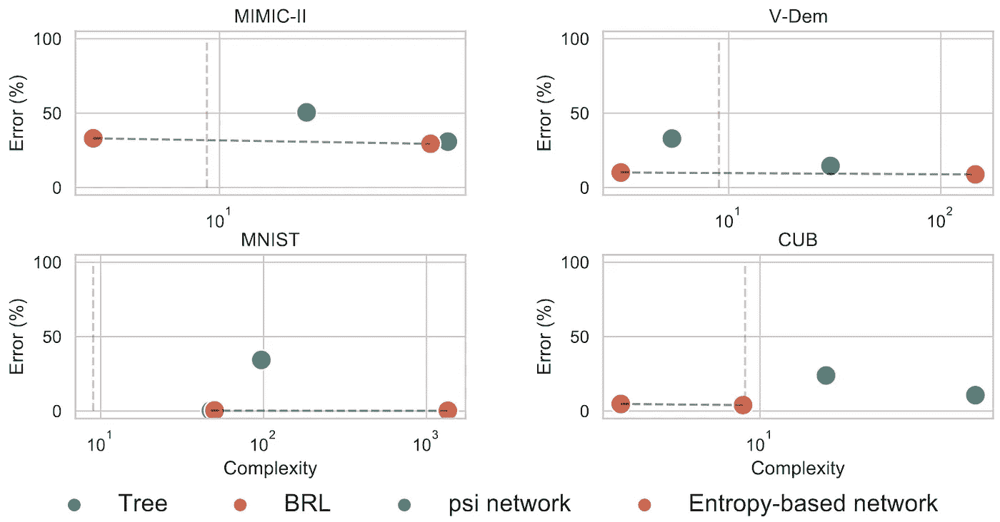

# 逻辑解释网络

> 原文：<https://towardsdatascience.com/logic-explained-networks-d81c8d119bde?source=collection_archive---------18----------------------->

## [思想和理论](https://towardsdatascience.com/tagged/thoughts-and-theory)

## 深度学习模型*可通过设计解释*

**TL；博士**

*   **问题—** 神经网络无法解释*它们如何*得出预测，因此不鼓励在安全关键应用中部署它们。
*   **解决方案** — [逻辑解释网络](https://arxiv.org/abs/2108.05149)是新颖的“*可解释的设计”*深度学习模型，为其预测提供逻辑解释。
*   **试一试！PyTorch，解释一下！”是一个 python 包，提供简单的 API 来实现逻辑解释的网络。**



透镜是基于概念的神经分类器，为它们的决策提供一阶逻辑解释。图片由作者提供。

# 你为什么会感兴趣？

我——你是一名研究人员还是一个拥有超级酷的深度学习系统的 startupper，你想部署它来拯救世界吗？嗯，你可能不能……

**你—** 为什么？

因为深度神经网络是“黑箱”:它们不是被设计来解释它们如何做出预测的！

**你—** 那又怎么样？

嗯，现在在美国和欧洲，许多安全关键应用程序都禁止使用“黑匣子”(如果你不相信我，可以去看看 https://gdpr.eu/的)。

**你—** 那么，我能做什么呢？

**我—** 阅读这篇文章，了解如何安全和**合法**地部署您最先进的深度学习系统**！:-)**

# 可解释的人工智能中的知识缺口(XAI)

## 为什么我们不能使用(标准的)深度学习来解决现实世界的问题？

深度学习(DL)在安全关键领域的应用受到立法者的强烈限制，因为 DL 模型通常被认为是黑盒，其决策过程不透明且过于复杂，外行人(甚至 DL 专家)都难以理解！).

出于这个原因，可解释的人工智能(XAI)研究要么专注于*解释*黑盒决策，要么专注于开发机器学习模型“*可通过设计*”(如决策树)。然而，虽然可解释的模型产生了对其预测的信任(这就是我们喜欢它们的原因…) [1]，但黑盒模型，如神经网络，通常是那些提供最先进的任务性能的模型(这就是我们喜欢它们的原因！) [2].

## XAI 研究中的知识缺口

大多数技术*解释*黑盒专注于寻找或排列黑盒用来做预测的最相关的特征。这种“特征评分”方法非常有效并被广泛使用，但 ***它们无法解释*** 神经网络如何组成这样的特征来进行预测【3】。此外，大多数*解释*方法的一个关键问题是，解释是根据输入特征(例如像素强度)给出的，这些输入特征并不对应于人类容易理解的高级类别[4]。

为了克服这个问题，**基于概念的**方法变得越来越流行，因为它们根据人类可理解的类别(即" ***概念*** *"* )而不是原始特征来提供解释[4]。简单地说，基于概念的模型是一个函数 *f* 将分类输入 *C* (即“概念”)映射到分类输出 *Y* (即目标类):

*f: C* ↦ *Y*

如果您的输入特征不是分类的(例如图像的像素亮度)，您可以首先使用函数 *g* 将您的输入 *X* 映射到分类的“概念空间” *C* :

*g: X* ↦ *C*

看看这个基于 CUB 数据集的例子(一个根据图像[5]进行鸟类分类的数据集):

*   首先，分类器 *g* 学习如何将像素强度(图像的输入特征)映射到分类概念空间 *C* 中，其中每个类别对应于一种鸟类特征；
*   第二，分类器 *f* 学习如何将根据概念 *C* 描述的输入样本映射到对应于鸟类名称(目标类别)的分类输出。



一个黑盒概念瓶颈模型。图片由作者提供。

然而，尽管是有用的，这些基于概念的方法中的大多数集中在最相关概念的识别上，但是它们不能解释**这样的概念如何被分类器 *f* 利用，更不能提供 ***简明的解释*** ，其有效性可以被定量评估*。***

> ***很少有方法能够解释*神经网络如何组成特征/概念来进行预测。****

## ***那你需要什么？***

***总之，你需要的是一个 ***新的深度学习范例*** 允许你部署模型:***

1.  ****实现接近等效“标准”黑盒所能达到的最先进水平的分类精度。****
2.  ****解释**如何组合输入特征以进行预测。**
3.  ****提供** *清晰的*解释，其质量可量化*。***

***您还想安全合法地部署您最先进的 DL 供电系统吗？***

***继续阅读…***

# ***逻辑解释网络***

***逻辑解释网络(或透镜)是一种特殊的基于概念的神经网络，为其决策提供一阶逻辑(FOL)解释。***

***看看 CUB 数据集上的同一个例子:***

*   ***分类器 *g* 执行相同的动作(即从图像预测概念)；***
*   **然而，分类器 *f* 现在是一个 ***逻辑解释的网络*** ，提供对目标类的预测+逻辑公式，解释网络 *f* 如何利用输入概念来达成决策！**

****

**一个逻辑解释网络在行动！图片由作者提供。**

## **为什么是逻辑解释？**

**与其他 XAI 技术相比，一阶逻辑解释提供了许多关键优势:**

1.  ****明晰度**—FOL 中报告的解释是一种严谨而明确的陈述。这种形式上的清晰可以服务于认知行为目的，例如产生信任、帮助偏见识别或采取行动/决策。例如，为了简单起见，省略了量词和变量，公式“斯诺∧树↔狼”可以很容易地概括训练数据集合中偏差的存在。**
2.  ****模块性** —不同的基于逻辑的解释可以组合起来描述一组观察结果或全局现象。例如，对于只显示人脸的图像，解释可以是“鼻子∧嘴唇→人”，而对于从后面显示人的另一个图像，有效的解释可以是“脚∧头发∧耳朵→人”。两种局部解释可以组合成“(鼻子∧嘴唇)∨(脚∧头发∧耳朵)→人”。**
3.  ****可测量性** —基于逻辑的解释的质量可以定量测量，以检查其有效性和完整性。例如，一旦为类“人”提取了解释“(鼻子∧嘴唇)∨(脚∧头发∧耳朵)”，该逻辑公式可应用于测试集，以检查其在诸如准确性、保真度和一致性等量化度量方面的通用性。**
4.  ****可简化性** —下面的解释可以用等价的形式重写，例如*析取范式* (DNF)和*合取范式* (CNF)。此外，奎因-麦克劳斯基算法等技术可以用来简化逻辑解释。例如，公式“(人∧鼻子)∨(人∧鼻子)’”可以很容易地简化为“鼻子”。**

> **逻辑解释网络是一种特殊的基于概念的神经网络，为其决策提供一阶逻辑解释。**

## **镜头范式:设计的可解释性**

**透镜族是一类可通过设计 解释的神经模型 ***。*****

***“你所说的可以通过设计来解释的模型是什么意思？”*，你可能会问。嗯，在 ***事后*** 方法和 LEN 范式之间有着明显的区别，LEN 范式是 ***通过设计*** 来解释的。事后方法通常不对分类器施加约束:模型本身不受任何与解释方法相关的约束。这就是为什么这类方法被称为 ***临时*** 的原因:在通常的训练完成后，XAI 方法开始生效。相反，透镜范例是可通过设计 解释的 ***，因为它在架构和损失函数中都嵌入了额外的约束，使得网络是自解释的。这就是为什么我们说透镜是可以通过设计来解释:分类器本身被限制以一种使解释自动出现的方式学习。*****

****

**如果你试图在实验后才理解“黑匣子”里发生了什么，你是在使用事后方法！来自[最大像素](https://www.maxpixel.net/Schroedinger-Physics-Schroedingers-Cat-3864563)的图像。**

> **透镜范式可以通过设计来解释，因为它在架构和损失函数中嵌入了额外的约束，使得解释自动出现。**

## **理论细节(只有一点，我保证！)**

**一个逻辑解释网络的设计需要三个方面的规范:架构**、**、**损失函数**和**简约准则**。这三个元素的混合允许逻辑解释网络的唯一标识。虽然架构和损失函数是任何神经网络的标准要求， ***简约标准对 LENs 起着特殊的作用*** ，因为它们允许分类器模仿人类学习的方式并提供解释。事实上，当人类比较一组概述相同结果的假设时，他们倾向于对最简单的假设有一种隐含的偏见。亚里士多德在他的“后验分析”中观察到了这一现象，后来的哲学家(如奥卡姆)重新发现了这一现象，最近在认知心理学、行为经济学和决策制定中进行了研究(一些最著名的作品来自乔治·米勒[6]和诺贝尔奖及图灵奖获得者希尔伯特·西蒙[7])。这种认知偏差是 XAI 研究迫切需要*简单解释的主要原因。简约标准是在端到端可区分模型(如逻辑解释网络)中编码这种归纳偏差的一种方式！***

> ***当人类比较一组概述相同结果的假设时，他们往往会对最简单的假设有一种隐含的偏见——简约标准在端到端可区分模型中编码了这种归纳偏见。***

***如果您有兴趣了解更多关于 LENs 及其简约标准的信息，您可以在我们最近的论文[8]中找到更多详细信息。***

***然而，如果你只是想玩玩镜头，那么下一节就是为你准备的！***

# ***PyTorch，解释一下！***

***阅读要求:Python、pip 和 PyTorch 的基础知识。***

## ***什么是“PyTorch，解释一下！”？***

***” *PyTorch，解释一下！*"是 PyTorch 开发逻辑解释网络的扩展库！***

**您可以从 [PyPI](https://pypi.org/project/torch-explain/) 安装`torch_explain`及其所有依赖项:**

```
**pip install -r requirements.txt torch-explain**
```

**代码可以在 github 上免费获得。**

## **玩具示例#1**

**对于这个简单的例子，让我们使用 Ciravegna 等人在 2020 年提出的第一个逻辑解释网络来解决 XOR 问题。作者称之为“ψ网络”[9]。该透镜特征在于:**

*   **具有 sigmoid 激活函数的全连接层序列；**
*   **训练时的修剪阶段，以简化架构。**

**您只需要导入两个库:**

```
**import torch
import torch_explain as te**
```

**并按如下方式生成训练数据:**

```
**x_train = torch.tensor([
    [0, 0],
    [0, 1],
    [1, 0],
    [1, 1],
], dtype=torch.float)
y_train = torch.tensor([0, 1, 1, 0], dtype=torch.long)**
```

**让我们定义一个 3 层ψ网络:**

```
**layers = [
    torch.nn.Linear(x_train.shape[1], 10),
    torch.nn.Sigmoid(),
    torch.nn.Linear(10, 5),
    torch.nn.Sigmoid(),
    torch.nn.Linear(5, 1),
    torch.nn.Sigmoid(),
]
model = torch.nn.Sequential(*layers)**
```

**现在，您可以通过优化二进制交叉熵损失和`l1_loss`损失函数来训练网络，将人类的先验知识融入到简单的解释中。我们将在 1000 个纪元后修剪网络:**

```
**optimizer = torch.optim.AdamW(model.parameters(), lr=0.01)
loss_form = torch.nn.BCELoss()
model.train()
for epoch in range(6001):
    optimizer.zero_grad()
    y_pred = model(x_train)
    loss = loss_form(y_pred, y_train) + 0.000001 * te.nn.functional.l1_loss(model)
    loss.backward()
    optimizer.step()

    model = prune_equal_fanin(model, epoch, prune_epoch=1000)**
```

**训练完成后，您可以提取一阶逻辑公式来描述网络如何构成输入要素以获得预测:**

```
**from torch_explain.logic.nn import psi
from torch.nn.functional import one_hot

y1h = one_hot(y_train.squeeze().long())
explanation = psi.explain_class(model, x_train)**
```

**解释将是析取范式的逻辑公式。在这种情况下，解释将是对应于`y=1 IFF f1 XOR f2`的`y=1 IFF (f1 AND ~f2) OR (f2 AND ~f1)`。**

**逻辑解释的质量可以在分类准确性和规则复杂性方面进行定量评估，如下所示:**

```
**from torch_explain.logic.metrics import test_explanation, complexity

accuracy, preds = test_explanation(explanation, x_train, y1h, target_class=1)
explanation_complexity = complexity(explanation)**
```

**在这种情况下，准确率为 100%，复杂度为 4。**

## **玩具示例#2**

**现在让我们把问题复杂化一点:让我们用 100 个虚拟特征来解决 XOR 问题。您只需要生成如下的训练数据:**

```
**x0 = torch.zeros((4, 100))
x_train = torch.tensor([
    [0, 0],
    [0, 1],
    [1, 0],
    [1, 1],
], dtype=torch.float)
x_train = torch.cat([x_train, x0], dim=1)
y_train = torch.tensor([0, 1, 1, 0], dtype=torch.long)**
```

**为了解决这个任务，让我们定义一个更强大的镜头，使用我们最近引入的一个特殊的层(即`EntropyLayer`)来实现一种非常有效的镜头，称为“基于熵的镜头”[10]:**

```
**layers = [
    te.nn.EntropyLinear(x_train.shape[1], 10, n_classes=2),
    torch.nn.LeakyReLU(),
    torch.nn.Linear(10, 4),
    torch.nn.LeakyReLU(),
    torch.nn.Linear(4, 1),
]
model = torch.nn.Sequential(*layers)**
```

**现在，您可以通过优化交叉熵损失和`entropy_logic_loss`损失函数来训练网络，该函数结合了人类对简单解释的先验知识:**

```
**optimizer = torch.optim.AdamW(model.parameters(), lr=0.01)
loss_form = torch.nn.CrossEntropyLoss()
model.train()
for epoch in range(1001):
    optimizer.zero_grad()
    y_pred = model(x_train).squeeze(-1)
    loss = loss_form(y_pred, y_train) + 0.00001 * te.nn.functional.entropy_logic_loss(model)
    loss.backward()
    optimizer.step()**
```

**训练完成后，您可以提取一阶逻辑公式来描述网络如何构成输入要素以获得预测:**

```
**from torch_explain.logic.nn import entropy
from torch.nn.functional import one_hoty1h = one_hot(y_train)
explanation, _ = entropy.explain_class(model, x_train, y1h, x_train, y1h, target_class=1)**
```

**解释将是析取范式的逻辑公式。在这种情况下，解释将是对应于`y=1 IFF f1 XOR f2`的`y=1 IFF (f1 AND ~f2) OR (f2 AND ~f1)`。**

**逻辑解释的质量可以根据分类准确性和规则复杂性进行定量评估，如下所示:**

```
**from torch_explain.logic.metrics import test_explanation, complexityaccuracy, preds = test_explanation(explanation, x_train, y1h, target_class=1)
explanation_complexity = complexity(explanation)**
```

**在这种情况下，准确率为 100%，复杂度为 4。**

# **LENs 有多厉害？**

**在这一点上，你可能会被说服，镜头做他们所做的。但是，你可能还有几个实际问题！现在，我将尽我所能猜测其中的一些，并提供一个简单的答案:)**

****问题 1——镜头有多强大？**或者换句话说，如果您使用 LENs 而不是等效的黑盒神经网络，您预计在分类准确性方面会损失多少？**

****答案 1—镜头精度与同等黑匣子不相上下。**在我们的论文中，我们展示了在具有挑战性的数据集上，基于熵的透镜相对于等效黑盒来说是非常有竞争力的，并且它们通常优于决策树和贝叶斯规则列表等白盒方法:**

****

**镜头相对于最先进的白盒模型的分类精度。图片由作者提供。**

**问题 2——实践中提取的 FOL 解释的质量如何？逻辑公式是否准确简洁？或者，换句话说，LENs 提供的解释有缺陷吗？完全是垃圾吗？**

****答案 2——解释简单而准确！**多少钱？嗯，至少可以与最先进的白盒模型提供的质量相媲美。下图显示了逻辑解释的质量，包括(1)平均分类测试误差(y 轴)和(2)逻辑解释的平均复杂度(文字数)(x 轴)。在提供一些最精确公式的同时，基于熵的网络也在产生最简单的公式。有多简单？好吧，垂直的红色虚线标记了外行人可以处理的最大解释复杂度(~9 个字面值[6])。基于熵的网络的大多数解释更简洁(3-4 个字面值)，所以它们的解释很简单:)**

****

**根据分类错误(y 轴)和逻辑规则长度(x 轴)对解释质量进行定量评估。图片由作者提供。**

# **带回家的信息**

**在这篇文章中，我试图传达 4 个关键信息:**

1.  **有一种 ***迫切&实用*** 需求的车型是**既*可解释&精确*** 。**
2.  **一阶逻辑解释很酷，因为它们可以被定量地****评估*** (这对实际的现实世界应用很关键)。***
3.  **逻辑解释网络是一个家族*神经模型提供 ***一阶逻辑解释*** *。****
4.  **逻辑解释网络是**既*可解释&准确*** ( [又容易实现](https://github.com/pietrobarbiero/pytorch_explain)！！！).**

# **参考**

**[1]鲁丁，辛西娅。"停止解释高风险决策的黑盒机器学习模型，转而使用可解释的模型."*自然机器智能*1.5(2019):206–215。**

**[2] Devlin，Jacob 等《Bert:用于语言理解的深度双向转换器的预训练》 *arXiv 预印本 arXiv:1810.04805* (2018)。**

**[3] Kindermans，Pieter-Jan 等人，“显著性方法的(不)可靠性”*可解释的 AI:解释、说明和可视化深度学习*。施普林格，查姆，2019。267–280.**

**[4] Koh，庞伟等，“概念瓶颈模型”*机器学习国际会议*。PMLR，2020 年。**

**[5] Wah，Catherine 等人，“加州理工学院-加州大学圣迭戈分校鸟类-200–2011 数据集。”(2011).**

**乔治·米勒:“神奇的数字七，加减二:我们处理信息能力的一些极限。”*心理评论* 63.2 (1956): 81。**

**[7]西蒙，赫伯特·a .“人类的模型；社会理性。”(1957).**

**[8] Ciravegna，Gabriele 等，《逻辑解释的网络》 *arXiv 预印本 arXiv:2108.05149* (2021)。**

**[9] Ciravegna，Gabriele 等人，“基于约束的学习和解释方法”*AAAI 人工智能会议论文集*。第 34 卷。№04.2020.**

**[10] Barbiero，Pietro 等人，“基于熵的神经网络逻辑解释”arXiv 预印本 arXiv:2106.06804 (2021)。**