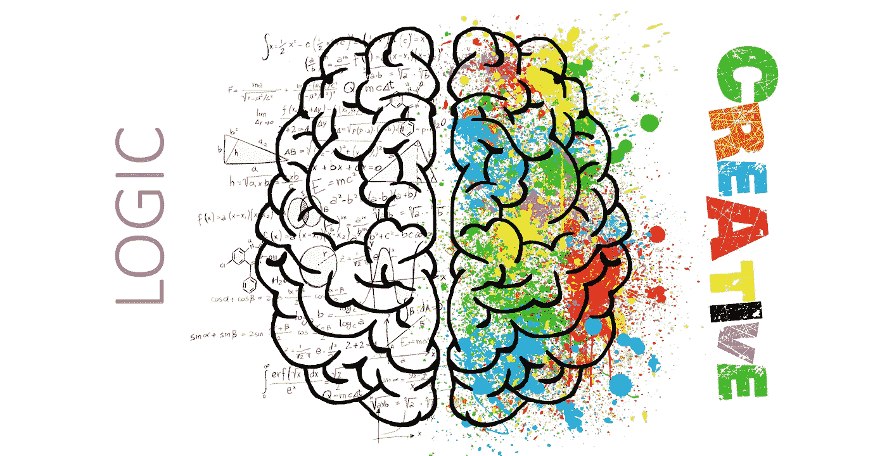
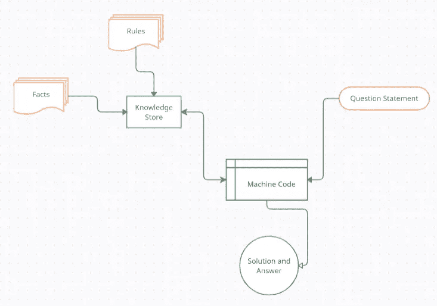
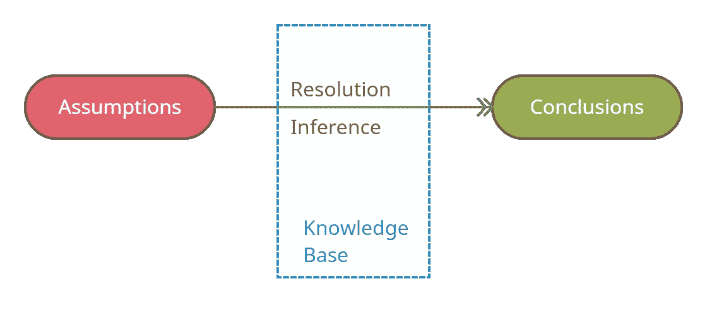

# 逻辑程序设计和基于 Python 的人性化人工智能设计

> 原文：<https://towardsdatascience.com/logic-programming-and-the-design-of-humanistic-ai-using-python-6ddb7019caa2?source=collection_archive---------11----------------------->

## 建立逻辑，促进机器中的人工智能



图片由 [ElisaRiva](https://pixabay.com/users/elisariva-1348268/?utm_source=link-attribution&utm_medium=referral&utm_campaign=image&utm_content=2062055) 来自 [Pixabay](https://pixabay.com/?utm_source=link-attribution&utm_medium=referral&utm_campaign=image&utm_content=2062055)

自诞生以来，人工智能一直是复制人类思想和行为的一种手段，并将这些属性赋予机器。

> 人工智能的成功是以机器的敏捷程度来衡量的。机器变得越聪明，人工智能代码就被考虑得越好。

随着创造智能机器的出现越来越多，为这些机器编码的创造性方法也越来越多。逻辑编程就是这样一种用于构建人工智能的创造性构造。LP 处理规则、函数和推理。它源于这样一个事实，即当一台机器经过足够的训练，能够理解其环境中存在的规则，并随后使用这些规则来区分“正确”和“错误”时，这就是这台机器变得智能并正确模仿人类行为的时候。

# 什么是逻辑编程？

这些是基于人工智能编程的理论，形成了从模式和规则中学习的代码的基础。逻辑编程谈论的是围绕任务中推理的建立的原则的研究。它是对当前规则的分析，利用这些规则可以得出未来的结果。例如，如果三个语句产生一个“真”的答案，程序可以推断出第四个相关语句的输出。

## **创意描述**

> 顾名思义，逻辑编程是两种截然不同的思想的结合——逻辑和编程。这里的逻辑详述了编程结构需要理解的事实和规则。编程的逻辑方法需要一组代码学习的输入规则，然后根据以前没有见过的新的相关事实推断出输出。这也可以看作是一种学习算法的形式，带有明确的理解指令。



逻辑编程代码流的表示|作者图片

用 Python，C，C++，Java 等写代码。我们已经观察到了像面向对象编程(OOPS)、抽象、循环结构和许多其他编程状态这样的范例。逻辑编程只是另一种处理关系的编程范例。这些关系是使用事实和规则构建的，并存储为关系数据库。这是一种基于事件的正式和显式逻辑的编程方法。

**关系:**关系是逻辑编程的基础。关系可以定义为遵循一定规则的事实。例如，[ A 🡪 B ]给出的一个关系式读作“若 a 为真，则 b 发生”。用语言来说，这可以理解为，“如果你是一名工程师，那么你是一名毕业生”，并推断，“工程师是毕业生”。在编程语言中，编写关系的语义根据语言的语法而变化，但这是关系含义背后的总体合理性。

**事实:**每一个建立在逻辑上的程序都需要事实。为了实现定义的目标，需要向程序提供事实。顾名思义，事实就是真相。代表程序和数据的真实陈述。例如，华盛顿是美国的首都。

**规则:**规则，像编程语法一样，是帮助从一个领域得出结论的约束。这些是逻辑子句，程序或事实需要遵循它们来建立关系。你可以这样想，事实是拉曼是个男人。现在，性别可以是一个单一的实体，这是一个规则。男人不可能是女人。因此，我们在这里建立的关系是，因为拉曼是男人，他不可能是女人。规则是这样建立的:

> 例如:
> 前任(A，B) :-父代(A，B)。
> 前任(A，C) :-父代(A，B)，前任(B，C)。

这可以读作，对于每一个 A 和 B，如果 A 是 B and B 的父是 C 的前任，A 是 C 的前任，对于每一个 A 和 B，A 是 C 的前任，如果 A 是 B and B 的父是 C 的前任

# 构建逻辑

因为我们只关注基于逻辑创建应用程序，所以有必要首先理解这个逻辑是如何工作的，以及它是如何派生出来的。下面我们就按照构建“逻辑”的层次来说。

*   **命题逻辑:**所有形式的代码构建都是从逻辑最基本的形式开始的，这就是命题。这里，陈述是由命题构成的，命题可以被定义为具有两种结果之一的陈述性陈述；真或假。它是数学中使用的一种知识表示技术。

> 永远为真的命题公式叫做重言式，也叫做有效句。一个总是假的命题公式叫做**矛盾**。

> 今天是星期天。(真)
> 太阳从北方升起(伪命题)
> 3+6= 7(伪命题)
> 3 是一个质数。(正确)

*   **一阶逻辑:**这是命题逻辑的延伸。一阶也建立一个布尔表达式，但是它是在一个叫做定义域的空间中完成的。这个领域是一个有限环境下的世界的局部视图。一阶逻辑由语法和语义组成。

> 除了事实(如命题逻辑所假设的)，一阶逻辑还假设世界包含对象、关系和函数，这些对象、关系和函数代表不能被分类为真或假的事件。

例如，考虑句子“X 是整数”。这个句子由两部分组成。第二部分*“是整数”*是事实。变量可以是整数，也可以不是(布尔型，因此是命题型)。但是，第一部分“X”，也称为主题，不是布尔型的。它是一个自然发生的物体，可以是任何变量。自然物质(非布尔)与命题逻辑的结合是一阶逻辑。这些是一阶逻辑的非布尔实体的几个例子。**常数(** 1、2、A、约翰等)。)
b. **变量(** x，y，z，a，b)
c. **谓词(**兄弟，父亲，>，< )
d. **函数(** sqrt，LeftLegOf 等。)
e. **连接词(** ∧，∨，，，⇔)
f. **等号(** ==)

*   **子句形式逻辑:**逻辑的最终形式是子句形式。这用于逻辑编程。子句形式逻辑是一阶逻辑的子集。给予一阶逻辑系统的知识是使用能够证明定理的归结推理系统来操纵的。



作者使用归结推理方法从知识库中提取命题并构建逻辑图像

# **逻辑编程用例**

1.  逻辑编程广泛用于自然语言处理(NLP ),因为理解语言是关于识别数字不能表示的模式。
2.  它也用于原型模型。由于表达式和模式可以使用逻辑来复制，原型制作变得很容易。
3.  图像处理、语音识别和各种其他认知服务中的模式匹配算法也使用逻辑编程进行模式识别。
4.  调度和资源分配是主要的操作任务，逻辑编程可以帮助高效和完整地解决。
5.  使用逻辑编程，数学证明也很容易解码。

# 使用人工智能解谜

逻辑编程可以用来解决许多数学问题，最终将有助于建造人工智能机器。在接下来的章节中，我们将观察如何使用逻辑编程来计算数学表达式，让程序学习运算，并形成预测。我们还将使用两个影响 Python 逻辑编程的库来解决一个实际问题。

任侃:任侃是 PyPi 中的一个库，它简化了从代码中生成业务逻辑的方式。我们之前讨论的逻辑、规则和事实可以通过“任侃”转换成代码。它使用高级形式的模式匹配来理解输入表达式，并根据给定的输入构建自己的逻辑。我们将在下面的章节中使用这个库进行数学计算。接下来的代码部分提到了导入和安装步骤。

**SymPy:** SymPy 代表 Python 中的符号计算，是一个开源库。它用于使用符号计算数学结构。SymPy 项目旨在建立一个功能完整的计算机代数系统(CAS)。这里的目的是保持对代码的简单和全面的理解。

**使用逻辑编程评估数学习惯用法**

算法不过是逻辑和控制的实现。同样，当逻辑运行一个数学函数时，我们称之为数学表达式。这些表达式是我们给程序的输入，基于这些输入，程序理解逻辑中存在的规则。基于对这些规则的理解，未来的表达式也可以被求值。让我们看一个计算数学表达式的逻辑编程的实现:

```
***CODE 1: Check for Mathematical Patterns*** pip install kanren
pip install sympy# Define values that will undertake the addition and multiplication operations
addition = 'add'
multiplication = 'mul'# Define facts and properties of each operation
fact(commutative, multiplication)
fact(commutative, addition)
fact(associative, multiplication)
fact(associative, addition)# Declare the variables that are going to form the expression
var_x, var_y, var_z = var('var_x'), var('var_y'), var('var_z')# Build the correct pattern that the program needs to learnmatch_pattern = (addition, (multiplication, 4, var_x, var_y), var_y, (multiplication, 6, var_z))match_pattern = (addition, (multiplication, 3, 4), (multiplication, (addition, 1, (multiplication, 2, 4)),2))# Build 3 distinct expressions to test if the function has learnttest_expression_one = (addition, (multiplication, (addition, 1 , (multiplication, 2, var_x )), var_y) ,(multiplication, 3, var_z ))test_expression_two = (addition, (multiplication, var_z, 3), (multiplication, var_y, (addition, (multiplication, 2, var_x), 1)))test_expression_three = (addition  , (addition, (multiplication, (multiplication, 2, var_x), var_y), var_y), (multiplication, 3, var_z))# Test the evaluations of the expression on the test expressions
run(0,(var_x,var_y,var_z),eq(test_expression_one,match_pattern))
**>>> ((4, 2, 4),)**run(0,(var_x,var_y,var_z),eq(test_expression_two,match_pattern))
**>>> ((4, 2, 4),)**run(0,(var_x,var_y,var_z),eq(test_expression_three,match_pattern))
**>>> ()**# Since the first two expressions satisfy the expression above, they return the values of individual variables. The third expression is structurally different and therefore does not match.***CODE 2: Symbolic Representations of Logic***# Running Mathematical Evaluations using SymPy
print (math.sqrt(8))
**>>> 2.8284271247461903**# Although the Math Square Root function gives an output for the Square Root of 8.
# We know this is not accurate since the square root of 8 is a recursive, non-ending real numberprint (sympy.sqrt(3))
**>>> sqrt(3)**# Sympy on the other hand, symbolizes the output and shows it as root of 3
# In case of actual square roots like 9, SymPy gives the correct result and not a symbolic answer***CODE 3: Prime Number check using Logic Programming***# Defining a function to build the expression for Prime Number check
def exp_prime (input_num):
if isvar(input_num):
  return condeseq([(eq, input_num, x)] for x in map(prime,    iter_one.count(1)))
else:
  return success if isprime (input_num) else fail# Variable to use
n_test = var()set(run(0, n_test,(membero, n_test,(12,14,15,19,21,20,22,29,23,30,41,44,62,52,65,85)),( exp_prime, n_test)))
**>>> {19, 23, 29, 41}**run(7, n_test, exp_prime( n_test ) )
**>>> (2, 3, 5, 7, 11, 13, 17)**
```

上面提到的代码只包含所有必要的伪逻辑，不会在任何 IDE 上独立运行。完整的代码在下面链接的存储库中，我鼓励你从包含完整工作代码的存储库中浏览 Google Colab 笔记本。

[](https://github.com/rjrahul24/ai-with-python-series/tree/main/03.%20Logic%20Programming%20for%20AI) [## 人工智能与 python 系列/03。人工智能的逻辑编程

### Python 系列教程，旨在学习人工智能概念。人工智能的逻辑编程。

github.com](https://github.com/rjrahul24/ai-with-python-series/tree/main/03.%20Logic%20Programming%20for%20AI) 

# 结论


规则和推论形成逻辑|图像由 [Thanasis 帕帕萨恰里亚斯](https://pixabay.com/users/papazachariasa-12696704/?utm_source=link-attribution&utm_medium=referral&utm_campaign=image&utm_content=5017116)从 [Pixabay](https://pixabay.com/?utm_source=link-attribution&utm_medium=referral&utm_campaign=image&utm_content=5017116) 中产生

在近十年的大部分时间里，人工智能一直是投资最多的技能。公司正在采用它，研究人员也在不断尝试改进它。逻辑编程的应用极大地帮助了这种改进。当机器可以根据给它们的规则推断出想法时，它们就变得聪明了。通过这个故事，我们已经能够走过和瞥见逻辑编程，它正逐渐成为构建人工智能应用程序的重要范式。从定义到实现，我们看到了逻辑编程的实际应用。就像我在以前的故事中提到的那样，最好在这篇文章中保持代码库开放，以充分利用这些概念。此外，我鼓励您浏览参考资料部分，这将有助于您详细理解每个概念。

**一些有趣的机器学习、数据科学、人工智能读物和教程:**

1.  学习在 Microsoft Azure 上为生产构建端到端的 AI & ML 工作流。

[](/implementing-an-end-to-end-machine-learning-workflow-with-azure-data-factory-f16cbeeffd94) [## 使用 Azure Data Factory 实现端到端的机器学习工作流

### 使用微软的 Azure 数据工厂(ADF)在一个屏幕上构建完整的 MLOps 生命周期

towardsdatascience.com](/implementing-an-end-to-end-machine-learning-workflow-with-azure-data-factory-f16cbeeffd94) 

2.使用函数式编程范式构建健壮的 AI 应用程序。

[](/the-ultimate-guide-to-functional-programming-for-big-data-1e57b0d225a3) [## 大数据函数式编程终极指南

### 纯函数和惰性求值——分布式数据计算的症结

towardsdatascience.com](/the-ultimate-guide-to-functional-programming-for-big-data-1e57b0d225a3) 

3.使用机器学习的构造简化复杂的 NLP 代码

[](/a-hybrid-approach-to-natural-language-processing-6435104d7711) [## 自然语言处理的混合方法

### 将 NLP 集成到传统机器学习工作流的指南

towardsdatascience.com](/a-hybrid-approach-to-natural-language-processing-6435104d7711) 

## [关于我]

我是 Rahul，目前在研究人工智能，在 Xbox 游戏上实现大数据分析。我在微软工作。除了专业工作之外，我还试图制定一个程序，来理解如何通过使用人工智能来改善世界上发展中国家的经济状况。

我现在在纽约的哥伦比亚大学，你可以通过 [LinkedIn](https://www.linkedin.com/in/rjrahul24/) 和 [Twitter](https://twitter.com/rjrahul24) 与我联系。

## [参考文献]

1.  [http://www.doc.ic.ac.uk/~cclw05/topics1/index.html](http://www.doc.ic.ac.uk/~cclw05/topics1/index.html)
2.  [https://en.wikipedia.org/wiki/Logic_programming](https://en.wikipedia.org/wiki/Logic_programming)
3.  [https://www . jigsawacademy . com/blogs/ai-ml/logic-programming/](https://www.jigsawacademy.com/blogs/ai-ml/logic-programming/)
4.  [https://data-flair.training/blogs/python-logic-programming/](https://data-flair.training/blogs/python-logic-programming/)
5.  [https://en . Wikipedia . org/wiki/List _ of _ programming _ languages _ for _ 人工智能](https://en.wikipedia.org/wiki/List_of_programming_languages_for_artificial_intelligence)