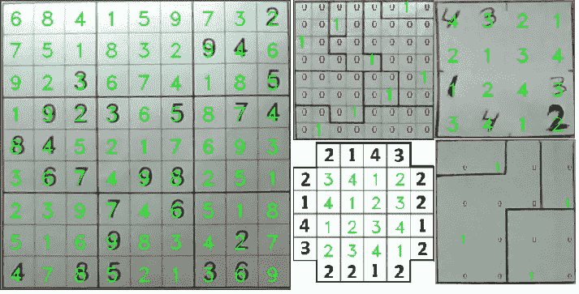
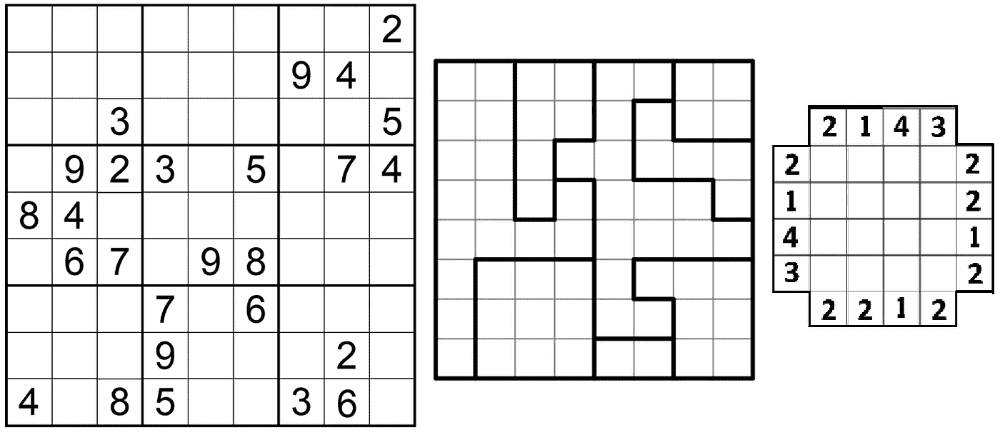
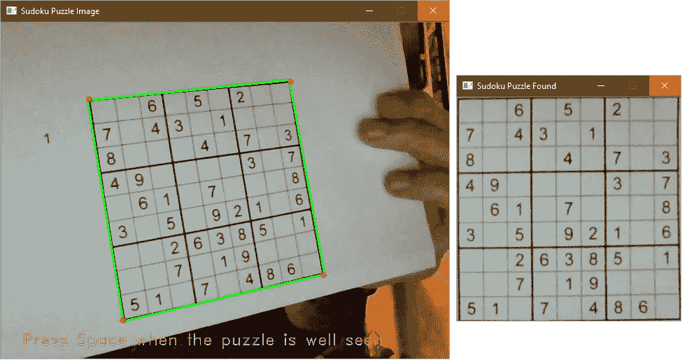
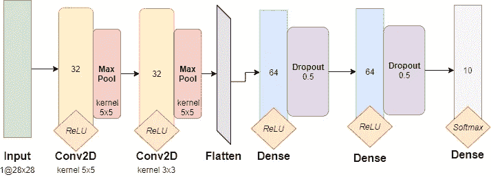
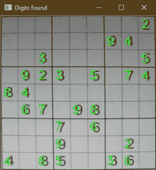
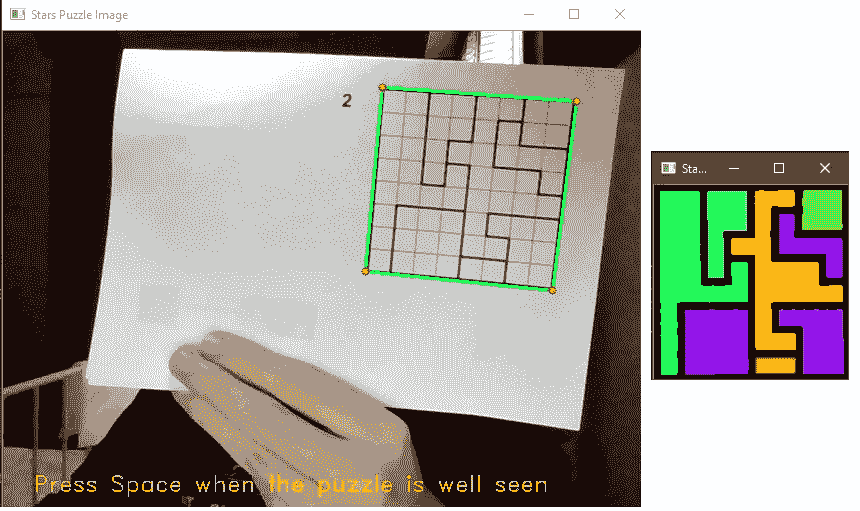

# LogicGamesSolver——如何利用计算机视觉和人工智能解决逻辑游戏

> 原文：<https://towardsdatascience.com/logicgamessolver-how-to-solve-logic-games-using-computer-vision-and-artificial-intelligence-1a4972e7e0be?source=collection_archive---------20----------------------->

## 计算机视觉和人工智能

## 一个用 OpenCV、回溯算法和少量深度学习来解决逻辑游戏(如数独)的实时 Python 工具。

作者图片

我喜欢逻辑游戏。我也喜欢计算机视觉和人工智能算法。为了将这两件事结合起来，我开发了一个软件，可以检测、分析和解决一些逻辑难题，比如数独游戏和 T2 摩天大楼。

在本文中，我将解释“LogicGamesSolver”项目。你可以在我的 [github 库](https://github.com/fabridigua/LogicGamesSolver)中找到带有运行指令的源代码。

该项目结合了三个研究领域:

*   **计算机视觉**用于输入图像中的拼图检测
*   **深度学习**对拼图中的任意数字进行分类
*   **人工智能**解决游戏

软件使用 **Opencv 4.01** 和 **Tensoflow 2.3.0** 用 Python 编写。
它能够解决三种游戏: [*数独、星球大战*和*摩天大楼*](http://www.cross-plus-a.com/puzzles.htm) 。

左起:数独、星球大战和摩天大楼。图片作者。

# 步骤 1:谜题检测

第一步是检测输入图像中的难题。

想法是找到最大的轮廓，即图像中最大的多边形。如果场景*干净*，有尽可能少的噪声和物体，这个步骤对软件来说更容易。

使用参数 *cv2 通过*查找轮廓*方法找到轮廓。RETR _ 外部*只考虑极端的外部轮廓。然后我们根据面积对轮廓进行排序，并取第一个元素。

找到拼图后，我们用四个顶点来计算透视变换，并用 *warpPerspective* 扭曲多边形的图像。

实时谜题检测示例。图片作者。

在继续之前，我们必须从网格中提取细胞的图像，以分析已经写入的数字。

请注意，网格长度由用户给出。方法 *get_digit()* 分析细胞图像以检查其是否包含数字(否则返回 None)并对其进行预处理以使其成为数字分类器的合适输入图像。

# **第二步:拼图分析**

一旦我们有了拼图的平面图像，就该分析它以获得已经提供的信息来解决游戏了。

对于数独和 T2 摩天大楼的谜题，有一些数字需要考虑。相反，对于*星球大战*游戏，我们需要理解内部结构来定位模式中的区域。

## 数字分类器

为了了解字谜中有哪些数字，该软件利用了一个为手写数字分类而构建的卷积神经网络，并用著名的 [MNIST 数据集](http://yann.lecun.com/exdb/mnist/)进行了训练:6 万个 0 到 9 之间的手写单个数字的 28×28 像素小正方形灰度图像。

我不想深入细节，因为这是一个非常基本的 CNN，数据集几乎在每本深度学习书籍中使用。我只给你看神经网络的架构，但是你可以在项目源代码中看到[*digit classifier . py*](https://github.com/fabridigua/LogicGamesSolver/blob/main/DigitClassifier.py)*类中的实现。*

**

*CNN 使用的架构。图片作者。*

*该软件只在第一次执行时训练模型，然后它使用保存在文件中的权重([这里你可以找到我的](https://github.com/fabridigua/LogicGamesSolver/blob/main/model_weights.h5))来预测数字。*

*方法 *img_to_array* 由 Tensorflow 提供，用于将图像转换为适合 CNN 的数组形式。该软件还有一个 *exclude_classes* 数组，即不考虑该游戏的类(如“0”代表数字在[1，9]范围内的*数独*)。使用*preds . arg max(axis = 1)[0]*我们将概率最大的值作为正确的数字。*

> **注意，MNIST 数据集是由*手写的*数字组成的。训练结束后，CNN 给出的***准确率为 99%。然而，我遇到了一些错误，而使用它由于字体；数字书写的数字可能与手写的数字非常不同。例如，“4”通常被预测为“9”，而“3”被预测为“8”。为了解决这个问题，我决定不仅考虑一个图像，而且考虑最后 7 个图像，并考虑对同一单元的 7 个预测中最频繁的一个数字的预测。***

****

**数独数字预测。图片作者。**

## **连通分量分析**

**对于游戏*星球大战*来说，没有数字要找，但是有网格区域要定位。为此，软件首先删除内部网格线，然后提取连接的组件。**

**在前 4 行中，我们应用了一个*腐蚀*过滤器来去除较亮的线条，然后我们应用了一个阈值来突出区域的边缘。最后，我们寻找连接的组件，用不同的颜色给这个区域着色。**

****

***星球战斗区域探测。图片作者。***

**这是一个实时过程，以便用户可以确认(通过按下空格键)区域定位是否良好。一旦用户确认，网格的单元就按照它们中心像素的颜色分组，定义了难题区域。**

# **第三步:解谜**

**所以，我们到了！我们有解决这个游戏的所有要素。**

**与许多其他逻辑益智游戏一样，*数独*、*星球大战*和*摩天大楼*可以描述为*约束满足问题。***

**CSP 包含三个要素:**

*   **我们希望找到正确值的一组**变量****
*   **每个变量的可能值的**域****
*   **定义问题的一组**约束****

**例如，对于*数独*游戏，我们有:**

*   ****变量:**网格的 81 个单元格**
*   ****域:**范围{1，9}(不包括已经填充的单元格)。**
*   ****约束:**游戏的*规则***

**类似的表示可以用于许多问题和游戏，以及*摩天大楼*和*星球大战*，然而，其中有一个特点:单元的域是{0，1},代表星星的存在(1)或不存在(0)。
解决方案是变量*的特定*赋值*，以便满足每个约束*。**

**源代码有点长(参见我的项目的[解算器类](https://github.com/fabridigua/LogicGamesSolver/blob/main/Solver.py)，但是我想向你解释用于在软件中求解 CSP 的*递归回溯搜索*的思想，展示算法的核心部分。**

**我知道，这看起来很复杂，但其背后的思想非常简单:该算法通过单变量赋值来执行对解决方案的搜索(技术上来说，这是一种*深度优先搜索*)，直到它找到一个完整的赋值(由 *is_complete* 方法控制)。**

**在每一步中，该算法采用一个没有赋值的变量(*select _ unassigned _ variable*)，选择其定义域的一个未经证实的值，然后观察会发生什么。如果有赋值，当前状态考虑所有约束(方法*是一致的*)我们再次调用算法来检查赋值是否完成，否则我们移除当前变量并返回到先前状态来尝试不同的值。**

**如果你阅读了整个代码，你会发现我使用了一些启发式方法来加速求解过程。一个是 *easy_inference* ,我试图通过检查一些简单的推理是否可以执行来分配一些变量:例如对于*数独*,如果一行、一列或一个正方形包含 8 个值，很明显这是丢失的值。另一种试探法用于给定变量的值选择。在方法 *neighbors_heuristic* 中，我从给定变量的定义域中删除了一些值，如果选择该值违反了一些游戏规则。**

**从计算的角度来看，这个算法减少了 O(d^n 的搜索空间！)去 O(d^n).不错，但重要的是要注意，如果没有启发式算法，算法可能会非常慢。**

****

**0.13 秒解决的星球大战 8x8 拼图示例。图片作者。**

# **最终考虑**

**我们生活在一个没有什么让我们感到惊讶的时代:人工智能对我们生活的社会影响如此之大，以至于我们对新技术变得漠不关心。也许有时候我们应该停下来反思一下，我们生活在这个革命的时代是多么幸运。**

**让我们以这个简单的，也许是以自身为目的的项目为例。该软件(大约 50KB 的内存分布在 4 个文件中)使用计算机视觉算法进行图像分析和透视变换，使用卷积神经网络进行数字分类，并使用一种算法在几秒钟内解决一个逻辑问题，而这至少需要几分钟。**

**这些算法都是世界各地几十年研究和实验的成果。是整整几代科学家的遗产，它让我们拥有实用的理论工具来解决一些问题，这些问题直到最近我们还无法想象能够解决。从这个角度来看，这个项目以及网络上可以找到的数以千计的其他计算机视觉和人工智能项目，对我来说似乎不仅仅是数学计算、代码或公式，它们对我来说似乎是最接近魔法的东西。**

# **参考**

**[1]什么是等高线？ *OpenCV 文档。*[https://docs . opencv . org/4 . 0 . 1/D4/d73/tutorial _ py _ contours _ begin . html](https://docs.opencv.org/4.0.1/d4/d73/tutorial_py_contours_begin.html)**

**[2]Yann le Cun、Corinna Cortes 和 Chris Burges 的 MNIST 手写数字数据库*官方网站*[http://yann.lecun.com/exdb/mnist/](http://yann.lecun.com/exdb/mnist/)**

**[3] M. Sahu，A. V. Singh 和 S. K. Khatri，“一个经典的约束满足问题及其利用人工智能的解决方法”， *2019 年友好国际人工智能会议(爱彩)*，阿联酋迪拜，2019，第 429–433 页，doi:10.1109/aicai . 2019 . 136363636**