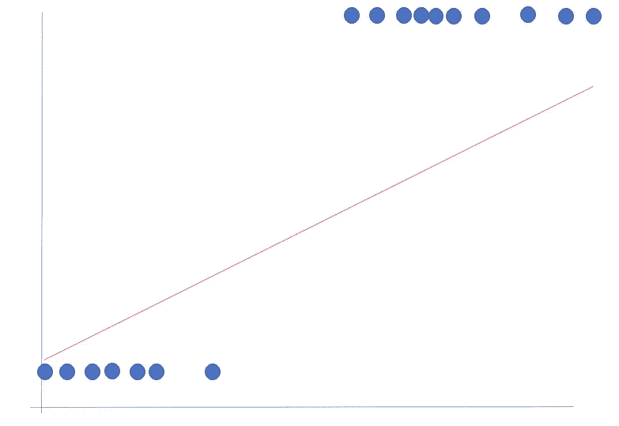

# 逻辑回归

> 原文：<https://towardsdatascience.com/logistic-regression-cebee0728cbf?source=collection_archive---------27----------------------->

## 或者我是如何爱上用于分类数据分类的 sigmoid“变形”函数的


逻辑回归|照片由[丹尼斯·博萨特](https://unsplash.com/@dbossarte)拍摄

这篇文章是我的[回归](/an-introduction-to-linear-regression-9cbb64b52d23)系列的简要延续。

到目前为止，我举例说明的回归例子都是数字:预测一个连续变量。通过高尔顿家庭身高数据集，我们预测了儿童的身高——一个不断变化的参数。然而，请注意回归线如何无法符合二元结果，分类示例:



二元结果的最佳拟合线

在上面的例子中，似乎有一个影响分类结果的阈值。这个数据有一个连续的回归线是没有意义的。为什么说不通？看看两个因变量(y ):它们取两个值中的一个:0 和 1。没有 0.25 或者 0.5 的值，只有那两个极值。这意味着，对于这个分类问题，我们需要一个函数，它接受一个输入或一系列输入，并给出它是两个类别之一的概率:即 0 和 1。我们可以给这些类别贴上任意标签:是或否、猫或非猫、发送促销电子邮件或不发送促销电子邮件、销售线索或不太可能的销售线索。

逻辑回归对于数据科学家和机器学习工程师来说都是一个强大的工具。我会说，为了健全性检查，它应该是用于分类目的的基线模型——一个与更复杂的模型(如 PCR、神经网络等)相比较的模型。

# 历史

*   “逻辑”一词是作为人口增长的模型发展而来的，它来自比利时数学家皮埃尔·弗朗索瓦·维赫斯特，他英年早逝，默默无闻
*   逻辑函数是德国化学家威廉·奥斯特瓦尔德(1883 年)在化学中作为自动催化的模型独立发展起来的
*   1920 年，美国人雷蒙德·珀尔(Raymond Pearl)和洛厄尔·里德(Lowell Reed)独立地重新发现了逻辑斯蒂函数，将其作为人口增长的模型，并将其用于现代统计学。他们不知道 Verhulst 早期的发现，但他们不相信他，也不采用他的术语
*   概率单位模型是在 20 世纪 30 年代中期发展起来的，一般认为是美国生物学家切斯特·布利斯的功劳
*   多项 logit 模型是由 David Cox (1966)和 Henri Thiel (1969)独立提出的

# 逻辑回归

为了得到逻辑回归，我们首先从经典的回归例子开始:


经典回归

为了开发分类模型，我们将借用数学中的 sigmoid 函数，通常表示如下:


Sigmoid 公式

重新排列并代入回归:


逻辑回归公式

这一系列函数的作用是给出将观察值分配给目标类的概率。一旦逻辑回归函数分配了一个概率，这就要求模型在数据集上进行拟合和训练，下面的例子是，数据点被投影到基于概率值的类中。对于大于 0.5 的概率值，该值被投影到 1，对于我们来说是目标类，而对于小于 0.5 的概率值，它们被投影到 0 类，或者不是目标类。

标准的 sigmoid 函数如下所示:


标准逻辑函数|图片来源[维基百科](https://en.wikipedia.org/wiki/Logistic_regression#:~:text=Logistic%20regression%20is%20a%20statistical,a%20form%20of%20binary%20regression).)

这将我们的原始数据集回归线转换为:


拐点在 0.5

## 刚刚发生了什么？

这个“s”形是用于分类目的的强大工具。我倾向于认为给定观察值输出的给定概率值，比如 0.36，逻辑回归将概率“压缩”为二进制值。解释这一点，模型是说给定的观察值属于模型被训练的目标类的概率只有 36%——假设是 1。这意味着有 1—0.36 或 64%的可能性该观察值不属于目标类，因此它被标记为 0 ->该观察值被向下投影到因变量结果标签 0。

逻辑回归线类似于我们之前的回归示例，但是**我们将输出解释为将数据点分配给目标类**的概率。

最常见的逻辑回归是二元逻辑回归，但多项逻辑回归模型确实存在于多类回归分析中。

名词（noun 的缩写）b:技术上可以达到 0.5 的数值，但是微乎其微。无论如何，你所使用的算法将会有一些关于如何分类这种边缘情况的预定义指令。

## Python 示例:逻辑回归

为了便于说明，我将使用`sklean`中著名的 iris 数据集来展示以下 Jupyter 笔记本单元的分类能力:

```
import numpy as np
import pandas as pd
import matplotlib.pyplot as plt
import seaborn as sns
from sklearn.model_selection import train_test_split
from sklearn.preprocessing import StandardScaler
from sklearn.metrics import accuracy_score%matplotlib inline
```

创建一个 df 并将所有原始数据转换成`sklearn:`熟悉的格式

```
from sklearn.datasets import load_iris
iris = load_iris()
df = pd.DataFrame(data= np.c_[iris[‘data’], iris[‘target’]],
 columns= [“sepel_length_cm”, “sepal_width_cm”,
 “petal_length_cm”, “petal_width_cm”, “target”])df.head()
```


数据导入良好

```
df.describe()
```


基本汇总统计

数据集包含真正的标签，我们可以看到这三个类是多么好和可分:

```
sns.pairplot(df, height=2.5, hue=’target’)
plt.show()
```


基于可测量性的三种花的分类

```
df[‘target’].value_counts()
```


注意我们有三类花，每一类有 50 个观察值。这个数据集非常平衡。

```
X, y = load_iris(return_X_y=True)X[:5]
```


```
y[:5]
```


以上五朵花都是 0 类的。

```
from sklearn.linear_model import LogisticRegression# instantiate the model and fit
log = LogisticRegression(multi_class=’warn’, solver=’warn’)
log_reg = log.fit(X, y)log_reg
```


```
# score the model
log.score(X, y)
```


我们可以看到，这是一个非常好的模型分数！

接下来我就来说说[时间序列分析](/time-series-analysis-7138ec68754a)！

在 [Linkedin](https://www.linkedin.com/in/james-a-w-godwin/) 上找到我

*物理学家兼数据科学家——可用于新机遇| SaaS |体育|初创企业|扩大规模*