# 逻辑回归解释

> 原文：<https://towardsdatascience.com/logistic-regression-explained-7695f15d1b8b?source=collection_archive---------19----------------------->


Pawel Czerwinski 在 [Unsplash](https://unsplash.com?utm_source=medium&utm_medium=referral) 上的照片

## 数据科学基础

## 了解这种受监督的机器学习算法是如何工作的

*逻辑回归*由于其简单性和可解释性，是一种流行的分类算法。如果你正在学习或实践数据科学，很可能你已经听说过这个算法，甚至使用过它。如果你想加深对逻辑回归的理解，学习它背后的数学知识，这篇文章提供了对逻辑回归的简单介绍。


Pawel Czerwinski 在 [Unsplash](https://unsplash.com?utm_source=medium&utm_medium=referral) 上拍摄的照片

*本帖假设读者对线性回归有所了解。如果你对线性回归不太适应，* [*这篇文章*](/linear-regression-explained-89cc3886ab48) *可能有助于获得线性回归的基础知识。我们将看到一些用 Python 编写的代码示例，然而，读者可以在不了解任何 Python 的情况下吸收概念性知识。*

# 概观📜

理解*逻辑函数*是理解*逻辑回归*的重要前提。所以让我们从理解什么是逻辑函数开始。

## 📍物流功能

> 逻辑函数是一种类型的 [sigmoid 函数](https://deepai.org/machine-learning-glossary-and-terms/sigmoid-function),用于压缩 0 和 1 之间的值。

虽然*乙状结肠功能*是*物流和其他功能*的总称，但该术语通常用于指代*物流功能*。例如，在神经网络的上下文中，逻辑函数通常被称为 *sigmoid 激活函数*。数学上，该函数如下所示:


函数通常用这两种形式中的一种来表示。这些形式是等价的，因为我们可以重新排列一种形式来得到另一种形式:

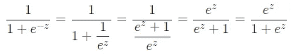

我们将继续使用第一种形式，因为它更简洁。逻辑函数的一个重要特征是它在 0 和 1 处有两条水平渐近线:

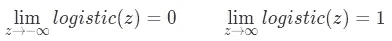

如果我们把逻辑函数形象化，这个特征会变得更清楚:

```
import numpy as np
import pandas as pd
pd.options.display.precision = 4import matplotlib.pyplot as plt
import seaborn as sns
sns.set(style='darkgrid', context='talk', palette='rainbow')from sklearn.linear_model import LogisticRegression# Create integers between -10 to 10 (both inclusive)
z = np.arange(-10,11)# Create logistic function
def logistic(x):
    return 1 / (1+np.exp(-x))# Plot x: z and y: logistic(z)
plt.figure(figsize=(10,4))
sns.lineplot(x=z, y=logistic(z))
plt.xlabel('z')
plt.ylabel('logistic(z)')
plt.title('Logistic function');
```

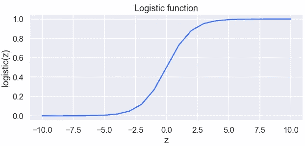

我们看到一条类似拉伸 S 的曲线，垂直轴上的函数输出范围从 0 到 1。当`z=0`时，逻辑函数返回 0.5。这意味着`logistic(z)>0.5`意味着`z`是正的，而`logistic(z)<0.5`意味着`z`是负的。

因为逻辑函数将任何实数转换为 0 到 1 之间的值，所以当我们想将数值转换为概率时，它非常有用。

## 📍逻辑回归

逻辑回归是一种二元分类算法，尽管其名称包含“回归”一词。对于二元分类，我们有两个想要预测的目标类。让我们称它们为*正* (y=1)和*负* (y=0)类。当我们将 [*线性回归*](/linear-regression-explained-89cc3886ab48) 和*逻辑函数*结合起来，我们得到逻辑回归方程:

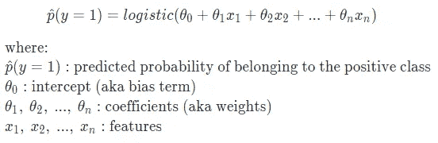

这与以下内容相同:

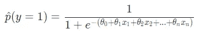

> 逻辑回归预测记录属于给定特征的正类的概率。

因为我们有两个类，所以找到属于负类的概率很简单:

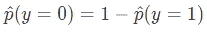

一旦我们有了概率值，就很容易将它们转换成预测类。使用阈值 0.5(即概率为 50%)，我们可以将概率值转换为类别:

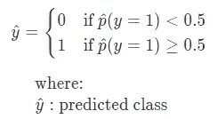

这相当于(如果不清楚为什么它们是相同的，再看一下上面的*物流功能部分*👀):

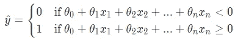

如果我们使用术语`z`来表示系数和特征的截距和点积之和:

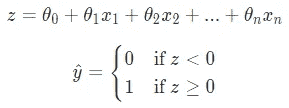

那么我们可以说对于`z`的负值，预测类为 0，否则，预测类为 1。下面是一个小玩具数据集的简单示例，它有一个二元目标和两个特征:

```
# Create sample data
train = pd.DataFrame({'x1': [1, 2, 2, 3, 2, 4, 3, 4, 3, 4], 
                      'x2': [2, 3, 4, 2, 1, 3, 5, 2, 3, 6], 
                      'y': [0, 0, 0, 0, 0, 1, 1, 1, 1, 1]})# Train a logistic regression
target = 'y'
features = ['x1', 'x2']
model = LogisticRegression()
model.fit(train[features], train[target])# Predict
for i, row in train.iterrows():
    train.loc[i, 'z'] = model.intercept_[0] + np.dot(model.coef_[0], 
                                                  row[:2])
train['p_hat'] = model.predict_proba(train[features])[:,1]
train['y_hat'] = model.predict(train[features]) # default threshold is 0.5def highlight(data):
    n = len(data)
    if data['z']<0:
        return n*['background-color: #FF9A98']
    else:
        return n*['background-color: lightgreen']
(train.style.apply(highlight, axis=1)
  .format('{:.2%}', subset='p_hat').hide_index())
```

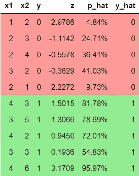

如果你想学着像这样美化熊猫的数据帧，你可能会喜欢阅读这个帖子。

我们可以看到，对于负值的`z`，概率值小于 0.5，对于正值的`z`，概率值大于 0.5。现在是学习逻辑回归的决策边界的好时机，它基本上包含了我们在本节中讨论的内容。

## 📍判别边界

[逻辑回归的决策边界](https://www.cs.princeton.edu/courses/archive/fall08/cos436/Duda/PR_simp/bndrys.htm)由下式给出:


在我们的例子中，由于我们只有两个特征，等式变成:

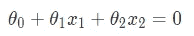

让我们沿着决策边界在横轴上绘制`x1`，在纵轴上绘制`x2`。如果我们重新排列上述等式，使`x2`用`x1`表示，绘制决策边界变得更容易:

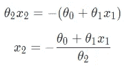

```
def decision_boundary(x1):
    intercept = model.intercept_[0]
    coefficients = model.coef_[0]
    x2 = -(intercept+coefficients[0]*x1)/coefficients[1]
    return x2# Plot decision boundary
plt.figure(figsize=(6,4))
sns.scatterplot(data=train, x='x1', y='x2', hue='y', 
                palette=['red', 'green'])
sns.lineplot(x=train['x1'], y=train['x1'].apply(decision_boundary), 
             color='red')
plt.fill_between(train['x1'], train['x1'].apply(decision_boundary), 
                 color='red', alpha=0.4)
plt.legend(loc='upper right', bbox_to_anchor=(1.3, 1))
plt.title('Decision boundary');
```

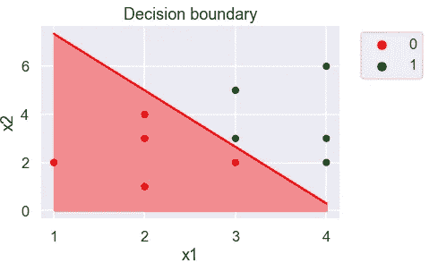

从这里，我们可以很容易地看到，逻辑回归的决策边界是线性的。使用这一行，我们可以确定给定记录的预测类:如果一个记录落在左下角阴影三角形中(即`z<0`，那么预测类是 0，否则(即`z≥0`)，预测类是 1。

# 训练逻辑回归🔧

熟悉了逻辑回归背后的直觉之后，现在让我们学习模型如何学习最优的[模型参数](https://machinelearningmastery.com/difference-between-a-parameter-and-a-hyperparameter/)(即截距和系数)。在训练逻辑回归时，我们希望找到最佳的参数组合，以便与任何其他组合相比，它们在所有训练示例中产生最低的误差。对于给定的一组参数，我们可以使用*对数损失(又名交叉熵损失)函数*来测量误差，作为训练示例:

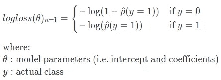

虽然[对数的底数并不重要](https://datascience.stackexchange.com/questions/57009/why-doesnt-the-binary-classification-log-loss-formula-make-it-explicit-that-nat)，但使用自然对数是很常见的:

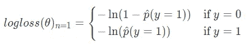

这可以简化为:

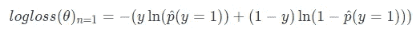

你会注意到，当`y=0`时，等式的前半部分为 0，而当`y=1`时，等式的后半部分为 0。这个函数一开始可能看起来不直观，但是在一个小例子中应用它可以阐明函数背后的直观性。让我们来看看两个类别不同概率的对数损失:

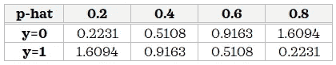

我们可以看到，对于负记录，误差随着概率越来越接近 0 而减小，对于正记录，误差随着概率越来越接近 1 而减小。换句话说，正面记录的概率越高或负面记录的概率越低，误差就越小。现在，这是直觉！

因为我们希望最小化所有训练样本的误差，所以集体误差由平均测井损失给出:

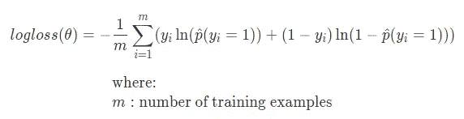

现在我们知道了如何测量一组给定参数的误差，下一个问题是如何找到使误差最小的最佳参数。这就是优化算法如[梯度下降](https://ml-cheatsheet.readthedocs.io/en/latest/gradient_descent.html)发挥作用的地方。优化算法求解参数的最佳组合，使测井曲线损失最小化。实际上，优化算法的选择取决于实现。例如，默认情况下，Scikit-learn 对`[LogisticRegression()](https://scikit-learn.org/stable/modules/generated/sklearn.linear_model.LogisticRegression.html)`使用 [LBFGS](https://stats.stackexchange.com/a/285106/249142) 优化算法。

# 解释逻辑回归参数🔎

为了解释逻辑回归参数，我们首先需要熟悉优势、优势比和 logit 函数。

## 📍可能性

赔率是事件的概率与其互补事件的概率(即事件不发生的概率)之比:

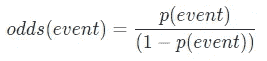

例如，如果我们掷一枚公平硬币，得到正面的几率是 1 (1:1):

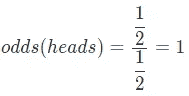

挑一张黑桃牌的赔率是 0.33 (1:3):

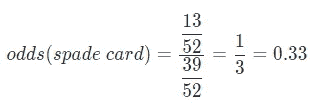

黑桃牌的胜算不大。换句话说，拿到黑牌的可能性比拿到非黑牌的可能性低三倍。

赔率不能是负数，因为它是概率的比率，并具有以下含义:
◼️赔率低于 1 意味着赔率不利于该事件(例如 0.25 或 20:80 或 1:4)
◼️赔率为 1 意味着赔率相等(即 50:50 或 1:1)……(*赔率*等于*偶数*😅)
◼赔率高于 1 表示赔率对赛事有利(例如 4 或 80:20 或 4:1)

## 📍让步比

比值比是两个比值之间的比值。

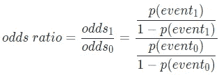

假设一个事件最初的赔率是 0.25 (1:4)，但现在新的赔率是 1.5 (3:2)。

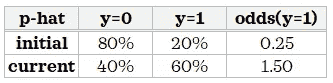

赔率是 6。这意味着当前赔率比初始赔率大 6 倍。

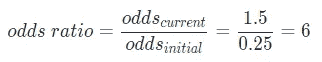

比值比也不能为负，因为它是两个比值之间的比值。赔率告诉我们赔率相对于基础赔率的变化:
◼️赔率低于 1 意味着赔率下降(赔率比以前低)
◼️赔率为 1 意味着赔率没有变化(赔率与以前相同)
◼️赔率高于 1 意味着赔率增加(赔率比以前高)

优势比对优势的大小不敏感。例如，从 0.01 到 0.04 和从 2 到 8 的比值都将导致比值比为 4。

## 📍Logit 函数

现在，让我们熟悉一下 *logit 函数*。

> Logit 函数的作用与 logistic 函数相反:它将概率转换为实数。

如果我们重新排列逻辑回归方程，使得右边类似于线性回归方程，我们在左边得到 logit 函数:

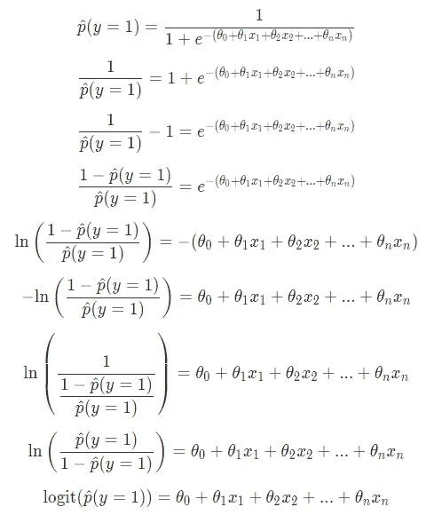

这种到 logit 函数的转换有助于解释模型参数。我们可以用类似于[线性回归](/linear-regression-explained-89cc3886ab48)的方式解释参数，但是我们相对于对数概率或属于正类的概率而不是连续的目标变量来解释它。

## 📍解释逻辑回归参数

对于大多数人来说，开始时解释逻辑回归参数并不直观。如果你第一次就明白了，干得好！否则，不要担心，随着练习，它会变得更加直观，所以要花时间来吸收这些知识。

让我们看看小模型的参数汇总:

```
summary = pd.DataFrame(np.concatenate([model.intercept_,
                                       model.coef_[0]]), 
                       index=[f'θ_{i}' for i in range(3)], 
                       columns=['values'])
summary['exp(values)'] = np.exp(summary['values'])
summary
```


我们可以用以下方式解释这些参数:

◼️:如果我们使用`exp(values)`，我们相对于**几率*来解释它，希望这样更容易理解。我建议使用这种方法:*

*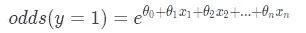*

*◼️如果我们使用`values`，我们将需要相对于*来解释它的对数几率:**

*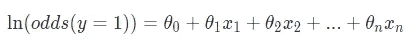*

*让我们看看我们构建的样本模型的一些示例解释:*

***截距:**当所有特征都为 0 时，*成为正类的几率*预计为 0.0045。*

*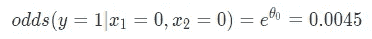*

*或者，当所有特征取值为 0 时，*正类的对数概率*预计为-5.3994。*

*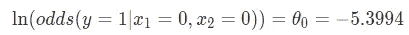*

***系数:**保持其他变量不变，如果`x1`增加一个单位，*属于正类的几率*预计变化 3.6982。*

*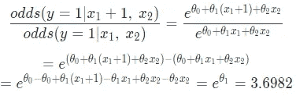*

*或者，保持`x2`不变，如果`x1`增加一个单位，*属于阳性类别的对数概率*预计将改变 1.3078。*

*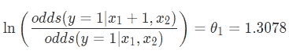*

*我们现在可以看到，逻辑回归系数显示对数优势比。*

**

*丹-克里斯蒂安·pădureț在 [Unsplash](https://unsplash.com?utm_source=medium&utm_medium=referral) 上拍摄的照片*

*这就是这篇文章的全部内容！希望你喜欢学习逻辑回归背后的直觉和数学。一路上，我们还学习了其他相关的概念，如赔率、赔率比和多个有用的函数。如果你也想学习神经网络，我们今天学习的一些概念如逻辑函数和对数损失函数将会派上用场。最后，当向涉众解释模型的驱动因素时，能够解释如何解释逻辑回归结果是有帮助的。如果你渴望了解更多关于逻辑回归的知识，请查看这个资源。*

**您想访问更多这样的内容吗？媒体会员可以无限制地访问媒体上的任何文章。如果您使用* [*我的推荐链接*](https://zluvsand.medium.com/membership)*成为会员，您的一部分会费将直接用于支持我。**

*感谢您阅读我的文章。如果你感兴趣，这里有我其他一些帖子的链接:*

*◼️️ [K 近邻讲解](/k-nearest-neighbours-explained-52c910c035c5)
◼️️ [比较随机森林和梯度推进](/comparing-random-forest-and-gradient-boosting-d7236b429c15)
◼️️ [决策树是如何建立的？](/how-are-decision-trees-built-a8e5af57ce8?source=your_stories_page-------------------------------------)
◼️️ [管道、ColumnTransformer 和 FeatureUnion 说明](/pipeline-columntransformer-and-featureunion-explained-f5491f815f?source=your_stories_page-------------------------------------)t21】◼️️[feature union、ColumnTransformer &管道用于预处理文本数据](/featureunion-columntransformer-pipeline-for-preprocessing-text-data-9dcb233dbcb6)*

*再见🏃 💨*

# *参考📁*

*   *Aurelien Geron，*使用 Scikit-Learn、Keras 和 TensorFlow 进行动手机器学习，2017 年* —第 4 章*