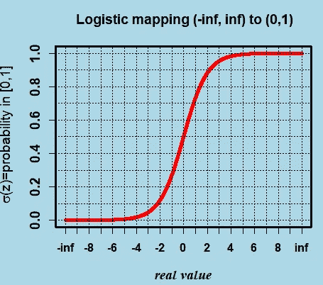
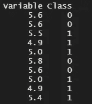
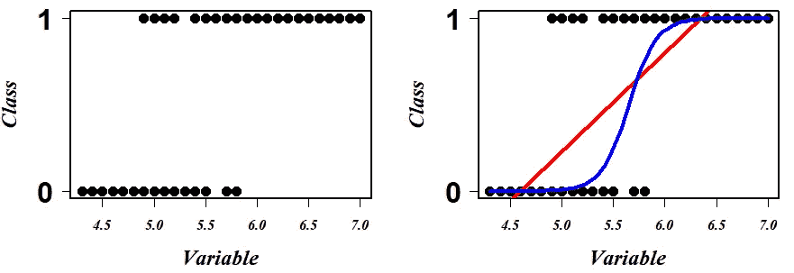
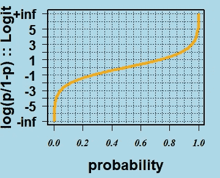
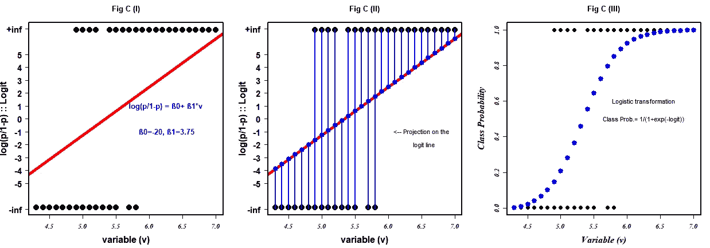
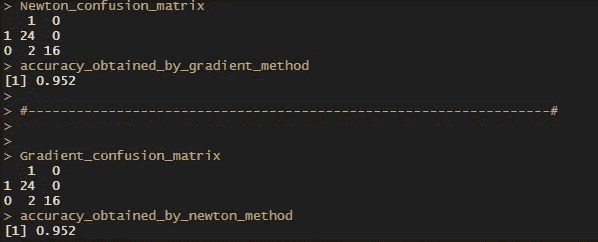
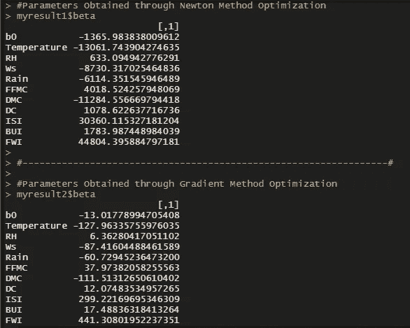
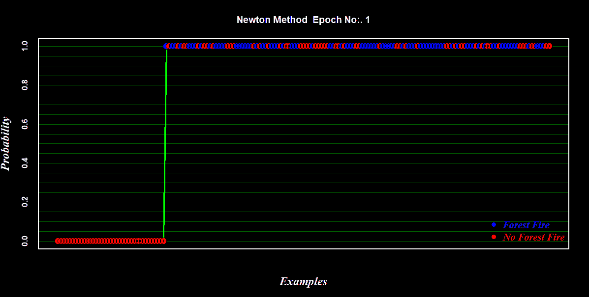
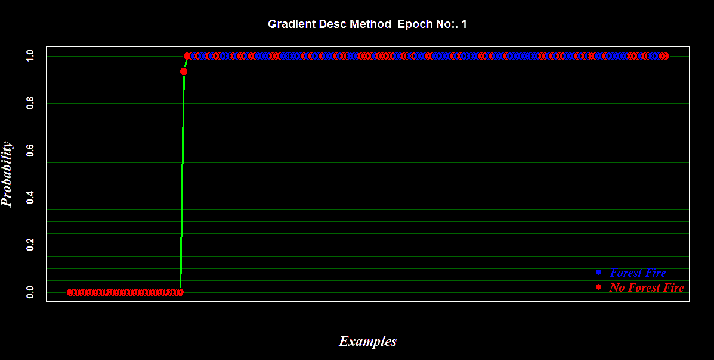
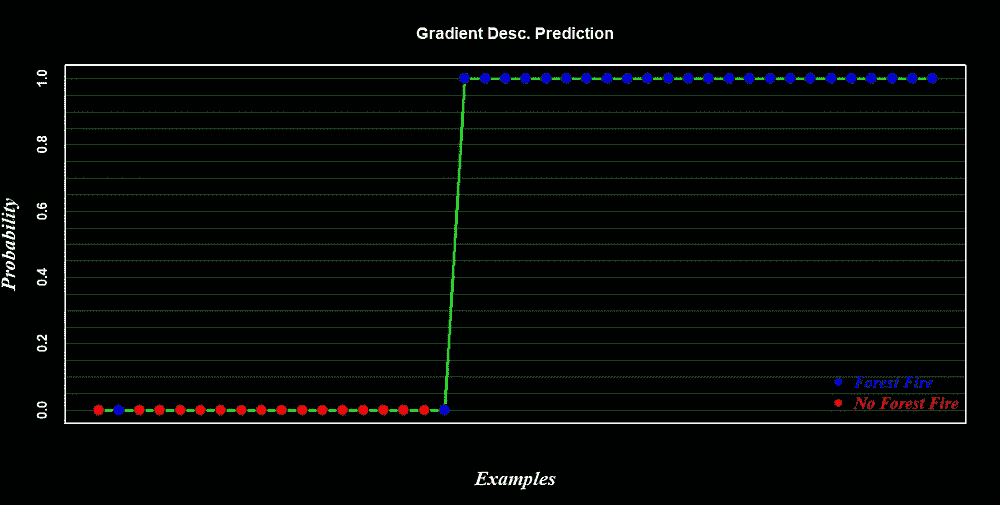

# 从头开始解释逻辑回归(视觉上、数学上和程序上)

> 原文：<https://towardsdatascience.com/logistic-regression-explained-from-scratch-visually-mathematically-and-programmatically-eb83520fdf9a?source=collection_archive---------2----------------------->

## 动手香草建模第三部分


作者图片

在小型谷歌搜索“逻辑回归”中会出现过多的结果。有时候，对于数据科学的初学者来说，要理解逻辑回归背后的主要思想是非常困难的。为什么他们不会感到困惑！！？每个不同的教程、文章或论坛对逻辑回归都有不同的叙述(不包括教科书的合法冗长，因为那会扼杀这些精通的“快速来源”的全部目的)。一些资料来源声称它是一种“分类算法”，一些更复杂的资料来源称它为“回归器”，然而，其思想和效用仍未被揭示。**请记住，逻辑回归是人工神经网络的基本构建模块，对它没有/错误的理解可能会使理解数据科学的高级形式变得非常困难。**

在这里，我将尝试以一种非常基本的方式阐明逻辑回归模型及其形式，以便给读者一种理解的感觉(希望不会使他们混淆)。现在，这里提供的简单性是以跳跃一些关键方面的深入细节为代价的，深入逻辑回归每个方面的本质就像潜入分形(讨论将永无止境)。然而，对于每一个这样的概念，我会提供你应该参考的著名读物/资料来源。

因为在逻辑回归的研究中有两个主要分支(I)建模和(ii)建模后分析(使用逻辑回归结果)。虽然后者是对拟合系数效果的测量，但我相信逻辑回归的黑箱方面一直存在于它的**模型**中。

我的目标是:

1.  用最通俗的方式来阐述逻辑回归。
2.  讨论逻辑回归中使用的两种流行的优化器(梯度下降和牛顿法)的数学基础。
3.  在 R 中为每种类型的优化器从头开始创建逻辑回归模块。

在我们继续之前，最后一件事是，为了避免复杂性，整篇文章都是通过记住二进制分类问题来设计的。

# 1.逻辑回归不是一个分类器

是的，它不是。它本质上是一个回归模型。我将描述什么和为什么逻辑回归，同时保留它与线性回归模型的共鸣。假设我的读者对线性回归的基础有所了解，很容易说线性回归通过给定特征的线性组合来预测目标变量的“值”，而另一方面，逻辑回归通过插入到等式(1)给出的 [**逻辑函数**](https://en.wikipedia.org/wiki/Logistic_function) **(又名**[](https://en.wikipedia.org/wiki/Logit)****)**中的给定特征的线性组合来预测“概率值”:**

****

****等式 1****

****

**逻辑函数(图片由作者提供)**

**因此命名为逻辑回归。这个逻辑函数是将位于(-inf，inf)范围内的线性组合***【z】，*** 映射到概率区间[0，1]的简单策略(在逻辑回归的上下文中，这个***z**将被称为 log(奇数)或 logit 或 log(p/1-p))(见上图)。因此，逻辑回归是一种映射范围限于[0，1]的回归，不像简单的线性回归模型，其域和范围可以取任何实值。*****

******

***数据的一个小样本(图片由作者提供)***

***考虑具有一个变量及其对应的二进制类 0 或 1 的简单数据。这些数据的散点图看起来像这样(左图 A)。我们看到数据点在两个极端的集群中。很好，现在对于我们的预测建模，这种情况下的简单回归线将给出一个无意义的拟合(图 A 右侧的红线),我们实际上需要拟合的是一条曲线(或图 A 右侧的弯曲“S”形蓝色规则)来解释(或正确分离)最大数量的数据点。***

******

***(图片由作者提供)图 A***

***逻辑回归是一种寻找最佳蓝色曲线的方法。现在首先让我们了解这条曲线上的每个点代表什么。给定投射在这条线上的任何变量值，这条曲线告诉该投射变量值落入第 1 类(比如“p”)的**概率。因此相应地，这条线告诉我们，位于这条蓝线上的所有底部点属于 1 类的概率为零(p=0 ),位于这条线上的顶部点属于 1 类的概率为 1(p=1)。现在，请记住我已经提到的逻辑(又名逆逻辑)是一种将无限拉伸空间(-inf，inf)映射到概率空间[0，1]的策略，一个 [**逻辑函数**](https://en.wikipedia.org/wiki/Logit) 可以将概率空间[0，1]转换为拉伸到(-inf，inf)等式(2) &的空间(图 B)。*****

******

*****等式 2*****

******

****图 b . logit 函数由****log(p/1-p)****给出，它将每个概率值映射到数轴上的点{****ℝ****}从-无限延伸到无限*(图片由作者提供)***

***记住这一点，逻辑回归建模的口头禅来了:***

> ***逻辑回归首先从*将 ***类概率的空间[*** *0，1]***vs******变量*** *{ℝ}* ( *如图右*)转换到**logit***{****ℝ通过调整系数和斜率来执行“类回归”拟合，以最大化**可能性**(这是一个非常奇特的东西，我将在下一节阐述这一部分)。 ***ⓑ***一旦调整和调优完成，**logit******ℝ****}***vs 变量***{****ℝ****}*空格被重新映射到 ***类反复执行这个循环(***【ⓐ→ⓑ→ⓐ】***)最终会得到最佳的曲线或最有区别的规则。**********

**哇！！！**

**那么，你可能(应该)会问(我)为什么以及如何进行这种转变？？(ii)可能性到底是什么？？以及(iii)该方案将如何产生最佳曲线？！！。**

**所以对于(I)，从有限的概率空间[0，1]到无限延伸的真实空间(-inf，inf)的转换的想法是因为它将使拟合问题非常接近于求解线性回归，对于线性回归，我们有许多优化器和技术来拟合最佳线。后面的问题最终会得到解答。**

**现在回到我们对最佳分类蓝色曲线的搜索，想法是首先用⚠️ **logit vs 变量空间** ⚠️ 坐标上的任意系数绘制初始线性回归线，然后调整该拟合的系数以最大化可能性(放松！！需要的时候我会解释“可能性”)。**

**在我们的单变量情况下，我们可以写出等式 3:**

****logit(p)= log(p/1-p)=**β₀+β₁*****v……(等式 3)**

****

**(图片由作者提供)图 C**

**在**图 C (I)** 中，红线是我们为数据点拟合的任意选择的回归线，映射在不同的坐标系中，β₀(截距)为-20，β₁(slope 为 3.75。**

**⚠️注意到，坐标空间不是 ***类*** {0，1} *vs* ***变量*** {ℝ}而是其**logit**{**ℝ**}***vs 变量** { **ℝ** } *。*此外，请注意，从图 A(右)到图 C(I)的变换对点的位置偏好没有影响，即上述**等式 2** 中的极值，logit(0)=-无穷大，logit(1)=+无穷大。***

***在这一点上，让我重申我们的目标:我们希望在*logit vs . variable*图中拟合数据点的直线，以这样一种方式解释(正确分离)当它通过反 logit(又名逻辑函数) **eq(1)** 转换为蓝色曲线时数据点的最大数量。因此，为了实现最佳回归，简单线性回归的类似策略开始发挥作用，但尽管最小化残差的平方，想法是最大化**可能性**(放松！！).**这样，投影到 logit 上的每个数据点对应于一个 logit 值。当这些 logit 值被插入逻辑函数 eq(1)时，我们得到它们落入图 C(III)的 1 类的概率。*****

> ***注意:这也可以用数学方法证明: **logit(p)=logistic⁻ (p)*****

***这个概率在数学上可以用等式 4 来表示，非常接近伯努利分布，不是吗？。***

*****p(y =*y*| x =*x*)=σ(βᵀ*x*)ʸ【1σ(βᵀ*x*)]⁽⁻ʸ⁾；** *其中 y 为 0 或 1* ..等式(4)***

***该等式表示对于给定的数据实例 ***x*** *，*当 *y* =1 时，标签 Y 为 *y* (其中 *y* 为 0 或 1)的概率等于 logit 的*逻辑，如果 *y* =0，则等于(1-logit 的逻辑)。这些新的概率值在我们的 ***类*** {0，1} *vs* ***变量*** {ℝ}空间中图示为图 C(III)中的蓝点。数据点的这个新概率值就是我们所说的该数据点的**可能性**。因此，简单来说，可能性是数据点的概率值，该概率值表示该点落入 1 类类别的可能性有多大。并且拟合的权重向量β的训练标签的可能性仅仅是这些新发现的概率值中的每一个的乘积。****

**l(β)=ⁿ∏ᵢ₌₁p(y =y⁽ⁱ⁾| x =x⁽ⁱ⁾)……………………….等式(5)**

**将等式 4 代入等式 5，我们得到，**

****l(β)=ⁿ∏ᵢ₌₁σ(βᵀ*x*⁽ⁱ⁾)ʸ⁽ⁱ⁾【1】σ(βᵀ*x*⁽ⁱ⁾)]⁽⁻ʸ⁽ⁱ⁾⁾**………………等式(6)**

**想法是估计参数( **β)** ，使得它最大化 L( **β** )。但出于数学上的方便，我们将 L( **β** )的对数最大化，称其对数似然方程为 7。**

****ll(β)=ⁿ∑ᵢ₌₁y⁽ⁱ⁾logσ(βᵀ*x*⁽ⁱ⁾)+(1y⁽ⁱ⁾)log【1σ(βᵀ*x*⁽ⁱ⁾)】**……..等式(7)**

**因此，在这一点上，我希望我们之前陈述的目标更容易理解，即在 *logit vs 变量*空间中找到最佳拟合参数 **β** ，使得*概率 vs 变量*空间中的 **LL(β)** 最大。对此，没有[的封闭形式](https://en.wikipedia.org/wiki/Closed-form_expression)，因此在下一节中，我将涉及两种优化方法(1)梯度下降法和(2)牛顿法，以找到最佳参数。**

# **2.优化者**

## ****坡度上升****

**我们的优化首先需要对数似然函数的偏导数。所以让我无耻地分享一个非常著名的[讲义](https://web.stanford.edu/class/archive/cs/cs109/cs109.1178/lectureHandouts/220-logistic-regression.pdf)的截图，它很好地阐明了导出 **LL(β)的偏导数的步骤。** *(注:这里显示的计算用θ代替β来表示参数。)***

********

**要更新参数，达到全局最大值的步骤是:**

****

****其中 *η* 是学习率****

**所以算法是:**

> **初始化 **β** 并设置可能性=0**
> 
> **While likelihood≤max(可能性){**
> 
> **计算 logit(***p***)=*x***βᵀ****
> 
> **计算***p***= logistic(x**βᵀ)**= 1/(1+exp(-x**βᵀ**))**
> 
> **计算似然 l(**β)=**ⁿ∏ᵢ₌₁***if else***(*y*(*I*)= 1， *p* ( *i* )，(1- *p* ( *i* ))**
> 
> **计算一阶导数*∇*ll(β)= x**ᵀ**(y-p)**
> 
> **更新: **β(新)= β(旧)+*η****∇*ll(β)**
> 
> **}**

## ****牛顿法****

**在所有可用的优化器中，牛顿法是另一个强有力的候选方法。在早期的课程中，我们已经学习了牛顿法作为算法来逐步寻找凹/凸函数上的最大/最小点:**

**[***x*ₙ₊₁*= x*ₙ+∇*f(x*ₙ*)。*∇∇*f⁻(x*ₙ*)***](https://en.wikipedia.org/wiki/Newton%27s_method_in_optimization)**

**在我们的对数似然函数的上下文中，[**∇*****f(x*ₙ*)***将被 **LL(β)** (即∇LL(β)) 和**∇∇*f⁻(x*ₙ***的梯度代替好吧，我就在这里蹦跶一下细节，不过你好奇的大脑应该参考一下*](https://en.wikipedia.org/wiki/Newton%27s_method_in_optimization)*[这个](https://thelaziestprogrammer.com/sharrington/math-of-machine-learning/solving-logreg-newtons-method)。因此，在这种情况下，更新参数的最终表达式由下式给出:***

*****βₙ₊₁ *=* βₙ *+ H⁻。* ∇LL(β)*****

***在逻辑回归的情况下，计算 **H** 非常简单，因为:***

****h =*∇∇ll(β)= ∇ⁿ∑ᵢ₌₁[*y*——σ(βᵀ*x*⁽ⁱ⁾)]. *x* ⁽ⁱ⁾***

***= ∇ⁿ∑ᵢ₌₁[*y*-*pᵢ*。 *x* ⁽ⁱ⁾***

***=−ⁿ∑ᵢ₌₁*x*⁽ⁱ⁾(∇*pᵢ*)*=*−ⁿ∑ᵢ₌₁*x*⁽ⁱ⁾*pᵢ*(1*-pᵢ*)(*x*⁽ⁱ⁾)**ˇ*****

***于是， **H= -XWXᵀ，**其中 w =(*p**(1-*p*)**ᵀ**I***

***所以算法是:***

> ***初始化 **β** 并设置可能性=0***
> 
> ***While likelihood≤max(可能性){***
> 
> ***计算 logit(***p***)=*x***βᵀ*****
> 
> ***计算***p***= logistic(x**βᵀ)**= 1/(1+exp(-x**βᵀ**))***
> 
> ***计算可能性 l(**β)=**ⁿ∏ᵢ₌₁***if else***(*y*(*I*)= 1， *p* ( *i* )，(1- *p* ( *i* ))***
> 
> ***计算一阶导数*∇*ll(β)= x**ᵀ**(y-p)***
> 
> ***计算二阶导数海森 H = -Xᵀ (P*(1-P))ᵀI X***
> 
> *****β(新)= β(旧)+ *H⁻。∇* LL(β)*****
> 
> *****}*****

# *****3。刮擦代码*****

## ***数据***

***我要用来训练和测试我的二元分类模型的数据集可以从 [**这里**](https://github.com/AbhibhavS/Modelling-the-Logistic-Regression/blob/main/fire.csv) 下载。最初，该数据集是阿尔及利亚森林火灾数据集。你可以在这里查看数据集[的细节。](https://archive.ics.uci.edu/ml/datasets/Algerian+Forest+Fires+Dataset++)***

## ***代码***

***对于跳过整篇文章来研究代码的读者来说，我建议快速浏览一下第二部分，因为我已经给出了一个针对优化器的特定算法，我的代码将严格遵循这个顺序。***

*****训练功能*****

```
***setwd("C:/Users/Dell/Desktop")
set.seed(111) #to generate the same results as mine#-------------Training Function---------------------------------#logistic.train<- function(train_data, method, lr, verbose){

  b0<-rep(1, nrow(train_data))
  x<-as.matrix(cbind(b0, train_data[,1:(ncol(train_data)-1)]))
  y<- train_data[, ncol(train_data)]

  beta<- as.matrix(rep(0.5,ncol(x))); likelihood<-0; epoch<-0 #initiate

  beta_all<-NULL
  beta_at<-c(1,10,50,100,110,150,180,200,300,500,600,800,1000,
             1500,2000,4000,5000,6000,10000) #checkpoints (the epochs at which I will record the betas)

  #-----------------------------Gradient Descent---------------------#
  if(method=="Gradient"){
    while( (likelihood < 0.95) & (epoch<=35000)){

      logit<-x%*%beta #Calculate logit(p) = xβᵀ

      p <- 1/( 1+ exp(-(logit))) #Calculate P=logistic(Xβᵀ)= 1/(1+exp(-Xβᵀ))

      # Likelihood: L(x|beta) = P(Y=1|x,beta)*P(Y=0|x,beta)
      likelihood<-1
      for(i in 1:length(p)){
        likelihood <- likelihood*(ifelse( y[i]==1, p[i], (1-p[i]))) #product of all the probability
      }

      first_d<-  t(x) %*% (y-p)#first derivative of the likelihood function

      beta <- beta + lr*first_d #updating the parameters for a step toward maximization

      #to see inside the steps of learning (irrelevant to the main working algo)
      if(verbose==T){
        ifelse(epoch%%200==0, 
               print(paste0(epoch, "th Epoch", 
                            "---------Likelihood=", round(likelihood,4),
                            "---------log-likelihood=", round(log(likelihood),4),
                            collapse = "")), NA)}

      if(epoch %in% beta_at){beta_all<-cbind(beta_all, beta)}

      epoch<- epoch+1
    }
  }

  #--------------Newton second order diff method-------------#

  else if(method=="Newton"){
    while((likelihood < 0.95) & (epoch<=35000)){

      logit<-x%*%beta #Calculate logit(p) = xβᵀ
      p <- 1/( 1+ exp(-(logit))) #Calculate P=logistic(Xβᵀ)= 1/(1+exp(-Xβᵀ))

      # Likelihood: L(x|beta) = P(Y=1|x,beta)*P(Y=0|x,beta)
      likelihood<-1
      for(i in 1:length(p)){
        likelihood <- likelihood*(ifelse( y[i]==1, p[i], (1-p[i])))
      }

      first_d<-  t(x) %*% (y-p)#first derivative of the likelihood function

      w<-matrix(0, ncol= nrow(x), nrow = nrow(x)) #initializing p(1-p) diagonal matrix
      diag(w)<-p*(1-p)
      hessian<- -t(x) %*% w %*% x #hessian matrix

      hessian<- diag(ncol(x))-hessian #Levenberg-Marquardt method: Add a scaled identity matrix to avoid singularity issues

      k<- solve(hessian) %*% (t(x) %*% (y-p)) #the gradient for newton method

      beta <- beta + k #updating the parameters for a step toward maximization if(verbose==T){
        ifelse(epoch%%200==0, 
               print(paste0(epoch, "th Epoch", 
                            "---------Likelihood=", round(likelihood,4),
                            "---------log-likelihood=", round(log(likelihood),4),
                            collapse = "")), NA)}

      if(epoch %in% beta_at){beta_all<-cbind(beta_all, beta)} #just to inside the learning
      epoch<- epoch+1
    }
  }

  else(break) 

  beta_all<-cbind(beta_all, beta)
  colnames(beta_all)<-c(beta_at[1:(ncol(beta_all)-1)], epoch-1)

  mylist<-list(as.matrix(beta), likelihood, beta_all)
  names(mylist)<- c("Beta", "likelihood", "Beta_all")
  return(mylist)
} # Fitting of logistic model***
```

*****预测功能*****

```
***logistic.pred<-function(model, test_data){

  test_new<- cbind( rep(1, nrow(test_data)), test_data[,-ncol(test_data)]) #adding 1 to fit the intercept

  beta<-as.matrix(model$Beta) #extract the best suiting beta (the beta at final epoch)
  beta_all<-model$Beta_all #extract all the betas at different checkpoints
  ll<- model$likelihood #extract the highest likelihood obtained

  log_odd<-cbind(as.matrix(test_new)) %*% beta #logit(p)

  probability<- 1/(1+ exp(-log_odd)) # p=logistic(logit(p))
  predicted_label<- ifelse(probability >= 0.5, 1, 0) #discrimination rule

  k<-cbind(test_data[,ncol(test_data)], predicted_label) # actual label vs predicted label
  colnames(k)<- c("Actual", "Predicted")
  k<- as.data.frame(k)

  tp<-length(which(k$Actual==1 & k$Predicted==1)) #true positive
  tn<-length(which(k$Actual==0 & k$Predicted==0)) #true negative
  fp<-length(which(k$Actual==0 & k$Predicted==1)) #false positive
  fn<-length(which(k$Actual==1 & k$Predicted==0)) #false negative

  cf<-matrix(c(tp, fn, fp, tn), 2, 2, byrow = F) #confusion matrix
  rownames(cf)<- c("1", "0")
  colnames(cf)<- c("1", "0")

  p_list<-list(k, cf, beta, ll, beta_all)
  names(p_list)<- c("predticted", "confusion matrix","beta", "liklihood", "Beta_all")
  return(p_list)

} # to make prediction from the trained model***
```

*****数据解析*****

```
***#importing data
data<-read.csv("fire.csv", header = T) #import
data$Classes<-as.numeric(ifelse(1:nrow(data)%in%grep("not",data$Classes), 0, 1)) # one hot encoding ; numeric conversion from label to 1 or 0
data<-rbind(data[which(data$Classes==0),],
            data[sample(size=length(which(data$Classes==0)),which(data$Classes==1)),]) #balancing the classes
data<-data[sample(1:nrow(data)),] #shuffling
data<-as.data.frame(data) #data to data frame
data<-lapply(data, as.numeric) 
data<-as.data.frame(data)#missing data handling
if(!is.null(is.na(data))){
  data<-data[-unique(which(is.na(data), arr.ind = T)[,1]),]
}#test train partition
partition<-sample(c(0,1), size=nrow(data), prob = c(0.8,0.2), replace = T) 
train<-data[which(partition==0),]
test<-data[which(partition==1),]***
```

*****培训→测试→结果*****

```
***#-------------------------TRAINING---------------------------------#mymodel_newton<- logistic.train(train, "Newton", 0.01, verbose=T) # Fitting the model using Newton method
mymodel_gradient<- logistic.train(train, "Gradient", 0.01, verbose=T) # Fitting the model using Gradient method#------------------------TESTING-------------------------------------#
myresult1<-logistic.pred( mymodel_newton, test_data = test) #prediction using Newton trained model
myresult2<-logistic.pred( mymodel_gradient, test_data = test) #prediction using Gradient trained model#------------------------Results----------------------------------#
myresult1$`confusion matrix`
myresult2$`confusion matrix`***
```

*****结果*****

******

***(图片由作者提供)***

***两种方法得到的混淆矩阵是相同的。两种方法在独立测试集上获得的准确率都是 95.2%(相当不错！！).***

******

***(图片由作者提供)***

***然而，两种方法得到的最佳拟合系数 **β** 在数值上有很大不同。牛顿的方法需要 3566 个时期来获得 1 的可能性，而梯度下降需要 3539 个时期来读取 0.999 的最大可能性。***

***就所花费的时间而言，与梯度法相比，牛顿法花费更多的时间来达到最优，因为在牛顿法中，求解 Hessian 的逆使其成为计算量有点大且耗时的算法。***

***正如你所注意到的，我在训练期间在不同的检查站捕捉到了贝塔。这将允许我们窥视训练过程，同时最大限度地提高可能性(见 **⇩⇩⇩⇩)*****

************

***(图片由作者提供)***

***我们还可以通过完全训练好的模型来查看测试集上的拟合情况***

************

***(图片由作者提供)***

***所以在这一点上，我想我可以向读者重申，逻辑回归的基本性质不是分类，而是回归。通过证实回归的核心功能，逻辑回归将输出作为一个给定实例的概率。当采用大于或小于 0.5 的规则时，将一个实例分配给一个特定的离散类。***

******

***[gif](https://www.google.com/url?sa=i&url=https%3A%2F%2Fwifflegif.com%2Ftags%2F54160-no-country-for-old-men-gifs&psig=AOvVaw1ZC4zx-ZW-eetLPQTVQaSj&ust=1617271993947000&source=images&cd=vfe&ved=0CAIQjRxqFwoTCID2-Oel2u8CFQAAAAAdAAAAABAJ)***

# ***结论***

***如果你在这里，那就去好好犒劳一下自己吧，你是一个真正的 MVP。我希望我对逻辑回归的随意阐述能让你对逻辑回归有更好的理解。本文包括逻辑回归的概念、基础数学和编程。虽然这里的想法描述了实际的方案，但这里讨论的优化器有一些超出范围的方面，其中优化算法可能无法实现最优，更多细节可以在这里找到[。](https://web.stanford.edu/~hastie/Papers/ESLII.pdf)***

***请随意从我的 [git](https://github.com/AbhibhavS/Modelling-the-Logistic-Regression) 下载整个代码(模型和图)。***

## ***一些阅读材料和资料来源:***

> ***[**统计学习的要素** *数据挖掘、推断和预测*](https://web.stanford.edu/~hastie/Papers/ESLII.pdf)***

***[](https://thelaziestprogrammer.com/sharrington/math-of-machine-learning/solving-logreg-newtons-method) [## 用牛顿法求解 Logistic 回归

### 在这篇文章中，我们介绍牛顿法，以及如何用它来解决逻辑回归。逻辑回归…

thelaziestprogrammer.com](https://thelaziestprogrammer.com/sharrington/math-of-machine-learning/solving-logreg-newtons-method) 

*还有，随意探索一下* [*第一部分*](/a-laymans-guide-to-building-your-first-image-classification-model-in-r-using-keras-b285deac6572?source=your_stories_page-------------------------------------) *和* [*第二部分*](/understanding-a-neural-network-through-scratch-coding-in-r-a-novice-guide-a81e5777274b?source=your_stories_page-------------------------------------) *的动手香草造型系列。欢呼:)****