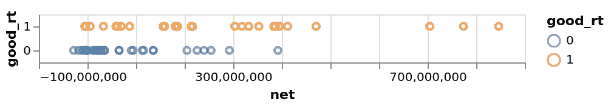
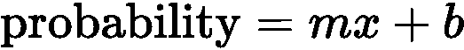
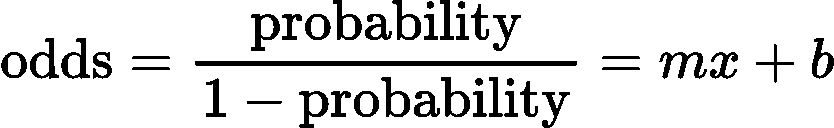
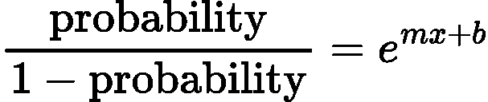
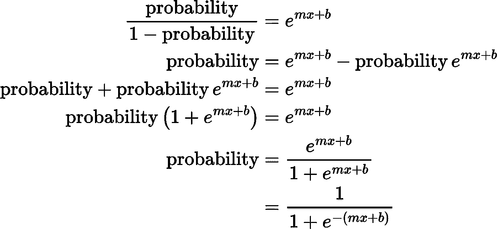
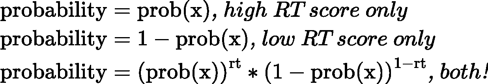
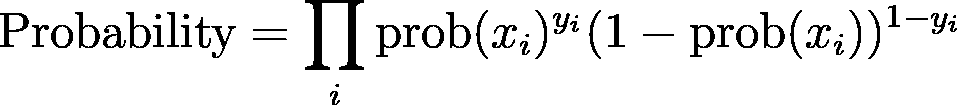
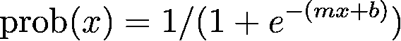
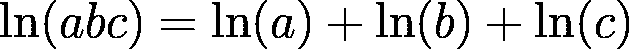
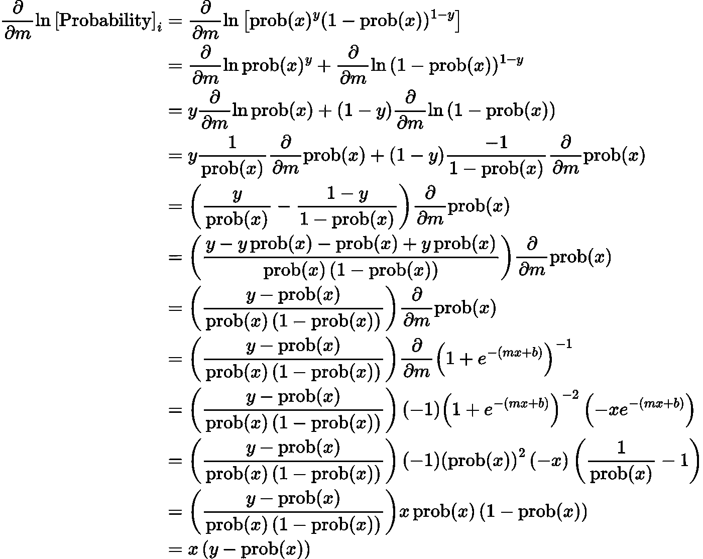

# Python 中第一原理的逻辑回归

> 原文：<https://towardsdatascience.com/logistic-regression-from-first-principles-in-python-82f238effef1?source=collection_archive---------12----------------------->

## LR 从无到有，没有*“可以证明……”*

从一个数据集和三个假设开始，我们用 Python 推导并实现了一个基本的逻辑回归。目标是更好地理解模型的基本假设。

# 定义问题

我们使用来自[织女星电影数据集](https://github.com/vega/vega/blob/master/docs/data/movies.json)的数据。我们的目标是预测一部电影在烂番茄是否会获得成功。在现实生活中，这有点倒退，因为一部电影通常在盈利之前就有评论。假设我们在烂番茄工作，并试图预测如果我们用已知票房表现但没有评论的老电影回填网站会发生什么。

首先，我们用

```
pip install altair vega_datasets
```

烂番茄网站对他们的[认证新鲜评分](https://www.rottentomatoes.com/about#whatiscertifiedfresh)使用超过 75 的分数，所以让我们坚持这个数字来衡量我们所谓的“好”电影，或`good_rt`。为了简单起见，我们只保留“G”级电影。

```
import pandas as pd                                                             
from vega_datasets import data                                                  

# Pull and prune the dataset to movies of interest.                                      
movies_g_df = (                                                                 
    data.movies()                                                               
    .query('MPAA_Rating == "G"')                                                
    .dropna(subset=["Rotten_Tomatoes_Rating"])                                  
)                                                                               

# Calculate net profits and Rotten Tomatoes' "Goodness" cutoff.                 
movies_df = movies_g_df.assign(                                                 
    net=movies_g_df.eval(                                                       
        "Worldwide_Gross-Production_Budget"                                     
    ),                                                                          
    good_rt=(                                                                   
        movies_g_df["Rotten_Tomatoes_Rating"] >= 75                             
    ).astype(int),                                                              
)
```

数据帧现在看起来像这样:

```
╔══════════════════════════════════════╦═════════════╦═════════╗
║                Title                 ║     net     ║ good_rt ║
╠══════════════════════════════════════╬═════════════╬═════════╣
║ Cats Don't Dance                     ║ -28411398.0 ║       0 ║
║ 102 Dalmatians                       ║ -18058441.0 ║       0 ║
║ Babe: Pig in the City                ║ -10868140.0 ║       0 ║
║ Muppets From Space                   ║  -7695214.0 ║       0 ║
║ The Adventures of Elmo in Grouchland ║  -5365542.0 ║       1 ║
║ ...                                  ║         ... ║     ... ║
║ "Monsters Inc."                      ║ 411864330.0 ║       1 ║
║ Ratatouille                          ║ 470495432.0 ║       1 ║
║ The Lion King                        ║ 704539505.0 ║       1 ║
║ Finding Nemo                         ║ 773894287.0 ║       1 ║
║ Toy Story 3                          ║ 846340665.0 ║       1 ║
╚══════════════════════════════════════╩═════════════╩═════════╝
```

我们使用[牛郎星](https://altair-viz.github.io/getting_started/installation.html)绘制并检查数据。

```
import altair as alt
alt.Chart(movies_df).mark_point().encode(                                       
    x=alt.X("net"),                                                             
    y=alt.Y("good_rt:N", sort="descending"),                                    
    color="good_rt:N",                                                          
    tooltip=[                                                                   
        "Title",                                                                
        "Release_Date",                                                         
        "net",                                                                  
        "Rotten_Tomatoes_Rating",                                               
    ],                                                                          
).save("/tmp/movies.html")
```



存储在“/tmp/movies.html”中的可视化快照。

利润较低的电影似乎不太可能是好电影。**现在的目标是创建一个函数，它接收利润并返回一个好的概率。如果对于某些电影概率超过 50%,我们说该函数预测电影是“好的”。**

观察上图，我们应该期望我们的函数具有以下特征:

*   对于负利润，该函数应返回一个小于 50%的数字。
*   对于非常高的利润，该函数应该返回超过 50%的数字。
*   对于较低的(正)利润，该函数应该返回大约 50%。

为了改进这些猜测，我们想利用现有的数据找到一个最佳的“利润”截止点。

# 开始预测

最简单的开始方法是一个线性函数，它通过将利润 *x* 乘以一个常数权重 *m* 并加上一个常数 *b* 来创建概率。



我们可以选择 m 和 T21 来得到 0 到 10 亿美元净利润的合理答案。然而，这一点被打破了，因为美元是无界的。一部足够成功的电影会把概率*m***x*+*b*推到 1 以上。

# 假设 1:在处理大于 1 的数字时，“*赔率”*优于*概率*

某事发生与未发生的比率被称为*赔率*，这是任何赛马场或体育博彩场的自然术语。如果一枚硬币正面着地的可能性是反面的两倍，我们说*几率是 2 比 1* 。说一匹马在比赛中的赔率是 9 比 2 更容易，而不是说这匹马有 81.818%的概率输掉比赛。

由于电影的净利润可能是任意高的，就像打赌的赔率一样，我们假设将利润与良好的烂番茄评分的赔率联系起来是合适的。



假设 1，我们应该把一部电影的“好”几率和它的盈利能力 x 联系起来。

这样，任何任意高的利润， *x* ，都可以匹配到相应的接近 1 的概率。为`probability`插入 0.99999，看看为什么。

还有第二个问题。如果一部电影的拍摄成本高于票房收入，那么这部电影的净利润可能是负数。我们需要一种方法来确保等式的右边总是正的，不管负的 x 是多少。

# 假设 2:对一列有序数字求幂是使它们都为正而不失去顺序的最简单的方法。

在保持排序的同时，尝试使排序列表中的每个数字都为正数:

```
[-12, -2, 1, 2, 99]
```

使数字为正的一种方法是取每一项的绝对值:

```
[12, 2, 1, 2, 99]   sorted -->   [1, 2, 2, 12, 99]
```

问题是顺序变了。说这些数字代表电影利润以百万计。赚了 2M 美元利润的电影和赔了 2M 美元的电影彼此接近，难以区分，这肯定是一个不理想的结果！

取而代之的是，拿 *e^x* 每部电影的利润 *x，*给予

```
[6e-6, 0.14, 2.7, 7.4, 9.9e42]
```

这五部电影仍然是同样的顺序，但我们已经成功地使所有的价值观是积极的。

在这一点上，你可能会问*，但是为什么不使用任何其他函数，比如* `*1+tanh(x)*` *，取负数为正数呢？那太好了！我们正试图用最简单的方法解决电影盈利率的概率问题，并且必须以某种方式使这些数字为正。如果我们假设`e^x`是最佳选择，我们可以继续推导逻辑回归。另一个假设可能导致一个有效但不同的结果。这就是为什么指数运算是逻辑回归的一个假设。*

我们的利润和概率之间的关系现在看起来像:



最后，我们准备做数学来创建函数，获取净利润并返回概率！



在 Python 中:

```
from math import e
def prob(x):
    m = ?
    b = ?
    return 1/(1 + e**(-m*x-b))
```

功能完成了！我们到现在还没有这么说，但是我们只用了两个假设就推导出了逻辑回归！剩下唯一要做的就是输入 *m* 和 *b* 的最佳值，这被称为“拟合”函数。但是等等…m*m*和 b*b*的最佳值是多少？原来这是一个如此重要的问题，我们继续回答它作为推导的延续。

# 插入数据以找到最佳值

为了找到逻辑回归的最佳值，我们从随机值开始，看看调整 *m* 和 *b* 时会发生什么。但首先，我们通过考虑正确猜测电影善良意味着什么来定义“发生了什么”。

当具有高烂番茄分数的电影 1 被我们的函数评估时，预测正确的概率是 T0。评价续集*电影 2* 时，烂番茄评分低，概率为`1-prob(x2)`。正确预测两者的概率是`prob(x1)*(1-prob(x2))`。

一般来说，几个预测正确的概率是每个预测的概率的乘积。例如，从数据中选取两部电影:

1.  《艾尔莫在格鲁希兰的冒险》损失了 500 万美元，但烂番茄收视率很高。
2.  *来自太空的布偶*，损失 700 万美元，烂番茄评分低。

对 *m* 和 *b* 使用任意值，正确预测这两部电影的概率为:

```
from math import e
def prob(x):
    m = 1e-6
    b = 1
    return 1/(1+e**(-m*x-b))# "The Adventures of Elmo in Grouchland" and "Muppets From Space".
prob(-5_365_542)*(1-prob(-7_695_214))0.012532803995131545
```

1.2%的综合概率。让我们看看调整 m 是否能改善这种情况:

```
from math import e
def prob(x):
    m = 1e-7  # <-- tweaked
    b = 1
    return 1/(1+e**(-m*x-b))# "The Adventures of Elmo in Grouchland" and "Muppets From Space".
prob(-5_365_542)*(1-prob(-7_695_214))0.271702643394042
```

27%!我们预测得更好！让我们再做一次，看看会发生什么:

```
from math import e
def prob(x):
    m = 1e-8  # <-- tweaked again
    b = 1
    return 1/(1+e**(-m*x-b))# "The Adventures of Elmo in Grouchland" and "Muppets From Space".
prob(-5_365_542)*(1-prob(-7_695_214))0.2048307326133298
```

嗯，降到 20%。也许我们可以换成移动 b？

```
from math import e
def prob(x):
    m = 1e-7
    b = 0.5
    return 1/(1+e**(-m*x-b))# "The Adventures of Elmo in Grouchland" and "Muppets From Space".
prob(-5_365_542)*(1-prob(-7_695_214))0.2783069465719312
```

略有改善，但如果我们…你明白了。我们可以继续向任一方向轻推 *m* 和 *b* ，直到每一个变化都使概率降低，这意味着我们达到了最优值。这很乏味，而且随着数据中电影的增多，这将变得更加困难。更糟糕的是，如果有两个以上的参数，比如考虑一个额外的电影特性，我们就必须这样调整所有的参数。

相反，让我们用所有的数据创建一个巨大的概率，然后找到一个更好的方法来优化它。为此，首先将低和高烂番茄结果组合成一个概率陈述:



最上面的等式被定义为高分烂番茄电影的概率。对于得分低的烂番茄电影，我们从 1 中减去概率(第二个等式)。定义变量“rt ”,对于高分电影为 1，对于低分电影为 0，可以组合概率(第三个等式)。

要了解上面第三个等式的工作原理，请注意当 *rt* =1 时，正确的项消失了。当 *rt* = 0 时，左边的项消失。

现在我们可以同时计算好电影和坏电影的概率。注意我们仍然对 m 和 b 使用任意选择的值。

```
from math import e
def prob(x):
    m = 1e-9
    b = 1e-2
    return 1/(1+e**(-m*x-b))probability = 1
for net, rt in movies_df[['net','good_rt']].to_records(index=False):
    probability *= (prob(net))**rt * (1-prob(net))**(1-rt)

print(probability)1.9707049911814526e-17
```

我们有可能一起猜测所有的数据点。现在是时候用比手动调整更聪明的方式找到 m 和 b 的最佳值了。

# 最大化概率

上面的`for`循环中的总概率在数学上是这样表示的:



巨型𝚷与 for 循环的*=操作相同。《我》是一部电影，就像《来自太空的布偶》。

`prob(x)`函数，即单部电影的概率，由下式给出:



为了得到 *m* (或 *b* )的最优值，我们取总概率相对于 *m* (或 *b* )的导数，将方程设为零并求解，对吗？不幸的是，有两个问题:

1.  对一堆相乘的东西求导。
2.  即使是对这个巨大的导数求导，我们也找不到关于 *m* (或 *b* )的封闭解，所以我们无法通过这种方式得到最优值。

但是并没有失去一切。虽然我们不能解析地解决这个问题，但我们仍然可以找到 m 和 b 的最佳值。我们可以尝试对概率方程进行(可怕的)求导，然后朝那个方向迈一小步，重复直到到达顶点！

这个管用。但是记住，一堆东西相乘的导数是很难的。在实践中，先多走一步，事情就简单多了。

# 假设 3:要使一个函数最大化，首先取这个函数的对数，如果它使数学更容易的话。

理由:对于任何有波峰和波谷的函数，到处取对数会降低波峰和波谷的高度，但不会移除任何波峰或波谷，也不会左右移动它们。为了找到概率函数 *m* 的最大值，在任何地方取其对数，并找到*的最大值 *m* ，即*函数和峰值将在同一位置。

同样，你可能会想*为什么是日志？为什么不是平方或平方根或余弦或任何其他函数？你又一次说对了。我们可以自由选择任何不影响概率峰值位置的合理函数。我们假设日志使我们的工作比其他选项更容易。*

原因如下。产品的对数等于因子对数的总和:



对于利润为 x 且烂番茄分类为 y 的单部电影 *i* :


这也证明了计算机更容易得到正确的数学运算。】

现在深呼吸，对 *m* 求导，必要时插入 prob(x)函数:



在一个看似奇迹般的取消条款的过程中，导数(调整 *m* 的方向)由`x*(y-prob(x))`给出，即一部电影的净利润乘以烂番茄优度减去函数正确的概率。

重新计算导数相对于 *b* 的位置，结果的唯一不同是前导`x`变成了`1`。

计算完所有数据点的导数后，最后一步是将其中的一小部分加回参数 *m* 和*b。*这将略微提高我们的总概率。重复这个过程，概率最终会停止变得更好，我们得到了最优值 *m* 和 *b* 。

```
from math import e# These are tiny fractions.
M_EPSILON = 1e-19
B_EPSILON = 1e-10def prob(x, m, b):
    return 1 / (1 + e ** (-m * x - b))m = 1e-9
b = 1e-3 

for i in range(100_000):
    for net_profit, rotten_tomatoes in movies_df[
        ["net", "good_rt"]
    ].to_records(index=False):
        p = prob(net_profit, m, b)
        m_derivative = net_profit * (
            rotten_tomatoes - p
        ) 
        m_step = M_EPSILON * m_derivative
        m += m_step

        b_derivative = 1 * (rotten_tomatoes - p)
        b_step = B_EPSILON * b_derivative
        b += b_stepprint(f"{m=}, {b=}")
```

以`m = 2.815e-09`和`b = 0.0001839`结尾。为了检查结果的合理性，使用 Scikit Learn 和 compare 运行相同的回归:

```
from sklearn.linear_model import LogisticRegressionX = movies_df[["net"]]
y = movies_df["good_rt"]
clf = LogisticRegression(random_state=0).fit(X, y)
print(f"{clf.coef_.item()=}, {clf.intercept_.item()=}")
```

赠送`m = 2.813e-09`，赠送`b = -6.792e-17`。

# 摘要

我们开始预测一部电影在给定净利润的情况下在烂番茄获得成功的概率，我们现在有:

```
from math import edef prob(x):
    m = 2.815e-09
    b = 0.0001839 
    return 1 / (1 + e ** (-m * x - b))print(prob(-1e10))  # 5.952373865141857e-13
print(prob(-1e8))   # 0.4301311461885308
print(prob(-1e6))   # 0.499342225379464
print(prob(1e6))    # 0.500749724438119
print(prob(1e8))    # 0.5699590060203963
print(prob(1e10))   # 0.9999999999994049
```

我们做了三个合理的假设，一路证明了它们的合理性。我们可以自由地偏离它们，例如通过选择对数的替代品，但是我们会失去简单的导数结果`x*(y-prob(x))`，并且我们不会得到逻辑回归。

逻辑回归的任何严肃应用都应该依赖 Scikit-learn 这样的软件包，而不是我们自己开发的各种软件包。它不仅更易于读取、编写和调试，而且还包含了诸如系数查找优化、多变量支持、管道支持等特性。

# 行话和后续步骤

我们从第一原理推导出逻辑回归。然而，将上述概念与标准术语联系起来是有帮助的。

*   **逻辑函数** : f(x) = 1/[1 + exp(-x)]
*   **Logit 函数** : f(x) = ln[x/(1-x)]
*   **似然**:以`Probability=...`开头的大𝚷方程
*   **对数似然**:以`ln[Probability]=...`开头的等式
*   **梯度**:相对于 *m* (或 *b* )的导数
*   **坡度上升**:将一部分坡度加回 *m* (或 *b* )

对于后续工作，请查看下面参考资料中的*从 Python 中的逻辑回归*一文，其中基于 Numpy 的方法在大约 20 行代码中导出了多变量逻辑回归。尝试自己编写一个二维扩展，并使用参考资料中的绘图代码来获得系数含义的直觉。

# 参考

1.  逻辑回归的推导:[https://web . Stanford . edu/class/archive/cs/cs 109/cs 109.1178/lesson 讲义/220-logistic-regression . pdf](https://web.stanford.edu/class/archive/cs/cs109/cs109.1178/lectureHandouts/220-logistic-regression.pdf)
2.  关于罗吉特变换的讨论:【https://data.princeton.edu/wws509/notes/c3.pdf#page=6】T4
3.  Python 中从头开始的逻辑回归:[https://Becker nick . github . io/logistic-Regression-from-Scratch/](https://beckernick.github.io/logistic-regression-from-scratch/)
4.  绘制逻辑回归模型的决策边界:[https://scipython . com/blog/plotting-the-decision-boundary-of-a-logistic-regression-model/](https://scipython.com/blog/plotting-the-decision-boundary-of-a-logistic-regression-model/)
5.  用[https://latexeditor.lagrida.com/](https://latexeditor.lagrida.com/)生成的乳胶

# 所有的代码

你是否一路向下滚动到底部，只是为了获得完整的代码来复制/粘贴，并看看这是否适合你？如果有，请尽情享受:-)

```
# Requires Python 3.8 or higher# Run the following line to install dependencies:
#     pip install altair vega_datasets scikit-learnimport pandas as pd                                                             
from vega_datasets import data###############################
# Pull and Prune the Data Set #
###############################

movies_g_df = (
    data.movies()
    .query('MPAA_Rating == "G"')
    .dropna(subset=["Rotten_Tomatoes_Rating"])
)#####################
# Data Calculations #
#####################movies_df = movies_g_df.assign(                                                 
    net=movies_g_df.eval(                                                       
        "Worldwide_Gross-Production_Budget"                                     
    ),                                                                          
    good_rt=(                                                                   
        movies_g_df["Rotten_Tomatoes_Rating"] >= 75                             
    ).astype(int),                                                              
)#########
# Plot! #
#########import altair as alt
alt.Chart(movies_df).mark_point().encode(                                       
    x=alt.X("net"),                                                             
    y=alt.Y("good_rt:N", sort="descending"),                                    
    color="good_rt:N",                                                          
    tooltip=[                                                                   
        "Title",                                                                
        "Release_Date",                                                         
        "net",                                                                  
        "Rotten_Tomatoes_Rating",                                               
    ],                                                                          
).save("/tmp/movies.html")#################################
# An Arbitrary First Best Guess #
#################################from math import e
def prob(x):
    m = 1e-6
    b = 1
    return 1/(1+e**(-m*x-b))# "The Adventures of Elmo in Grouchland" and "Muppets From Space".
print(f"{prob(-5_365_542)*(1-prob(-7_695_214))=}")############################
# Calculate the Likelihood #
############################def prob(x):
    m = 1e-9
    b = 1e-2
    return 1/(1+e**(-m*x-b))probability = 1
for net, rt in movies_df[['net','good_rt']].to_records(index=False):
    probability *= (prob(net))**rt * (1-prob(net))**(1-rt)

print(f"{probability=}")###################
# Gradient Ascent #
#################### These are tiny fractions.
M_EPSILON = 1e-19
B_EPSILON = 1e-10def prob(x, m, b):
    return 1 / (1 + e ** (-m * x - b))m = 1e-9
b = 1e-3 

for i in range(100_000):
    for net_profit, rotten_tomatoes in movies_df[
        ["net", "good_rt"]
    ].to_records(index=False):
        p = prob(net_profit, m, b)
        m_derivative = net_profit * (
            rotten_tomatoes - p
        ) 
        m_step = M_EPSILON * m_derivative
        m += m_step

        b_derivative = 1 * (rotten_tomatoes - p)
        b_step = B_EPSILON * b_derivative
        b += b_stepprint(f"{m=}, {b=}")###########################
# Scikit Learn Comparison #
###########################from sklearn.linear_model import LogisticRegressionX = movies_df[["net"]]
y = movies_df["good_rt"]
clf = LogisticRegression(random_state=0).fit(X, y)
print(f"{clf.coef_.item()=}, {clf.intercept_.item()=}")
```

[*Ryan Duve*](https://www.linkedin.com/in/duve/)*是 Corvus Insurance 的数据科学家。他还是一名物理学家、Linux 黑客和一名糟糕的咖啡师。*