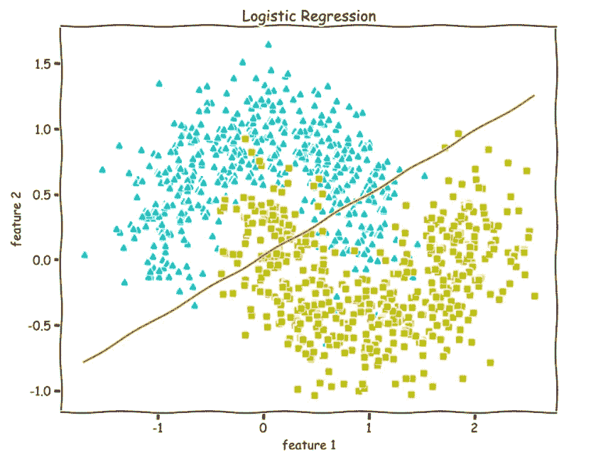
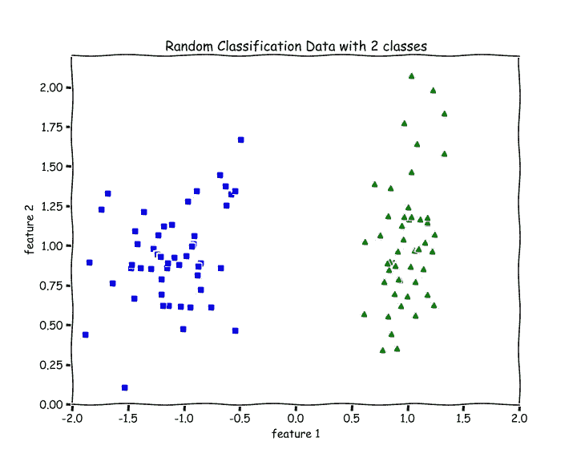
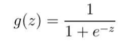
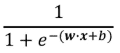
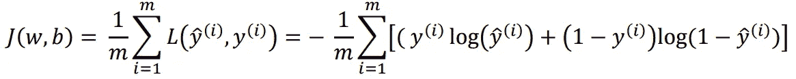
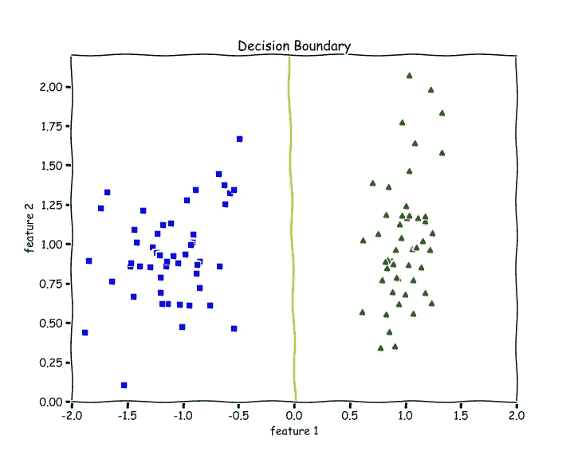
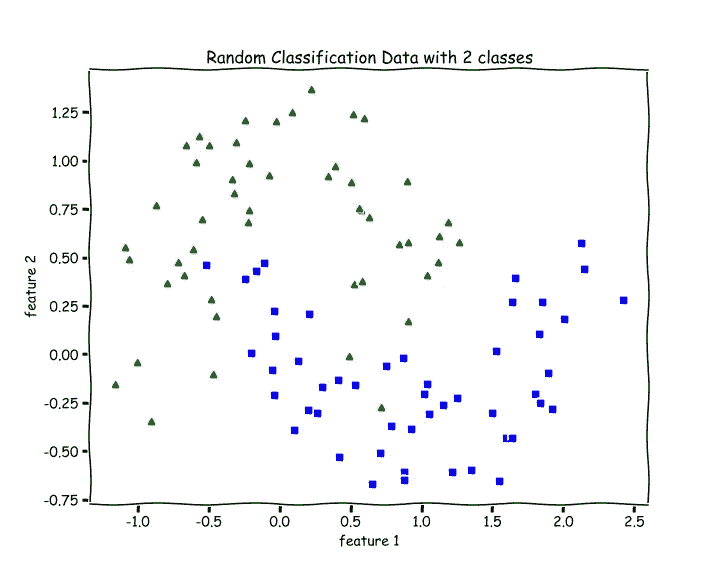
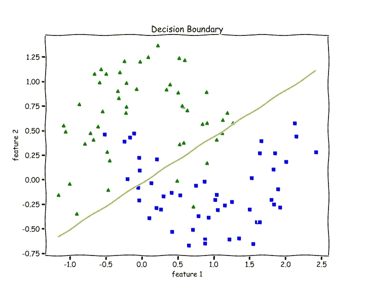

# Python 中从头开始的逻辑回归

> 原文：<https://towardsdatascience.com/logistic-regression-from-scratch-in-python-ec66603592e2?source=collection_archive---------0----------------------->

## 从零开始的机器学习:第 5 部分



作者图片

在本文中，我们将实现最常用的分类算法，称为逻辑回归。首先，我们将理解 **Sigmoid** 函数、**假设**函数、**决策边界**、**测井损失函数**并对它们进行编码。

之后，我们将应用**梯度下降**算法来寻找参数`weights`和`bias`。最后，我们将测量**准确度**和**绘制线性可分离数据集和非线性可分离数据集的决策边界**。

我们将使用 Python NumPy 和 Matplotlib 来实现这一切。

[](/polynomial-regression-in-python-b69ab7df6105) [## 用 Python 从头开始实现多项式回归

### 从零开始的机器学习:第 4 部分

towardsdatascience.com](/polynomial-regression-in-python-b69ab7df6105) 

# 符号—

*   `n`→特征数量
*   `m`→训练实例数量
*   `X`→形状输入数据矩阵(`m` x `n`)
*   `y`→真/目标值(**只能是 0 或 1**)
*   `x(i), y(i)`→带培训示例
*   `w` →形状的权重(参数)(`n` x 1)
*   `b` →bias(参数)，一个可以[广播的实数](https://numpy.org/doc/stable/user/basics.broadcasting.html)。
*   `y_hat`(带帽子的 y)→假设(**输出 0 和 1** 之间的值)

我们将进行**二进制分类**，因此`y`(真/目标)的值将为 0 或 1。

例如，假设我们有一个乳腺癌数据集，其中`X`是肿瘤大小，`y`是肿块是恶性(癌变)还是良性(非癌变)。每当病人来访时，你的工作就是告诉他/她根据肿瘤的大小，肿块是恶性的还是良性的。这种情况下只有两个类。

所以，`y`要么是 0，要么是 1。

# 逻辑回归

让我们使用以下随机生成的数据作为一个激励性的例子来理解逻辑回归。

```
**from sklearn.datasets import make_classification****X, y = make_classification(n_features=2, n_redundant=0, 
                           n_informative=2, random_state=1, 
                           n_clusters_per_class=1)**
```



作者图片

有 2 个特性，`n` =2。有两类，蓝色和绿色。

对于二进制分类问题，我们自然希望我们的假设(`y_hat`)函数输出 0 到 1 之间的值，这意味着从 0 到 1 的所有实数。

所以，我们想选择一个函数，它把所有的输入压缩在 0 和 1 之间。一个这样的函数是 Sigmoid 或逻辑函数。

# **乙状结肠或逻辑函数**

正如我们在下图的 y 轴上看到的，Sigmoid 函数将其所有输入(x 轴上的值)压缩在 0 和 1 之间。



资料来源:吴恩达

该函数的输入范围是所有实数的集合，输出范围在 0 和 1 之间。


乙状结肠函数；来源:[维基百科](https://www.google.com/url?sa=i&url=https%3A%2F%2Fen.wikipedia.org%2Fwiki%2FSigmoid_function&psig=AOvVaw2nq5uAehtbrwbJxkVG5Klg&ust=1617881288361000&source=images&cd=vfe&ved=0CAIQjRxqFwoTCNjO282D7O8CFQAAAAAdAAAAABAD)

我们可以看到，随着`z`向正无穷大增加，输出越来越接近 1，随着`z`向负无穷大减少，输出越来越接近 0。

```
**def sigmoid(z):
    return 1.0/(1 + np.exp(-z))**
```

# 假设

对于线性回归，我们有一个假设`y_hat = w.X +b`，其输出范围是所有实数的集合。

现在，对于逻辑回归，我们的假设是——`y_hat = sigmoid(w.X + b)`，其输出范围在 0 和 1 之间，因为通过应用 sigmoid 函数，我们总是输出 0 和 1 之间的数字。

`y_hat` =



逻辑回归假设；[来源](https://www.google.com/url?sa=i&url=https%3A%2F%2Fneuralrepo.net%2F2019%2F07%2F07%2Fsigmoid-neuron-logistic-regression-from-scratch%2F&psig=AOvVaw26nBIbMpK8ZeFZVkA0ndO9&ust=1617919651464000&source=images&cd=vfe&ved=0CAIQjRxqFwoTCIjhk8eS7e8CFQAAAAAdAAAAABAD)

> z = w.X +b

现在，你可能会奇怪，有很多连续函数输出 0 到 1 之间的值。为什么我们只选择物流功能，而不选择其他功能？实际上，有一类更广泛的算法叫做广义线性模型，这是它的一个特例。给定我们的一组假设，Sigmoid 函数会很自然地从中脱离出来。

# 损失/成本函数

对于每个参数化机器学习算法，我们需要一个损失函数，我们希望最小化该函数(找到其全局最小值)，以确定最佳参数(`w`和`b`)，这将帮助我们做出最佳预测。

对于线性回归，我们用均方差作为损失函数。但这是一个回归问题。

对于一个二元分类问题，我们需要能够输出`y`是 **1** 的概率(比如肿瘤是良性的)，然后我们就可以确定`y`是 **0** (肿瘤是恶性的)的概率或者反之。

所以，我们假设我们的假设(`y_hat`)输出的值在 0 和 1 之间，是`y`为 1 的概率，那么`y`为 0 的概率将是`(1-y_hat)`。

> 记住`y`只是 0 或者 1。`y_hat`是介于 0 和 1 之间的数字。

更正式的说法是，给定`X`，用`w`和`b`参数化的 y=1 的概率是`y_hat`(假设)。那么，逻辑上给定`X`，用`w`和`b`参数化的 y=0 的概率应该是`1-y_hat`。这可以写成—

> `P(y = 1 | X; w, b) =` y_hat
> 
> `P(y = 0 | X; w, b) = (1-y_hat)`

然后，基于我们的假设，我们可以使用上述两个方程计算参数的对数似然，从而确定我们必须最小化的损失函数。以下是二元 Coss-熵损失或对数损失函数—



二元交叉熵损失函数；资料来源:吴恩达

供参考— [了解逻辑回归和可能性](https://stats.stackexchange.com/questions/304988/understanding-the-logistic-regression-and-likelihood)

`J(w,b)`是训练集的总成本/损失，而`L`是第 I 个训练示例的成本。

```
**def loss(y, y_hat):
    loss = -np.mean(y*(np.log(y_hat)) - (1-y)*np.log(1-y_hat))
    return loss**
```

通过查看损失函数，我们可以看到，当我们正确预测时，即当 y=0 且 y_hat=0 或 y=1 且 y_hat=1 时，损失函数接近 **0** ，而如果我们预测错误，即当 y=0 但 y_hat=1 或 y=1 但 y_hat=1 时，损失函数接近**无穷大**。

# 梯度下降

现在我们知道了假设函数和损失函数，我们需要做的就是使用梯度下降算法找到我们参数的最优值，就像这样(`lr`→学习速率)—

> w := w-lr*dw
> 
> b := b-lr*db

其中，`dw`是损失函数相对于`w`的偏导数，`db`是损失函数相对于`b`的偏导数。

> dw = (1/m)*(y_hat — y)。X
> 
> db = (1/m)*(y_hat — y)

让我们写一个函数`gradients`来计算`dw`和`db`。

请参见注释(#)。

```
**def gradients(X, y, y_hat):**

    # X --> Input.
    # y --> true/target value.
    # y_hat --> hypothesis/predictions.
    # w --> weights (parameter).
    # b --> bias (parameter).

    # m-> number of training examples.
    **m = X.shape[0]**

    # Gradient of loss w.r.t weights.
    **dw = (1/m)*np.dot(X.T, (y_hat - y))**

    # Gradient of loss w.r.t bias.
    **db = (1/m)*np.sum((y_hat - y)) 

    return dw, db**
```

# 判别边界

现在，我们想知道我们的假设(`y_hat`)将如何预测 y=1 还是 y=0。我们定义假设的方式是给定`X`并且由`w`和`b`参数化的`y`为 1 的概率。

所以，我们会说它会预测—

> 当`y_hat ≥ 0.5`时 y=1
> 
> `y_hat < 0.5`时 y=0

查看 sigmoid 函数的图表，我们看到——

> y_hat ≥ 0.5，`z`或 w.X + b ≥ 0
> 
> y_hat < 0.5，z 或 w.X + b < 0

也就是说，我们预测—

> 当 w.X + b ≥ 0 时，y=1
> 
> 当 w.X + b < 0 时，y=0

所以，`**w.X + b = 0**`将是我们的决策边界。

> 以下用于绘制决策边界的代码仅在`X`中只有两个特征时有效。

```
**def plot_decision_boundary(X, w, b):**

    # X --> Inputs
    # w --> weights
    # b --> bias

    # The Line is y=mx+c
    # So, Equate mx+c = w.X + b
    # Solving we find m and c
    **x1 = [min(X[:,0]), max(X[:,0])]
    m = -w[0]/w[1]
    c = -b/w[1]
    x2 = m*x1 + c**

    # Plotting
    **fig = plt.figure(figsize=(10,8))
    plt.plot(X[:, 0][y==0], X[:, 1][y==0], "g^")
    plt.plot(X[:, 0][y==1], X[:, 1][y==1], "bs")
    plt.xlim([-2, 2])
    plt.ylim([0, 2.2])
    plt.xlabel("feature 1")
    plt.ylabel("feature 2")
    plt.title('Decision Boundary')** **plt.plot(x1, x2, 'y-')**
```

# 归一化函数

函数来规范化输入。请参见注释(#)。

```
**def normalize(X):**

    # X --> Input.

    # m-> number of training examples
    # n-> number of features 
    **m, n = X.shape**

    # Normalizing all the n features of X.
    **for i in range(n):
        X = (X - X.mean(axis=0))/X.std(axis=0)**

 **   return X**
```

# 训练功能

`train`该功能包括初始化权重和偏差以及带有小批量梯度下降的训练循环。

请参见注释(#)。

```
**def train(X, y, bs, epochs, lr):**

    # X --> Input.
    # y --> true/target value.
    # bs --> Batch Size.
    # epochs --> Number of iterations.
    # lr --> Learning rate.

    # m-> number of training examples
    # n-> number of features 
    **m, n = X.shape**

    # Initializing weights and bias to zeros.
    **w = np.zeros((n,1))
    b = 0**

    # Reshaping y.
    **y = y.reshape(m,1)**

    # Normalizing the inputs.
    **x = normalize(X)**

    # Empty list to store losses.
    **losses = []**

    # Training loop.
   ** for epoch in range(epochs):
        for i in range((m-1)//bs + 1):**

            # Defining batches. SGD.
            **start_i = i*bs
            end_i = start_i + bs
            xb = X[start_i:end_i]
            yb = y[start_i:end_i]**

            # Calculating hypothesis/prediction.
 **y_hat = sigmoid(np.dot(xb, w) + b)**            
            # Getting the gradients of loss w.r.t parameters.
 **dw, db = gradients(xb, yb, y_hat)**            
            # Updating the parameters.
            **w -= lr*dw
            b -= lr*db**

        # Calculating loss and appending it in the list.
        **l = loss(y, sigmoid(np.dot(X, w) + b))
        losses.append(l)**

    # returning weights, bias and losses(List).
  **  return w, b, losses**
```

# 预测功能

请参见注释(#)。

```
**def predict(X):**

    # X --> Input.

    # Normalizing the inputs.
   ** x = normalize(X)**

    # Calculating presictions/y_hat.
 **preds = sigmoid(np.dot(X, w) + b)**    
    # Empty List to store predictions.
 **pred_class = []** # if y_hat >= 0.5 --> round up to 1
    # if y_hat < 0.5 --> round up to 1
 **pred_class = [1 if i > 0.5 else 0 for i in preds]**    
 **return np.array(pred_class)**
```

# 训练和绘制决策边界

```
# Training 
**w, b, l = train(X, y, bs=100, epochs=1000, lr=0.01)**# Plotting Decision Boundary
**plot_decision_boundary(X, w, b)**
```



作者图片

# 计算精度

我们检查有多少例子是正确的，然后除以例子的总数。

```
**def accuracy(y, y_hat):
    accuracy = np.sum(y == y_hat) / len(y)
    return accuracy****accuracy(X, y_hat=predict(X))**
>> 1.0
```

我们得到了 100%的准确率。我们可以从上面的决策边界图中看到，我们能够完美地分离绿色和蓝色类。

# 非线性可分数据的检验

让我们测试一下代码中不可线性分离的数据。

```
**from sklearn.datasets import make_moons****X, y = make_moons(n_samples=100, noise=0.24)**
```



作者图片

```
# Training 
**w, b, l = train(X, y, bs=100, epochs=1000, lr=0.01)**# Plotting Decision Boundary
**plot_decision_boundary(X, w, b)**
```



作者图片

由于逻辑回归只是一个线性分类器，我们能够画出一条像样的直线，能够尽可能多地将蓝色和绿色彼此分开。

让我们检查一下这个的准确性—

```
**accuracy(y, predict(X))**
>> 0.87
```

87 %的准确率。还不错。

# 重要见解

当我使用我的代码训练数据时，我总是在损失列表中得到 NaN 值。

后来我发现我没有把我的输入正常化，这就是我的损失充满了失败的原因。

如果你在训练中得到 NaN 值或溢出——

*   规范化您的数据— `X`。
*   降低你的学习速度。

感谢阅读。对于问题、评论、顾虑，请在回复部分进行讨论。更多的 ML 从零开始即将推出。

**看看从零开始学习的机器系列—**

*   第一部分:[**Python 中从零开始的线性回归**](https://medium.com/analytics-vidhya/linear-regression-from-scratch-in-python-b6501f91c82d?source=your_stories_page-------------------------------------)
*   第二部分:[**Python 中的局部加权线性回归**](/locally-weighted-linear-regression-in-python-3d324108efbf?source=your_stories_page-------------------------------------)
*   第三部分: [**使用 Python 的正规方程:线性回归的封闭解**](/normal-equation-in-python-the-closed-form-solution-for-linear-regression-13df33f9ad71?source=your_stories_page-------------------------------------)
*   第四部分:[**Python 中从零开始的多项式回归**](/polynomial-regression-in-python-b69ab7df6105)