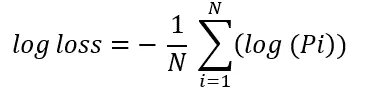
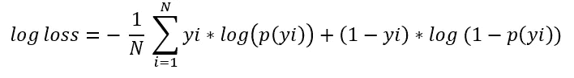

# 逻辑回归:从统计概念到机器学习

> 原文：<https://towardsdatascience.com/logistic-regression-from-statistical-concept-to-machine-learning-78691a4d20e1?source=collection_archive---------34----------------------->

Lex Aliviado 在 [Unsplash](https://unsplash.com?utm_source=medium&utm_medium=referral) 上拍摄的照片

## 从简单的直觉到复杂的建模过程

逻辑回归是用于解决机器学习中分类问题的最流行的算法之一。它使用逻辑函数来模拟不同的输入变量如何影响二元结果的概率。如现有文献所述，该技术相当复杂。写这篇文章的目的是用简单的术语描述这个模型，主要集中在通过尽可能避免复杂的数学公式来建立一种直觉。

我将从一个相对容易理解的线性回归问题开始，并在此基础上建立逻辑回归。最后，我将介绍一些额外的主题，如成本函数和最大似然估计。让我们开始吧！

# **直觉**

让我们忘记“逻辑回归”，看看不使用这个术语我们能走多远。

让我们假设客户收入与他们在某些产品上的支出相关联。因此，我们建立了一个基于收入水平预测支出的模型，如下所示:

*支出= a + b *收入+ e*

请注意，在这种情况下，因变量——支出——是一个连续变量。有了客户的收入和支出数据，我们就可以估算出 *a* & *b* 并根据收入(自变量)用模型预测支出(因变量)。

假设在分析数据后，我们将模型参数化，如下所示(不用说，完全是虚构的数字):

*支出= -50 + 0.12 *收入*

现在，如果我们插入收入，我们可以很容易地估计支出。假设收入是 1000 美元，那么:

*支出=-50+0.12 * 1000 = 85 美元。*

同样，我们的因变量是一个连续变量。但是如果它是一个分类变量呢？我们想预测顾客是否会购买一件产品，而不是*支出的金额*？所以本质上现在因变量是一个二元结果——是或不是。

*购买(是/否)= -50 + 0.12 *收入*

现在，如果你在等式中插入收入，它仍然给出连续的价值作为输出，尽管我们的因变量是分类的。

让我们用假人(yes =1，no =0)来代表购买决策:

*购买(1 或 0) = -50 + 0.12 *收入*

我们现在有了一个数值型的因变量，但它仍然是二进制的——只包含两个值 0 和 1。那么周围的路是什么呢？一种方法是使用概率(p)来代替二元结果:

*p = -50 + 0.12 *收入*

现在我们有另一个问题。我们知道概率有两个独特的特征

*   它总是一个正数
*   它只取 0-1 之间的值

到目前为止，我们的概率方程不满足这两个条件。如果我们插入 400 美元的收入， *p* =负，如果我们插入 500 美元，那么 p > 1。

所以我们的下一个任务是确保 *p* 满足这两个条件。

有许多方法可以使一个数为正数，例如取这个数的平方或使用指数等。我们用后者吧。

这样，我们就使 *p* 成为正数(因为指数总是正的)。

现在让我们来满足第二个条件—使输出介于 0 和 1 之间。

**概率**

它只是对前面等式的修改。我们现在除以相同的值并加 1。加 1 的原因是确保分母总是大于分子，这样输出总是在 0 和 1 之间。当我们这样做时，我们现在可以称之为*概率。*

这是我们追求了很久的方程式——数据科学家称之为**逻辑回归**。

现在，如果我们插入任何 X，我们会得到相应的概率 p。我们可以使用这个 p 值创建一个阈值，将概率转换回二进制是/否结果:

*   如果 p <0.50, purchase == no
*   if p> 50，购买==是

我们可以用不同的方式来表达之前的等式。取决于我们如何表示，我们得到两个重要的概念— **赔率**和**对数赔率**。

**赔率**

**日志赔率**

既然我们对逻辑回归是如何工作的以及它是如何产生的有了一般的直觉，让我们来涵盖一些对建模很重要的额外的概念。

# 线性与逻辑回归

我们从线性回归开始，一直到逻辑回归。现在，让我们找出两者之间的一些相同点和不同点:

*   线性和逻辑模型都可以将连续和离散变量作为输入。
*   线性回归预测连续结果，逻辑回归预测二元结果。
*   逻辑回归可以解决分类问题，而线性回归用于预测连续变量，如工资等。
*   在线性回归中，最佳拟合线是直线，在逻辑回归中是 S 形曲线。
*   为了找到最佳拟合直线，线性回归使用最小二乘法来最小化误差，逻辑回归使用**最大似然**来找到最佳直线。

# 价值函数

线性回归中的成本函数使预测值和实际值之间的差异(误差)最小化。所以如果我们的回归模型是**ŷ=α+θI Xi***(其中θ是 x 的系数)，那么代价函数就是:*

**

*线性回归成本函数*

*这显然不适用于逻辑回归，但让我们用同样的思路，利用下表中的信息，为逻辑回归开发一个成本函数。如果您从左栏开始，一直到右栏，在底部您就能够计算原木损失——成本函数。*

**

*根据 4 次观测计算测井曲线损失的过程*

*我们刚刚在表中计算的值用下面的等式表示:*

**

*日志丢失的一种更普遍的形式是:*

**

*它也被称为二元交叉熵。要了解这个等式是如何推导出来的，请看吴恩达的课。*

# *寻找最佳拟合线:最大似然估计(MLE)*

*我们在上一节中提到，逻辑回归使用一种称为最大似然估计(MLE)的方法来寻找最佳拟合线。寻找 MLE 的过程并不像名字听起来那么吓人，它的工作原理如下:*

*   *使用我们上面创建的概率函数随机选择一条概率曲线。*
*   *计算单个数据点结果的可能性(概率)。*
*   *计算所有数据点的可能性，并将所有数据点的可能性相乘。*
*   *移动概率曲线，重复这个过程。*
*   *选择具有最高(“最大”)可能性的曲线。*

# *摘要*

*与线性回归相反，逻辑回归通常用于通过概率函数预测二元结果。对数损失是用于优化逻辑回归的成本函数，最大似然估计(MLE)是寻找最佳拟合线的方法。*

*我在这篇文章中没有涉及的几件事是(1) Wald 对特征选择的检验(它检验一个变量的效应在模型中显著不同于零的假设)；(2)超参数(β)调谐；以及(3)使用标准库(例如`sklearn`)实现逻辑回归。这些是一些实际问题——可能是另一篇文章的主题。*

*我希望这篇文章是有用的。如果你有意见，请随意写在下面。也可以在 [Medium](https://mab-datasc.medium.com/) 、 [Twitter](https://twitter.com/DataEnthus) 或 [LinkedIn](https://www.linkedin.com/in/mab-alam/) 上与我联系。*