# Python 中的逻辑回归——如何工作的有用指南

> 原文：<https://towardsdatascience.com/logistic-regression-in-python-a-helpful-guide-to-how-it-works-6de1ef0a2d2?source=collection_archive---------14----------------------->

## 机器学习

## 算法的详细解释以及如何用 Python 构建模型的有用示例

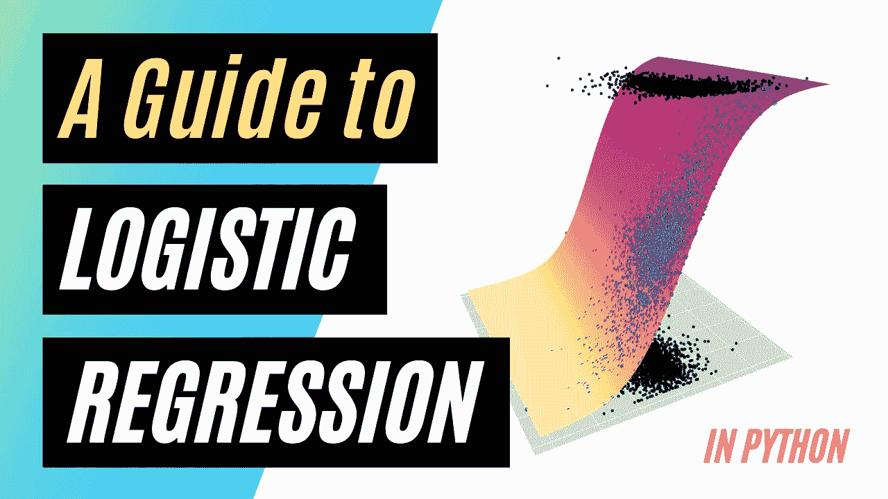

逻辑回归。图片由[作者](https://solclover.medium.com/)提供。(参见下面 Python 部分中的图表制作方式)

# **前言**

*正如你所知道的，这是一篇长文***，包含了逻辑回归的可视化和数学解释，并附有 4 个不同的 Python 例子。请看看* ***下面的主题列表*** *，随意跳转到你最感兴趣的部分。**

# ***简介***

*机器学习正在取得巨大的进步，越来越多的算法使我们能够解决复杂的现实世界问题。*

*这个故事是解释机器学习算法机制的深度系列的一部分。除了让您了解 ML 算法如何工作，它还为您提供了构建自己的 ML 模型的 Python 示例。*

# *这个故事涵盖了以下主题:*

*   *逻辑回归算法的**类别**属于*
*   *关于逻辑回归如何工作的解释*
*   ***Python 示例**如何建立逻辑回归模型，包括:
    -有 1 个自变量的二元目标
    -有 2 个自变量的二元目标
    -有 3 个类别标签和 2 个自变量的多项式
    -有 3 个类别标签和 2 个自变量的多项式+过采样*

# ***逻辑回归属于哪一类算法？***

*查看下图的监督学习分支，我们可以看到我们有两个主要的问题类别:回归和分类。*

*   ***回归**:当我们有一个连续的(数字)目标变量时，我们使用回归算法。例如，根据房子与主要设施的接近程度来预测房子的价格。*
*   ***分类**:当目标变量是分类变量时使用。例如，预测游戏的输赢或客户拖欠/不拖欠贷款。注意，它不一定是二元结果。*

*虽然逻辑回归的名称中有一个“回归”，但它实际上属于分类算法。然而，线性回归和逻辑回归之间有一些相似之处，我们将在下一节中谈到。*

*下图是**交互式的，**所以一定要点击不同的类别来**放大并展示更多的**👇。*

*机器学习算法分类。互动图表由[作者](https://solclover.com/)创作。*

****如果你喜欢数据科学和机器学习*** *，请* [*订阅*](https://solclover.com/subscribe) *每当我发表一个新的故事，你都会收到一封电子邮件。**

# ***逻辑回归是如何工作的？***

*让我们从下面的例子开始解释。*

*假设我们有一个 10 个学生的班级，每个学生都要参加考试。他们的准备时间、最终分数和结果(通过/失败)如下所示。*注意，及格分数是 40。**

*现在，让我们看看如何使用线性回归和逻辑回归来解决这个问题。*

## ***线性回归的快速回顾***

*如果我们要建立一个简单的线性回归模型，我们可以用“学习时间”作为自变量，用“最终分数”作为因变量(目标变量)。这是因为“最终得分”是回归所需的连续变量。这将使我们得出一个由最佳拟合线概括的结果，其形式如下:*

*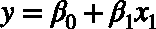*

```
*where β(0) is an intercept, β(1) is a slope, and x(1) is the sole independent variable.* 
```

*注意，增加更多的独立变量会导致等式中有更多的元素:*

*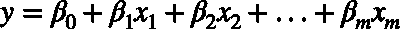*

## ***物流功能***

*现在让我们假设我们没有“最终分数”我们所拥有的只是一个结果(通过/失败标志)。我们想建立一个逻辑回归模型，用“学习时间”来预测学生通过考试的可能性。*

*从上表中你可以看出，“学习时间”和“考试成绩”之间有很强的相关性，尽管我们不能完全区分这两个类别。因此，我们希望有一个模型，在给定学习时间的情况下，给出我们通过考试的概率。*

*这是通过使用逻辑函数(也称为 sigmoid 函数)来实现的:*

*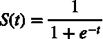*

*如果我们要在图表上绘制一个逻辑函数，它会是这样的:*

## ***赔率***

*为了理解数据如何映射到逻辑函数，我们首先需要了解概率、优势和对数优势之间的关系。*

*   ***赔率** —这只是事件(在这种情况下，考试通过)和非事件(考试失败)之间的比率。比方说，如果你有 5 个学生，每个人花 7 个小时准备考试，其中 3 个学生通过，2 个学生不及格，那么通过的几率是 3:2，用十进制表示就是 1.5。*
*   *对数赔率是赔率的自然对数。所以如果，`the odds are 3:2 = 1.5, then log(odds) = log(1.5) = 0.405...`*
*   ***概率与赔率**——你可以很容易地在概率和赔率之间转换。所以如果，`the odds are 3:2, then the probability is 3/5=0.6.`你可以用下面的等式在概率和赔率之间进行转换:*

*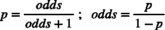*

*   *最后要注意的是，逻辑函数中的 **S(t)** 是概率 p 的**。因此，使用上述等式，我们可以推导出使我们的逻辑函数:***

*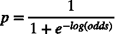*

*显然，我们可以进一步简化它，这将使我们回到最初的概率方程，用赔率来表示。然而，我们对这种形式很满意，因为现在我们可以更进一步找到对数优势方程。*

## ***对数优势方程***

*让我们用另一个例子来将数据绘制成图表，以了解对数优势方程是如何创建的。*

*我们可以将这些数据绘制成图表，x 轴表示“学习时间”, y 轴表示对数概率:*

*这看起来很熟悉。我们的自变量 x(学习小时数)和 log-odds 之间的关系是线性的！这意味着我们可以使用相同类型的直线方程绘制通过这些点的最佳拟合直线:*

**

*这使得我们的后勤职能:*

*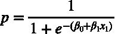*

*具有多个独立变量的一般形式变成:*

*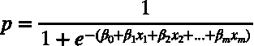*

## ***最大似然估计***

*构建逻辑回归模型时，算法的目标是找到系数β(0)、β(1)等。然而，与线性回归不同的是，它不是通过最小化残差平方来实现的，而是通过找到最大似然来实现的。*

*最大似然最常用对数似然公式表示:*

*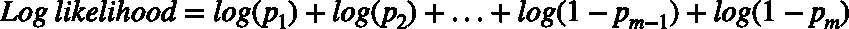*

```
*where ***p*** is the probability for points with an actual outcome of event ("pass") and ***1-p*** is the probability for points with an actual outcome of non-event ("fail").*
```

*有多种方法可以使对数似然最大化。一些最常用的是**梯度下降**和**牛顿-拉夫森**。*

*通常，用于寻找逻辑函数系数的方法经历选择候选线和计算对数似然的迭代过程。这一直持续到达到收敛并找到最大似然。*

*注意，我不会深入这些算法的机制。相反，让我们用 Python 建立一些逻辑回归模型。*

*[](https://solclover.com/membership)**[](https://www.linkedin.com/in/saulius-dobilas/)*

# ***Python 中的逻辑回归***

*现在是利用我们获得的知识建立一些模型的时候了。*

## ***设置***

*我们将使用以下库和数据:*

*   *来自 Kaggle 的国际象棋比赛数据*
*   *[Scikit-learn 库](https://scikit-learn.org/stable/index.html)，用于将数据拆分为[训练测试](https://scikit-learn.org/stable/modules/generated/sklearn.model_selection.train_test_split.html?highlight=train_test_split#sklearn.model_selection.train_test_split)样本，构建[逻辑回归](https://scikit-learn.org/stable/modules/generated/sklearn.linear_model.LogisticRegression.html)模型，以及[模型评估](https://scikit-learn.org/stable/modules/generated/sklearn.metrics.classification_report.html?highlight=classification_report#sklearn.metrics.classification_report)*
*   *[用于过采样少数类的不平衡学习库](https://imbalanced-learn.org/stable/generated/imblearn.over_sampling.RandomOverSampler.html)*
*   *[Plotly](https://plotly.com/python/) 用于数据可视化*
*   *用于数据操作的[熊猫](https://pandas.pydata.org/docs/)和 [Numpy](https://numpy.org/)*

*让我们导入所有的库:*

*我们将使用 Kaggle 的**国际象棋游戏**的数据，你可以通过以下链接下载:[https://www.kaggle.com/datasnaek/chess](https://www.kaggle.com/datasnaek/chess)。*

*一旦你在你的机器上保存了数据，我们就用下面的代码接收它:*

*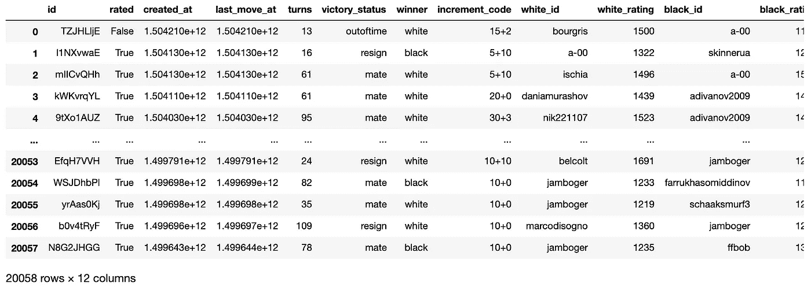*

*卡格尔的国际象棋数据集的数据片段。图片由[作者](https://solclover.medium.com/)提供。*

*由于我们希望将‘winner’字段用于我们的因变量(目标变量),让我们检查一下它的分布情况:*

*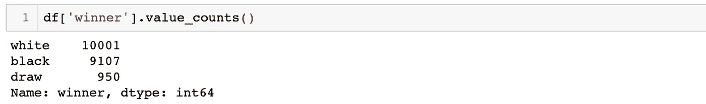*

*象棋比赛数据赢家分布。图片由[作者](https://solclover.medium.com/)提供。*

*很高兴看到白棋和黑棋的胜算相当均衡。然而，少数比赛以平局告终。拥有一个代表性不足的阶级将会使预测它变得更加困难，我们将会在后面看到多项式的例子。*

*对于二元结果模型，我们将尝试使用玩家评级差异来预测白棋是否会赢。同时，对于多项式情况，我们将尝试预测所有三个类别(白棋赢、和棋、黑棋赢)。*

*首先，让我们派生几个新字段用于模型预测。*

*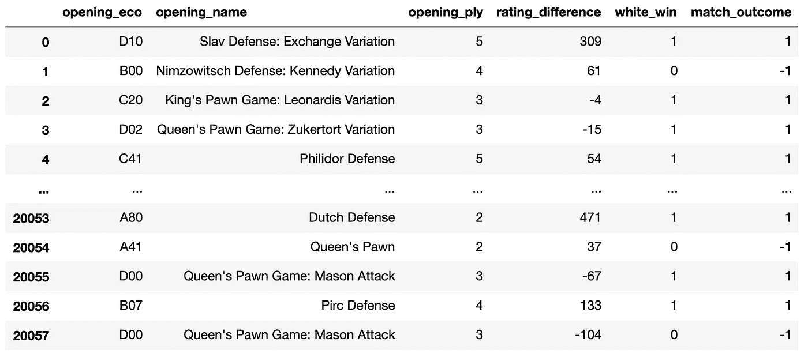*

*三个新派生的列被添加到 DataFrame 中。图片由[作者](https://solclover.medium.com/)提供。*

## ***二元结果的逻辑回归——1 个独立变量***

*让我们开始建设吧！我们将使用白人和黑人评分之间的差异作为独立变量，并将“white_win”标志作为目标。*

*将数据分成训练样本和测试样本后，我们拟合模型。我们这次选择了 **sag** (随机平均梯度)求解器来寻找 log-odds 方程的 beta 参数。正如下面的评论中所列，还有其他的解算器，我们将在接下来的几个例子中尝试。*

*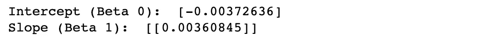*

*模型方程的截距和斜率。图片由[作者](https://solclover.medium.com/)提供。*

*这为我们提供了以下对数优势和逻辑方程式:*

*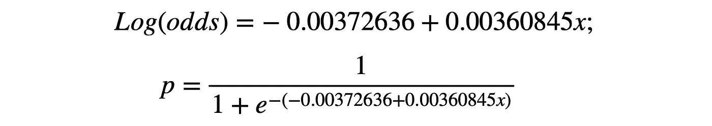*

*让我们检查一下测试样本的模型性能指标:*

*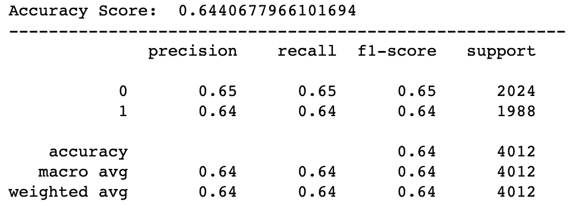*

*模拟性能指标。图片作者[作者](https://solclover.medium.com/)。*

*绩效指标的快速回顾:*

*   ***准确度** =正确预测/总预测*
*   ***精度** =真阳性/(真阳性+假阳性)；精度越低意味着假阳性的数量越多*
*   ***回忆** =真阳性/(真阳性+假阴性)；低召回率意味着该模型包含许多假阴性，即，它不能正确地识别大部分类别成员。*
*   ***F1-得分** =精确度和召回率之间的平均值(对于特定用例，如果一个指标比另一个更重要，则可以应用权重)*
*   ***支持** =该类中实际观测的数量*

*我们可以看到，虽然该模型并不是很好，但它仍然有助于我们在 64%的情况下识别白色胜利，这比随机猜测要好(有 50%的机会答对)。*

*接下来，让我们绘制一个逻辑函数，每个类都映射到这个函数上。我们先做一些数据准备:*

*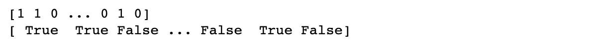*

*用于屏蔽的布尔数组。图片来自[作者](https://solclover.medium.com/)。*

*我们将在图中使用掩蔽来创建两条单独的轨迹，一条带有事件(白棋获胜)，另一条带有非事件(白棋未获胜)。如您所见，它只是一个布尔数组，包含 True 表示 1，False 表示 0。*

*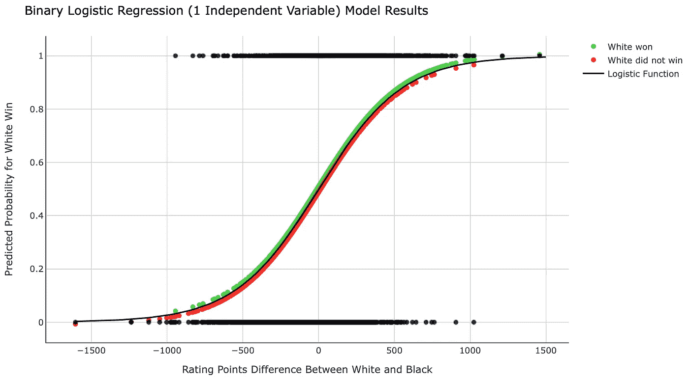*

*逻辑回归模型结果。图片由[作者](https://solclover.medium.com/)提供。*

*让我们看看这里展示了什么。*

*   *顶部的**黑点**是实际类别为 1(白方获胜)的测试数据集观察值。相比之下，底部的**黑点是实际类为 0 的观测值(白棋未胜)。***
*   ***黑线**是逻辑函数，它基于我们用模型导出的方程，给我们以下参数:`intercept = -0.00289864 and slope = 0.00361573.`*
*   ***绿点**是类别=1 的黑点，使用模型中的概率映射到逻辑函数。*
*   ***红点**是类别=0 的黑点，使用模型中的概率映射到逻辑函数。*

**快速注意，为了更容易阅读，我不得不将绿色和红色的点稍微偏移(0.01)以避免重叠。**

*总之，虽然该模型可以在 64%的情况下正确预测白棋获胜{p(白棋获胜)> 0.5}，但也有许多情况(36%)没有成功预测结果。这表明在国际象棋中有较高的等级并不能保证比赛的成功。*

## ***二元结果的逻辑回归— 2 个独立变量***

*让我们在下一个模型中增加一个额外的自变量。我们将使用一个名为“回合”的字段，它告诉我们一场比赛中的总移动次数。*

**请注意，我们在这里有点作弊，因为总移动次数只有在比赛后才能知道。因此，如果我们在比赛开始前进行预测，这个数据点对我们来说是不可用的。然而，这仅仅是为了说明的目的，所以我们将继续使用它。**

*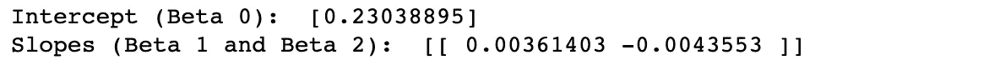*

*模型方程的截距和斜率。图片由[作者](https://solclover.medium.com/)提供。*

*注意，这次我们有两个斜率参数，每个自变量一个。β(2)略呈负值，表明“回合”数越多，白方获胜的几率越低。这是有道理的，因为白棋不赢也包括“和棋”，而且更有可能发生在长时间的比赛之后(许多步之后)。*

*让我们来看看测试样本的模型性能指标:*

*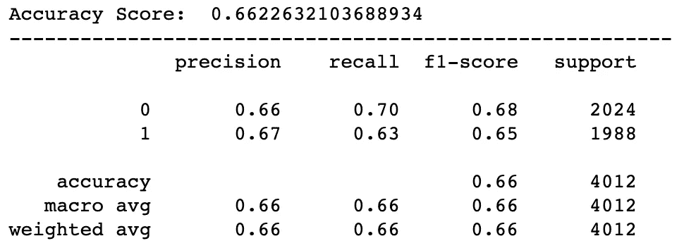*

*模拟性能指标。图片由[作者](https://solclover.medium.com/)提供。*

*我们可以看到，该模型的所有分类指标都有所提高，正确预测率为 66%。这并不奇怪，因为我们使用了“turns”字段，它为我们提供了关于匹配如何演变的信息。*

*现在，让我们做一些数据准备，并再次绘制逻辑函数，尽管这一次，它将是 3D 图形上的一个表面，而不是一条线。这是因为我们在模型中使用了两个独立变量。*

*绘制图表:*

*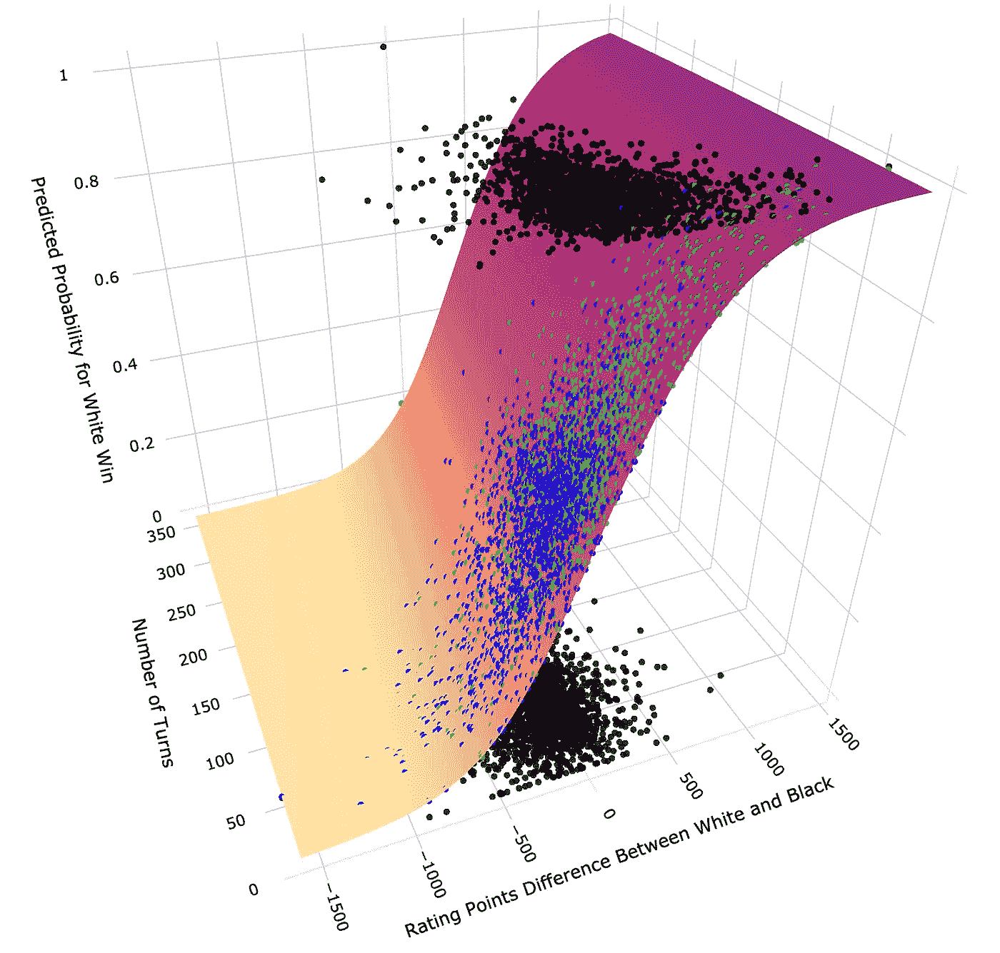*

*具有两个独立变量的逻辑回归-模型结果。图片由[作者](https://solclover.medium.com/)提供。*

*此图显示了顶部(类=1)和底部(类=0)的黑点是如何映射到逻辑函数预测表面上的。在这种情况下，绿点表示 class=1 的概率，蓝点表示 class=0 的概率。*

## *多项式逻辑回归— 2 个独立变量*

*现在，让我们构建一个具有 3 个类别标签的模型:*

*   *-1:黑方获胜*
*   *0:绘制*
*   *1:白方获胜*

*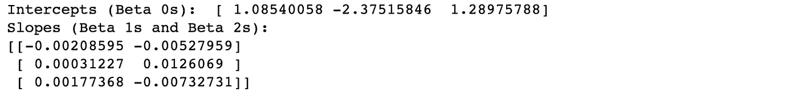*

*模型方程的截距和斜率。图片由[作者](https://solclover.medium.com/)提供。*

*注意，对于多项式情况，我们有三个截距和三对斜率。这是因为该模型为预测每个类别创建了一个单独的方程。*

*让我们来看看模型性能:*

*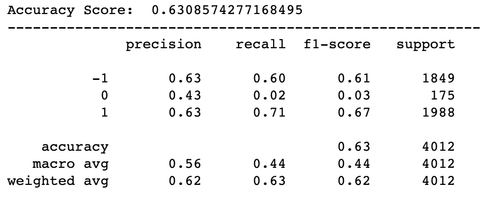*

*模拟性能指标。图片由[作者](https://solclover.medium.com/)提供。*

*正如所料，由于不平衡的数据，该模型在预测 class=0 (draw)时遇到了一些困难。无论是白棋还是黑棋，你都可以看到比赢牌少得多的平局结果(测试样本中的 175)。*

*基于精度，我们可以看到该模型有 43%的“平局”预测是正确的。然而，召回率仅为 0.02，这意味着该模型预测“平局”的情况非常少，大多数“平局”结果都无法识别。*

*处理不平衡数据有多种方法，其中一种方法是对少数类进行过采样(在本例中，class=0)。*

## ***过采样的多项逻辑回归— 2 个独立变量***

*我们将使用不平衡学习包中的“随机过采样器”来帮助我们的探索。*

*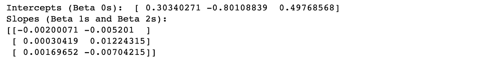*

*模型方程的截距和斜率。图片由[作者](https://solclover.medium.com/)提供。*

*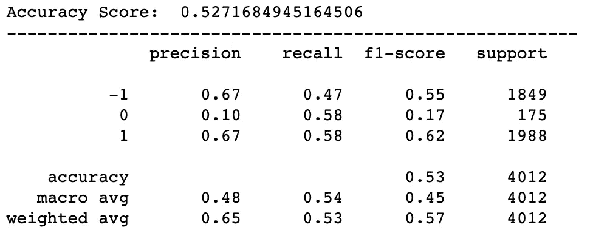*

*模拟性能指标。图片作者[作者](https://solclover.medium.com/)。*

*这些是最终结果。我们可以看到，由于 class=0 的精度降低，模型精度已经下降。这是过采样所预期的，因为模型预期该类比实际更常见，从而导致更频繁地预测“平局”*

*虽然这损害了精确度，但它有助于回忆，因为该模型能够识别更多的“平局”结果。*

*显然，这种模式远非理想，需要更多的工作来改进它。这可以通过增加更多的独立变量和采用额外的技术来实现，如欠采样多数类。*

*但是，这些示例的目的是向您展示如何构建不同类型的逻辑回归模型，而不是为这组特定的数据找到最佳模型。我相信我已经给了你很多例子。因此，我将停止这个故事。*

## ***结论***

*这是我写过的较长的故事之一。如果你设法一路走到了终点，那就恭喜你了！👏*

*我希望你现在已经很好地理解了什么是逻辑回归，并且我已经启发你打开你的笔记本，开始自己构建逻辑回归模型。*

*干杯！👏
**索尔·多比拉斯***

****如果你已经花光了这个月的学习预算，下次请记得我。*** *我的个性化链接加盟媒介是:**

*<https://solclover.com/membership> * 

*你可能喜欢的相关故事:*

*</svm-classifier-and-rbf-kernel-how-to-make-better-models-in-python-73bb4914af5b>  </naive-bayes-classifier-how-to-successfully-use-it-in-python-ecf76a995069> *