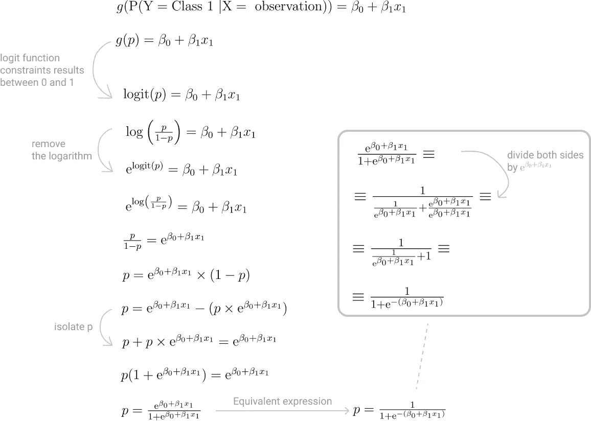
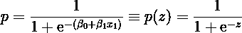

# 现实生活中的逻辑回归:构建日常生产力分类模型

> 原文：<https://towardsdatascience.com/logistic-regression-in-real-life-building-a-daily-productivity-classification-model-a0fc2c70584e?source=collection_archive---------7----------------------->


图片作者。

Logistic 回归是一个机器学习分类模型，名字相当混乱！

这个名字让你想到[线性回归](/linear-regression-in-real-life-4a78d7159f16)，但它不是用来预测一个无限的、连续的结果。相反，它是一个统计分类模型，它给你一个观察属于一个特定类别的可能性。

逻辑回归被用于许多科学领域。在[自然语言处理(NLP)](https://en.wikipedia.org/wiki/Natural_language_processing) 中，它被用来确定电影评论的情绪，而在医学中，它可以用来确定病人患特定疾病的概率。

# 对你的日常生产力进行分类

最近你对衡量自己的生产力感兴趣。不一定要量化到最小的细节，但只是为了更好地了解你的一天是否真的富有成效。

每天结束时，你都在问自己，这一天是否真的富有成效。但这只是一个潜在的有偏见的定性数据点。你想找到一个更科学的方法来做这件事。

你已经观察了一天中的自然涨落，并意识到对它影响最大的是:

*   **睡眠**你知道睡眠，或者睡眠不足，对你的一天有很大的影响。
*   **咖啡**不是喝完咖啡一天就开始了吗？
*   专注时间**这并不总是可能的，但是你可以试着花 3-4 小时专注于项目。**
*   你已经注意到，当你有时间吃一顿正式的午餐，而不仅仅是小吃时，一天会过得很顺利。
*   **散步**你一直在进行短途散步，以便进入状态，放松一下，思考一下你的项目。


*什么影响了你的工作效率。*

你听说过机器学习分类模型，因为有许多不同的模型，具有不同的复杂程度和定制程度，所以你想从一个简单的模型开始。

当你在考虑使用哪种模式时，你意识到这些活动与你的整体生产力有线性关系。

那么你的第一个问题是，*[*线性回归*](/linear-regression-in-real-life-4a78d7159f16) *可能是这项工作最简单、最好的工具吗？**

# *如果是线性模型，为什么不用线性回归呢？*

*最后，您希望创建一个模型来描述一组特征、影响您工作效率的因素以及目标变量(有效率或无效率的一天)之间的线性关系。*

*那么，为什么不保持简单，使用线性回归模型呢？*

*要用线性回归模型将你的一天划分为有效率还是没有效率，第一步是选择一个任意的阈值 *x* ，并根据一个简单的标准将观察值分配给每个类别:*

*   **类非生产性*，所有小于等于 *x* 的结果。*
*   **类生产性*否则，即所有结果大于 *x* 。*

**

**使用任意阈值 x 来确定数据属于哪一类。**

*这很简单！*

*您获取数据并在训练集和测试集之间进行分割，确保将所有分类值编码为数字值。*

> *线性回归模型不知道如何处理分类值，所以需要对它们进行编码。*

*你可以用你喜欢的方式，只要是整数。在这种情况下*否*变为 0，而*是*变为 1。*

**

**你一直在收集的用来模拟日常工作效率的数据。**

*至于任意阈值，您已经决定:*

*   *小于或等于零的结果被分配到 0 级，即非生产日。*
*   *积极的结果被分配到第 1 类，即富有成效的一天。*

*您使用 Python 的 [SckitLearn](https://scikit-learn.org/stable/modules/generated/sklearn.linear_model.LinearRegression.html) 通过线性回归模型运行数据，并绘制结果及其各自的类。*

```
*import numpy as np
import matplotlib.pyplot as plt
from sklearn import linear_model
from matplotlib.lines import Line2D
from sklearn.model_selection import train_test_splitdef plot_results(train_targets, predictions):
    fig, ax = plt.subplots(figsize=(15, 10))
    # removing all borders except bottom
    ax.spines['top'].set_visible(False)
    ax.spines['right'].set_visible(False)
    ax.spines['left'].set_visible(False) # adding major gridlines
    ax.grid(color='grey', linestyle='-', linewidth=0.25, alpha=0.5) training_colors = ['#4786D1' if target <= 0 else '#F28627' for target in train_targets]
    prediction_colors = ['#4786D1' if target <= 0 else '#F28627' for target in predictions] train_set_len = len(train_targets)
    predictions_len = len(predictions) plt.scatter(np.arange(0, train_set_len), train_targets, color=training_colors, marker='o', s=[12 * train_set_len])
    plt.scatter(np.arange(0, predictions_len), predictions, color=prediction_colors, marker='^', s=[40 * predictions_len]) ax.set_xlabel('Observation')
    ax.set_ylabel('Target value') # Customizing symbols in the legend
    legend_items = [Line2D([0], [0], color='#4786D1', markersize=15), 
        Line2D([0], [0], color='#F28627', markersize=15),
        Line2D([0], [0], color='w', marker='o', markerfacecolor='#979797', markeredgecolor='#979797', markersize=15),
        Line2D([0], [0], color='w', marker='^', markerfacecolor='#979797', markeredgecolor='#979797', markersize=15)] # Adding some spacing between each legend row and padding
    ax.legend(handles=legend_items,
    labels=['Class 0: Non Productive', 'Class 1: Productive', 'Training set', 'Predictions'],labelspacing=1.5, borderpad=1)

    plt.show()def fit_linear_regression(features, targets):
    train_features, test_features, train_targets, test_targets = train_test_split(features, targets, test_size=0.25, random_state=123) model = linear_model.LinearRegression()
    fitted_model = model.fit(train_features, train_targets)
    predictions = fitted_model.predict(test_features)

    print('---Linear Regression')
    print('Coefficients: ' + str(fitted_model.coef_))
    print('Intercept: ' + str(fitted_model.intercept_))
    print('R-squared: ' + str(fitted_model.score(train_features, np.array(train_targets).reshape(-1, 1))))

    plot_results(train_targets, predictions)productivity_features = [[8.0, 2, 4.5, 1, 0],
                         [7.5, 1, 5.0, 1, 0],
                         [9.0, 2, 3.0, 0, 0],
                         [6.0, 3, 2.5, 1, 0],
                         [8.5, 2, 3.5, 0, 1],
                         [10.0, 1, 2.0, 1, 1],
                         [7.5, 3, 2.5, 1, 0],
                         [8.5, 2, 3.5, 0, 1],
                         [6.0, 2, 1.5, 1, 1],
                         [7.0, 1.0, 3.0, 1, 0]]productivity_targets = [1, 1, 0, 0, 1, 0, 1, 0, 0, 1]fit_linear_regression(productivity_features, productivity_targets)*
```

# *线性回归:不是这项工作的最佳工具*

*绘制训练集的目标或结果以及模型预测，您可以看到一些点被错误地分类。*

*在某些情况下，该模型在预测正确的类别方面做得并不好。*

*例如，在只有蓝色数据点的绘图区域中有一个橙色数据点，而在主要为橙色的区域中有一个蓝色数据点。*

**

**训练目标值散点图(圆形)和线性回归模型预测值散点图(三角形)。根据等级进行颜色编码:蓝色代表 0 级，橙色代表 1 级。**

*因此，为了更好地了解模型的性能，您可以检查它的 [R 平方](https://en.wikipedia.org/wiki/Coefficient_of_determination)，这是一个衡量这些特征如何帮助确定结果的指标。*

**

*线性回归模型的输出。*

*0.7 还不错。当然，这种模式有改进的空间，但它不是一个彻底的失败！*

*但是，即使有看似令人鼓舞的结果，线性回归模型在分类任务方面也有一些限制:*

1.  *意味着结果值有特定的顺序。*
2.  *产生连续的、无限的结果。*
3.  *仅解释单个特征如何影响目标。*

## ***1。意味着结果值有特定的顺序***

*如果你只使用一个阈值来分配类，你是在假设结果有一个隐含的顺序。*

*例如，您决定所有小于或等于 *0* 的结果属于*类 0、*，而所有其他结果属于*类 1* 。*

*因此，使用这种方法，您隐含地假设所有来自*类 0* 的观察值必须在所有来自*类 1* 的观察值之前。*

*你可以控制这个阈值，所以你可以选择任何你想要的数字。但是，在实际中，当数据可能不遵循该特定顺序时，该模型将盲目地使用给定的阈值。*

*因此，该模型往往具有较低的准确性。*

## ***2。产生连续的、无限的结果***

*在分类问题中，结果变量是*分类*，在这种情况下，是一个生产或非生产日。*

*但是你正在将数据拟合到一个只能产生连续结果的回归模型中。*

*结果是连续的这一事实不是问题。最大的限制是这些结果不限于 0 到 1 之间的值。*

*你刚刚看到了它的作用。尽管可能的目标是 0 和 1，但有些预测完全是 0，有些预测是肯定的，但不完全是 1。有些预测甚至是负面的！*

## ***3。仅解释单个特征如何影响目标***

*线性回归是表示目标变量和一组特征之间的线性关系的一个很好的模型，但是模型系数只能告诉您一个特定的特征(独立于其他特征)如何影响目标。*

> *线性回归映射目标和特定特征之间的关系，假设所有其他特征都是固定的。*

*但是在分类任务中，你想要测量整个特征集如何影响结果，因为所有特征*同时存在*，而不是孤立存在【1】。*

# *逻辑回归拯救世界！*

*知道了这些限制，很明显线性回归不是分类任务的最佳工具。*

*一个可行的选择是使用**逻辑回归**。它解决了线性回归的局限性，同时分享了它的许多特征。例如，逻辑回归和线性回归都是[广义线性模型](https://en.wikipedia.org/wiki/Generalized_linear_model)，描述目标和独立变量集之间的线性关系。*

*但是逻辑回归更适合于二元分类任务，因为它:*

*   *预测发生[伯努利事件](https://en.wikipedia.org/wiki/Bernoulli_distribution)的可能性，其结果只能是*是/否*或*肯定/否定*。*
*   *找到一个函数 *g，*，也称为*链接函数*，该函数获取某个观察值属于某个类别的可能性，并将其结果建模为预测值的线性组合。*
*   *假设模型的结果不会随着特征的变化而线性变化。函数 *g* 随着特征的变化而线性变化。*

*对于只有一个特征或预测器的模型，**链接函数** *g* 可描述为:*

**

*逻辑回归模型连接函数的定义。*

*逻辑回归使用*链接函数*，但是它的结果是一个概率，这意味着它只能预测 0 到 1 之间的值。*

*所以问题变成了，*逻辑回归如何把线性组合的无界连续值变成概率？**

# *logit 函数*

*为了完成这一数学壮举并将其结果限制在 0 和 1 之间，逻辑回归使用 [**logit 函数**](https://en.wikipedia.org/wiki/Logit) 作为其链接函数来表示概率 *p* 的**对数优势比的对数**。*

*在这种情况下，多产日的对数概率是多产日的概率( *p* )与非多产日的概率(1- *p* )之比。*

*这就是为什么 logit 函数也被称为 log-odds 函数。*

**

*但是为什么是 logit 而不是其他函数呢？*

**logit* 功能是一个 [sigmoid 功能](https://en.wikipedia.org/wiki/Sigmoid_function)。它在 0 和 1 处渐近，因此，随着模型结果越来越接近*-无穷大*,*logit*的结果越来越接近 0。另一方面，随着结果越来越接近*+无穷大*， *logit* 的结果越来越接近 1。*

**

*一个逻辑函数的锅。*

*logit 函数很棒，因为它将值保持在 0 和 1 之间，但是您对*对数几率不感兴趣。**

*在二元类任务中，您需要实际的概率。*

# *物流功能*

*实际上，你希望*从对数概率中提取*概率。*

*听起来像是一个困难的任务，但是，好消息是，它只需要几个数学变换！*

*下面是你如何从对数概率中*得出*成功的概率*(p)。**

**首先你*去掉*的对数，然后，经过一些代数运算，你能够*分离出* *p* 。**

****

**在这个过程结束时，概率 *p* 、成功概率*、是一个线性组合的函数。***

**从数学上来说，你实现的是 logit 函数的逆函数，这个函数叫做 [**逻辑函数**](https://en.wikipedia.org/wiki/Logistic_function) *。***

****

***逻辑函数的定义。***

**简单形式的线性组合 *z* 的函数。**

**如果你对*失败*的概率感兴趣，你可以做一个等价的操作并隔离(1- *p* 而不是 *p.***

**将所有这些放在一起，现在我们知道逻辑回归使用逻辑函数来预测观察值属于*正*类的可能性。概率也是线性组合的函数，如线性回归中使用的概率。**

**逻辑回归这个名字更有意义！**

**这个模型只需要考虑一个细节，然后就可以把你的一天划分为有效率的或者没有效率的。**

# **定义决策边界**

**对于每个观察值，逻辑回归模型计算该观察值属于*正*类的概率，在本例中，是多产的日。它看起来像这样:**

****

**但是您在分类任务中使用这个模型，所以它仍然需要决定将哪个类分配给每个观察。**

**该模型需要一些标准来区分对应于生产日的观察和对应于非生产日的观察。它需要一个**决策边界**。**

> **决策边界是将来自*正*类的观察值与来自*负*类的观察值分开的*假想边界*。**

**根据手头的问题，您可以将决策边界设置为您喜欢的任何概率。但是典型地，判定边界被设置为 0.5。**

**所以，如果模型预测观察有一个概率:**

*   ****低于或等于 0.5** ，观察值被分配到负类，例如，非生产日。**
*   ****大于 0.5** ，观察值被分配到积极等级，例如，多产日。**

# **你的一天(真的)有成效吗？**

**要回答这个问题，您可以在已经完成的线性回归的基础上，再次使用 ScikitLearn 来拟合一个[逻辑回归模型](https://scikit-learn.org/stable/modules/generated/sklearn.linear_model.LogisticRegression.html#sklearn.linear_model.LogisticRegression)。**

```
**from sklearn.linear_model import LogisticRegressiondef fit_logistic_regression(features, targets):
    train_features, test_features, train_targets, test_targets = train_test_split(features, targets, test_size=0.25, random_state=123) model = LogisticRegression(random_state=0)
    fitted_model = model.fit(train_features, train_targets)
    predictions = fitted_model.predict(test_features) print('---Logistic Regression')
    print('Coefficients: ' + str(fitted_model.coef_))
    print('Intercept: ' + str(fitted_model.intercept_))
    print('Mean accuracy: ' + str(fitted_model.score(train_features, np.array(train_targets).reshape(-1, 1))))

    plot_results(train_targets, predictions) fit_logistic_regression(productivity_features, productivity_targets)**
```

**然而，仅仅通过观察模型结果的曲线，很难判断模型是否做得很好。**

****

***训练目标值(圆形)和逻辑回归模型预测值(三角形)的散点图。根据等级进行颜色编码:蓝色代表 0 级，橙色代表 1 级。***

**要衡量性能，你需要看模型的**<https://en.wikipedia.org/wiki/Accuracy_and_precision>**。******

************

******逻辑回归模型的输出。******

******85%的准确度意味着您的模型正确预测了 85%的测试观察值。******

******现在你不必仅仅依靠定性的自我评价来判断你的一天是否富有成效！******

******你已经通过一种定量的、可重复的方式对你一天的工作效率进行了分类。******

******在这个过程中，您也更好地理解了为什么线性回归不是分类任务的最佳模型，即使特征和目标之间的关系是线性的。******

******希望你喜欢学习逻辑回归。******

*******感谢阅读！*******

# ******参考******

******[1] Stoltzfus JC。[逻辑回归:简明入门](https://pubmed.ncbi.nlm.nih.gov/21996075/)。Acad 急救医学。2011 年 10 月；18(10):1099–104.******

*******图片由作者提供，除非另有说明。*******