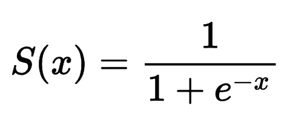
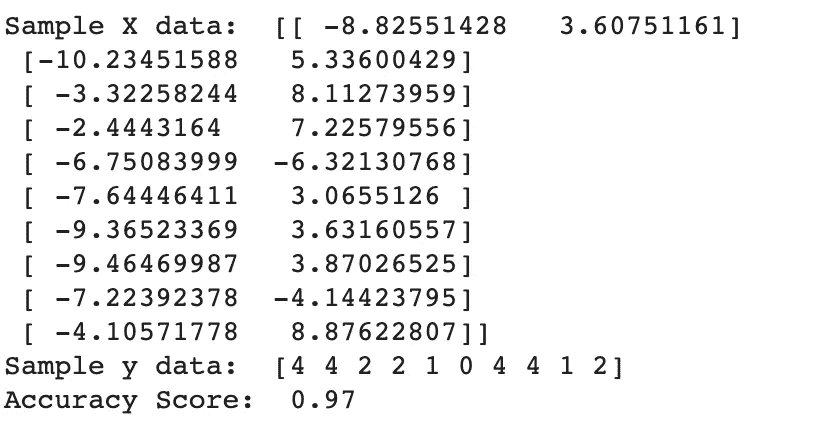
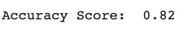
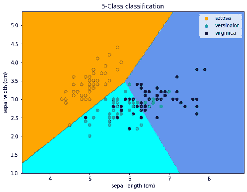

# 逻辑回归——用 Python 实现的机器学习算法

> 原文：<https://towardsdatascience.com/logistic-regression-machine-learning-algorithms-with-implementation-in-python-7dd5778279fc?source=collection_archive---------23----------------------->

## 机器学习算法— 30 天挑战

## 在本文中，我们将研究逻辑回归，一种机器学习分类算法，以及如何使用 Python (Scikit-learn)实现它

在本文中，我们将研究逻辑回归(线性回归的一种变体)，这是 ML 算法工具箱中的另一种基本而重要的机器学习算法。

图片来自 [Unsplash](http://james-harrison-vpOeXr5wmR4-unsplash)

我们将从了解它的功能和工作原理开始。然后我们将使用`scikit-learn`来实现它

*   什么是逻辑回归
*   Python 实现(虚拟数据)
*   Python 实现(真实世界数据集)
*   绘制决策边界
*   应用程序
*   结论
*   你能做什么
*   其他 ML 算法

这是我 30 天文章写作挑战的一部分。请随意查看我的新人帖子上的文章:

<https://nouman10.medium.com/lets-publish-30-articles-in-30-days-a0b8111855bb>  

# 什么是逻辑回归？

逻辑回归是线性回归的变体，用于分类目的。分类是基于概率的概念

逻辑回归使用一个名为“Sigmoid function”的压缩函数，它基本上将任何实数值转换为 0 到 1 之间的值。Sigmoid 函数的方程式如下:

Sigmoid 函数方程(图片由作者提供)

这导致了下图:

Sigmoid 函数的图形(图片由作者提供)

对于分类，我们定义一个阈值。例如，高于 0.5 的 sigmoid 函数的任何输出值将被分类为类 1，低于或等于 0.5 的任何值将被分类为类 0。我们也可以对多个类做同样的事情。

# Python 实现(虚拟数据)

让我们从对一些虚拟数据进行逻辑回归开始。

我们从导入必要的模块开始。然后，我们创建一些 200 个样本的虚拟数据，每个样本包含 2 个特征，属于 5 个不同的类别。我们将我们的`LogisticRegression`模型与数据进行拟合，并计算得分。输出将是:

作者图片

# Python 实现(真实世界数据集)

现在让我们使用`iris`数据集来实现它。代码同上，除了我们使用`scikit-learn`加载`iris`数据集。我们只包括数据的前两个特征，因为它有助于可视化决策边界

这给了我们 82%的分数。

作者图片

# 绘制决策边界

现在，让我们使用以下代码绘制决策边界，这将有助于我们可视化正确和不正确的预测:

这将导致由我们的逻辑回归模型创建的以下决策界限:

作者图片

# 应用程序

*   欺诈检测:检测信用卡欺诈或银行欺诈是这个用例的目标。
*   电子邮件是否是垃圾邮件:将电子邮件分类为垃圾邮件并将其放入收件箱或垃圾邮件文件夹是这个用例的目标。
*   情绪分析:使用评论或推文分析情绪是这个用例的目标。大多数品牌和公司利用这一点来增加客户体验。

# 结论

让我们总结一下本文所做的工作:

*   我们从逻辑回归如何工作的一般解释开始
*   然后，我们用 Python 在一些虚拟数据上实现了它，随后在一个数据集上实现了它
*   然后，我们使用`matplotlib`绘制决策边界
*   最后，我们研究了逻辑回归的应用。

# 您可以做什么:

*   尝试从零开始实现逻辑回归。为此，你需要理解逻辑回归背后的数学原理
*   将您的实现与`scikit-learn`中的实现进行比较
*   在各种其他数据集上测试上面的代码。

如果你有任何问题，请随时联系我。请继续关注我，因为我计划在未来讲述更多的机器学习算法

# 其他 ML 算法:

*   线性回归——用 Python 实现的机器学习算法

<https://medium.com/mlearning-ai/linear-regression-a-to-z-2ab3d1b7277c>  

*   k-最近邻——机器学习算法及其 Python 实现

<https://nouman10.medium.com/k-nearest-neighbors-a-to-z-with-implementation-in-python-74630ffb79a2>  

*   决策树——机器学习算法及其 Python 实现

<https://nouman10.medium.com/decision-trees-machine-learning-algorithms-with-implementation-in-python-5bc034e67fc8>  

*   k-Means-机器学习算法及其在 Python 中的实现

</k-means-machine-learning-algorithms-with-implementation-in-python-ac1d48e90239>  

如果您觉得以上内容对您有用，请分享并随时支持我-->

*   https://www.buymeacoffee.com/nouman10