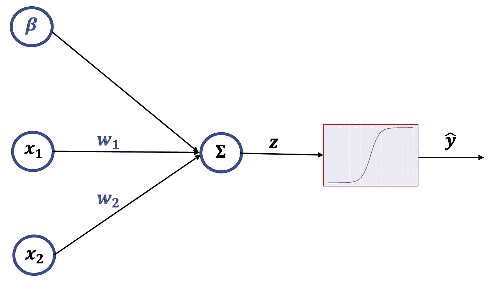

# 用 PyTorch 进行逻辑回归

> 原文：<https://towardsdatascience.com/logistic-regression-with-pytorch-3c8bbea594be?source=collection_archive---------2----------------------->

## 使用 PyTorch 应用逻辑回归进行二元分类的介绍。


我们选哪个门？(*图片来自 iStock，授权给 Dennis Loevlie* )

二元逻辑回归用于对两个线性可分的组进行分类。这种线性可分的假设使得逻辑回归对于简单的 ML 任务非常快速和强大。我们将对其执行逻辑回归的线性可分数据示例如下所示:


线性可分数据的示例(图片由作者提供)

**这里的线性可分群是:**

1.  红色= 0
2.  蓝色= 1

我们希望使用逻辑回归将任何[ *x1* ， *x2* ] 对映射到相应的类(红色或蓝色)。

## 第一步。将我们的数据集分割成训练/测试分割。

我们这样做是为了评估我们的模型在数据上的表现，这些数据在训练中是看不到的。通常，如果你告诉某人你的模型有 97%的准确性，这被认为是你在谈论验证/测试的准确性。

你自己可以很容易地做到这一点，但是说实话，*sk learn . train _ test _ split*函数在可读性方面非常好。

```
X_train, X_test, y_train, y_test = train_test_split(
 inputs, labels, test_size=0.33, random_state=42)
```

## 步骤 2:构建 PyTorch 模型类

我们可以使用以下代码创建逻辑回归模型:

```
import torchclass LogisticRegression(torch.nn.Module):
     def __init__(self, input_dim, output_dim):
         super(LogisticRegression, self).__init__()
         self.linear = torch.nn.Linear(input_dim, output_dim) def forward(self, x):
         outputs = torch.sigmoid(self.linear(x))
         return outputs
```

在 PyTorch 神经网络(实际上只是一个感知器)的“正向”传递中，视觉表示和相应的方程如下所示:



神经网络架构可视化(图片由作者提供)


(图片由作者提供)

其中:


(图片由作者提供)

sigmoid 函数非常有用，主要有两个原因:

1.  它将我们的线性回归输出转换为从 0 到 1 的概率。然后，我们可以将任何大于 0.5 的概率视为 1，小于 0 的概率视为 0。
2.  与逐步函数(也会将数据转换为二进制形式)不同，sigmoid 是可微分的，这对于使用梯度下降优化参数是必要的(我们将在后面介绍)。


具有选择蓝色或红色的决策边界的 Sigmoid 函数(图片由作者提供)

## 步骤 3:初始化模型

此外，我们应该分配一些超参数:

```
epochs = 200000
input_dim = 2 # Two inputs x1 and x2 
output_dim = 1 # Single binary output 
learning_rate = 0.01
```

**参数定义:**

*   **历元** —表示网络已经完成的通过整个训练数据集的次数
*   **learning_rate** —优化算法中的一个调整参数，用于确定每次迭代的步长，同时向损失函数的最小值移动
    *高学习率意味着您可能永远无法达到最小值。
    *低学习率需要更长时间。

下面的代码初始化了我们之前创建的模型类:

```
model = LogisticRegression(input_dim,output_dim)
```

步骤 4:初始化损失函数和优化器

```
criterion = torch.nn.BCELoss()
```


**二值交叉熵损失** **(图片由作者提供)**

*   m =训练样本的数量
*   y =真 y 值
*   y^ =预测的 y 值

```
optimizer = torch.optim.SGD(model.parameters(), lr=learning_rate)
```

有很多常见的神经网络优化器，但大多数都是基于**梯度下降。**这种优化技术朝着损失函数的最小值前进，其方向由损失函数的梯度决定，即由学习速率决定的权重和幅度或步长。

**注:**为了准确快速的达到损失函数的最小值，慢慢的降低你的学习速率是有好处的，像 PyTorch 也实现的自适应运动估计算法( **ADAM)、**这样的优化器，为我们做到这一点。你可以在[https://pytorch.org/docs/stable/optim.html](https://pytorch.org/docs/stable/optim.html)找到更多关于这些优化器的 PyTorch 实现。

我们使用以下等式更新参数以最小化损失函数:


(图片由作者提供)


(图片由作者提供)

*   **Alpha** —学习率

你可能想知道我们从哪里得到 *dL/dw* 和 *dL/dbeta，*这将是一个很好的问题！在神经网络中，我们使用反向传播来获得偏导数。幸运的是，在逻辑回归中，方程简化了，我将在下面展示这一点(以及网络的反向投影)。

利用链式法则我们可以推导出:


(图片由作者提供)

偏导数如下所示:


(图片由作者提供)

简单的方程式，你会得到:


(图片由作者提供)

所以在现实中你会这样做:


(图片由作者提供)

我们可以类似地导出 *dL/dbeta* 。幸运的是，亲笔签名帮助我们做到了这一切！

## 第五步:训练模型

首先，我们将输入和标签从 numpy 数组转换成张量。

```
X_train, X_test = torch.Tensor(X_train),torch.Tensor(X_test)
y_train, y_test = torch.Tensor(y_train),torch.Tensor(y_test)
```

接下来，我们构建训练循环并存储损失。我们还可以不时地打印出测试数据的准确性，看看我们的模型做得如何。

每 10，000 个时期的损失:


BCE 损失与纪元的关系(图片由作者提供)

## 步骤 6:绘制结果

由于我们知道决策边界将是 *w*x + b = 0.5* ，我们可以绘制决策边界。结果如下:

**列车:**


(图片由作者提供)

**测试:**


(图片由作者提供)

## 第七步:如何在新数据上获得预测！

如果你有一个新的点在 *x1=1* ， *x2=1* 视觉上(在 2 维空间)，很容易告诉我们应该把这个点归类为“红色”。因此，让我们检查我们的模型是否工作正常，并展示如何根据新数据从模型中获得预测:

```
x1 = 1
x2 = 1
new_data = torch.tensor([x1,x2]).type(torch.FloatTensor)with torch.no_grad():
    prediction = model(new_data).round()
    if prediction == 1.0:
        print(f'The model classifies this point as RED')
    else:
        print(f'The model classifies this point as BLUE')
```

根据下面的训练数据绘制新点:


根据新数据进行预测(图片由作者提供)

**输出:**

```
>>> The model classifies this point as RED
```

## 完整代码:

## 其他资源:

*   [https://pytorch.org/docs/stable/nn.html](https://pytorch.org/docs/stable/nn.html)
*   [https://deeplearning.cs.cmu.edu/F21/index.html](https://deeplearning.cs.cmu.edu/F21/index.html)
*   https://www.youtube.com/watch?v=MswxJw-8PvE&t = 304s

## 我们连线吧！

1.  [推特](https://twitter.com/DennisLoevlie)
2.  [领英](https://www.linkedin.com/in/dennisloevlie/)
3.  [GitHub](https://github.com/loevlie)