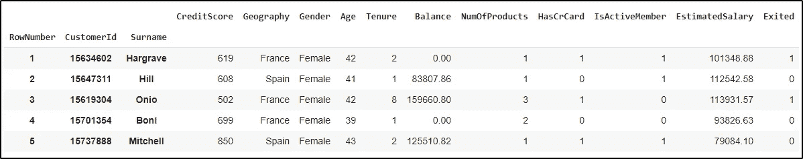
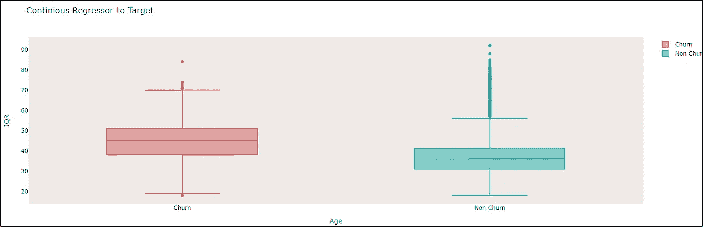
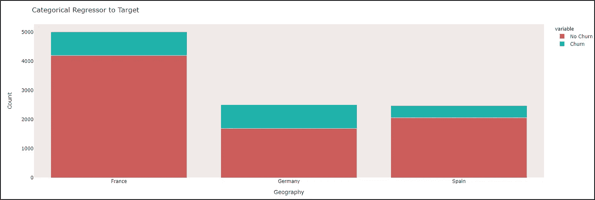
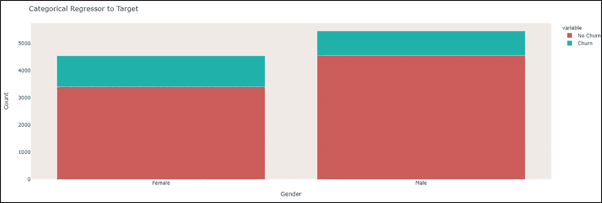
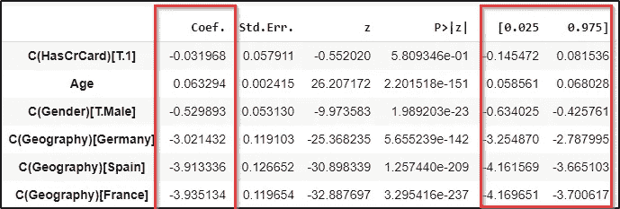
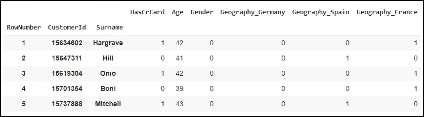
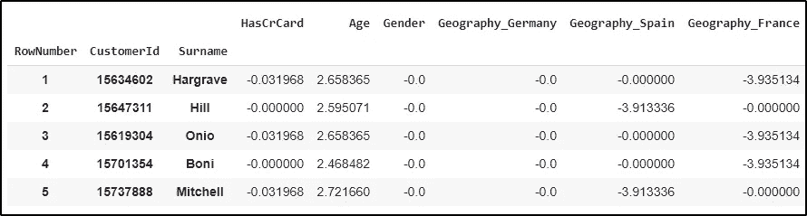
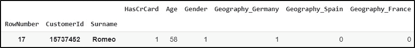
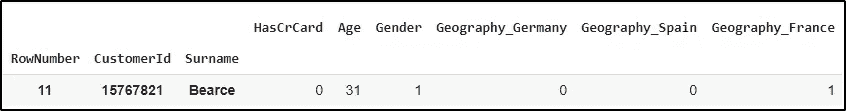

# logit——Python 中的全局和局部可解释性

> 原文：<https://towardsdatascience.com/logit-global-and-local-interpretability-in-python-f554acb541e4?source=collection_archive---------28----------------------->


托拜厄斯·凯勒在 [Unsplash](https://unsplash.com?utm_source=medium&utm_medium=referral) 上的照片

# 介绍

Logit 模型是一种回归技术，在给定预测值的情况下，对二元目标的对数概率进行建模。它的简单性(与 Xgboost 这样的锤子相比)使得解释它的决策非常方便。我们探索视觉上解释**“模型如何做出决定？”的技术** on **全局**(用于建模所取的所有数据)和 **local** (特定数据点)设置。本文灵感来源于 [**可解释性机器学习**](https://christophm.github.io/interpretable-ml-book/) **这本书。**

# 数据和问题陈述

数据可以在 [**这里**](https://www.kaggle.com/c/churn-modelling/data) 找到，来自一家跨国电信公司。该数据是个人级别的，具有关于地理位置、个人信息(年龄/性别)和基于客户特征的信用评级的特征。目标是一个 bool，它告诉我们一个特定的客户是否从那个公司(flag=1)流失了(**【Exited】**)。

我们使用 Logit 模型将客户分为流失客户和非流失客户。本 [**笔记本**](https://colab.research.google.com/drive/12GwHg7wqxHvtE20V7h4tcxGTrWHf8Cvu?usp=sharing) 有特征选择、拟合优度和解释的实现。这里我们只关注模型的决策。

综上所述，问题陈述是关于预测流失事件的 **log odds** 。

## 读取数据

假设 csv 文件位于项目根目录中

```
df = pd.read_csv("Churn_Modelling.csv",index_col=["RowNumber","CustomerId","Surname"])df.head()
```



数据(图片来源-作者)

# 用于建模的特征

我们使用以下特征进行建模:

*   年龄(顾客的年龄)
*   地理位置(客户所在地-法国、德国或西班牙)
*   性别
*   HasCrCard(客户是否有信用卡)

已经使用视觉分析完成了特征的选择。然而，我们可以使用诸如方差膨胀因子、皮尔逊/卡方/方差分析等技术。例如，从下图中我们可以看到，与西班牙和法国相比，德国有更大比例的客户曾有过不愉快经历。因此，将它作为一个特征将使我们的模型成为一个很好的预测器。



数据分析- **年龄**(图片来源-作者)



数据分析- **地理**(图片来源-作者)



数据分析- **性别**(图片来源-作者)

```
#Selecting features for the Logit Model
categorical_cols = ["Geography", "Gender",  "HasCrCard",]
non_categorical_cols = ["Age"]
```

## 拟合模型

```
#Creating the Formula
formula = "Exited"+"~"+"+".join(non_categorical_cols)+"+"+\
"+".join([f"C({each_categorcial_col})" for each_categorcial_col\in categorical_cols]) + "-" + "1"#Fitting the Model
logitfit = logit(formula = str(formula),data = df).fit()
```

# 解释

现在我们解释模型，为此我们需要首先获得必要的参数。

```
#Extracting Logit's coefficients and sorting them.
logit_coeffs = logitfit.summary2().tables[1]
logit_coeffs = logit_coeffs.reindex(logit_coeffs["Coef."].abs().sort_values().index)
```



置信度系数(图片来源-作者)

## 权重图(全局特征重要性)

我们采用 Logit 模型的系数，并观察它们的相对重要性。系数的值越多(无论是正的还是负的)，它们在预测流失类别的对数概率中的影响就越大。这个图是在**全球**范围内，这意味着它是在所有数据点上计算的。

特征重要性(图片来源-作者)

从该图中，我们推断出**年龄**是唯一一个其值增加会导致平均流失事件的对数几率增加的特征。

## 重量图(重要特征)

上面的图显示了系数的点估计，为了显示系数的重要性，我们使用下面的权重图。这考虑了**标准误差**，并绘制了重量估计值的 **95%置信区间**。这也是针对所有数据点绘制的。

重要性权重图(图片来源-作者)

我们可以通过目测推断出特征 **HasCrCard** 在统计上**不**显著。这是因为**的重量估计值的 95%置信区间经过了 **0** 。**

## 效果图

在权重图中，我们有一个困惑，估计的尺度各不相同。更可靠的方法是将每个特征的权重与其对应的实际特征值相乘，这将为我们提供 Logit 权重对数据的**实际影响**。实际效果将**而不是**变化，不像重量图。

为了计算这一点，我们需要使我们的数据虚拟编码 w.r.t the Logit。

```
#Create Dummies of Categorical Variables
dummy_encoded_df = pd.get_dummies(df[non_categorical_cols+categorical_cols],\columns=["Geography"])#Order the columns in order to multiply with weights
dummy_encoded_df = dummy_encoded_df[["HasCrCard", "Age",\ "Gender","Geography_Germany", "Geography_Spain",\ "Geography_France",]]dummy_encoded_df["Gender"] = dummy_encoded_df["Gender"].map({"Female":0, "Male":1})dummy_encoded_df.head()
```



虚拟编码数据(图片来源-作者)

**计算实际效果:**

```
# Multiply Dummy Encoded data with actual weights from Logit
effects = dummy_encoded_df * logit_coeffs['Coef.'].to_numpy()
effects.head()
```



实际效果(图片来源-作者)

效果图(图片来源-作者)

特征**年龄**和**地理**当然对流失预测的对数几率有很大影响。

## 局部可解释性

为了解释单个数据点，我们将单个数据点的效果(显示为**红点**)叠加在效果图上。这有助于我们推断回归计算中单个数据点的影响。

1.  这里我们考虑一个客户，他的预测对数概率是**大于**0.5。



预测对数概率比 **0.5** 多**的客户(图片来源-作者)**

以上数据点的局部效果(图片来源-作者)

让我们考虑上面的红点，它标记了数据点的个体效应。在这种情况下，**年龄**对对数赔率计算有重大影响，这抵消了**地理位置**和**性别**(具有**负**影响)的组合影响，并将对数赔率值拖至**大于 **0.5** 。**

这与数据分布是一致的，正如我们在上面的方框图中看到的那样，与那些没有频繁购买的客户相比，频繁购买的客户的平均年龄更高。

2.接下来，我们考虑一个客户，其预测对数概率比 **0.5** 小**。**



预测对数概率比 **0.5** 小**的客户(图片来源-作者)**

以上数据点的局部效果(图片来源-作者)

让我们考虑上面的红点，它标记了数据点的个体效应。在这种情况下，客户身在**法国**，是一名**男性**且年龄为 **31** 的事实使得对数几率**大大小于 **0.5** 。地理和性别效应将它拖向负值，甚至年龄效应也拖向年龄效应分布的左尾(**<25%平铺**)。**

这与数据分布非常同步。法国客户的流失率最低，年龄较低的客户平均流失率也较低。

感谢你的阅读！

# 参考

`Molnar, Christoph. "Interpretable machine learning. A Guide for Making Black Box Models Explainable", 2019\. [https://christophm.github.io/interpretable-ml-book/.](https://christophm.github.io/interpretable-ml-book/.)`

[**Colab 上的笔记本全代码**](https://colab.research.google.com/drive/12GwHg7wqxHvtE20V7h4tcxGTrWHf8Cvu?usp=sharing)