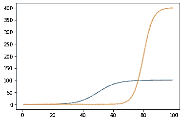

# 对数分析-重访新冠肺炎投影

> 原文：<https://towardsdatascience.com/loglet-analysis-revisiting-covid19-projections-5e9d14a46f2?source=collection_archive---------76----------------------->

## Loglet 分析(将增长分解为 S 形逻辑成分)是对新冠肺炎扩散的更好预测，因为它考虑了多次波动的演变。


图 01:用 KNIME & Jupyter-Notebook 进行 Loglet 分析(图片由作者提供)

***注来自《走向数据科学》的编辑:*** *虽然我们允许独立作者根据我们的* [*规则和指导方针*](/questions-96667b06af5) *发表文章，但我们不认可每个作者的贡献。你不应该在没有寻求专业建议的情况下依赖一个作者的作品。详见我们的* [*读者术语*](/readers-terms-b5d780a700a4) *。*

*在* [*的上一篇文章*](https://medium.com/swlh/covid-19-projections-with-knime-jupyter-and-tableau-daccca93b716) *中，我们展示了如何使用来自约翰霍普金斯学院的 covid 数据，通过 KNIME、Jupyter 和 Tableau 对未来 30 天进行预测。这些预测为逻辑增长模型进行了优化。我们将展示将生长分解成 S 形逻辑成分也称为* ***对数分析*** *、* *更准确，因为它考虑了多个 covid 波的演变。*

> 1994 年洛克菲勒大学创造的术语“ **Loglet** ”将“逻辑”和“小波”结合在一起。Loglet 分析很有趣，因为它可以处理多峰曲线，这是曲线拟合技术的常见挑战。

复制生物(例如病毒)的生长基本上以三个生长阶段为特征:

1.  指数生长
2.  逻辑增长
3.  多元逻辑增长

## **指数增长**

在第一阶段，增长是指数级的。在数学术语中，人口增长率 P(t)与人口数量成正比。时间 t 的增长率定义为导数 dP(t)/dt。

指数增长模型被写成一个微分方程:


图 02:指数增长模型(图片由作者提供)

这个方程可以通过引入 e(自然对数的底数，约为 2.71)来求解。。。).
大家熟悉的解决方案是:


图 03:指数增长模型的解(图片由作者提供)

其中“a”是增长率常数，“b”是初始种群 P(0)。“a”通常以百分比表示。例如，值为 0.02 的“a”相当于“人口以每年 2%的速度持续增长”。尽管许多种群在一段时间内呈指数增长，但除非系统的参数或极限发生变化，否则没有一个有限系统能够无限维持指数增长。

让我们试着想象一下 Jupyter 笔记本电脑的这种增长:

```
**import** **matplotlib.pyplot** **as** **plt**
**import** **numpy** **as** **np**
**import** **pandas** **as** **pd**t = np.arange(1, 100)
a = 0.1
b = 1
y= b*np.exp(a*(t))

plt.plot(t,y)
plt.show()
```


图 04:指数增长(作者图片)

**2。逻辑增长** 由于很少有系统随着时间的推移保持指数增长，指数增长方程必须用一个极限或承载能力来修正，使其具有更真实的乙状结肠形状。
指数增长模型中应用最广泛的修正是 logistic 模型。它由 Verhulst 在 1838 年引入，但在 20 世纪 20 年代由 Lotka 在数学生物学中推广。逻辑方程从指数模型开始，但增加了一个“负反馈”项，当接近极限 K 时，会减慢种群的增长率:


图 05: Logistic 微分方程(作者图)

请注意，当 P (t) << K and approaches zero as P(t) -> K 时，反馈项(1-P(t))/K 接近 1。因此，增长率开始呈指数增长，但随后随着种群 P(t)接近极限 K 而降至零，形成 S 形(乙状结肠)增长轨迹。

logistic 微分方程有许多封闭形式的解。我们将使用 Fisher-Pry 方程进行进一步分析:


图 06: Logistic 增长函数(作者图)

上面的等式产生了熟悉的 S 形曲线。完全指定曲线需要这三个参数，“a”、“b”和 k。生长速率参数“a”指定乙状结肠曲线的“宽度”。

让我们再次尝试想象一下 Jupyter 的增长:

```
t = np.arange(0, 100)
K = 100
a = 0.1
b = 50

y = K/(1+np.exp(-a*(t-b)))

plt.plot(t,y)
plt.show()
```


图 07:逻辑斯蒂增长(作者图片)

此外，用一个变量代替“α”通常更好，该变量指定曲线从极限 K 的 10%增长到 90%所需的时间，我们称之为特征持续时间δt。


图 08:曲线从 10%增长到 90%所需的时间(作者图片)

为了实现这一点，我们必须执行以下代数变换。首先，我们计算达到总增长率 90%所需的时间。


图 09:达到生长 90%的计算时间(作者图片)

然后是达到总增长率 10%的时间，我们从这个值中减去 90%。特征持续时间与“a”的关系为 ln(81)/δt。


图 10:特征时长(作者图片)

对于历史时间序列数据的分析，参数δt 通常比“a”更有用，因为单位更容易理解。三个参数 K、∞、t 和“b”定义了逻辑模型的参数化，该逻辑模型被用作我们的 Loglet 分析的基本构造块。


图 11:log El 分析基本建筑设计框图(作者图片)

**3。多逻辑增长** 在[上一篇文章](https://medium.com/swlh/covid-19-projections-with-knime-jupyter-and-tableau-daccca93b716)中，我们展示了逻辑增长模型可以很好地近似 covid19 波的演化。但是由于这种传播不局限于单个波，我们需要一种扩展的方法来描述整个过程。
许多成长过程由几个子过程组成。首先，让我们建立一个经历两个独立阶段增长的系统模型。然后，我们将这个模型扩展到任意数量的阶段。在所谓的双逻辑模型中，增长是两个“小波”的总和，每个小波都是逻辑的:


图 12:双逻辑模型(图片由作者提供)

在哪里


图 13:双对数小波(作者图片)

双逻辑模型的实现需要 6 个参数，在 Jupyter 中显示如下:

```
t = np.arange(1, 100)

K1 = 100
dt1 = 40
b1 = 50

K2 = 400
dt2 = 20 
b2 = 80

y = K1/(1+np.exp(-np.log2(81)/dt1*(t-b1))) + \
    K2/(1+np.exp(-np.log2(81)/dt2*(t-b2)))

plt.plot(t,y)
plt.show()
```


图 14:双对数增长(作者图片)

下图显示了双对数波的分解。蓝色脉冲被随后的橙色脉冲叠加。这样，看似复杂的行为被简化为两个逻辑小波的和。

```
y1 = K1/(1+np.exp(-np.log2(81)/dt1*(t-b1)))
y2 = K2/(1+np.exp(-np.log2(81)/dt2*(t-b2)))

plt.plot(t,y1)
plt.plot(t,y2)
plt.show()
```



图 15:双对数波的分解(图片由作者提供)

下一步是将双物流模型推广为多物流模型，其中增长是 n 个简单物流的总和:


在哪里


图 16:多重逻辑函数(作者图片)

以下 Jupyter 代码也可在我的 [github 网站](https://github.com/deganza/Loglet-analysis-revisiting-covid19-projections)上获得，它预测了瑞士未来 30 天的预期新冠肺炎病例，并需要 4 个逻辑小波的组合。对于其他国家，需要不同数量的小波。我们将在下面谈到这一点。
使用 Jupyter 中 scipy 软件包的 curve_fit 功能对模型进行拟合。

```
**import** **matplotlib.pyplot** **as** **plt**
**import** **numpy** **as** **np**
**import** **pandas** **as** **pd**
**from** **scipy.optimize** **import** curve_fitpath = 'https://raw.githubusercontent.com/deganza/Loglet-analysis-revisiting-covid19-projections/main/covid_daten_knime.csv'
df_country = pd.read_csv(path)df_country_exp = pd.DataFrame()

df_country_list = df_country.groupby(['Country']).last().reset_index()
country_list = df_country_list['Country'].to_list()df_country_period = df_country
zeilen = df_country_period['cases'].count()*# Select country or for evaluation of every country remark the variable country_list*

*#country_list =['Austria','Switzerland','Germany','United Kingdom','Spain']*
*#country_list =['United Kingdom']*
*#country_list =['Germany']*
*#country_list =['Spain']*
country_list =['Switzerland']
*#country_list =['Poland']*
*#country_list =['Turkey']*
*#country_list =['US']*

df_country_exp = pd.DataFrame()

*#logistic functions*

**def** logistic_function1(x,b1,dt1,K1,b2,dt2,K2,b3,dt3,K3,b4,dt4,K4):
    **return** K1/(1+np.exp(-np.log2(81)/dt1*(x-b1)))

**def** logistic_function2(x,b1,dt1,K1,b2,dt2,K2,b3,dt3,K3,b4,dt4,K4):
    **return**  K1/(1+np.exp(-np.log2(81)/dt1*(x-b1))) + K2/(1+np.exp(-np.log2(81)/dt2*(x-b2)))

**def** logistic_function3(x,b1,dt1,K1,b2,dt2,K2,b3,dt3,K3,b4,dt4,K4):
    **return**  K1/(1+np.exp(-np.log2(81)/dt1*(x-b1))) + K2/(1+np.exp(-np.log2(81)/dt2*(x-b2))) + K3/(1+np.exp(-np.log2(81)/dt3*(x-b3)))

**def** logistic_function4(x,b1,dt1,K1,b2,dt2,K2,b3,dt3,K3,b4,dt4,K4):
    **return**  K1/(1+np.exp(-np.log2(81)/dt1*(x-b1))) + K2/(1+np.exp(-np.log2(81)/dt2*(x-b2))) + K3/(1+np.exp(-np.log2(81)/dt3*(x-b3))) + K4/(1+np.exp(-np.log2(81)/dt4*(x-b4)))

**for** country **in** country_list:

        df_country_modell = df_country_period[df_country['Country'] == country]

        expdays = 30
        wave = 0

        datum = pd.date_range(start=df_country_modell['Date'].max(), periods=expdays)
        datum = pd.date_range(start=df_country_modell['Date'].min(),end=datum.max())
        datum = datum.strftime("%Y-%m-**%d**")

        zeilen= df_country_modell['cases'].count()
        x = np.arange(1,zeilen+1)
        x_exp = np.arange(1, x.max() + expdays  )
        y = df_country_modell['cases'] 

        y_min = y.min()
        y = y - y_min

        **try**:   
            popt, pcov = curve_fit(logistic_function4, x, y  )
            y_exp = (logistic_function4(x_exp, *popt))    

            df = pd.DataFrame({'day':x_exp, 'expected':y_exp,'datum':datum, 'Country' : country})
            df_country_exp = df_country_exp.append(df)

            wave=4
            print(country,wave)

        **except** **RuntimeError**:
            **try**:
                popt, pcov = curve_fit(logistic_function3, x, y  )
                y_exp = (logistic_function3(x_exp, *popt)) 

                df = pd.DataFrame({'day':x_exp, 'expected':y_exp,'datum':datum, 'Country' : country})
                df_country_exp = df_country_exp.append(df)

                wave=3
                print(country,wave)

            **except** **RuntimeError**:
                **try**:
                    popt, pcov = curve_fit(logistic_function2, x, y  )
                    y_exp = (logistic_function2(x_exp, *popt)) 

                    df = pd.DataFrame({'day':x_exp, 'expected':y_exp,'datum':datum, 'Country' : country})
                    df_country_exp = df_country_exp.append(df)

                    wave=2
                    print(country,wave)

                **except** **RuntimeError**:
                    **try**:
                        popt, pcov = curve_fit(logistic_function1, x, y  )
                        y_exp = (logistic_function2(x_exp, *popt)) 

                        df = pd.DataFrame({'day':x_exp, 'expected':y_exp,'datum':datum, 'Country' : country})
                        df_country_exp = df_country_exp.append(df)

                        wave=1
                        print(country,wave)    

                    **except** **RuntimeError**:
                        print(''.join(country) +  ": Error - curve_fit Log failed")

df_country_exp.reset_index(drop=**True**, inplace=**True**)
print('finished')
print(zeilen)
```

对于每个国家，该模型都符合几个逻辑脉冲，并计算出最佳描述病毒传播的参数。

**需要多少训练数据？** 我们现在已经创建了一个可以近似多个连续且重叠的 covid 波的模型。但现在问题来了:我们要考虑多少浪？这是一个还没有计算出来的参数。

> 如果你想定义未来，就研究过去
> ― **孔子**

在[的最后一篇文章](https://medium.com/swlh/covid-19-projections-with-knime-jupyter-and-tableau-daccca93b716)中，我们决定只考虑过去 90 天的案例，以符合我们的逻辑模型。有了我们新的多元逻辑模型，这个限制就不再必要了，因为我们可以使用疫情疫情爆发第一天的数据。但是现在我们有了一个新的参数来选择小波的数目。这是一个开放点，我们决定采取以下策略:
现在是 2021 年 1 月。对于每个国家，我们开始用 4 个小波来拟合模型。如果模型不收敛，我们将其减少到 3 个小波等等，直到我们找到最佳逼近。

**将所有这些放在一起** 使用上面的代码已经可以对每个国家进行预测，但是我们希望在我们现有的 [KNIME-Workflow](https://hub.knime.com/deganza/spaces/Public/latest/covid19_Loglet_knime_jupyter_tableau/) 流程中实现它，以实现更好的数据转换和随后的 Tableau 可视化。
正如您在上一篇文章中所记得的，我们使用 KNIME 加载来自约翰·霍普金斯研究所的 covid19 数据，对其进行转换，并使用 Jupyter 计算预测。最后，我们将数据导出到 Tableau 中进行可视化。


图 17: KNIME 工作流:加载数据，计算预测，并将其导出到 Tableau 中(图片由作者提供)

KNIME-workflow 在我的 [KNIME-hub](https://hub.knime.com/deganza/spaces/Public/latest/covid19_Loglet_knime_jupyter_tableau/) 站点上可用，Tableau 仪表盘几乎每天都在我的 Tableau-Public 站点[这里](https://public.tableau.com/profile/dennis.ganzaroli#!/vizhome/Covid19-Dashboard-V2/Overview_dsh)上发布实际数据


图 18: Covid19 Tableau-Dashboard，带有未来 30 天的预测(图片由作者提供)

这种扩展的对数预测方法比简单的对数分析更灵活，因为它考虑了连续波的演变。因此，可以更快地跟踪和推断病毒的新波动或变异。这变得越来越重要，因为这种病毒已经在英国和南非变异成传染性更强的版本。

<https://medium.com/@deganza11/membership>  

*跟我上* [*中*](https://deganza11.medium.com/)*[*Linkedin*](https://www.linkedin.com/in/dennis-ganzaroli-17785222/)*或*[*Twitter*](https://twitter.com/DennisGanzaroli) *以及跟我上的脸书群* [***数据科学跟 yo dime***](https://www.facebook.com/Data-Science-with-Yodime-103661695297356)*

*****本项目材料****:
Jupyter-Code:*[*github*](https://github.com/deganza/Loglet-analysis-revisiting-covid19-projections) *knime-workflow:*[*knime-hub*](https://hub.knime.com/deganza/spaces/Public/latest/covid19_Loglet_knime_jupyter_tableau/) *Tableau-Dashboard:*[*Tableau-Public*](https://public.tableau.com/profile/dennis.ganzaroli#!/vizhome/Covid19-Dashboard-V2/Overview)**

*****参考资料
-*-**[Covid 19-用 Knime、Jupyter 和 Tableau 进行预测](https://medium.com/swlh/covid-19-projections-with-knime-jupyter-and-tableau-daccca93b716)
- [*逻辑增长和替代入门:Loglet Lab 软件的数学*](https://phe.rockefeller.edu/publication/primer-logistic-growth-substitution-mathematics-loglet-lab-software/) *-*[*Scipy-文档*](https://scipy-lectures.org/intro/scipy.html)**

***为首次发表于*[*KD nuggets*](https://www.kdnuggets.com/2021/01/loglet-analysis-revisiting-covid-19-projections.html)*。***