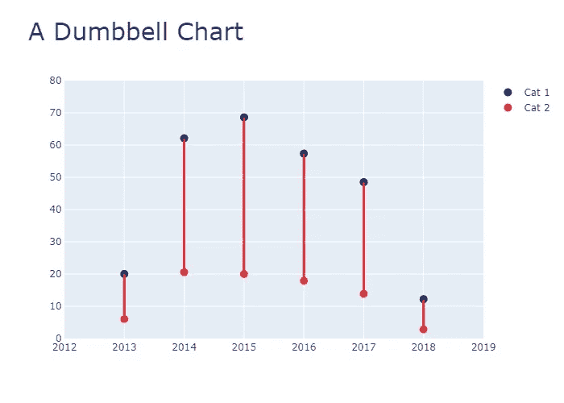
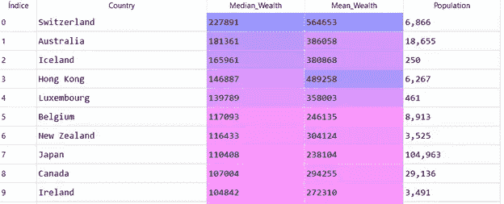
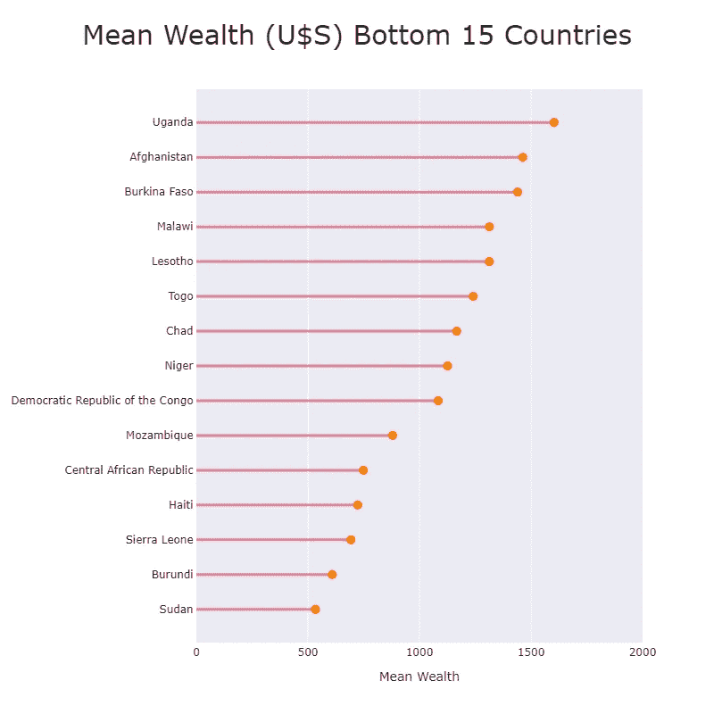
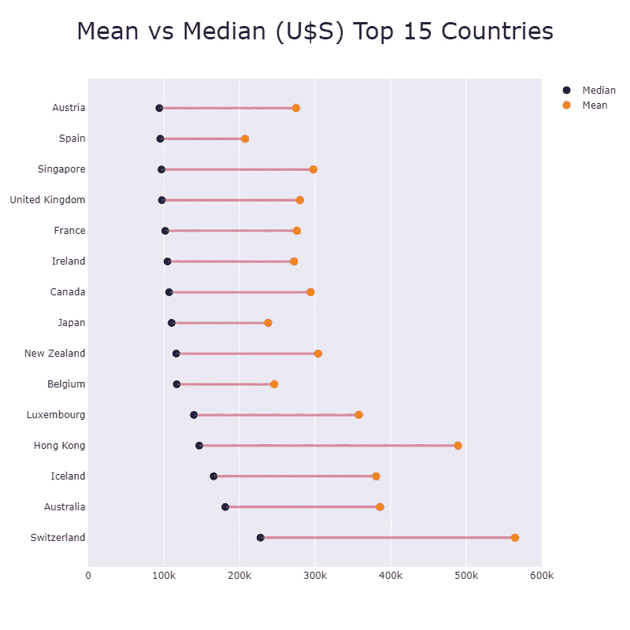
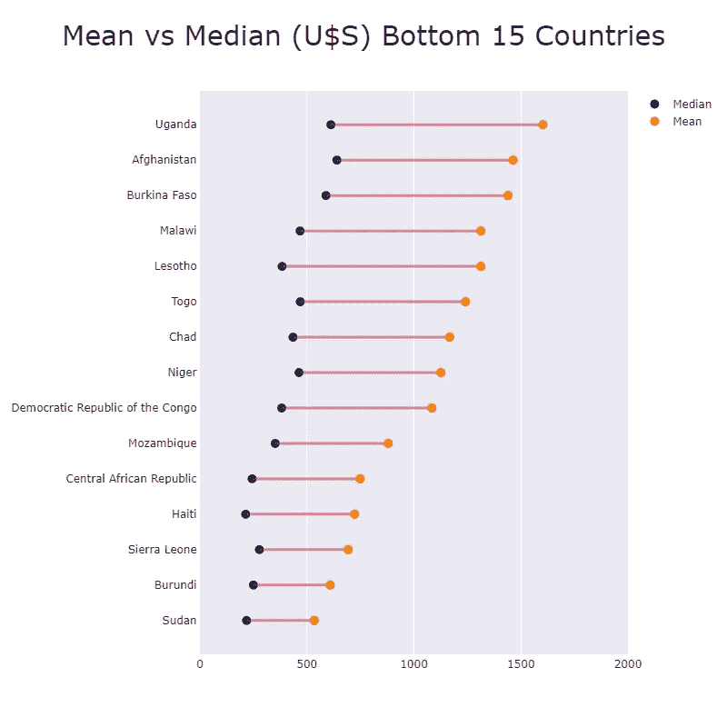

# Plotly 的棒棒糖和哑铃图表

> 原文：<https://towardsdatascience.com/lollipop-dumbbell-charts-with-plotly-696039d5f85?source=collection_archive---------11----------------------->

## **均值还是中值？**


图片由来自 Unsplash 的 Eskay Lim 提供

棒棒糖图(LC)是条形图的一种便利变体，其中**条形图由一条线和一个点代替。**它们是二维的，有两个轴:一个轴显示类别或时间序列，另一个轴显示数值。这些数值由线末端的点的位置表示。垂直方向的 LC 在 y 轴上显示分类变量，而水平方向的 LC 在 x 轴上显示分类变量。

就像[条形图](https://medium.com/@dar.wtz/bar-graphs-why-how-8c031c224c9f)一样，棒棒糖图用于在不同项目或类别之间进行**比较**。它们也用于**排名**或显示**随时间变化的趋势**。我们只比较每个项目或类别的一个数字变量。它们不适用于关系、分布或构成分析。

当您不得不**显示大量类似的高值时，LCs 比条形图更受欢迎。**在标准条形图的情况下，您可能会得到一个杂乱的图表，并体验到一种称为 [**莫尔条纹的视觉效果。**](https://en.wikipedia.org/wiki/Moir%C3%A9_pattern) 虽然等同于条形图，但是**这种等同只对** **标准条形图**有效；不要试图将其扩展到[堆叠、](/stacked-bar-graphs-why-how-f1b68a7454b7) [聚集、](/clustered-overlapped-bar-charts-94f1db93778e)重叠条形图。

另一方面，**哑铃图** (DC)是簇状条形图和斜率图的替代品。也被称为 **DNA 图**，它们表示两个数据点之间的变化。每个点对应一个数值，在同一个维度上以非常直接的方式进行比较。

在比较点与点之间的差异、范围、分布或距离时，它们非常有效。它们用于在类别之间进行比较，或者观察两个时间间隔之间的趋势。

图 0 显示了一个示意性的垂直方向哑铃图。



图 0:作者用 Plotly 做的哑铃图。

# **集中趋势的度量**

专业数据科学家应该熟悉用于描述其研究或项目观察结果的不同统计方法。他们应该非常熟悉的集中趋势的常用度量是均值、中值和众数。

数据集的**均值**是通过将数据集中的所有数字相加，然后除以其中值的个数得到的。当数据集从最小到最大排序时，**中值**是中间值**T5。 **Mode** 是集中趋势的度量，代表数据集中出现频率最高的值。**

由于有许多外部因素限制了均值的使用，中位数被广泛使用，尤其是在偏态分布中。中位数被认为是对异常值稳健的，而平均值被认为是对异常值敏感的。请记住，离群值(异常值)是一段与数据集中所有其他数据都非常不同的数据，并且似乎不符合相同的模式。中位数通常给出了更恰当的数据分布概念。

# **棒棒糖和哑铃图表与 Plotly**

**面向对象的人物创作界面 Plotly Express** 于 2019 年发布。它是 Plotly.py 的高级包装器，包括绘制标准 2D & 3D 图表和 choropleth 地图的函数。与 Plotly 生态系统的其余部分完全兼容，是快速开发探索性图表的优秀工具。

Plotly 提供了一组名为 *graph objects* 的类，可用于构建图形。 *plotly.graph_objects* 模块包含 Python 类的层次结构。*图*是初级类。*图*有一个**数据属性**和一个**布局属性**。数据属性有 40 多个对象，每个对象引用一个特定类型的图表( **trace)** 及其相应的参数。布局属性指定图形的整体属性(轴、标题、形状、图例等。).

我们使用了从社区 GitHub [1]下载的公共数据集。该数据集包含与世界财富和收入相关的记录。我们想知道哪种集中趋势度量最适合分析数据集。

首先，我们导入 Plotly Express 为 *px，*模块 *plotly.graph_objects* 为 *go* ，Pandas 库为 *pd* ，并将我们的 *csv 文件*转换成数据帧:

```
import pandas as pdimport plotly.express as pximport plotly.graph_objects as godf_Ww = pd.read_csv(path + 'WorldWealth.csv', 
                    index_col = False,
                    header = 0, sep = ';', engine='python')
```

数据存储在文件中的方式不是我们绘图所需的方式。由于每一列都存储为一个对象类型，我们需要将列`*Median_Wealth*` 和`*Mean_Wealth*` 转换为整数:

```
df_Ww['Mean_Wealth']   = df_Ww['Mean_Wealth'].str.replace(
                               ',', '').astype(str).astype(int)df_Ww['Median_Wealth'] = df_Ww['Median_Wealth'].str.replace(
                               ',', '').astype(str).astype(int)types = df_Ww.dtypes
```

下面的屏幕截图显示了转换后的数据帧的前十条记录:



完成这三行代码后，我们就可以画棒棒糖图了。

我们用 `.add_trace(go.Scatter(`画点，用 `.add_shape(type=’line`画相应的线。我们选择通过在 y 轴上显示分类变量`[“Country”]`来绘制水平方向的 LC。我们使用`mode = ‘markers’`来选择一个点标记。

使用`fig1.add_shape(type='line'.` 将独立行添加到图中。注意，我们使用 for 循环的计数器变量来设置`y0` 和`y1` 值。

我们用`update.layout`更新了图表:设置标题和字体大小。我们设置了`template= ‘seaborn+ygridoff’`:在这种情况下，通过合并[两个注册模板](/histograms-with-plotly-express-e9e134ae37ad) (seaborn & ygridoff)的集合来计算结果模板。我们用宽度和高度来定义图形尺寸。然后我们更新了 x 轴(标题和范围)。我们将图表保存为静态的 *png* 文件，最后，我们绘制了图表。

首先，我们根据财富中值对前 15 个国家进行了排名:

```
df_WwT = df_Ww.sort_values(by = ['Median_Wealth'],
                    ascending = False).iloc[0:15].reset_index()fig1 = go.Figure()# Draw points
fig1.add_trace(go.Scatter(x = df_WwT["Median_Wealth"], 
                          y = df_WwT["Country"],
                          mode = 'markers',
                          marker_color ='darkblue',
                          marker_size  = 10))# Draw lines
for i in range(0, len(df_WwT)):
               fig1.add_shape(type='line',
                              x0 = 0, y0 = i,
                              x1 = df_WwT["Median_Wealth"][i],
                              y1 = i,
                              line=dict(color='crimson', width = 3))# Set title
fig1.update_layout(title_text = 
                   "Median Wealth (U$S) Top 15 Countries",
                   title_font_size = 30)# Set x-axes range
fig1.update_xaxes(title = 'Median Wealth' , range=[0, 250000])fig1.write_image(path + "figlollipop1.png")fig1.show()
```


图 1:作者用 Plotly 做的棒棒糖图。

然后，我们根据平均财富对排名最低的 15 个国家进行了排名:

```
df_WwB = df_Ww.sort_values(by = 
                   ['Mean_Wealth']).iloc[0:15].reset_index()fig2 = go.Figure()# Draw Points
fig2.add_trace(go.Scatter(x = df_WwB["Mean_Wealth"], 
                          y = df_WwB["Country"],
                          mode = 'markers',
                          marker_color ='darkorange',
                          marker_size  = 10)# Draw Lines
for i in range(0, len(df_WwB)):
               fig2.add_shape(type='line',
                              x0 = 0, y0 = i,
                              x1 = df_WwB["Mean_Wealth"][i],
                              y1 = i,
                              line=dict(color='crimson', width = 3))# Set title
fig2.update_layout(title_text =
                   "Mean Wealth (U$S) Bottom 15 Countries",
                    title_font_size = 30)# Set x-axes range
fig2.update_xaxes(title = 'Mean Wealth', range=[0, 2000])fig2.write_image(path + "figlollipop2.png")fig2.show()
```



图 2:作者用 Plotly 做的棒棒糖图。

然后，我们设计了两个水平方向的哑铃形图表，比较 15 个排名靠前的国家和 15 个排名靠后的国家的平均财富和中值财富。现在我们需要两个`.add_trace(go.Scatter(`:一个是平均财富点，另一个是中等财富点。关于`.add_shape(type=’line’`，我们用`df_WwT[“Median_Wealth”][i`表示`x0`，用`df_WwT[“Mean_Wealth”][i]` 表示`x1`。

```
fig3= go.Figure()fig3.add_trace(go.Scatter(x = df_WwT["Median_Wealth"], 
                          y = df_WwT["Country"],
                          mode = 'markers',
                          marker_color = 'darkblue',
                          marker_size = 10,
                          name = 'Median'))fig3.add_trace(go.Scatter(x = df_WwT["Mean_Wealth"], 
                          y = df_WwT["Country"],
                          mode = 'markers',
                          marker_color = 'darkorange', 
                          marker_size = 10,
                          name = 'Mean'))for i in range(0, len(df_WwT)):
               fig3.add_shape(type='line',
                              x0 = df_WwT["Median_Wealth"][i],
                              y0 = i,
                              x1 = df_WwT["Mean_Wealth"][i],
                              y1 = i,
                              line=dict(color='crimson', width = 3))fig3.update_layout(title_text =
                    "Mean vs Median (U$S) Top 15 Countries",
                    title_font_size = 30)fig3.update_xaxes(range=[0, 600000])fig3.write_image(path + "figdumbbell1.png")fig3.show()
```



图 3:作者用 Plotly 做的哑铃图。

图 4 的代码与图 3 的代码相同，除了我们使用了 `df_WwB`而不是`df_WwT.`



图 4:作者用 Plotly 做的哑铃图。

当你有一个正态分布的样本时，你可以用平均值或中值来衡量集中趋势。在任何对称分布中，平均值、中值和众数都是相等的。我们的数据(前 15 个国家和后 15 个国家)并非如此:平均值总是大于中位数。这清楚地表明数据是右偏的。在这些情况下，中位数通常被认为是集中趋势的最佳衡量标准。中位数没有受到非常富有的人的扭曲价值的强烈影响，并为我们的数据提供了最佳的中心位置。我们的哑铃图显示的差异证实了这一假设。

# **总之**

棒棒糖图的使用情况与标准条形图完全相同，它以相同的方式对数值进行编码:线条的长度和线条末端的点的位置相当于水平或垂直矩形条的长度或高度。当您处理大量相似的数值时，棒棒糖图比条形图更受欢迎。哑铃图是简单的图表，可以快速直接地显示差异、变化、范围和相似性。它们允许将大量信息编码到一个易于理解的图表中。

如果你发现了这篇感兴趣的文章，请阅读我之前的(https://medium.com/@dar.wtz):

分歧棒线，为什么&如何，用分歧讲故事

[](/diverging-bars-why-how-3e3ecc066dce) [## 背离棒线，为什么&如何

### 用分歧讲故事

towardsdatascience.com](/diverging-bars-why-how-3e3ecc066dce) 

斜率图表，为什么和如何，用斜率讲故事

[](/slope-charts-why-how-11c2a0bc28be) [## 斜率图表，为什么和如何

### 用斜坡讲故事

towardsdatascience.com](/slope-charts-why-how-11c2a0bc28be) 

# **参考文献**

[1]:**[https://github . com/datasets/world-wealth-and-income-database/commit/33a 44291 E4 d6f 76 be 066 f 0912 b 6 DC 033 d9 ECE 59 e](https://github.com/datasets/world-wealth-and-income-database/commit/33a44291e4d6f76be066f0912b6dc033d9ece59e)**