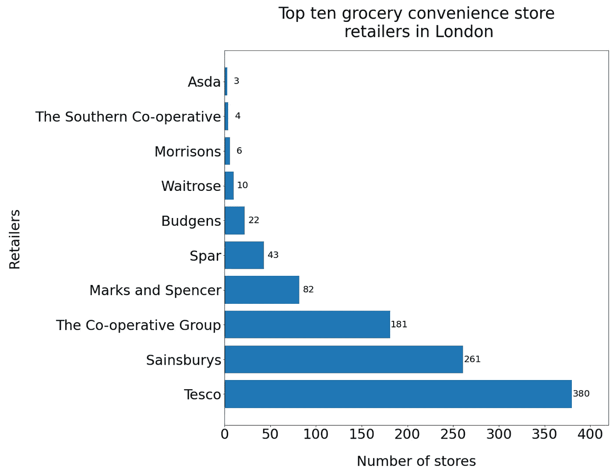
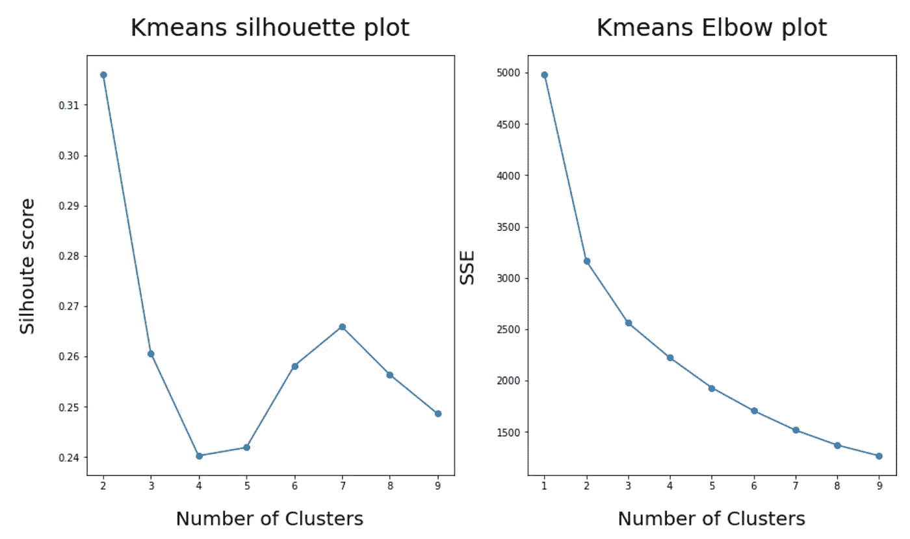
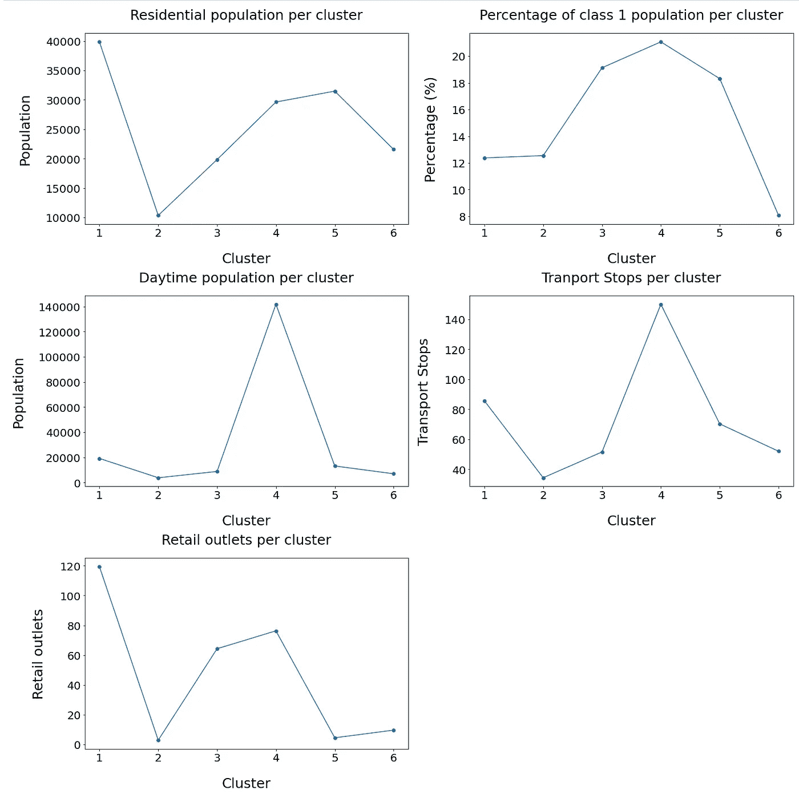
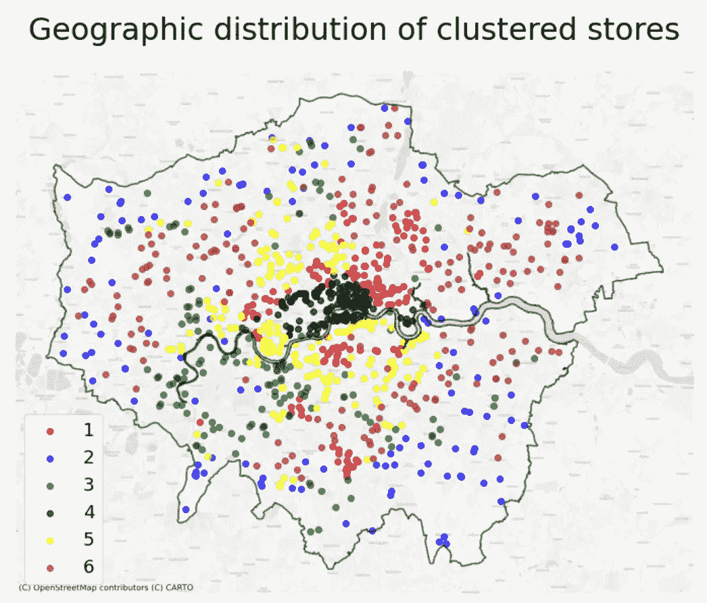

# 使用 K-均值聚类的伦敦便利店分类

> 原文：<https://towardsdatascience.com/london-convenience-store-classification-using-k-means-clustering-70c82899c61f?source=collection_archive---------16----------------------->

## 伦敦的便利店怎么分类？


Viki Mohamad 在 [Unsplash](https://unsplash.com?utm_source=medium&utm_medium=referral) 上拍摄的照片

英国的便利店可归类为面积小于 3，000 平方英尺的商店，靠近消费者的家或白天有大量人口，产品范围广泛但不丰富。这意味着它们主要面向希望从主要商店购买额外商品的消费者、经常光顾但规模较小的商店的消费者，以及可能只想在办公室购买午餐的消费者。

这些小商店越来越成为英国杂货零售店持续扩张的工具，因为它们需要较小的门槛人群才能盈利，它们可以适应消费者对更多便利的不断变化的需求，它们在当前的规划制度下更容易建设，它们被视为独立于大型杂货店的市场，这意味着竞争监管对于现有的国家杂货零售商变得不那么重要。

因此，相对于大型超市和超级市场商店，国家杂货零售商认为这些是近年来更可行的扩张选择。从某种程度上来说，从 2003 年到 2012 年，全国杂货店的大部分增长是由于 Co-op、Tesco 和 Sainsbury's 等零售商开设了便利业态。这意味着到 2015 年，22%的食品杂货市场被便利店占据。

虽然便利业态最初采取的形式是位于居民区附近的独立街角商店，但随着独立便利零售商的数量减少，它已经转向大型全国性零售商和伞式组织。这种形式的目的也发生了变化，因为尽管便利店是根据其规模进行分类的，但它们可以位于非常不同的区域，例如靠近办公人群的市中心商店，靠近交通节点以吸引大量步行人流的商店，或靠近居民区以吸引夜间人群的商店。因此，能够对这些商店进行分类，以了解它们的位置如何影响它们销售什么、向谁销售以及何时销售产品变得非常重要。此处的分析遵循 Hood 等人(2016)提出的方法，该方法对英国约克郡和亨伯地区的便利店零售商进行了分类。这样做的目的是复制伦敦的分析，并为此创建一个 Jupyter 笔记本。

为此，使用与 Hood 等人(2016 年)类似的输入数据，我们将使用:居住人口、日间人口、其他零售景点、交通节点附近以及按社会分类的居住人口。这是因为这些因素被认为与已知的销售数据相关，并与特定的客户任务相关联。这些数据可以从 2011 年伦敦人口普查数据、国家公共交通访问节点和 OpenStreetMaps (OSM)数据集提取。为此，使用包含英国主要杂货零售商信息的 [Geolytix](https://geolytix.com/) dataset⁴提取伦敦的便利店，包括它们的尺码范围。从伦敦范围内和大小范围 A ( < 3，013 𝑓𝑡ft (280 𝑚)内的商店中提取，留给我们来自 13 个主要杂货零售商的 997 家便利店。该结果数据中的主要零售商是:



作者图片

正如我们所看到的，这个数据集中的便利店主要是 Tesco，Sainsbury's 和 Co-operative Group。

为此，我们对便利店 1 公里范围内的人口、公共交通站和零售店感兴趣，因为这被视为典型消费者愿意步行到这些类型的商店的最大距离，并且是这些商店周围缓冲区的行业标准，用于分析目的。

首先，可以使用 OSM api 使用以下代码从这些便利店周围 1 公里范围内提取零售商店:

```
#to reduce the need to call the osm api we can store the data after the first collection
Cleaned_convenience_surrounding_retail = os.path.join("Data", "stores_with_surrouding_retail.shp")#if the data already exists in order to reduce time waiting on the #api call then we can read it in
if os.path.exists(Cleaned_convenience_surrounding_retail):
    #read in the cleaned results
    London_convenience_stores = gpd.read_file(Cleaned_convenience_surrounding_retail)#if this is done for the first time:
else:
    #set the tag of the building as retail usage
    tags = {"building":["retail"]} #create an empty list of retailers nearby
    retail_nearby = {} #iterate over each row in the London_convenience_stores_dataset
    for index, row in London_convenience_stores.iterrows():

        #extract the buildings within a 1km radius
        buildings = ox.geometries_from_point((row["lat_wgs"],     row["long_wgs"]), tags, dist = 1000)
        #add the number of buildings to the dictionary
        retail_nearby[row["store_name"]] = len(buildings)

    #set the column to the number of stores nearby based on the dictionary results
    London_convenience_stores["stores_nearby"] = London_convenience_stores["store_name"].map(retail_nearby)

    #output the results to a shapefile
    London_convenience_stores.to_file(Cleaned_convenience_surrounding_retail, index=False)
```

然后可以将其添加回原始数据集中。通过在便利店周围生成一个 1km 的缓冲区，并查找该缓冲区内的停靠点数量/居住人口数量/人口类型/工作场所人口数量，可以将剩余的数据连接到便利店信息。缓冲区本身可以通过以下方式生成:

```
London_convenience_buffer = London_convenience_stores.buffer(1000)
```

使用空间连接来查找 1km 缓冲区内的停靠点数量:

```
London_convenience_stores_transport = gpd.sjoin(stops_geo,
                                                London_convenience_stores_buffer,
                                                how = "inner",
                                                op = "within")#we then want the number of stops which can be found using the size attribute
London_convenience_stores_transport = (London_convenience_stores_transport.groupby(["store_name"], 
                                                                                   as_index=False)
                                       .size())#renamethe size column
London_convenience_stores_transport.rename(columns = {"size":"transport_nearby"}, inplace=True)
```

和叠加分析，找出 1km 边界内输出区域或工作区的百分比:

```
#we want to find the area of overlap between buffers and the workplace zone
#this is so that we can calculate the percentage of population later
WZ_overlap = gpd.overlay(London_convenience_stores_buffer[["store_name",    "geometry"]], 
             UK_WZ[["wz11cd", "geometry"]], how = "intersection")#calcualte the area of the workplace zone
UK_WZ["area"] = UK_WZ.area
#claculate the area of teh overlapped area
WZ_overlap["overlap_area"] = WZ_overlap.area#merge the overlap with the workplace zone 
WZ_overlap = WZ_overlap.merge(UK_WZ,
                             on = "wz11cd",
                             how = "left")#calculate the area for each workplace zone that lies within the overlap
#this is so we can get a percentage of population
WZ_overlap["area_perc"] = WZ_overlap["overlap_area"]/WZ_overlap["area"]#merge the resulting data with that of the population datadrame
WZ_overlap = WZ_overlap.merge(UK_WZ_pop[["GEO_CODE", "workplace_population"]],
                             left_on = "wz11cd",
                             right_on = "GEO_CODE",
                             how = "left")#calcualte the actual amount of workplace population within the immediate zone
#this assumes that workplace population is evenly distributed within a workplace zone
WZ_overlap["WZ_area_pop"] = WZ_overlap["area_perc"] * WZ_overlap["workplace_population"]#we then want this by each store so we groupby the store name
Workzone_pop = WZ_overlap.groupby(["store_name"], as_index=False).agg({"WZ_area_pop":"sum"})
```

其可用于计算该边界内居住和日间人口的实际数量，假设每个输出区域和工作场所区域内人口的平均分布，以及社会分类 1(高级管理、行政和专业职业)内工作成人的百分比。

这些变量在悬挂物周围的分布导致:


作者图片

显示了长尾分布。因此，由于聚类使用距离度量，并且对数据集中的变化敏感，所以所有变量都经过对数变换和标准化，以确保数据集中的尺度和变化相同。

为了确定要识别的聚类数量，使用了肘图和轮廓得分方法，并从数据中得出以下图:



作者图片

这些结果表明 2 或 3 个聚类将是合适的(最大的轮廓分数和肘部的开始)，然而，轮廓分数也表明 6 或 7 个聚类也可能是合适的。根据结果的地理分布、聚类的大小和其中的变量来检查这些数量的聚类，6 个聚类被认为是最实用的，因为它们易于地理和变量解释，并且每个聚类内的商店数量分布大致均匀。这些集群可以表示如下:



作者图片



作者图片

这些可以解释为:

**集群 1——以住宅和零售为主**

这些集群的位置出现在主要人口中心周围，并且位于其他零售位置附近。在伦敦市中心及其周围，这些很可能在拥有大量居民的主要大街附近被发现。

**集群 2——分布式便利店**

这些便利店并不位于任何其他吸引因素附近，可能位于伦敦边缘的主要私人交通节点附近。它们既不靠近任何居民区或白天活动的人群，也没有任何数量可观的其他零售点，表明它们是单独设置的。

**集群 3——以零售为重点**

这些便利店主要集中在零售商店附近和富裕住宅区附近，但这两者都比集群 1 少。这些商店可能位于二级大街上，就零售或人口而言，它们都不是主要的景点，远离伦敦市中心，因此人口密度较小。

**集群 4——关注工作场所**

这些便利店主要位于工作场所人口高度集中的地方，以及主要位于伦敦市中心的交通站附近。这些很可能在早上和晚上严重依赖于交通工具的步行交通，而在白天则依赖于工作场所的人口来维持。

**集群 5——以富裕住宅为主**

这些便利店往往位于富裕的住宅区。这些可能是你在高人口密度地区的街角商店，周围很少有其他零售店。他们整天依赖于居住人口。

**集群 6 —不太富裕的住宅集中**

这些便利店主要集中于居住人口，类似于集群 5，但在不太富裕的地区也是如此。它们主要位于人口密度较低的区域，这些区域附近的零售商店或交通站比集群 5 中的要少。

理解这一点很重要，因为可能服务于这些便利店的人群将会影响他们在有限的商店空间内提供什么类型的产品以及他们可能会很忙的时间。这也对哪些商店将在整个冠状病毒期间经历财富的变化具有重要影响，因为在此期间，以住宅为重点的商店可能会增加收入，而以工作场所为重点的商店可能会减少收入，甚至暂时关闭。这种情况可能会再次发生变化，因为我们正朝着混合工作制的办公室回归，因为与前几个月相比，住宅商店的需求可能会下降，而以工作场所为重点的商店可能会重新开业，尽管混合工作制可能不足以支持所有这些商店的重新开业。

代号:[https://github.com/PhilipDW183/Convenience_store](https://github.com/PhilipDW183/Convenience_store)

[1] Baron，s .，Harris，k .，Leaver，d .和 Oldfiel，b .，2001 年。超越便利:英国独立食品和杂货零售商的未来。*《零售、分销和消费者研究国际评论》，第 11 卷第 4 期，第 395-414 页。*

[2]伍德和麦卡锡博士，2014 年。英国食品零售的“空间竞赛”和市场饱和:当代评论。*《国际零售、分销和消费者研究评论》，* 24 卷 2 期，第 121–144 页。

[3]n .胡德，g .克拉克和 m .克拉克，2016 年。为零售选址规划细分不断增长的英国便利店市场。《零售、分销和消费者研究国际评论》， 26(2)，第 113-136 页。

[4][https://geolytix.com/](https://geolytix.com/)(开放数据许可:[https://drive.google.com/open?id = 1 b 8m 7m 86 rqg 2 sx 2 tshhfa 2d-x-dz 1 dbsy](https://drive.google.com/open?id=1B8M7m86rQg2sx2TsHhFa2d-x-dZ1DbSy)