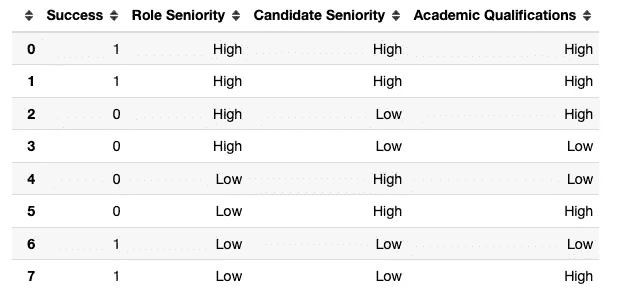
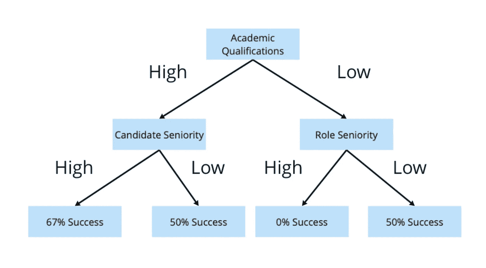
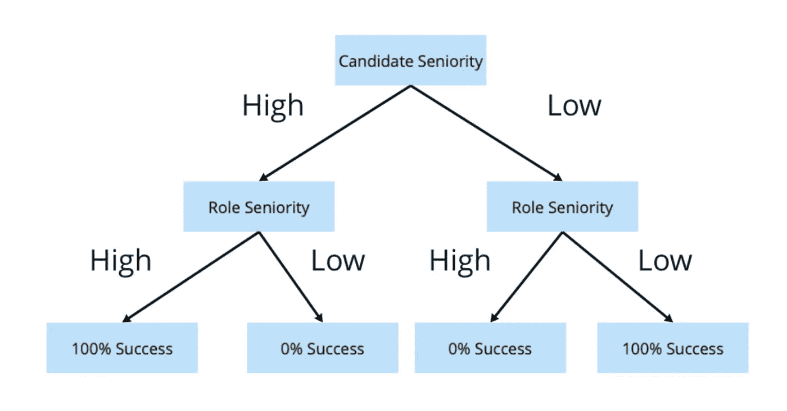
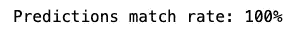
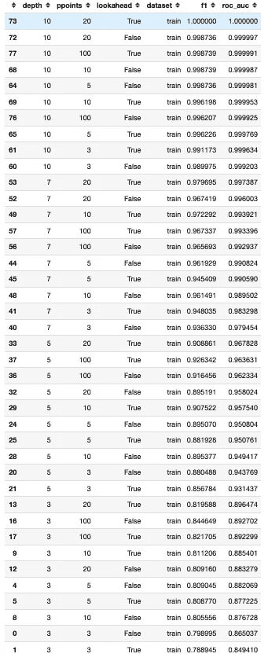
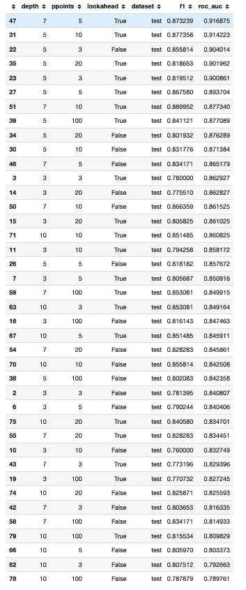

# 前瞻决策树算法

> 原文：<https://towardsdatascience.com/lookahead-decision-tree-algorithms-1a531897d15c?source=collection_archive---------12----------------------->

## 决策树中的前瞻机制可以产生更好的预测


图片由来自 [Pixabay](https://pixabay.com/?utm_source=link-attribution&utm_medium=referral&utm_campaign=image&utm_content=1894938) 的[Steve buiss NNE](https://pixabay.com/users/stevepb-282134/?utm_source=link-attribution&utm_medium=referral&utm_campaign=image&utm_content=1894938)拍摄

**TL；博士**:我证明了具有单步前瞻机制的决策树可以胜过标准的贪婪决策树(没有前瞻)。在样本数据集中没有观察到过度拟合或前瞻病理。

## 为什么要向前看？

假设我们试图**预测一个潜在的工作候选人**能否在他的工作中**成功。**


来自[像素库](https://pixabay.com/?utm_source=link-attribution&utm_medium=referral&utm_campaign=image&utm_content=1841158)的[像素](https://pixabay.com/users/pexels-2286921/?utm_source=link-attribution&utm_medium=referral&utm_campaign=image&utm_content=1841158)的图像

我们有一个历史数据集，使我们能够建立一个预测模型。



作者图片

“成功”是我们的目标变量，我们在预测模型中使用了 3 个分类特征:

*   角色资历
*   候选人资历
*   学历

让我们的例子简单一些，假设这些特征取两个值“高”或“低”中的一个。

假设我们使用 scikit-learn 的默认参数构建一个 2 级决策树。下面是生成的拆分。



作者图片

请注意，决策树能够生成候选人可以落入的 4 个最终叶子/桶。候选人的预测成功率是 67%、50%、0%或 50%，这取决于他属于哪个左/桶。

我们没有得到一个明确的树叶分裂，其中候选人要么 100%成功，要么在所有桶 0%。决策树的目标是区分潜在的成功候选人和不成功的候选人。

实际上，本可以产生一个更好的分割…

在我们的示例中，如果候选人资历和角色资历都很高或都很低，则候选人会成功，因为候选人的资历和角色所需的资历非常匹配。这种情况 100%都会发生。反之亦然…如果候选人资历高，但角色资历低，或反之亦然，候选人成功的几率为 0%。

如果我们按照下面的方法构建一棵树，我们可以将候选人放入叶子中，将成功的候选人与不成功的候选人完全分开。



作者图片

决策树的标准实现将构建前一个次优树的原因是因为**决策树**是贪婪的，并且评估局部最优解。

第一次分裂将发生在“学术资格”特征上，因为这是决策树能够最好地区分成功和不成功候选人的局部最优，在数据中，具有高“学术资格”的候选人的 60% (3/5)是成功的，而具有低“学术资格”的候选人只有 33% (1/3)是成功的。

如果我们在第一步中按照“候选人资历”或“角色资历”进行划分，那么对于“候选人资历”或“角色资历”高和低的候选人，我们最终的成功率都是 50%……该模型无法进行任何有意义的预测。

因此，决策树更喜欢对局部最优的“学历”进行拆分，而不是进行更深层次的搜索。

但是，如果决策树能够**向前看**一步，它会在第一步中根据“候选人资历”和第二步中的“角色资历”找到一个更有效的分裂，或者反过来。看数据。

## 展望未来的成本

没有前瞻机制的决策树会选择最大化信息增益的分裂。通常，基尼指数(scikit-learn 默认选项)或熵在每次可能的分割后进行测量，以选择最佳分割。虽然拆分可以最大化拆分后的信息增益，但是它不考虑后续拆分中的信息增益。

在我们上面的例子中，首先按照“学历”进行分割，在第一次分割后产生最佳的基尼系数。但是它并没有给我们一个路径来做一个完美的第二级分裂，0 基尼系数，有能力将候选人分为 100%成功或不成功。

根据“职位资历”或“候选人资历”进行划分。

> **基尼-杂质**:*GI*=*I*= 1∑*C**p*(*I*)∑(1*p*(*I*))

当添加单步前瞻时，在每次分割时，我们也通过考虑**随后的分割**来进行优化。在上面的例子中，我们会发现按“职位资历”进行拆分比按“学历”进行拆分更好，因为如果我们继续按“候选人资历”进行拆分，我们可以得到完美的基尼系数 0。

仅通过单步预测，我们需要评估所有可能的分割组合(当前和后续分割)，这是一个非常昂贵的操作，需要大量的**计算资源**。

此外，还有一种**前瞻病理学**现象，这种现象经常被观察到，前瞻实际上会导致更糟糕的结果和更大的决策树。在机器人和游戏(如国际象棋)中也观察到了前瞻病理学，在这些游戏中，没有前瞻或具有有限前瞻的简单试探法往往优于进行更深入前瞻的更广泛搜索。


图片由 [PIRO4D](https://pixabay.com/users/piro4d-2707530/?utm_source=link-attribution&utm_medium=referral&utm_campaign=image&utm_content=1702670) 来自 [Pixabay](https://pixabay.com/?utm_source=link-attribution&utm_medium=referral&utm_campaign=image&utm_content=1702670)

在我们的求职者示例中，情况并非如此，但这确实会发生。不能保证向前看会提高决策树的准确性。

## 设置我们的实验

我们将运行一个简单的实验来测试前瞻是否增加了决策树分类器的准确性。具有前瞻机制的决策树有现成的实现(例如 Weka 中的 J48)，但是我们将从头用 Python 构建一个定制的分类器。

我们首先准备一个包含两个类的样本分类数据集，并将其分成训练和测试数据集。

```
RANDOM_STATE = 1clf_data = make_classification(
    n_samples=1000,
    n_features=20,
    n_informative=10,
    n_redundant=2,
    n_classes=2,
    shuffle=True,
    random_state=RANDOM_STATE,
)X_train, X_test, y_train, y_test = train_test_split(
    clf_data[0], clf_data[1], test_size=0.2, random_state=RANDOM_STATE)
```

下面的代码是决策树的一个自定义实现，虽然简单、缓慢，但它确实完成了任务。它包括单步前瞻，并允许修改最大深度以及**分割点/箱数量(基于百分点)**以考虑每个特征。当分割点≥样本量时，我们将简单地评估每个值的分割，而较少的分割点是一种正则化形式，我们根据百分位数评估分割特征的潜在值。

当我们不包括任何前瞻并选择大量分裂点时，决策树产生的预测应该与 scikit-learn 的具有默认参数的决策树分类器的预测几乎相同(由于随机因素，不一定精确)。

我们快速检查一下…

```
# Sklearn decision tree
sk_dt = DecisionTreeClassifier(max_depth=3, 
                               random_state=RANDOM_STATE)
# Custom decision tree
custom_dt = CustomDT(max_depth=3, 
                     ppoints=1000) # percentile/split pointssk_dt.fit(X_train, y_train)
custom_dt.train(X_train, y_train)sk_preds = sk_dt.predict(X_test)
custom_preds = custom_dt.predict(X_test)# Check if predictions are the same
print("Predictions match rate: "\
    f"{round(100*(sk_preds == custom_preds).mean())}%")
```



作者图片

预测在 100%的情况下匹配，因此这使得我们的定制决策树(没有前瞻，具有大量分裂点)可以与 scikit-learn 实现相媲美。

我们可以使用下面的代码用 lookahead 重新运行我们的自定义树。

```
custom_dt = CustomDT(max_depth=3, 
                     ppoints=10)custom_dt.train(X_train, 
                y_train,
                # Depth of tree constructed in single step lookahead
                **lookahead_depth=3**)custom_preds = custom_dt.predict(X_test)
```

在我们的实验中，我们将检查在不同的树深度和分割点组合下，单步前视与无前视相比如何(减少分割点可以减少过度拟合)。

为了简化我们的实验，我们将只跟踪 2 个准确性指标，F1 得分和 ROC AUC。

## 实验结果

实验在以下参数下进行。

```
params = {
    "depth": [3, 5, 7, 10],
    "ppoints": [3, 5, 10, 20, 100]
}
```

下面是使用的代码。

```
results = {
    "depth": [],
    "ppoints": [],
    "lookahead": [],
    "dataset": [],
    "f1": [],
    "roc_auc": []
}for depth in params["depth"]:
    for ppoints in params["ppoints"]:
        custom_dt = CustomDT(
            max_depth=depth, 
            ppoints=ppoints
        )
        # Decision tree with lookahead
        custom_dt_lk = CustomDT(
            max_depth=depth, 
            ppoints=ppoints
        )

        custom_dt.train(X_train, 
                        y_train
                       )
        custom_dt_lk.train(X_train, 
                           y_train, 
                           lookahead_depth=depth
                          )

        y_pred_train = custom_dt.predict(X_train)
        y_prob_train = custom_dt.predict(X_train, prob=True)
        y_pred_train_lk = custom_dt_lk.predict(X_train)
        y_prob_train_lk = custom_dt_lk.predict(X_train, prob=True)
        y_pred = custom_dt.predict(X_test)
        y_prob = custom_dt.predict(X_test, prob=True)
        y_pred_lk = custom_dt_lk.predict(X_test)
        y_prob_lk = custom_dt_lk.predict(X_test, prob=True)

        for i in range(4):
            results["depth"].append(depth)
            results["ppoints"].append(ppoints)

        results["dataset"].append("train")
        results["lookahead"].append(False)
        results["f1"].append(
            f1_score(y_train, y_pred_train))
        results["roc_auc"].append(
            roc_auc_score(y_train, y_prob_train))results["dataset"].append("train")
        results["lookahead"].append(True)
        results["f1"].append(
            f1_score(y_train, y_pred_train_lk))
        results["roc_auc"].append(
            roc_auc_score(y_train, y_prob_train_lk))

        results["dataset"].append("test")
        results["lookahead"].append(False)
        results["f1"].append(
            f1_score(y_test, y_pred))
        results["roc_auc"].append(
            roc_auc_score(y_test, y_prob))

        results["dataset"].append("test")
        results["lookahead"].append(True)
        results["f1"].append(
            f1_score(y_test, y_pred_lk))
        results["roc_auc"].append(
            roc_auc_score(y_test, y_prob_lk))
```

最后，让我们看看结果…下面的准确性指标是针对训练数据集的预测。

```
df_results = pd.DataFrame(results)
df_results[df_results.dataset=="**train**"].sort_values(
    by="roc_auc", ascending=False)
```



作者图片

当我们尝试在训练数据集上运行预测时，我们显然会在更大的最大深度下获得更好的结果。这并不奇怪，因为我们正在更好地拟合数据。

没有明显的前瞻性病理迹象。F1 和 ROC AUC 得分均为 100%的最佳设置是第一个 max_depth = 10，split points/bin = 20，并带有前瞻的设置。**前瞻出现在性能最佳的设置中**。

当我们查看 ROC AUC 时，在所有最大深度，基于 20 个百分点仓的分割特征比基于 100 个仓的更细粒度的分割产生更好的结果。这可能是由前瞻病理学驱动的，但它更有可能只是在决策树的前几层发生的更有利的分裂的人为产物，导致在更大的最大深度也有更好的结果。

更重要的是，让我们对照测试数据集来检查预测…

```
df_results = pd.DataFrame(results)
df_results[df_results.dataset=="**test**"].sort_values(
    by="roc_auc", ascending=False)
```



作者图片

在 ROC AUC 得分上**表现最好的设置****使用前瞻**。前 8 个设置中有 7 个包含前瞻机制。

如果我们按照 F1 分数对决策树进行排序，我们会得到类似的见解。

```
df_results = pd.DataFrame(results)
df_results[df_results.dataset=="test"].sort_values(
    by="**f1**", ascending=False)
```


前 4 种设置都使能了前瞻。当我们查看 ROC AUC 时，最高性能设置的最大深度为 7，有 10 个仓，而不是最高的 5 个仓。

具有前瞻的顶级设置和没有前瞻的顶级设置之间的差异在 F1 分数上是 2.3 分，在 ROC AUC 上是 1.5 分，这是相当显著的差异。

使用单步预测的准确度的提高似乎随着更深的树而增加，这反映了预测没有发生过拟合。

```
mpl.style.use("fivethirtyeight")pivoted_results = pd.pivot_table(data=df_results[(
    df_results.dataset == "test")], 
    index=["depth", "ppoints"], 
    columns="lookahead", 
    values="roc_auc")pivoted_results["Percent Diff"] = (pivoted_results[True] \
    / pivoted_results[False] - 1) * 100sns.catplot(data=pivoted_results["Percent Diff"].reset_index(), 
            x="depth", y="Percent Diff", aspect=16/9, height=7)plt.title("Percent Difference in ROC AUC With Lookahead vs. Without")
```


作者图片

## 结论

在我们从 scikit-learn 的 make_classification 生成的典型分类数据集中，具有单步预测的决策树优于没有预测的标准决策树。我们没有观察到任何前瞻性病理或过度拟合的明显迹象。当然，这不一定是所有数据集中的情况。

尽管如此，我们表明，至少对于一些数据集，前瞻机制可以始终产生更准确的决策树。

鉴于 XGBoost 和其他提升树算法的广泛流行，探索添加前瞻机制是否能产生更好的结果将是有趣的。在我的定制实现中进行测试是不可行的，因为这样的测试需要大量的计算资源。