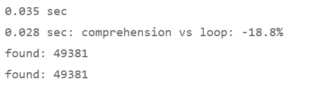

# 循环杀手:Python Zips 和示例理解

> 原文：<https://towardsdatascience.com/loop-killers-python-zips-and-comprehensions-by-example-a0fb75dbddf2?source=collection_archive---------9----------------------->

## 你的 Python 代码箭头派遣侏罗纪循环抵制

斯蒂芬·凯勒拍摄的图片，[幻想恐龙 Pixabay 上的免费照片](https://pixabay.com/photos/fantasy-dino-dinosaur-reptile-6611533/)

作者图片

示例教程:

*   列表、集合和字典理解，带有条件或类似过滤器的行为；
*   与理解相关的列表、字典和元组的压缩和解压缩；
*   随后是一些速度测量，将“旧式”循环的性能与理解进行比较。

# 0.理解的 Pythonic 式特征

如果你像我一样，从其他不提供类似对象的编程语言来到 Python，当你第一次面对列表理解时，你可能会感到困惑；当您理解了它们如何使您的代码更简洁、更快速时，我们感到非常惊讶。理解和循环一样，用于过滤列表或字典、提取项目和转换值。让我们浏览一系列循环和理解的例子。

# 1.拉链和理解:处理列表、元组和字典

## 1.1 拉链

## 1.1 .等长的拉链列表

假设我们必须处理从 Python 脚本中的不同方法接收到的一组非结构化的值。在我们的例子中，我们假设我们需要处理三个预测准确性指标的列表:RMSE、MAPE 和 R 平方。我们希望避免将这些变量分别传递给其他方法。相反，这三个指标应该一前一后地处理。因此，我们将把它们收集到一个列表或字典中，然后演示如何使用它们和对它们进行操作。

我们把数值组合成一个列表， *acc_values* 。

为了区分这些指标，我们在第二个列表中写下它们的名字， *acc_names* ，注意它要与第一个列表的排序顺序相匹配。

作者图片

第 23 行和第 27 行是可选的公式，它们生成相同的名称列表。

悄悄地，我们在第 27 行引入了一个没有使用关键字的列表操作。注意列表变量前面的星号*和后面的逗号。语法

*   *listname，=逗号分隔值的列表

生成一个列表。星号*实际上是一个解压缩操作符。但是当我们应用第 27 行的语法时，它也可以组合条目来创建一个列表。

接下来，我们通过*压缩*来合并这两个列表。语法:

*   mylist = list(zip(list1，list2，…))

作者图片

作者图片

Python 的 *zip* 函数将两个(或更多)列表的对应项配对到一个元组列表中，不需要多行循环。

## 1.1.b 解压缩元组列表

相反的情况呢？如果我们面对一个元组列表，我们能不能不用写循环就把它们压缩成单独的列表？是的，我们在列表变量前面加了一个星号或星号*来解包元组。语法:

*   var1，…，varN = zip(*mylist)

作者图片

作者图片

## 1.1.c 长度不等、有遗漏的压缩列表

如果我们处理条目数不同的多个列表，我们仍然可以通过应用 *list()* 构造函数将它们组合成一个元组列表，尽管长度不等。然而，zip 函数采用最短的*列表并省略较长列表的相应元素。*

语法:

*   mylist = list(zip(list1，…，listN))

作者图片

作者图片

## 1.1.d 长度不等的拉链列表，带填充

在大多数情况下，跳过较长列表中包含的“多余”项目不是首选行为。幸运的是， *itertools* 库提供了 *zip_longest* 函数。它将最长的*列表的所有项目插入到元组中，然后不将任何项目写入较短列表不能贡献值的那些元组项目中。这里，例如，前面的方法没有为第四个度量“MSE”提供值，因此 *zip_longest* 插入一个值 None 来完成最后一个元组。*

再次注意我们简洁的口头禅:在可能的情况下，我们希望用一行代码创建一个列表，就像下面第 8 行中的那样；因此，没有需要几行的循环。

语法:

*   mylist = list(zip_longest(list1，…，listN))

作者图片

作者图片

## 1.2a 压缩元组列表以创建字典

让我们把元组列表转换成字典，去掉许多括号。语法:

*   mydict = dict(mylist)

作者图片

作者图片

## 1.2b 压缩列表以创建字典

为了演示如何将 zip 函数应用于列表，我们绕道将原始的名称列表和值列表合并到一个元组列表中，然后再将其转换为字典。

现在我们跳过一个多余的步骤:我们再次通过使用 zip 函数来演示如何将两个原始列表直接转换为字典，而不需要绕道元组。第 3 行代表字典理解。

语法:

*   mydict = {key:val for key，val in zip(listK，listV)}

作者图片

作者图片

这本字典去掉了元组的许多括号。

但是，我们如何生成一个在报告中可读性更好的表格布局呢？

## 1.3 打开字典包装

在我们继续使用 zip 生成的字典之前——我们如何实现相反的操作并解包现有的字典，最好没有循环？

我们可以将字典值赋给代码行 3 左侧的逗号分隔变量。或者，分配由键和值组成的对，而不是值。

语法:

*   var1，…，varN = mydict.items()

作者图片

作者图片

*   var1，…，varN = mydict.values()

作者图片

作者图片

作者图片

作者图片

或者我们通过使用*将字典键和值解包到两个独立的*列表*中。按键()*和*。values()* 函数并用 *list()* 构造函数对其结果进行类型转换。语法:

*   listKeys = list(mydict.keys())
*   listValues = list(mydict.values())

作者图片

作者图片

或者，第三个变体，我们通过一前一后地使用 zip 和 list 函数，成对地将键和值解包到元组列表中。

元组列表的一种更简单的方法:

作者图片

作者图片

语法:

*   listTuples = list(mydict.items())

## 1.4 列表和词典理解的结构

理解的**一般结构**遵循以下模式:

*   一个 ***表达式*** 开头*；*在下面的例子中: *print* 函数取字典项的*键*和*值*并打印这一对；
*   接下来， 中的**’*for——引用理解将从字典中提取的项(键和值)(在列表理解中，*键*不适用)；我们将在下面进一步运行的速度测试将证明理解中的*for-in*结构比传统的 *for* 循环更快；***
*   随后是 ***字典*** 或 ***列表*** 本身，其中包含了*表达式*应该处理的所有键和/或值；
*   可选地，可以将一个 ***条件表达式(if — else)*** 附加到理解的语法上，以过滤字典或列表；我们将在下面看到一个例子。
*   **语法:[列表中项目的表达式]**
*   示例:my list =[numbers list 中 x 的 x * * 2]
*   如果 numberslist =[1，2，3]，那么 mylist = [1，4，9]
*   **语法:{ dictionary . items()或 list}中键、值的表达式**
*   示例:my dict = { v:v * * 2 for v in numbers list }
*   *表达式*对 iterable 中的值求平方，iterable 在本例中是一个数字列表，然后将输入参数(它将解释为键)与其平方值配对。
*   如果 numberslist =[1，2，3]，那么 mydict = {1:1，2:4，3:9}

## 1.5 示例:用于打印的理解

要查看实际的例子，让我们创建一些字典和列表理解，它们将漂亮地打印多个结果。我们希望获得一个表格形式的垂直布局的报表输出:

作者图片

作者图片

Python 通过函数 pprint()提供了漂亮的打印库。但是它没有返回我们喜欢的布局，如下所示:

作者图片

我们可以使用 for 循环来逐个打印字典条目。在这种情况下，上面显示的循环甚至非常简洁。但是下面进一步的速度测试将证明，无论我们是将循环用于打印还是其他方法，循环都要慢得多。当我们需要处理包含成百上千条目的列表或字典时，就会感觉到时间效率低下。

我们可以把字典转换成数据框架。一行程序是理解的简洁替代。

作者图片

尽管如果我们需要处理一个包含 10，000 个字符串作为值、索引号作为键的大得多的字典，转换成数据帧的速度比理解一个列表要慢 175 倍。

作为冗长的循环和较慢的数据帧转换的替代方法，让我们在字典上尝试一下列表理解。

我们在一个列表理解中包含了我们的三个预测准确性度量的字典，每当我使用它进行漂亮的打印时，我都称它为*打印理解*。 *print()* 函数代表任何理解开始时的*表达式*。

作者图片

作者图片

list comprehension 一个接一个地打印字典的内容。

唯一的缺陷是:三个*无*值的列表。它们来自哪里？这不是列表理解本身的 bug。更确切地说，print 函数被定义为返回 *None* ，并为它处理的每个键/值对执行此操作。我们将取消 *None* 值。

第一种方法:在打印理解下面插入另一行。

作者图片

作者图片

第二种方法:附加行也可以由一个 *pass* 语句组成。

作者图片

作者图片

第三种方法:将印刷理解赋给任何变量。

作者图片

作者图片

第四种方法:左边的下划线可以达到同样的目的。

作者图片

作者图片

最后，让我们完成打印理解练习，并漂亮地打印出命名指标及其数值的字典(v)。度量的名称充当键(k)。我们在 print 函数中用数字格式包含了值变量 v。

作者图片

作者图片

为了比较，我们来看看我在几个网站上看到的一个替代代码构造。为了打印字典，网站建议定义一个通过 for 循环运行的函数。它确实起了作用，但我不愿称之为 Pythonic 式的优雅。

到目前为止，我们对循环足够敏感，以至于它们在 Python 脚本中的出现会给我们一些停顿。在所有情况下，理解不能代替循环。但是这项任务——就像打印一本字典一样简单——应该只需要一行代码。定义一个函数来使用*print*()——本身就是一个函数——似乎是多余的。如果不是函数，那么函数体中的循环应该会引起我们的愤怒，促使我们去寻找需要更少代码行的可能的替代方法。

## 1.6 摘要:压缩成字典并打印

是时候总结一下我们已经采取的步骤，并省略我们已经讨论过的替代和中间解决方案，以展示 zip 函数和理解可以相互交互的各种方式。我们将把脚本压缩成四行代码。

我们希望处理一组预测准确性指标及其值，这些指标和值是前面的计算已经生成并传递给我们的脚本的。

*   我们将它们各自的值组合成一个列表， *acc_values* 。
*   为了正确标记这些值，我们为这些指标创建了一个名称列表， *acc_names* 。
*   在行 13 中，z *ipping* 生成一个元组列表，字典理解将该列表转换成字典，
*   我们通过列表理解将其打印在第 16 行。

作者图片

作者图片

理论上，我们可以将第 13 行和第 16 行合并成一行，这样就可以创建字典并立即打印出来。

但是可读性应该优先于减少代码行数。仅仅是两倍长的一行不能算作一个改进。字典的创建和它的打印代表了不同的目的，因此它们应该各占一行，如第 13 行和第 16 行。

# 2.表现:理解和循环的速度

第 1 章集中讨论了循环代码的长度，与大多数理解所需要的不太冗长的单行代码形成对比。一般来说，理解更简洁。

在这一章中，让我们测试一下更短的理解代码是否也能导致更快的执行。

为了生成循环和理解可以相互竞争的数据，我们创建了一个用随机数填充的列表。我们在第三行使用一个简短的列表理解。

满足我们目的的理解 *c* 由第 15 行的一小段代码组成，而循环像往常一样需要多行代码来处理列表中的所有元素。

作者图片

作者图片

## 2.1 对数值进行操作的列表理解

如上图所示准备好赛道后，我们想要寻找可测量的速度差异。因此，使用与上面相同的代码，我们创建了一个更长的 100，000 个随机数的列表，然后释放循环和对它的理解。

作者图片

作者图片

列表理解比循环快 21%。

请注意，无论何时重新运行代码，测量的时间都会不同。有效时间取决于您的计算机在任何给定时刻如何在等待队列中的任务之间分配处理器容量。但是结果可以预期证明理解比循环更快，很少有例外。

## 2.2 列表理解中的条件表达式

让我们给循环和理解添加另一层——在将表达式应用于列表项之前，让它们接受一个条件表达式的评估。

在我们的例子中，任何列表值都应该是大于 90 的平方。在将表达式应用于所选值之后，此构造通过仅将满足条件的值传递给结果列表来过滤源列表。

条件理解的句法:

*   my list =[如果则列表**中的项目的表达式(条件= =真)]**

条件还可以包含一个在两个不同表达式之间进行选择的 *else* 子句。在前面的例子中，在理解的开始有一个单一的表达，现在有两个可供选择的表达。但是对于理解从源列表中读取的每个值，只执行其中一个。我们可以再次在末尾附加一个条件，它具有过滤器的作用，就像前面的例子一样，这样就可以将条件#2 的评估限制在满足条件#1 的项目上。换句话说，条件#1 选择将传递给行首两个表达式的源数据；然后，条件#2 确定两个表达式中的哪一个(A 或 B)将转换选定的源值。

语法:

*   my list =[expression a**if**(condition 2 = = True)**else**用于列表中项目的表达式 if (condition1==True)]

示例:如果参数超过 90，则对其取平方；但是如果它小于或等于 90，则将其提高到三次幂；以列表“mylist”的形式返回所有取幂的结果，无论它们是平方的还是立方的；但是，根据行尾的条件，只有当源值是偶数时，才需要取幂运算和结果列表中省略奇数:

*   my list =[(x * * 2)if(x > 90)else(x * * 3)for x in list if(x % 2 = = 0)]

下面的示例演示了在末尾有一个类似筛选器的条件#1 的语法。理解只处理大于 90 的数字，并从平方结果中省略较小的自变量，因此将形成比 100，000 个大小随机数的源列表更短的列表。

作者图片

作者图片

理解在列表中的速度比循环快 45%。

我们测试了另一个变体:我们制定了一个循环和一个列表理解，它们都包含一个条件表达式:仅当一个值是偶数时求平方，并跳过奇数编号的参数

作者图片

作者图片

条件列表理解比循环快 18.8%。那已经接近低端了。有时，您会发现处理时间加快了 40–50 %,这取决于处理器对并发任务的工作负载优先级。

## 2.3 对字符串进行操作的列表理解

我们研究了数字变量的列表理解的性能。让我们看看循环和理解如何处理字符串列表，如姓名、单词或日期字符串。

为了快速获得我们希望用于搜索和过滤练习的一长串字符串，我们创建了一个包含 10，000 个工作日名称的日期范围，然后将元素从 datetime 转换为 string 类型。

我们通过对列表的理解来执行转换(当然，不是通过循环，只要我们能避免循环)。这个理解中的*表达式*元素由 *strftime* 函数组成。

作者图片

作者图片

## 2.4 对字符串进行操作的条件列表理解

接下来，我们制定一个条件表达式来筛选日期字符串列表。让我们搜索所有年份中 10 月份的周六和周日。循环和理解应该通过给日期加上后缀“= Oct weekend”来修改它们找到的日期字符串。

我们评估三个条件:一天的名称是“(S)unday”或“(星期六)urday”，一个月的名称以“Oc”开头。这些条件决定了一个值是否服从表达式(这里，通过添加后缀“= Oct weekend”)。 *else* 术语告诉理解将其他日期字符串包含在结果列表中，而不修改它们。

我们还可以使用一个附加条件来过滤表达式中的值。例如，只评估 2022 年的值。就像上面的随机数的例子一样，我们将把这样一个过滤条件(condition1)附加到列表理解的末尾。语法:

*   my list =[expression a**if**(condition 2 = = True)**else**用于列表中项目的表达式 if (condition1==True)]

作者图片

作者图片

使用与循环相同的条件表达式的列表理解速度提高了 21.9%。

## 2.5 集合理解

在演示了列表和字典理解如何优于循环之后，让我们看一个集合理解的例子。

我们想在前 N = 100，000 个整数中找出质数。

我们将使用厄拉多塞之筛的改进版本([厄拉多塞之筛——维基百科](https://en.wikipedia.org/wiki/Sieve_of_Eratosthenes))。首先，sieve 算法创建一组从 2 到 100，000 的所有整数(根据现代定义，1 不是质数)。然后，它遍历所有整数 I，直到 N 的平方根，并从 100，000 个数字的集合中丢弃那些等于或大于 I 的平方的数字 j。迄今为止，筛子不是查找素数的最快算法。但是撇开数学不谈，我们可以在循环和集合理解中应用筛子的逻辑来比较它们的处理速度。

传统风格会使用嵌套循环:'*代表 I '【T3]作为外循环，'*代表 j'* 作为内循环。让我们创建一个嵌套的理解作为它的挑战者。*

嵌套理解的语法:

*   myset = {{expression(itemA，itemB)for itemA in setA } for itemB in setB }

作者图片

作者图片

集合理解比循环快 57%。

## 2.6 理解是所有可重复项目的灵丹妙药吗？

那么…我们结束了吗？理解在任何情况下都被证明是不可战胜的吗？不完全是。

让我们再次过滤日期字符串列表，但是这次使用基于 lambda 函数的过滤器。

基于 lambda 的过滤器需要 0.0001 秒。列表理解，0.0033 秒，慢了 22 倍。

作者图片

我们将把列表理解和 lambda 过滤器之间的赛马作为另一篇文章的单独主题。

# 3.结论

今天的文章关注了传统循环与列表、集合和字典理解的比较；以及与理解相关的 zip、unzip 和 unpack 方法。

这些例子表明

*   理解和压缩函数如何在列表、元组和字典上相互作用；
*   如何简洁地编码它们的交互，通常用一行就可以表达，而循环会扩展到多行——每个例子都展示了在许多其他语言中通常需要循环的操作；
*   我们可以期待理解提供优于传统循环的速度。

Jupyter 笔记本可以在 GitHub 上下载:[GitHub—h3ik0th/loop killers:Python 的 zip 和 comprehensions against loops](https://github.com/h3ik0th/LoopKillers)