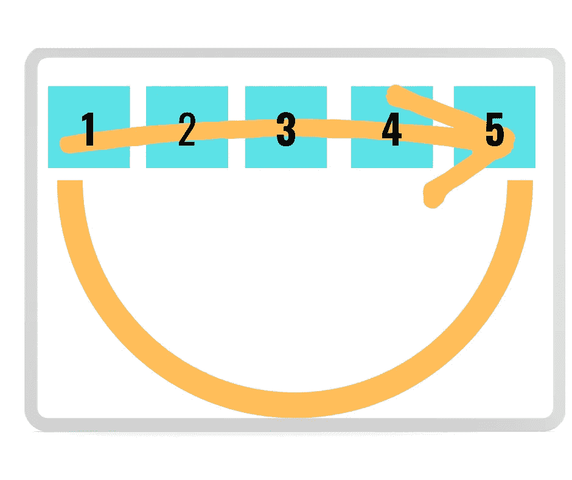

# Python 中的循环和语句:深入理解(附示例)

> 原文：<https://towardsdatascience.com/loops-and-statements-in-python-a-deep-understanding-with-examples-2099fc6e37d7?source=collection_archive---------25----------------------->

## 当它们看起来被理解时，还有更多


尼克·里克特在 [Unsplash](https://unsplash.com/s/photos/python?utm_source=unsplash&utm_medium=referral&utm_content=creditCopyText) 上的照片

当学习数据科学时，第一步是学习编程，而人们学习的第一个主题是循环和语句。
嗯，实际上我并不是编程天才(我正在向中级水平迈进:)，但是循环确实考验了我。它们看起来如此简单，如此容易理解…也许你可以说“好吧，这真的很明显！”。此外，这可能是由于 Python 本身，因为它是为了让人类容易理解而发明的。
因此，我想深入解释循环和语句，这样我们可以通过一些例子来了解它们背后有多少东西需要理解。

# Python 中的循环:“for”循环

首先，我要解释的是“for”循环。
我们举一个简单的例子来了解一下基本情况。假设我们有一个四个数字的列表，我称之为“数字”；它是这样定义的:

```
numbers = [2, 3, 5, 7]
```

我希望我的 Python 脚本打印出我的列表中的所有数字。为此，我可以使用一个简单的“for”循环，如下所示:

```
numbers = [2, 3, 5, 7]for number in numbers:
    print(number)
```

结果是:

```
2
3
5
7
```

让我们更深入地分析这几行代码。首先重要的是:在 for 循环中我们使用辅助变量。在这种情况下，辅助变量是“数字”；事实上，我已经定义了一个名为“数字”的列表，你看不到任何定义为“数字”的变量；所以在循环中直接使用“number”辅助变量，我在编写循环代码时定义了它。

现在，让我们来看一个例子，这个例子对于思考 for 循环是如何工作的很有用，因为对于上面的例子，人们可能认为已经理解了，但也许…不是！

让我们定义一个列表，并用它来打印一些东西。例如:

```
my_list = [1,2,3,4,5]for x in my_list:
    print ("cool")
```

这是结果:

```
cool
cool
cool
cool
cool
```

嗯……一个人应该马上问自己:“亲爱的朋友 Python，我只要求你打印一次“cool ”;请你告诉我，你到底为什么要印 5 次？?"

这是一个恰当的问题，表明您没有理解前面例子中的 for 循环，但是思考一下 for 循环并获得深入理解是一个有用的问题。

我想考虑像电流或液体在物体中循环这样的回路。在这种情况下，对象是一个列表，我们的朋友 Python(你甚至可以把它想成一条蛇:D)在列表中“循环”，并试图用你的代码做你要求的事情；在本例中，它找到了 5 个数字(列表由 5 个数字组成)，并为列表中的每个值打印“good ”:这就是 for 循环的工作方式。

下图可能有助于您直观地了解 for 循环的工作方式。



for 循环如何工作的可视化表示。图片由作者提供。

# python 中的语句:if-else 和 if-elif-else 语句

现在，让我们来看一下“如果”语句。“if”语句不完全是一个循环。这是一个陈述，通过它我们可以说一个条件必须为真；如果没有，我们可以说点别的(使用“else”语句)。让我们看一个 if-else 语句的简单例子。

```
x = 2if x > 0:
    print("x is greater than 0")
else:
    print("x is negative")
```

而且…猜猜怎么着？结果是:

```
x is greater than 0
```

同样，非常简单，你可以肯定已经理解了 if 语句。

让我们看看更难的东西。现在，我们要使用 if-elif-else 语句，其中代码测试条件“if”和“elif”(意为“else，if”)；如果这些都是假的，它测试其他的。

```
x = 1if x == 1:
    print(x)
elif x == 3:
    print(x)
else:
    print("error")
```

当然，这段代码的结果是:

```
1
```

这非常非常简单。我将 x 强制为 1，因此唯一的真值可以是“if”语句强制的值。而且，再一次，一个人可能认为已经理解了一切。但是真正的美是当你试图把它们放在一起的时候。

# python 中的循环和语句:嵌套在 for 循环中的 if-elif-else 语句

假设我们有另一个从 1 到 5 的数字列表，我们想遍历它，用 if-elif-else 语句给出一些条件。
为此，我们必须在 for 循环中嵌套 if-elif-else 语句。
什么意思？
意思是我们的“蟒蛇会流通”(还记得上图吗？:D)通过测试一些条件列表，这些条件是由 if-elif-else 语句定义的。并且当条件匹配时代码会打印一些东西(“if”或“elif”)；当 not ("else ")时，它打印其他内容。

例如:

```
my_list = [1,2,3,4,5]for x in my_list:
    if x == 1:
        print(x)
    elif x == 3:
        print(x)
    else:
        print("wrong numbers")
```

结果是:

```
1
wrong numbers
3
wrong numbers
wrong numbers
```

如果我们已经理解了 for 循环和 if-elif-else 语句是如何工作的，那么结果是显而易见的:我们的辅助变量(称为“x”)遍历我们的列表(称为“my_list”)并测试由 if-elif 语句强加的每个数字的给定值。

首先，x 在列表中找到值 1。它与“if”语句匹配，所以代码打印“1”
然后 x 找到 2；它与任何强加的值都不匹配(对于 if 语句为 1，对于 elif 语句为 3)，因此代码打印“else”条件，这是“错误的数字”。
然后去 3；它找到与 elif 语句匹配的内容，并输出 3。然后它通过 4 和 5，由于没有找到匹配，它打印出“错误的号码”，这是由 else 条件强加的。

正如我们所看到的:当 for 循环和语句似乎被理解时，还有更多更深层次的东西…我希望这篇文章能对对这些主题有疑问的学生有用！

*需要 Python 中的内容来开始或促进您的职业生涯？下面是我的一些文章，可以帮到你:*

**Python:**

*   [Python 循环:如何在 Python 中迭代的完整指南](/python-loops-a-complete-guide-on-how-to-iterate-in-python-b29e0d12211d)
*   [学习 5 个 Python 库，开启您的数据科学生涯](/5-python-libraries-to-learn-to-start-your-data-science-career-2cd24a223431)
*   [数据科学如何学习 Python](/how-to-study-python-for-data-science-888a1ad649ae)
*   [Bash to Python:设置和使用环境变量的终极指南](https://medium.com/codex/bash-to-python-the-ultimate-guide-to-setting-and-using-environment-variables-8535855e2ec4)

考虑成为会员:你可以免费支持我和其他像我一样的作家。点击 [***这里的***](https://federicotrotta.medium.com/membership)**成为会员。**