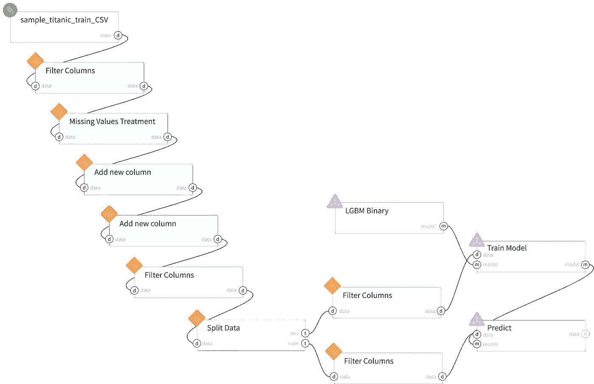
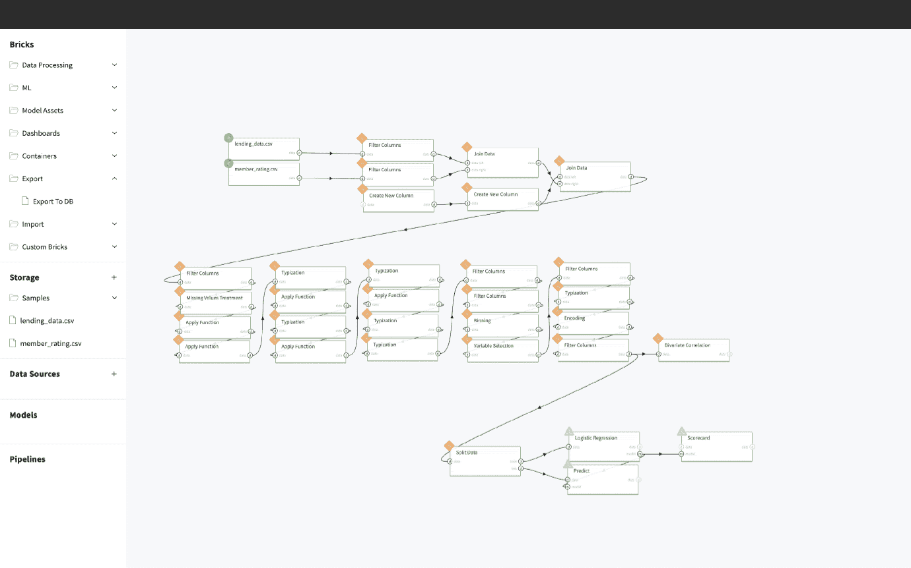

# 企业中的低代码 AI

> 原文：<https://towardsdatascience.com/low-code-ai-in-enterprise-benefits-and-use-cases-b9692ee13168?source=collection_archive---------28----------------------->

## 优势、使用案例、限制

软件和应用程序统治着当今世界，为了让你的企业取得成功，它必须跟上潮流。但是设计和推出一个新的解决方案需要时间和金钱。一家规模不大的初创企业或有各种需求的企业能否更快、更经济地获得解决方案？应对这一挑战的答案是低代码人工智能——人工智能的游戏规则改变者，它简化了常规的应用程序开发任务，并使软件开发更贴近用户。

通过低代码人工智能，即使非专业人士也可以立即创建应用程序，随时修改和更新它们，以提供卓越的客户体验。在这里，我们详细讨论了[低代码人工智能](https://datrics.ai/product)的主题，以阐明它如何工作，它带来了哪些利弊，以及企业和数据科学家如何挖掘它的潜力。我们还提供了一个现成的清单，用于选择一个理想地满足您需求的低代码人工智能解决方案。

## 什么是低代码 AI？

编程语言的复杂性不同，软件开发人员制作一个或多或少复杂的应用程序所需的准备工作也不同。但是，它们都有一个共同的特点——需要专业的准备，一个远离编程的外行很难做出可行的程序。人工智能是一个狭窄的高科技编程领域，需要更深入的编码和技术知识。因此，人工智能开发传统上一直与先进的技术技能、专业的软件工程教育以及数月昂贵而艰苦的劳动联系在一起。

低代码人工智能通过提供简单、直观和用户友好的解决方案，改变了人工智能产品开发的愿景。低代码人工智能开发平台的出现为创建人工智能解决方案提供了现成的构建模块，用户可以在 GUI 和配置的帮助下在几个小时内制作应用程序，而不是手写代码。听起来很神奇，对吧？让我们仔细看看这是如何工作的。

图片来自 freepik.com

## 低代码与无代码人工智能

顾名思义，低代码人工智能开发仍然需要用户输入一些最少的编程工作。反过来，无代码软件根本不需要编程，甚至允许没有编程经验的用户通过使用简单的构建模块来定制符合他们需求的人工智能应用程序。

## 它是如何工作的？

低代码 AI 可以由缺乏编码知识的人来创造。因此，即使没有经过专业培训的普通用户也可以通过可视化构建模块快速编译所需的低代码 AI 产品。大多数低代码 AI 平台的基础设施包括以下元素。

#1.图形用户界面(GUI)

一个非专业人士也能理解的直观图形用户界面，配有清晰的视觉元素，可以很容易地构建人工智能程序，而不会对输入和输出产生困惑。

#2.集成

为了让创建的程序处理您的业务数据，它必须访问您企业的数据库。低代码人工智能平台创建者通过 API 来处理这些问题，让新程序安全高效地与数据库通信。

#3.应用程序经理

用低代码人工智能平台创建一个应用程序并不是软件开发过程的结束。为了让应用程序正常工作，它需要正确地维护和更新。此外，您创建应用程序的平台通常会提供故障排除服务，以帮助您消除错误并改进应用程序的功能。

# 低代码人工智能平台的能力和局限性

低代码人工智能开发的变革潜力是无可争议的。此类解决方案可帮助企业缩短应用上市时间，大幅节省雇佣软件开发团队的成本，并提供现成软件解决方案的速度、简单性和灵活性。

*   低代码软件创建的**便利性**是连接非技术专家和人工智能产品的商业优势。
*   应用程序创建的**速度**最大限度地缩短了上市时间，最大限度地提高了业务收入。
*   低代码解决方案的**灵活性**允许通过从平台上的可用选项中进行选择来轻松定制应用。

然而，不管引入低代码人工智能开发听起来有多乐观，它仍然有一些限制。例如，这种开发类型仍然带有 *l* ***i* mited 定制机会**，您的应用程序中可以包含有限数量的构建模块。低代码 AI 产品的**灵活性**也受到平台**上可用功能数量有限的限制。迁移问题**仍然存在，尤其是如果你在低代码人工智能平台上开发一个应用，然后用不同的代码将其迁移到你现有的生态系统中。一些提供商不允许应用迁移，这意味着只要你的应用在使用中，你就被锁定在特定平台的使用中。

图片由 Ksenia Kirikova 从[https://datrics.ai/](https://datrics.ai/)站台拍摄

# 低代码 AI 如何让数据科学家受益？

低代码和无代码的人工智能产品使人们更容易获得数据科学，而不需要雇用全职的数据科学家。

然而，这些担忧并没有远离事实，因为低代码人工智能平台本身代表了数据科学家推进其职业发展的巨大潜力。通过投入时间来创建新的可定制的低代码和无代码人工智能解决方案，所有经验和资格水平的数据科学家都可以推动一个全新的行业利基向前发展。额外的服务，如通过高级订阅或数据科学培训进行更多定制，预计也将享受不断增长的需求。因此，低代码人工智能技术对这个行业来说更多的是机遇而不是挑战。

# 低代码 AI 对企业有什么优势？

正如你所看到的，企业可以从利用低代码人工智能解决方案中获得许多好处。好处来自于开发成本的大幅削减、软件上市时间的缩短、更好的数据分析、更好的用户体验等等。然而，低代码和无代码解决方案的批评者经常声称，这种产品严重受限于提供商平台的特性，因此提供了最少的真正定制。Datrics 通过提供灵活的以业务为中心的解决方案来解决这个问题。Datrics 平台的当前功能使其能够用于构建零售和信用评分业务的智能系统。此外，它通过使用大量的数据处理、分析和机器学习库来提供广泛的定制解决方案。因此，在 Datrics 的帮助下，企业可能确实实现了他们需要的定制化水平，以业务问题而不是系统的限制，代表着合作的基石。

这里有几个用例，可以更好地理解低代码人工智能开发在今天是如何应用的。

# 二尖瓣脱垂综合征

MVP 是以最少的时间和精力投入来可视化想法的实现，并查看它是否满足客户的期望。低代码 AI 开发平台也使 MVP 创建功能能够最大限度地减少开发到发布的周转时间，并帮助用户了解还需要哪些其他功能。

# 新技术

我们生活在增强现实(AR)和虚拟现实(VR)应用获得动力的时代。因此，挖掘这个新市场的潜力是商业成功的关键。您可以选择多经验开发平台来更经济高效地开发此类产品，而不是将所有资金投入到昂贵的硬件和软件中。这种平台的一些受欢迎的例子包括 [Firebase](https://firebase.google.com/) 和 [GeneXus](https://www.genexus.com/en/) ，帮助用户在创纪录的时间内创造创新产品。

# 工序自动化

技术应该为你的运营效率目标服务，这也是低代码 AI 开发所能给予的。考虑您企业的自动化需求，并设计一个简单而强大的人工智能应用程序来满足这些需求。例如， [Appian](https://www.appian.com/platform/) 是一个全球知名的低代码自动化平台。Datrics 还提供方便和负担得起的低代码人工智能开发服务，增强您的业务运营。使用 Datrics，没有深入编程技能的用户可以通过拖放的方式从块中创建数据处理管道，在几个小时内就可以开发出现成的 ML 应用程序。Datrics 解决方案已被证明在金融科技的信用风险和欺诈检测等用例中非常高效。因此，Datrics 模型的部署速度提高了 5 倍(平均一周),并且有 5 个现成的模板管道用于行业用例，因此该公司在低代码和无代码数据科学解决方案方面领先竞争对手一步。

图片由 https://datrics.ai/站台[的 Ksenia Kirikova 拍摄](https://datrics.ai/)

# 低代码人工智能实现的投资回报率

那么，AI 的实施在财务上可行吗？大多数专家认为是的，低代码人工智能产品能够在创纪录的时间内最大化你的努力的投资回报率。[麦肯锡](https://goneutrinos.com/low-code-bpm-to-speed-up-roi-for-your-enterprise/)估计商业运营中数据分析集成的未来商业潜力为每年 9.5-15.4 万亿美元，其中人工智能解决方案约占收入增长的 40%。

# 如何选择合适的解决方案？

一旦你决定继续使用人工智能解决方案，选择平台的时间就到了。选择范围很广，数百家提供商承诺提供优惠条款和积极的用户体验。以下是在做出最终选择之前要使用的清单:

*   定价计划(价格应该比雇佣内部技术专家低得多)
*   灵活性(创建和定制产品时可供选择的功能数量)
*   安全性(大多数平台在云中运行，因此应用程序和数据的安全性至关重要)
*   迁移策略(将创建的应用程序迁移到您的系统的可能性)
*   公民与开发者平台(根据谁将开发应用程序来选择平台)
*   维护(确保选择提供维护和定期更新的平台，以使应用程序的使用过程更加顺畅)
*   用户界面(虽然低代码平台对非技术用户来说非常友好，但它们仍然需要一些编码和定制，所以最好选择那些具有简单 GUI 的平台)
*   客户支持和培训(平台应提供足够的培训和故障排除资源，以及全天候支持，以便您在需要时获得帮助)

在加入一个低代码 AI 开发平台之前，这里是你需要知道和考虑的所有事情。享受触手可及的技术进步带来的好处，并通过技术创新将您的业务运营提升到一个全新的水平。让一个先进的人工智能产品服务于您的业务需求从来没有那么简单。