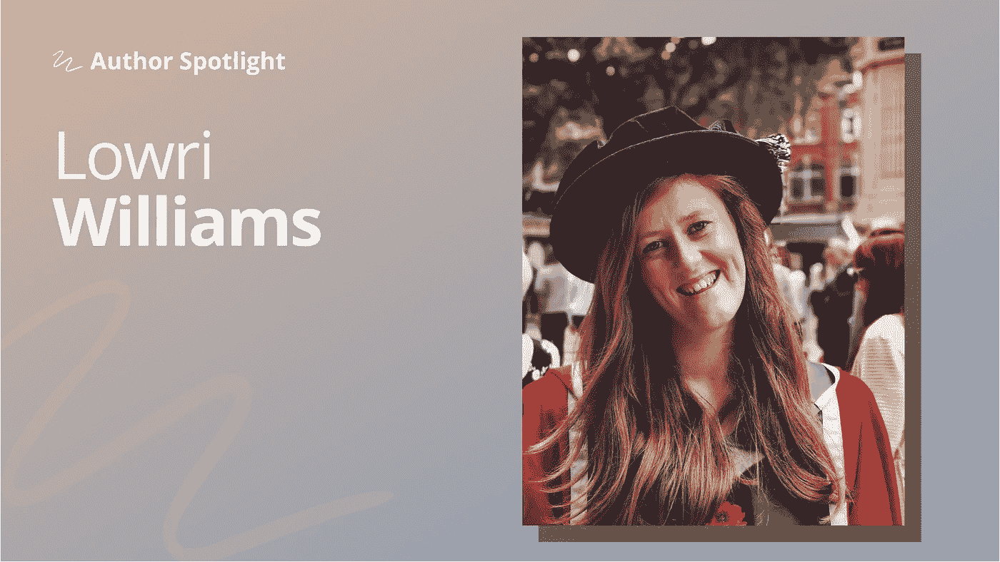

# 劳里·威廉姆斯讲述如何将你的学术训练与现实世界的挑战联系起来

> 原文：<https://towardsdatascience.com/lowri-williams-on-how-to-connect-your-academic-training-to-real-world-challenges-bc43ef3cdfed?source=collection_archive---------25----------------------->

## [作者聚焦](https://towardsdatascience.com/tagged/author-spotlights)

## *“我有发挥数据创造力的空间”*

*在 Author Spotlight 系列中，TDS 编辑与我们社区的成员谈论他们在数据科学领域的职业道路、他们的写作以及他们的灵感来源。今天，我们很高兴与劳里·威廉姆斯进行对话。*

照片由劳里·威廉姆斯提供

L [owri Williams](https://medium.com/u/e98db206e1b3?source=post_page-----bc43ef3cdfed--------------------------------) 是一名总部位于威尔士的研究数据科学家，他在学术研究领域积累了四年的经验，在基于行业的合作领域积累了两年的经验，以新颖的数据科学解决方案支持中小型企业。她曾与多学科专家合作，在几个著名的学术期刊上发表研究成果和发现，并转向媒体和*数据科学*，在教程风格的博客帖子中展示一些新颖的数据科学方法。

## 最初是什么激发了你学习数据科学？

我一直对数据很好奇。我记得当我 13 岁的时候，作为地理课程的一部分，我们必须就一个我们感兴趣的地理相关主题制作一个项目。我决定测量我童年家附近的一条河流的一些属性。

我找到一张地图，骑着自行车来到这条河的特定区域，测量水流的速度、宽度等。虽然听起来很无聊，但我很喜欢。我花了很多时间对数据进行假设、绘制和绘图，以展示我的结果。我自豪地交了报告，获得了全班最高分。我很自豪。快进到 17 年后，我是一名研究数据科学家。

## 你能分享更多关于你目前所处的道路吗？

我成为数据科学家的道路非常简单。我花了三年时间在英国威尔士卡迪夫大学攻读信息系统学士学位。该学位的核心是关于人类如何与技术和信息互动。它没有我希望的那么技术性，也没有我能做什么。我想要一些更有挑战性的东西，一些迫使我学习并为自己的成长负责的东西。于是……我申请了博士奖学金，最后拿到了！

我不得不承认，我真的没有准备好，或者说我不太清楚我将面临什么。我有一些粗略的想法，我想把我的研究重点放在什么上，但如何研究和正确地做对我来说是一个巨大的学习曲线。但是，有时候潜入未知不仅是了解一个主题的最好方法，也是了解你自己的最好方法。

我的研究兴趣围绕自然语言处理，尤其是情感分析。我猜这种兴趣与我的学士学位密切相关——理解人类如何与技术交流让我着迷，尤其是他们使用的语言。

一旦我获得博士学位，是时候投入令人生畏的求职大军了。

## 许多职业生涯早期的数据科学家都担心找不到第一份工作——你的经历是怎样的？

我发现很难把自己放在一个我觉得有趣或者我觉得我能胜任的角色中。我不仅仅是一个了解自然语言处理的人，我还不止于此。我了解机器学习、特征工程、分类、注释数据，如何生成强大的数据集以实现稳定的机器学习模型，如何解释和可视化这些结果。我知道如何清理和处理数据，而不仅仅是文本数据。我是一个编码者，一个实现者，一个开发者，一个问题解决者。

我以自己的方式做所有这些事情，将自己归类为软件开发人员、数据工程师、这个、那个，真的，嗯，很难！我花了几个小时试图定义我到底是谁，我今天是谁，那就是数据科学家。我认为这没什么——我们都有自己的时间表。我认识一些人，他们从获得学士学位的第一天起就知道自己人生的下一步是什么，并一直坚持下去。我也知道有些人每两三年就换一次角色，因为他们经常需要更多的刺激或更具挑战性的东西来帮助他们成长。两条路都可以，我想如果我能穿越回那个时代，我会告诉年轻时的自己。

## 那你最后去了哪里？

我目前是加的夫大学一个项目的研究数据科学家，该项目通过新颖的数据科学解决方案支持基于行业的中小型企业。而且我喜欢！我喜欢尝试不同的想法和方法来解决不同的问题——不要说这是一个数据或任何东西的游乐场，我已经制作了一些帮助改善业务的项目！但我有空间对数据进行创新——作为一名数据科学家，这是我学到的一项非常重要的技能。

## 你是在什么时候决定开始公开写作的，是什么驱使你做出这个决定的？

一开始转向 Medium 和作为写作平台的数据科学有点令人畏惧。作为一名学者，几乎可以预料到我们会发表科学文献，这些文献遵循一种相当粗糙的格式，“这是我们的假设，这是其他人已经做的，我们不认为这回答了我们的假设，因此这是我们的新方法，这是实验，这是结果，现在知道了这些，如果我们在繁重的工作之间有机会做的话，我们将来可能会做些什么……”

因为有机会在我目前的职位上发挥创造力，我觉得这不太适合学术界。这并不是说我解决问题的方法是错的，因为它们解决了问题。但是它们更少实验性，因为它们遵循更敏捷的方法，我们面对一个问题，解决它，然后根据其他解决方案的输出继续下一个。因此，从学术角度为一些原因辩护变得更具挑战性。

所以，我转向媒体来分享这些输出和我探索的一些方法。这也让我可以练习一种不同于我习惯的写作风格。我也不会说写博客更容易。清晰而连贯的写作有时很有挑战性！但我喜欢这种挑战，因为它开启了与其他贡献者的合作，我可以与他们分享想法和交流。

## 在接下来的几个月或几年中，您希望在数据科学领域看到什么样的变化？

我真的希望自然语言处理领域很快会有一个转变，因为几年来它一直是相对相似的。它来了。单词嵌入和 BERT 正在向我们展示深度学习模型如何产生一些非常酷的结果。我认为这是机器学习中的普遍情况。例如，有大量的机器学习方法被提出来帮助自动[根据新冠肺炎患者的咳嗽声](/coronavirus-using-machine-learning-to-triage-covid-19-patients-980e62489fd4)对他们进行分类，或者根据他们的胸部 x 光片自动对患者是否患有肺炎进行分类。因此，我期待着尝试类似的模型，看看我们如何利用它们来获得更大的好处。

如果你想了解更多关于 Lowri 的工作以及她利用自己的学术专长应对现实世界挑战的方式，这里是她最近几个月的 TDS 帖子精选。你可以在[洛瑞的简介](https://lowri-a-williams.medium.com/)上找到完整的档案，以及她网站上她的学术出版物[的链接。](https://lowriwilliams.co.uk/)

*   [**情感分析:习语及其重要性**](/️-sentiment-analysis-idioms-and-their-importance-2f547f2e646c) ( *TDS* ，2020 年 9 月)对 Lowri 的研究以及她如何将其转化为引人入胜、易于理解的帖子的介绍一样好，本文基于 Lowri 的博士研究。关注习语在情感分析中的作用和价值，这是更清晰地洞察人们使用日常语言方式的敲门砖。
*   [**Spotify 情绪分析**](/spotify-sentiment-analysis-8d48b0a492f2) ( *TDS，【2020 年 5 月)一部分是有趣的边项目，一部分是动手操作的教程，在这篇文章中，Lowri 转向了她自己的 Spotify 数据，试图从她的收听习惯中发现模式和见解。(剧透:事实证明，劳里最喜欢的音乐比她想象的更快乐！)*
*   [**WordNet:英语单词的词汇分类**](/️wordnet-a-lexical-taxonomy-of-english-words-4373b541cfff)**(*TDS*，2020 年 10 月)
    回到 NLP，这篇文章是对普林斯顿词汇数据库 [WordNet](https://wordnet.princeton.edu/) 的彻底解释。作为一篇 Lowri 文章，它不会停留在高级理论上——准备好卷起袖子，用一些有用的代码示例进行实验。**

**敬请期待我们的下一位特色作者，即将推出！(如果您对希望在此空间看到的人有任何建议，请给我们留言。)**