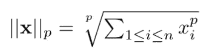
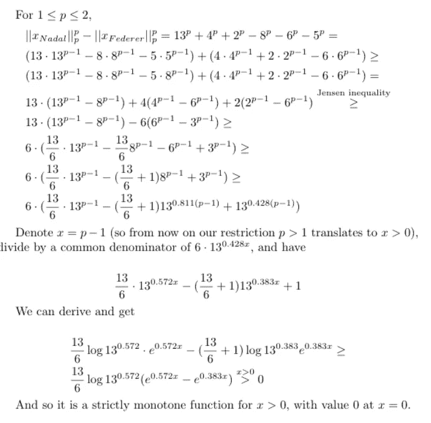
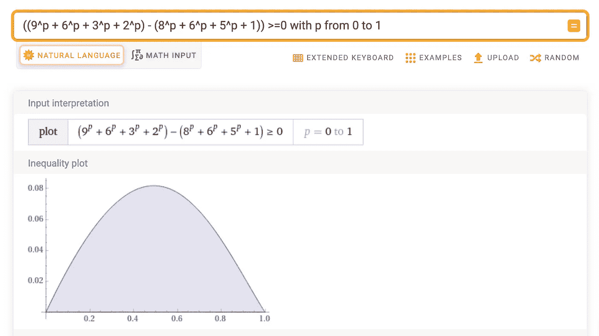
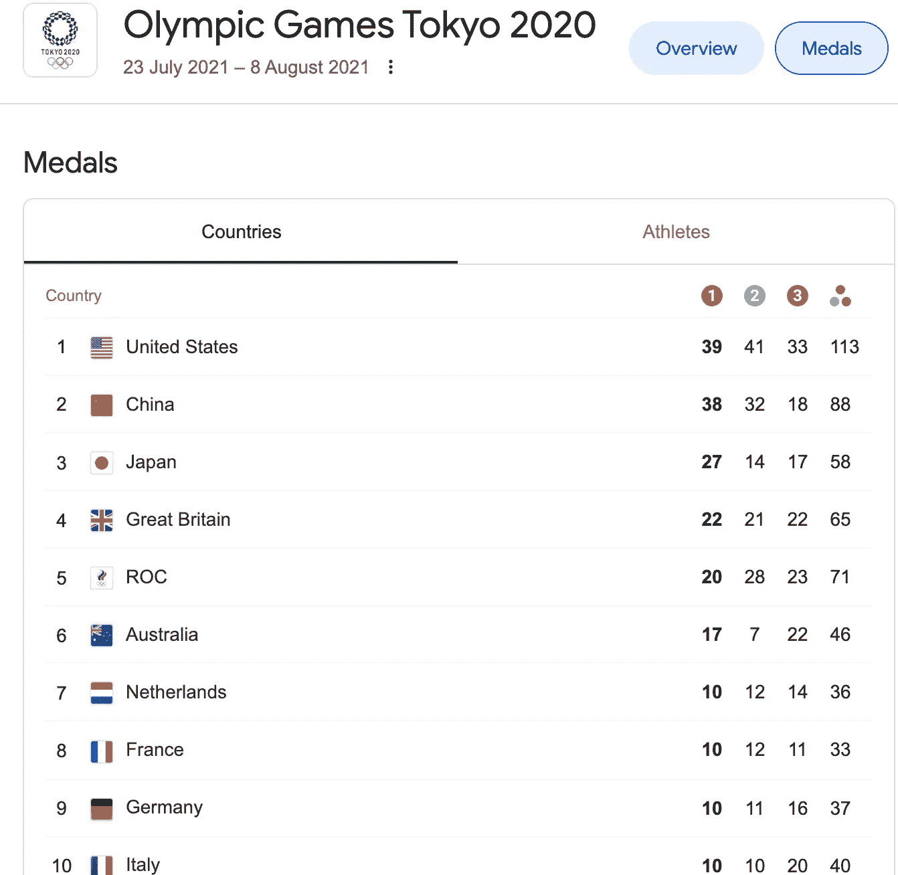

# Lp 规范、大满贯和奥运奖牌

> 原文：<https://towardsdatascience.com/lp-norms-grand-slams-and-olympic-medals-f005e002ae8e?source=collection_archive---------37----------------------->

## 聚合结果的多种风格及其讲述的故事

在考虑了迈克尔·乔丹是否是低方差之王之后，我想讨论另外两种体育情况，在这两种情况下，人们总是争论汇总结果的正确方法

所有“三巨头”网球运动员目前都有 20 个大满贯。那么谁才是最棒的呢？(先不说这在未来会如何变化……)

一个直观的想法是，这些数据不仅向我们展示了球员的总数，还显示了他们的“多才多艺”和“专业”程度。纳达尔的大部分大满贯都是在法网取得的。我们可以通过选择不同的聚合方案来惩罚(或奖励)这种情况。一种由 p 参数化的常用方法是 Lp 范数:

Lp 规范定义(图片由作者提供)

对于 p=1，这只是大满贯的总和(比如费德勒的大满贯向量是(6，1，8，5)，L1 范数是 20)。其他有趣的参数值有 0、1/2、2 和无穷大(其中无穷大表示 p->Inf 的 Lp 范数的极限)。对于 p=0，Lp 范数就是非零向量元素的个数。所有玩家都是 4 分。如果某个球员“错过”了一场大满贯比赛，他将落后于 L0 标准。对于 p =无穷大，Lp 范数是向量中的最大数。在这一点上，纳达尔赢了，因为他在法网赢了 13 场(德约科维奇在澳网赢了 9 场，排名第二)。对于 p=2，纳达尔再次获胜，德约科维奇的分数为 13.78 ~ 11.4，费德勒的分数为 11.22。但对于 p=1/2，德约科维奇以~17.19 的成绩获胜，费德勒以~17.03 第二，纳达尔以~16.04 最后。一般来说，低 p 值更多地奖励“良好平衡”的表现，而高 p 值奖励极端。我们实际上可以映射出 p 参数的不同区域，从而产生不同的顶级玩家。不仅如此，我们还可以证明:

**没有费德勒是顶级球员的 Lp 规范。**

事实上，对于每一个 p>1(“专门”制度),纳达尔都在上面，对于每一个 p <1 (the “versatile” regime), Djokovic is on top. Because the proof is involved, we show something more simple: That for p> 1，纳达尔总是领先于费德勒。

我对纳达尔>费德勒 p>1 的乳胶计算(图片由作者提供)

首先，请注意，由于 x^p 在 x 中对任何 p 都是单调的，所以用 p 的幂来比较范数就像比较范数本身一样。那么，除了算术，这里有两个重要的步骤:首先，由于 x^p 是 p>1 的凸函数，我们可以使用[詹森不等式](https://en.wikipedia.org/wiki/Jensen%27s_inequality)，特别是为了表明 4^p + 2^p ≥ 2*3^p.。更重要的是，我不知道一个通用的方法来解决复杂的指数不等式的形式

a * b^x + c*d^x — h*t^x ≥ 0

但是在这种情况下，我们发现了一个很好的技巧，就是将 c 和 t 近似为 b 的指数(为了保持不等式，我们用 b^(alpha 寻找 b 的某个指数α)< c, and exponent beta with b^(beta) >h)。幸运的是，a，c，h 系数给了我们足够的“回旋空间”,在推导之后，我们可以证明导数总是正的，因此函数是单调递增的，也总是正的。

为了说明对于 p <1 Djokovic is always on top of Federer, I have to admit I was more lazy, but the WolframAlpha graph is quite convincing:

A WolframAlpha screenshot for the Djokovic >费德勒对于 p <1 case (Image by author)

Sorry, Federer fans.

The Olympics were a tough time for score aggregators as well:

It was hard to determine if China should be first (has the most gold medals) or the US (most overall medals). Google went by [字典顺序](https://en.wikipedia.org/wiki/Lexicographic_order)，你优先考虑金牌最多的国家，然后如果与银牌最多的国家持平，最后是铜牌最多的国家。对我来说，奖牌总数也有意义。在[竞赛论](https://www.eco.uc3m.es/temp/lcorchon/SSRN-id2811686.pdf)中，一个共同的区别是，每一场竞赛都有努力/能力成分和运气成分。将所有的重要性分配给金牌(按字典顺序，一个有 1 枚金牌和 0 枚银牌的国家将排在一个有 0 枚金牌和 100 枚银牌的国家之上)假设这纯粹是努力的结果。但这其中肯定有一些运气成分:事实是，很多时候世界冠军或历届奥运会冠军都没有在奥运会上获胜。在游泳中，很多时候第一名和第二名的差距是 1/100 秒。因此，给排名较低的奖牌分配一些权重也是有道理的。对美国来说幸运的是，以下是 2020 年东京奥运会前 10 名国家的最终奖牌数:

2020 年东京奥运会谷歌奖牌统计最终结果(图片由作者提供)

由于美国在每块奖牌上都领先中国(这是“[帕累托优势](https://en.wikipedia.org/wiki/Pareto_efficiency#:~:text=A%20situation%20is%20called%20Pareto,scope%20for%20further%20Pareto%20improvement.)”)，任何加权评分规则都会选择我们为赢家。然而，对于争夺第三名的日本和英国来说，事情就不那么明朗了。实际上，我认为英国应该有优势。日本拥有金牌优势，英国拥有奖牌总数优势，但如果我们通过应用[博尔达法则](https://en.wikipedia.org/wiki/Borda_count#:~:text=The%20Borda%20count%20is%20a,number%20of%20candidates%20ranked%20lower.)打破僵局，即给每枚金牌 3 分，银牌 2 分，铜牌 1 分，我们将获得

UK = 3*22 + 2*21 + 22 = 130

日本= 3*27 + 2*14 + 17 = 126

对不起，日本人民。特别抱歉费德勒的日本粉丝。

