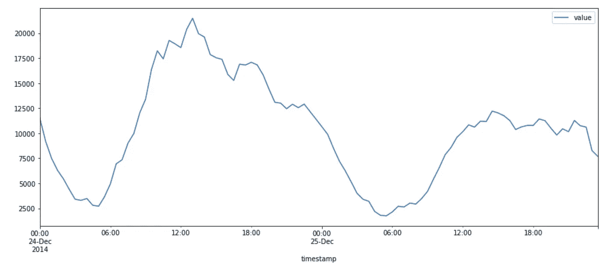

# 用于回归的 LSTM 和双向 LSTM

> 原文：<https://towardsdatascience.com/lstm-and-bidirectional-lstm-for-regression-4fddf910c655?source=collection_archive---------0----------------------->

## 学习如何使用长短期记忆网络解决回归问题

STM 代表长短期记忆，是 1997 年提出的一个模型[1]。LSTM 是一个门控递归神经网络，双向 LSTM 只是该模型的一个扩展。关键特征是这些网络可以存储信息，这些信息可用于未来的细胞处理。我们可以把 LSTM 想象成一个 RNN，有两个关键向量的内存池:

*   (1)短期状态:保持当前时间步的输出。
*   (2)长期状态:在通过网络时存储、读取和拒绝对长期有意义的项目。

读取、存储和写入的决定基于图 1 中的一些激活函数。这些激活函数的输出是(0，1)之间的值。


图 1:LSTM 单元的架构。所有图片由作者提供。

遗忘门和输出门决定是保留还是丢弃新信息。LSTM 模块的记忆和输出门的条件产生模型决策。然后，输出作为输入再次传递给网络，形成循环序列。

# 双向 LSTM

在双向 LSTM 中，我们引入了两个模型，而不是训练一个模型。第一个模型学习所提供的输入序列，第二个模型学习该序列的相反序列。

因为我们已经训练了两个模型，我们需要建立一个机制来结合两者。它通常被称为合并步骤。合并可以是以下功能之一:

*   总和
*   增加
*   求平均值
*   串联(默认)

# 使用 Keras 的回归预测:

LSTM 可以在许多问题上提供帮助，这些问题涉及多个领域。LSTM 模型可用于检测网络违规或意外的系统行为，或者信用卡交易中的欺诈行为。在这种背景下，LSTM 有一个目标:预测不符合预期模式的事件。为了展示 LSTM 和双向 LSTM 在真实示例中的应用，我们将解决一个回归问题，预测纽约市使用出租车的乘客数量。我们可以预测下周或下个月的乘客数量，并相应地管理出租车的可用性。

机器学习中用于回归的 LSTM 是一个典型的**时间序列**问题。与其他机器学习问题相比，时间序列的关键区别在于数据样本是按顺序出现的。序列显式或隐式地表示一个时间维度。隐式部分是输入序列的时间步长。

## 例如:纽约出租车乘客

此示例将使用 LSTM 和双向 LSTM 来预测未来事件，并预测可能脱颖而出的事件。本例中使用的数据集可以在 [Kaggle](https://www.kaggle.com/gauravduttakiit/new-york-taxi) 上找到。

**(1)探索数据集**


图 2:来自纽约出租车乘客的样本

我们使用 Pandas 加载数据集，得到如图 2 所示的数据帧。该数据集有 10320 个条目，代表 2014 年 7 月至 2015 年 1 月的乘客需求。图 3 显示了 2014 年后六个月的需求值。


图 3:数据集中出租车需求的实际模式

如图 3 所示，数据集有两个异常值，它们与常规模式不同。那些高于正常水平的峰值或需求的减少，暗示我们要深入审视时代的背景。例如，图 4 中节假日(12 月 24 日、25 日)的需求快照包含了与其他日期不可比的独特数据点。



图 4:一些选定假日的需求数据点

**(2)数据序列和特征工程**

查看数据集，我们可以很快注意到一些明显的模式。例如，有每日模式(工作日与周末)，每周模式(一周的开始与结束)，以及一些其他因素，如公共假日与工作日。我们考虑构建以下有助于我们制作模型的附加功能:

*   除了一个月中的某一天之外，还添加一周中的某一天
*   一周中同一天每小时的平均乘坐次数。
*   白天和晚上的乘坐次数。

```
# (1) Adding day of the week.
df['Weekday'] = df.timestamp.dt.weekday# (2) Adding the average of rides grouped by the weekday and hour
# 7 Days, 24 Hours = 168 values
df.avg_hour_day = df.avg_hour_day.replace(df[:7344].groupby(df.Weekday.astype(str) + ' ' + df.Hour.astype(str))['value'].mean().to_dict())# (3) Featuring the number of rides during the day and during the night.
# We define the day time to be any hours between 6 AM and 10 PM while Night time where usually there is less 
# demand is any time between 10:00 PM and 6:00 AM
df['day_time'] = ((df['Hour'] >= 6) & (df['Hour'] <= 22)).astype(int)
```

添加这些特性后，数据集的另一个外观如图 5 所示。


图 5:来自纽约出租车乘客的样本，带有额外的构造特征。

现在，我们可以看到白天和晚上的需求模式。


图 6:与夜间相比，乘客在白天出行的频率。

像大多数 ML 模型一样，LSTM 对输入规模非常敏感。我们需要重新调整数据集。我们将使用来自 Sklearn 的标准定标器。

**(3)了解未来**

我们将要建立的模型将需要接收一些关于过去的观察来预测未来。过去的观察将不会明确地指示时间戳，但是将接收到我们所称的数据点窗口。该窗口有 48 个数据点:每天 24 小时每小时两个记录，如图 7 所示。

```
X_train = create_sequence(X_train, 48)
X_test  = create_sequence(X_test, 48)
y_train = y_train[-X_train.shape[0]:]
y_test  = y_test[-X_test.shape[0]:]
```


图 7:训练测试时间序列数据集分割。

每个学习示例由过去的观察窗口组成，可以具有一个或多个特征。目标变量可以是单个目标或一系列目标。在本例中，模型学习预测单步值，如图 8 所示。输入结构必须采用以下格式[训练示例、时间步长、特征]。我们的设计具有三个特征，具有 48 个时间步长的窗口，使得输入结构为[9240，48，3]。


图 8:如何构建数据序列的演示。

使用 Keras 构建双向 LSTM 非常简单。Keras 提供了一个双向层来包装一个递归层。在我们的代码中，我们使用两个双向层包装作为参数提供的两个 LSTM 层。我们将展示如何构建一个 LSTM 和一个双向 LSTM:

```
model = Sequential()
model.add(LSTM(64,return_sequences=True, input_shape=(X_train.shape[1], X_train.shape[-1])))
model.add(Dropout(0.5))
model.add(LSTM(20,return_sequences=False))
model.add(Dropout(0.5))
model.add(Dense(1))
model.compile(loss='mse', optimizer='rmsprop')
```

return sequences 参数设置为 True 以获取所有隐藏状态。对于双向 LSTM，输出由前向和后向层生成。第一个双向层的输入大小为(48，3)，这意味着每个样本有 48 个时间步长，每个时间步长有三个特征。对应的代码如下:

```
# Building the model
model = Sequential()
# Adding a Bidirectional LSTM layer
model.add(Bidirectional(LSTM(64,return_sequences=True, dropout=0.5, input_shape=(X_train.shape[1], X_train.shape[-1]))))
model.add(Bidirectional(LSTM(20, dropout=0.5)))
model.add(Dense(1))
model.compile(loss='mse', optimizer='rmsprop')
```

**(4)结果**

一旦我们运行了 fit 函数，我们就可以在测试数据集上比较模型的性能。图 9 展示了获得的结果。这个模型实现了一个伟大的未来预测。尽管我们构建的模型被简化为专注于构建对 LSTM 和双向 LSTM 的理解，但它可以准确预测未来趋势。


图 9:比较预测目标值和实际目标值的线图。

# 摘要

在本文中，我们了解了什么是 LSTM 网络以及如何构建双向网络。请注意，我们提到 LSTM 是 RNN 的延伸，但请记住，这不是唯一的延伸。例如，注意力模型，序列到序列 RNN 是其他扩展的例子。

LSTM 有助于模式识别，尤其是在输入顺序是主要因素的情况下。我们已经在提供的示例中看到了如何使用 Keras [2]构建 LSTM 来解决回归问题。本文只演示了部分代码。你可以在 [my Github](https://github.com/malhamid/LSTM) 上找到完整的预处理步骤的完整代码示例。谢谢大家！

# 参考

[1]塞普·霍赫雷特，于尔根·施密德胡贝尔；长短期记忆。*神经计算* 1997 年；9 (8): 1735–1780.https://doi.org/10.1162/neco.1997.9.8.1735

[2]https://keras.io/api/layers/recurrent_layers/lstm/[上提供的 Keras LSTM 图层](https://keras.io/api/layers/recurrent_layers/lstm/)