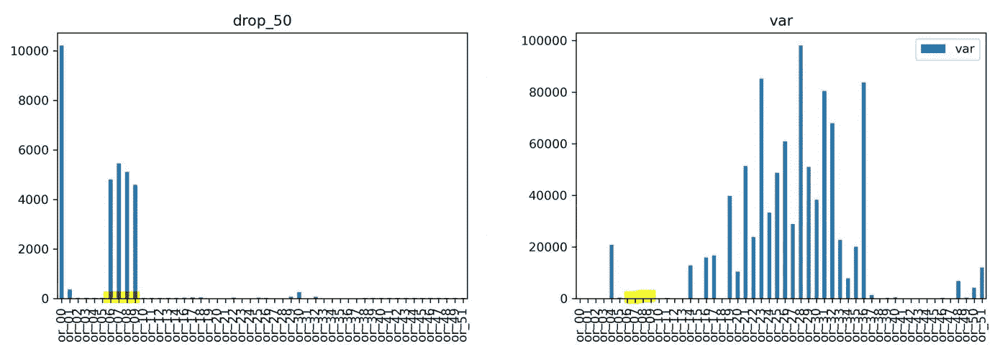

# 用于泵传感器数据预测性维护的 LSTM

> 原文：<https://towardsdatascience.com/lstm-for-predictive-maintenance-on-pump-sensor-data-b43486eb3210?source=collection_archive---------0----------------------->

## 在本文中，我们希望通过一些时间序列分析来解释预测性维护案例中的思维过程

坎凯奥·维莱辛在 [Unsplash](https://unsplash.com/?utm_source=unsplash&utm_medium=referral&utm_content=creditCopyText) 上拍摄的照片

# 内容列表

**前提
介绍
数据**
—整体第一眼
—目标数据(y)
**清理数据** —移除 nan
**进一步选项**
—异常值移除
—特征工程
—特征选择
**为 LSTM 准备数据** —创建时间序列
—将数据拆分为训练验证测试集
—标准化/规范化数据
—使用简单的 LSTM
对
**进行整形和一次性编码——**

# 先决条件

所有代码都可以在[这个 Git-repo](https://github.com/JanderHungrige/PumpSensor) 中找到
要重新创建这篇文章，你可以在这里找到[数据集](https://ga-data-cases.s3.eu-central-1.amazonaws.com/pump_sensor.zip)

我建议使用 [anaconda](https://www.anaconda.com/) 创建一个 Python 3.6 环境并安装 Python 包:

tensor flow(pip install tensor flow)
Pandas(pip install Pandas)
Numpy pip install Numpy)
Scikit-learn(pip install Scikit-learn)
Matplotlib(pip install Matplotlib)

# 介绍

在本文中，我们将探讨泵传感器数据的预测性维护。我们的方法对于时间序列分析来说是非常通用的，即使在你自己的项目中每一步看起来都有细微的不同。这个想法是给你一个关于一般思维过程的想法，以及你将如何解决这样一个问题。关于步骤的完整概述，请参见文章末尾的图(可能在阅读时并行打开)。它应该有助于按逻辑顺序组织所有步骤。如果你有一个类似的项目，并且只是在寻找一个演练，你可以在 Github 上查看[代码，并根据你的需要进行修改。](https://github.com/JanderHungrige/PumpSensor)

限制文章篇幅，当然很多点只是提一下，不深究。但是，我们指出细节上的相关文章。我们希望给出的信息能帮助你理解时间序列分析的一般方法。

# 数据

## 第一眼

> 我们首先检查数据的总体情况。我们面前是什么？我们有多少数据？数据是如何组织的？每一部分都是什么类型的数据？

因此，我们用 pandas 中的一行来读取数据，并通过简单的打印语句来获得一些概述。

按作者

从这些照片中，我们可以得出以下信息:

CSV 文件包含 55 列，每列超过 200K 个条目。

按作者

数据被分成 52 个*传感器*列、一个*机器状态*(目标/结果)列、一个*时间戳*列和一个*未命名*列，后者只是原始索引列。

按作者

从时间戳中，我们可以看到数据是以 1 分钟为单位记录的。快速浏览一下，我们会发现传感器数据是 float32 格式，具有不同的幅度，时间戳是 yyyy-MM-dd HH:mm:ss 格式。

按作者

## 目标数据(y)

> 下面，在第一眼之后，对我来说第二重要的事情就是看一眼目标数据(y 数据/结果)。这将为解决方案策略提供一些指示。

现在，在第一次浏览数据后，我们必须检查提供了什么结果(称为目标),我们稍后可以使用这些结果来确定/定义我们的预测性维护目标/路径。在键入代码以提取目标数据时，我会问自己一些问题

*   *我们是否有目标信息，或者这将是一项无人监管的任务？*
*   *目标数据是连续数据还是布尔值？*
*   *目标是什么数据类型？值，文本，…*
*   *目标以什么间隔记录？每个传感器条目都有一个条目，还是被分组？*
*   *是每个传感器都有自己的目标(一台机器—一个传感器)，还是所有传感器都有一个目标(一台机器—多个传感器)？*
*   *目标是描述性的，还是我们必须确定哪些是不符合标准的，哪些是正常的？*
*   *目标信息是否完整有用？*
*   …

为了得到一些答案，我们将得到唯一的类，看看每个类有多少个值。发现标签是 char 格式(文本),我们知道，我们必须在某个时候将它们转换成整数值，以便我们以后的 Ml 算法使用。要将它们转换成相应的整数值，可以使用 scikit-learn 中的 mapper 函数。如果您有映射的目标，我们应该绘制它，以了解何时发生了什么。

获取目标数据的信息[来自作者]

因此，我们看到，数据集中有三个类。如前所述，它们是文本形式的，已经给了我们一个很好的提示。在其他情况下，您可能只会收到一个状态[A、B、C]或类似的状态。

可用的类[来自作者]

在对每个类中的值进行计数后，我们看到大多数类为" *Normal* "，这是意料之中的，因为机器应该在大多数时间正常运行。*恢复*、*破碎*班为少数民族班。我们直接看到，我们最有可能无法使用中断的类，因为七个值不足以学习任何模式。

每个类的值的数量[按作者]

我们还看到，通过对这些值进行合计，我们得到了与现有行相同的数量。这意味着目标数据中没有缺失值(NaN)(当然也可以用 *isna()* 函数来检查)。

目标的曲线向我们显示，故障部分并不在例如末端处聚集，而是分散在整个数据长度上。这对于以后分割成训练集和测试集是很有趣的。我们还看到，*恢复*类总是跟随*损坏*类。这意味着只有 7 个条目的*损坏的*类不成问题，因为我们只需预测恢复阶段就能得到*损坏的*类。

目标数据[按作者]

为了回答一些早期的想法:我们有良好和完整的目标数据。每一行都有一个条目，这就形成了一个单机:多传感器的监督学习任务。

## 清理数据

> 既然我们理解了数据，我们将不得不寻找传感器数据的质量，并且最有可能操纵/修复/增加数据以用于以后的训练。

## 移除 NaNs

数据清理的第一步是检查 NaN 值。因此，在某些情况下，传感器不会发送任何数据。不要与零值混淆，零值实际上可能意味着值为零(数据集中的大量零使其成为稀疏数据集)。这些问题是

*   *有多少数据是 NaN 的？*
*   *是只有少数传感器，还是大部分都有 nan？*
*   *是否有些传感器的 nan 比其他传感器多得多？*
*   NaNs 是聚集在一起还是分散开来？
*   我们可以填充 nan 还是必须删除它们？

所以我们首先检查、打印和绘制它们。我们马上注意到， *Sensor_15* 完全是空的，因此我们将他移除以更好地缩放数据。

显示 NaNs，传感器掉落 _ 15[作者]

我们现在可以简单地从数据中删除所有的 nan，但是，我们会丢失大约 77000 个时间步长，大约是 35%。因此，我们尝试逐个传感器地移除尽可能多的 NaNs 传感器。

如果我们看看 NaNs 的第二大持有者，我们会看到传感器 50 和 51。我们可以看到几样东西。首先，传感器 50 只是在某个点失效。因此我们将移除传感器 50。这里的另一个选项是从时间步长~140000 年起删除所有传感器的所有数据…所以这不是一个真正的选项(在其他情况下，这可能是唯一的选项)。

比较 sensor_50 和 sensor _ 51[作者]

第二，两个传感器具有非常相似的振幅和值范围。更有甚者，黄色标注的部分其实非常相似。我们在其他传感器(见下文)中看到，几乎所有传感器都出现了 140000 点的下降。传感器 51 似乎也在其数据间隙后立即显示这种下降。因此，我们决定用 50 来修复 51。不是最干净的方式，但绝对有可能。

删除 sensor_50 后，我们看到 sensor_00 和 06–09 之间的传感器显示大多数 nan。现在是检查方差的好时机，方差显示了信号从其自身的平均值得到了多少。意思是，这个信号以任何方式移动吗？如果我们想检测一个趋势或类的变化，如果信号显示方差是好的。

传感器和传感器数据的差异[作者]

正如我们在标记部分看到的，传感器 00、06–09 没有显示出很大的差异。因此，我们允许我们删除这些，因为我们认为它们不会增加足够多的有价值的信息，与我们丢失的总信号数量相比。

跌落后，剩余的传感器确实显示一些 nan。现在我们尝试通过将限制设置为 30 的 *fillna()* 函数来填充它们。也就是说，最多填充 30 个连续的 NaN 值。这导致两个传感器剩下大约 200 纳。最后，我们只是删除那些，因为它只代表 0.09%。

*旁注:* [*这里有一个不错的 Stackoverflow 讨论*](https://stackoverflow.com/questions/41190852/most-efficient-way-to-forward-fill-nan-values-in-numpy-array) *关于如何最有效地填充 NaNs。*

填充连续的 NaNs 按作者]

移除 NaNs[来自作者]

# 更多选项

> 你总是可以做更多的准备。为了进行概念验证，我建议继续使用 NaN 免费数据，并在建立基线模型性能后再回来进行进一步的数据预处理。

现在，被机器学习使用的第一步完成了。最基本的是，这些数据可以被读取并用于训练机器学习网络。然而，对于一个良好运行的解决方案来说，有更多的选项可以优化，包括所需的数据拆分和后期的缩放。

进一步优化的最常见步骤是:

*   异常值去除/噪声降低
*   特征工程
*   特征选择

在简短地探讨了这个话题之后，我们将继续讨论实际状态下的信号。第一个目标应该是获得一个运行中的概念证明 (POC)。优化应该随后进行，继续信号清理、特征创建等。一切正常。

## 异常值去除/噪声降低

离群点去除意味着识别和去除对模式识别没有贡献或者甚至扰乱算法的信号部分。这可以通过不同的已经建立的算法来完成。在下面的文章中可以找到一个很好的概述:

</ways-to-detect-and-remove-the-outliers-404d16608dba>  

需要记住的一点是，除了降噪之外，异常值的去除是信号的这些部分实际上可能是有价值的信息。因此，盲目地忽略它们并自动移除异常值和噪声可能不会破坏您的算法，但可能会降低其性能。这尤其适用于降噪。匆忙执行降噪会威胁到您的分析。

提高信噪比的一般方法是移动平均或卡尔曼滤波策略。

## 特征工程

在我们的例子中，我们可以直接使用信号传感器信号作为特征输入。然而，如果您的问题更复杂，信号不稳定、有噪声且高度不稳定，那么您需要利用您对该问题的了解。这种知识，或通常良好的工程特征，通常会导致更好的模型性能。不同的表述，好的特征减少了完美模型的必要性。

这个话题是另一篇文章的内容，因此我们不会深入讨论，但会给你一篇由*杰森·布朗利写的很棒的文章:*

<https://machinelearningmastery.com/discover-feature-engineering-how-to-engineer-features-and-how-to-get-good-at-it/>  

## 特征选择

此外，这个主题本身需要一篇文章，我们将简要解释关于我们的数据集的几点，并指出更多由*杰森·布朗利*撰写的文献供您深入研究。

<https://machinelearningmastery.com/feature-selection-with-optimization/>  

特征选择已经完成，因为冗余数据、坏数据或无信息数据会阻碍而不是提高你的机器学习性能。我们总是认为，数据越多越好，但更准确地说应该是:*好特性的数据越多越好。* 通过特征选择，我们帮助算法预先整理出哪个特征会加入来解决问题。

***一个经验法则是*** *，像 K-NN 这样越简单的算法越能从特征选择中受益，否则它将很难从冗余特征中分离出有意义的特征(淹没在特征中)。更复杂的算法，如随机森林和人工神经网络，能够找到自己的最佳特征。这里，我们“只是”通过先前的特征选择来减少计算量。*

只是提一下，正则化在某些情况下可以代替特征选择。关于 L1 正则化和特征选择的有趣讨论可以在[这里](https://stats.stackexchange.com/questions/149446/do-we-still-need-to-do-feature-selection-while-using-regularization-algorithms)找到。好的描述可以看[这里](https://jermwatt.github.io/machine_learning_refined/notes/9_Feature_engineer_select/9_7_Regularization.html)。

当查看我们所有的传感器时，我们可以看到有几组传感器看起来非常相似(在下图中按颜色分组)。这意味着通过相关方法或主成分分析(PCA)减少输入传感器将会很好地工作。

分组传感器信号[按作者]

# 训练模型

由于数据是基数准备的，我们现在可以选择一种算法类型来解决预测问题。根据数据量、问题的复杂性、最终运行的硬件以及其他考虑因素，您可以在不同的算法之间进行选择。

由于我们没有进行特征选择，我们应该使用随机森林分类器/预测器或一种人工神经网络，因为两者都作为集成的特征选择器工作。

我们选择了一个 LSTM 来测试它在嵌入式硬件上的支持。

# 为 LSTM 准备数据

> 选择预测方法后，必须再次准备数据以适合特定的方法。经典的 ML 和 ann 数据准备基本相似，但在小细节上有所不同(如输入维度)。

## 创建时间序列

当前形式的数据可用于训练实际类的分类器。但是，我们希望根据实际值来预测未来的类。因此，我们需要根据目标来移动数据，以创建一个时间间隔。在此再次感谢*杰森·布朗利*关于这个话题的[精彩文章。](https://machinelearningmastery.com/convert-time-series-supervised-learning-problem-python/)

移位 x[作者]

下面的代码逐块显示:

*   **n_in** :预测多少时间步。 **n_out** :用 n_in 预测多少个目标。 **n_out > 1** 表示预测一系列目标值。两者都可以用来展望未来。我们这里只用 n_out=1。
*   **第 6–7 行**，根据 n_in 量产生移位输入。因此，如果例如 n_in=3，那么对于剩余的 46 个传感器中的每一个，在数据帧中创建 3 个移位信号和相应的名称。
*   **第 10–15 行**，向前移动创建一个目标序列。
*   **第 17–18 行**，将所有内容组合在一个数据帧中
*   **第 20–22 行**，删除轮班产生的 nan

为时间序列预测创建移位信号[作者]

该函数返回一个包含原始值和移位值的数据帧(如下图所示)。

带有 x(t)和 x(t-1)的数据帧[作者]

我们现在必须删除我们不想要的价值观。在我们的情况下会是这样吗

*   x(t)处的传感器
*   在 x(t-n)处的传感器，其中 n 几乎都是期望的偏移值，
*   以及在 x(t-n # a3)处的传感器 _44(目标)。

因此，我们将剩下所需的移位数据和未移位的目标。我们现在必须删除我们不想要的价值观。

*   **第 1 行，**设定展望未来的步骤
*   **第 2 行**，首先调用 *series_to_supervise()* 创建移位数据。
*   **第 3 行**，获取所有未换班人员的姓名
*   **第 4 行**，获取除了我们要用于预测的时间步长距离之外的所有移位值的名称(*未来*值)。*这个其实没必要。保留所有移位的值可能会提高性能。在您自己的项目中测试差异。*
*   **第 6–8 行**，取出目标数据并删除收集到的名称。

删除不需要的数据[按作者]

现在我们有移位的 X 数据和未移位的 Y 数据。

## 将数据分成训练验证测试集

下一步是将数据分成训练验证和测试集。通常，这是通过`[*sklearn.model_selection.train_test_split()*](https://scikit-learn.org/stable/modules/generated/sklearn.model_selection.train_test_split.html)`或`[sklearn.model_selection.StratifiedKFold](https://scikit-learn.org/stable/modules/generated/sklearn.model_selection.StratifiedKFold.html)*()*` 功能完成的。然而，为了我们的概念验证，我们手动分割以获得更多的控制。我们选择:

手动分隔数据[按作者]

拆分数据[按作者]

现在我们已经准备好了布景。同样，对于正确的 k 倍分析，这不应该手动完成，而应该使用`[sklearn.model_selection.KFold()](https://scikit-learn.org/stable/modules/generated/sklearn.model_selection.KFold.html)` 或`[sklearn.model_selection.StratifiedKFold](https://scikit-learn.org/stable/modules/generated/sklearn.model_selection.StratifiedKFold.html)*()*`函数(分层意味着每个选择中所有类别的数量相等)。

## 标准化/规范化

下一步是标准化数据。如果不同的输入特征(这里是传感器)具有不同的幅度范围，则数据的标准化是必要的。否则，在使用机器学习方法时，值会被歪曲。机器学习方法主要使用函数内的乘法。一个大值的乘法导致更大的值，这将被误解为“重要性”。在例如[0，1]之间缩放所有值是中性比较的基础。

缩放数据[来自作者]

## 整形和一次热编码

在最后两个步骤中，我们必须按照 LSTM(我们将选择它)期望的输入形式[样本、时间步长、要素]对数据进行整形。

并且，当我们寻找分类时，我们必须在训练之前对我们的目标进行一次热编码，以便 softmax 激活正确地解释分类，而不会将分类顺序(0，1，2)误解为等级或重要性。这很容易用`sk[learn.preprocessing.OneHotEncode()](https://scikit-learn.org/stable/modules/generated/sklearn.model_selection.KFold.html)`函数来完成。

两者结合在一个功能中:

现在我们已经准备好在不同的类上训练一个算法。我们会选择 LSTM。

# 使用简单的 LSTM

## 层和单元的问题

所以我们首先为自己建立一个简单的 LSTM 模型。深度神经网络，主要有两个问题:**每层有多少个隐藏单元**(神经元，滤波器，…)**和多少层**。关于模型应该有多深的问题，经验法则是:

> 如果您构建了自己的模型(非预训练)，从一层或两层开始，在比较性能的同时逐渐添加更多层。

总的来说，对于 LSTMs，你可能会问更多的层是否意味着更多的长期记忆。这里有一篇来自*杰森·布朗利*T3 的关于这个话题的有趣的[文章。总的来说，似乎更多的 LSTM 层提供了不同的时间缩放，因此具有更好的时间分辨率/更好的性能。这相当于 CNN 有更多层时分辨率更高。**注意:更多的层意味着更多的复杂性，通常会导致过度拟合。**
另一方面，隐单元(神经元、滤波器、…)的数量在 CNN 内部是不同的。CNN 的经验法则是增加每层的数字，因为需要分析更详细的信息。在 LSTMs 中，就分析时间序列而言，存储单元的数量不如层数重要。这里的经验法则是**比输入特征**更少的隐藏单元(存储单元)。开始时很小，例如 2，然后慢慢增加。所以尝试不同的价值观，但不要太强调它们。这里我们选择 42；-).](https://machinelearningmastery.com/stacked-long-short-term-memory-networks/)

## 简单的模型

我们尝试用于概念验证的模型如下所示:

模型[作者]

两个 LSTM 层，每个层有 42 个隐藏单元和两个输出层。您可以在这里使用一个简单的单输出序列模型。我们有两个 as，我们想展示不同的使用情形。signal_out 是一个密集层，其中一个单元为我们提供预测信号，而 class_out 是一个密集层，其中 3 个单元和 softmax 激活为我们提供预测类别*、【正常】、*恢复*和*损坏*。*

模型[作者]

signal_out 在这里似乎没有太大的意义，但是我们想展示如何使用这种方法来增加预测(参见结果)并预测信号而不是类。

现在让我们训练模型:

火车模型[作者]

# 结果

训练指标看起来很有希望。验证(此处标记为*测试*)损失和准确性看起来不错。

准确性和损失[按作者]

但是我们看到了一件事。尽管预测的信号，如下所示，并不完美，但验证准确率显示为 99%。这是为什么不对不平衡数据集使用精度的一个很好的例子。仅仅通过将所有事物归类为多数类，我们就已经达到了很高的准确度。因此，最好对不平衡数据集实施 Kappa 统计、ROC、F1、Anova 等测量。为了做到科学上的滴水不漏，要使用不止一种测量方法，并进行 k 倍交叉验证。

现在运行推论。

运行推论[按作者]

最后，让我们绘制目标和预测目标的相互关系图:

预测目标与原始目标[作者]

您可以看到，故障情节没有被直接分类(由于只有 7 个样本要处理)，但是，恢复阶段被很好地检测到，在这种情况下，提前 10 分钟。作为一个工程问题，这就足够了，因为我们积极地检测故障事件的开始和结束，并有时间作出反应(关闭、转移到另一个泵、降低速度等)。如果你需要提前更多的时间，从 *series_to_supervised()* 函数中增加 *n_in* 变量。然而，移位后的数据帧变得非常大，我的笔记本电脑再也无法处理它了。是时候搬到 Azure 了。

如果我们将预测类(模型的 signal_out 输出)绘制为连续信号而不是最大类，我们可以看到，如果我们为例如输出设置简单的阈值或者我们对计算的方差设置阈值，这可能会导致更稳定的分类。

作为连续信号的预测目标与作为二进制信号的原始目标[作者]

一般来说，用这种输出方法，可以预测一个信号。这意味着，您可以使用一些传感器数据来预测另一个传感器即将到来的数据。对于这种方法，您唯一需要更改的是使用您想要预测的信号作为目标，而不是类(例如，Sensor_42 的数据现在是目标)。

# 更多选项

如果你的项目结果不令人满意，下面的选项是可用的(可能我错过了很多):

*   玩弄超参数
*   添加更多层
*   使用上述信号处理/清洁步骤
*   使用轻量级的“经典”机器学习
*   使用新型变压器模型
*   合成更多的少数民族国家与甘，SMOTE，ADASYN，…
*   重量少数级惩罚
*   …

# 步骤总结

这是相当长的，也许令人困惑。因此，我们再次总结我们对每一章的所有想法。这会让你很容易地重建思路。
请重用这张图片，但别忘了引用它。

思路[作者]