# 单变量时间序列预测的 LSTM 框架

> 原文：<https://towardsdatascience.com/lstm-framework-for-univariate-time-series-prediction-d9e7252699e?source=collection_archive---------0----------------------->

## 完整的代码模板和演练

**鸣谢:** [**马克·乔多因**](https://unsplash.com/@marcojodoin)

LSTM 方法虽然是在 90 年代后期引入的，但直到最近才成为一种可行的、强有力的预测技术。像 ARIMA 和 HWES 这样的经典预测方法仍然很受欢迎和强大，但它们缺乏像 LSTM 这样的基于记忆的模型所提供的整体概括能力。

本文的主要目标是引导您构建一个工作的 LSTM 模型。然而，虽然本文的目标不一定是比较新的和经典的建模技术，但我将在结论中讨论经典的和基于 RNN 的技术的一些优点和缺点。

下面提供了完整代码。假设您已经导入了数据集和必要的类，那么结果应该是完全可再现的。

# 什么是 LSTMs？

LSTM(长短期记忆)是一种基于递归神经网络(RNN)的架构，广泛用于自然语言处理和时间序列预测。Brandon Rohrer 的视频提供了一个很好的、直观的介绍。

LSTM 纠正了递归神经网络的一个大问题:短期记忆。使用一系列“门”，每个门都有自己的 RNN，LSTM 根据概率模型设法保留、忘记或忽略数据点。

LSTMs 也有助于解决爆炸和消失梯度问题。简单地说，这些问题是神经网络训练时反复调整权重的结果。随着历元的重复，梯度变得更大或更小，并且随着每次调整，网络的梯度更容易在两个方向上复合。这种混合要么使梯度过大，要么过小。虽然爆炸和消失的梯度是使用传统 RNN 的巨大缺点，LSTM 建筑严重缓解这些问题。

做出预测后，它会反馈到模型中，以预测序列中的下一个值。每次预测都会给模型带来一些误差。为了避免爆发梯度，在门进入和输出之前，通过(通常)sigmoid & tanh 激活函数“挤压”值。下面是 LSTM 建筑的示意图:

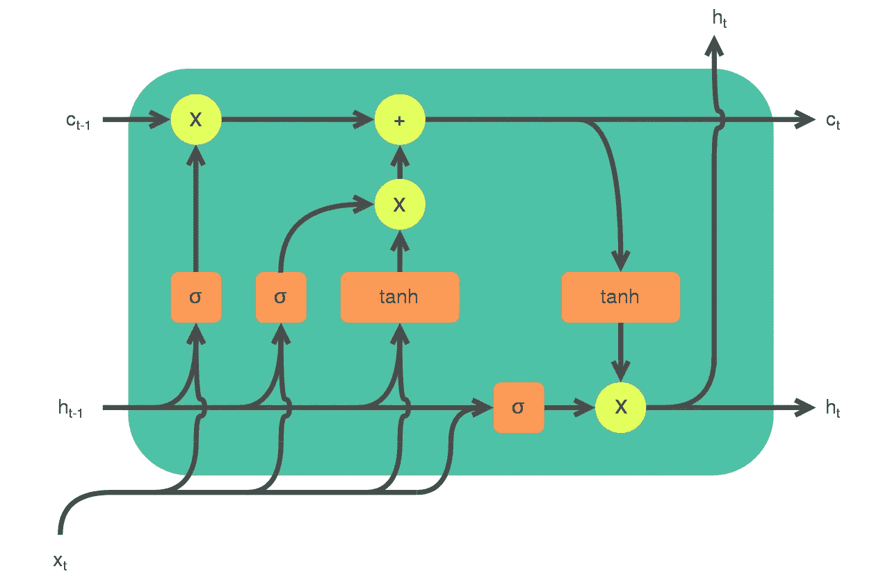

LSTM 建筑。图片来自[维基百科](https://en.wikipedia.org/wiki/Long_short-term_memory#/media/File:LSTM_cell.svg)下 [CC BY-SA 4.0](https://creativecommons.org/licenses/by-sa/4.0/) 许可。

# **TL；博士——给我代码**

## 执行脚本

**数据操作方法**

**时间序列方法**

**LSTM 战法**

# 代码和数据演练—数据准备

数据为 2010 年至今的美欧汇率，未经季节调整。你可以从圣路易斯美联储[这里](https://fred.stlouisfed.org/series/DEXUSEU)提取数据。

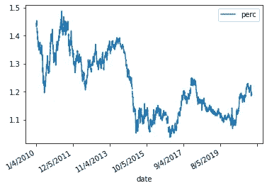

数据

在建立模型之前，我们创建一个序列并检查平稳性。虽然平稳性不是 LSTM 的明确假设，但它确实对控制误差有很大帮助。非平稳序列将在预测中引入更多误差，并迫使误差更快地复合。

我们过滤掉一个“序列长度”的数据点，供以后验证。在这种情况下，60 分。

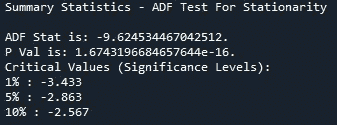

我们的迪基-富勒—显示了平稳性

LSTM 所需的数据格式是三维的，具有移动窗口。

*   因此，第一个数据点将是前 60 天的数据。
*   第二个数据点是前 61 天的数据，但不包括第一天。
*   第三个数据点是前 62 天的数据，但不包括第一天和第二天。

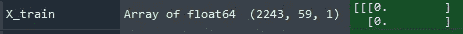

我们的培训数据框架

准备的最后一个主要步骤是扩展数据。这里我们使用一个简单的最小最大值定标器。我们这部分代码的序列长度是 60 天。

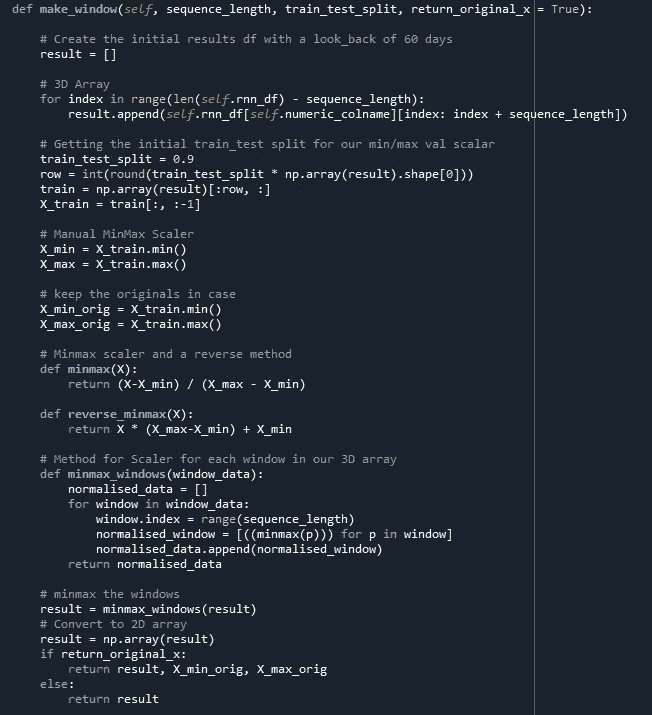

# 代码演练—构建 LSTM

分析的下一部分在代码方面非常简单。我们首先创建一个学习率调度器。该调度器将监控验证损失，并在平稳期修改学习率。

我们创建了一个方法来重置所有的权重，以防我们想要用不同的参数重新训练(这个方法在我的代码中没有使用，但是如果你需要的话，它就在那里)。

然后，我们构建一个具有 2 层的 LSTM，每层具有 100 个节点，并构建一个具有 sigmoid 激活的输出函数。

历史对象存储历元上的模型损失，其可以被绘制以评估在训练过程中是否需要调整。

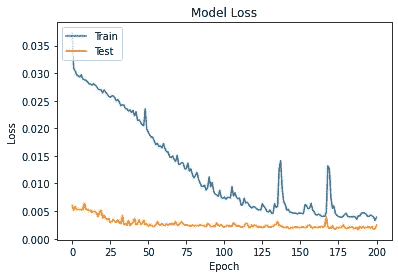

按历元的模型损失

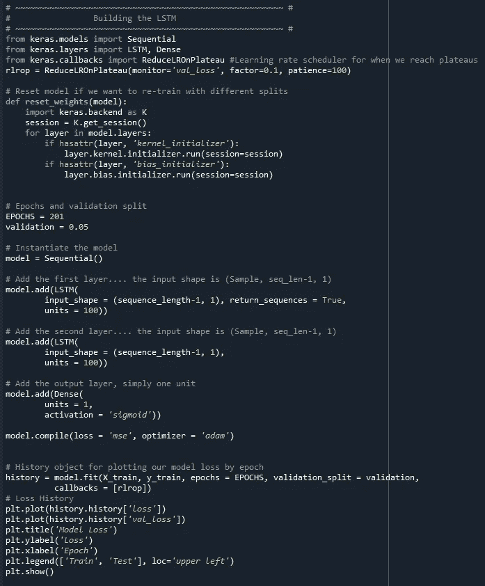

代码片段

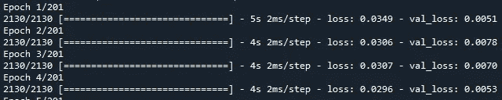

训练模型

# 代码演练—预测未来

提供的类允许我们测试模型的准确性和预测未来。

下面的方法根据我们之前搁置的验证数据框架来测试我们的模型。结果很有希望。

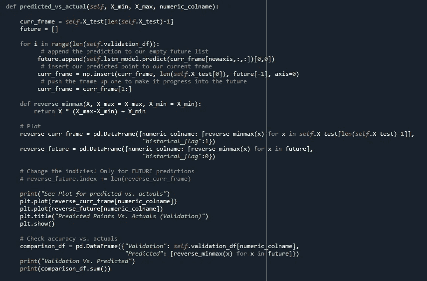

我们的比较法

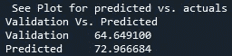

我们的比较

如果我们对准确性感到满意，我们就可以预测未来。下面是一个 LSTM 预测的快速演示。您可以看到在每个时间点模型中引入了一些误差，但是由于每个数据点都是一系列历史点，因此误差会减少。

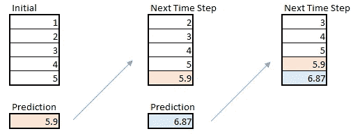

网络将预测反馈到模型中

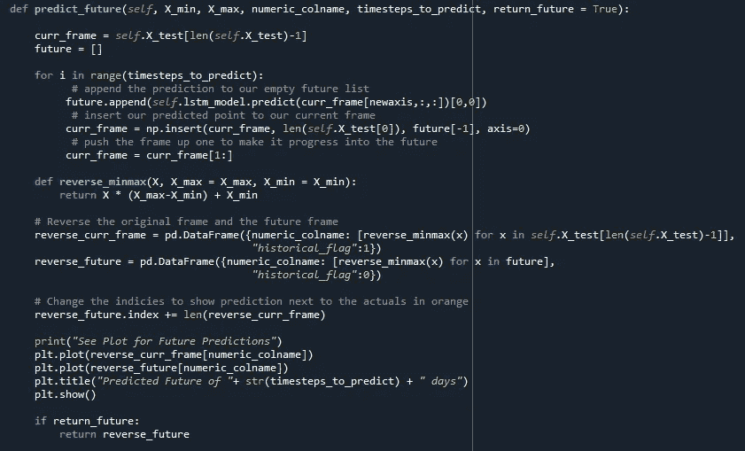

反转最小最大值并预测

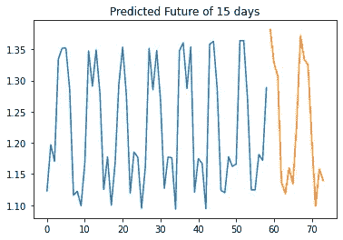

预测点(橙色)

# 结论

因为这篇文章主要是关于建立一个 LSTM，所以我没有讨论使用 LSTM 相对于传统方法的优点和缺点。我想在这个结论中提供一些指导:

**非技术考虑**

1.  权衡使用复杂模型和简单模型的成本和收益是非常重要的。稍微提高一下准确度可能不值得花费时间、精力和损失 LSTMs 引入的可解释性。
2.  如果时间序列预测很容易，股票市场就解决了！无论我们的模型有多好，所有时间序列数据中都有一个固有的噪声元素，我们无法捕捉到。
3.  不要忽视直觉。时间序列模型隐含地假设以前的时间段决定将来的时间段。情况可能并不总是如此。如果你的结果在直觉上没有意义，不要害怕抛弃模型！

**技术考虑因素**

1.  ARIMA(以及一般基于 MA 的模型)是为时间序列数据设计的，而 RNN 模型是为序列数据设计的。由于这种区别，很难建立基于 RNN 的现成模型。
2.  ARIMA 模型是高度参数化的，因此，它们不能很好地概括。对新数据集使用参数化 ARIMA 可能不会返回准确的结果。基于 RNN 的模型是非参数的，更具普遍性。
3.  根据窗口大小、数据和期望的预测时间，LSTM 模型在计算上可能*非常*昂贵。有时候，没有强大的云计算，它们是不可行的。
4.  最好有一个“无技能”模型来比较结果。一个好的开始是将模型结果与预测期间内每个时间步长(水平线)的【仅 平均值的模型进行比较。