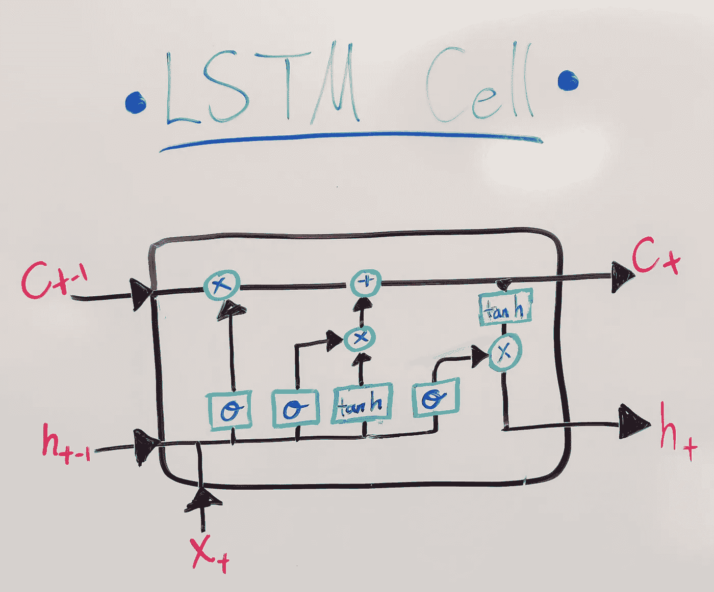
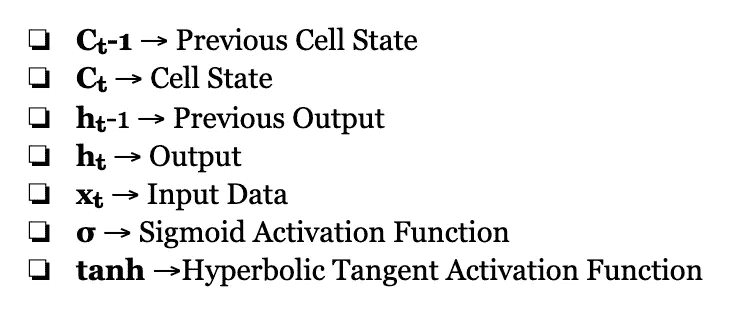
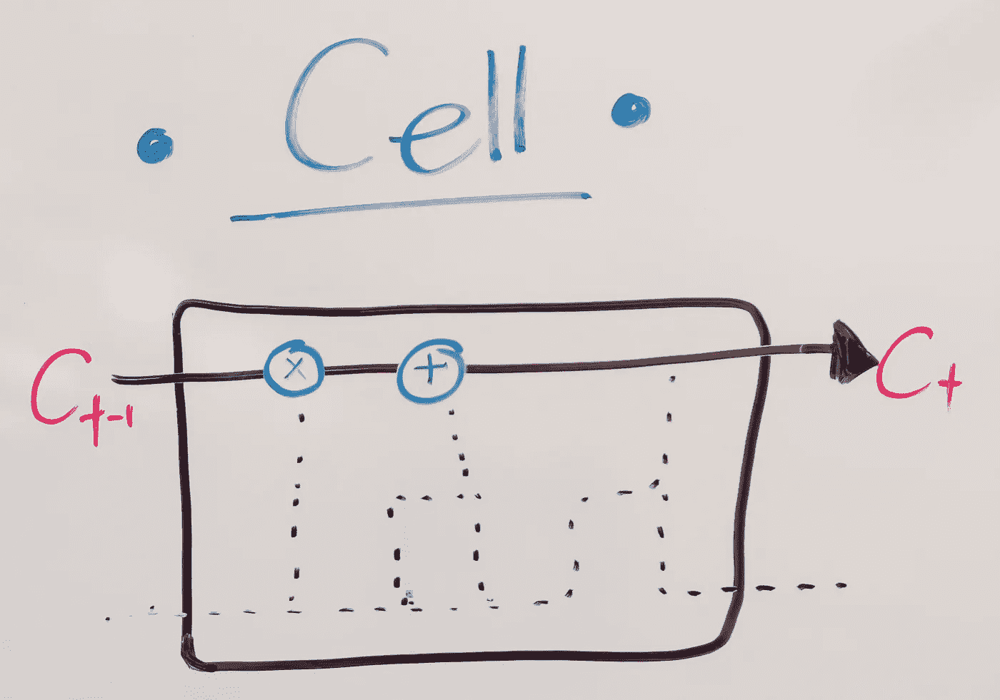
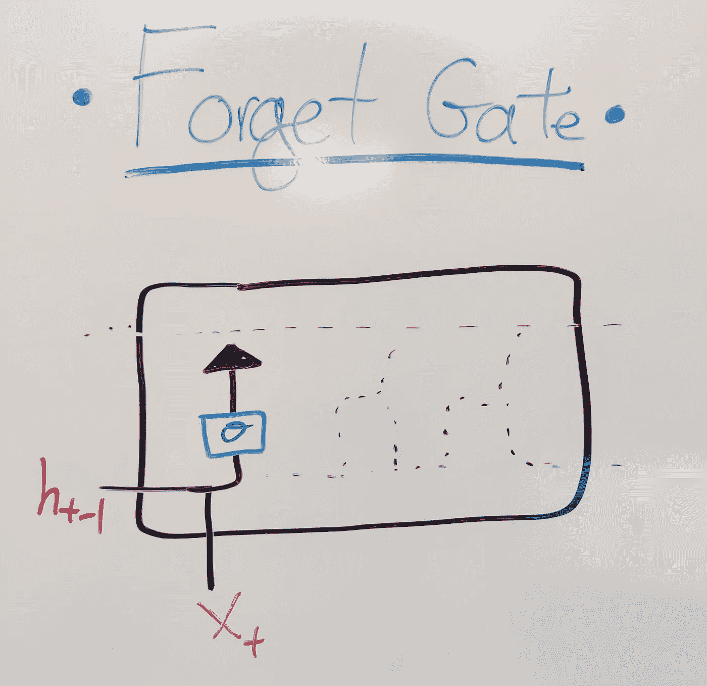
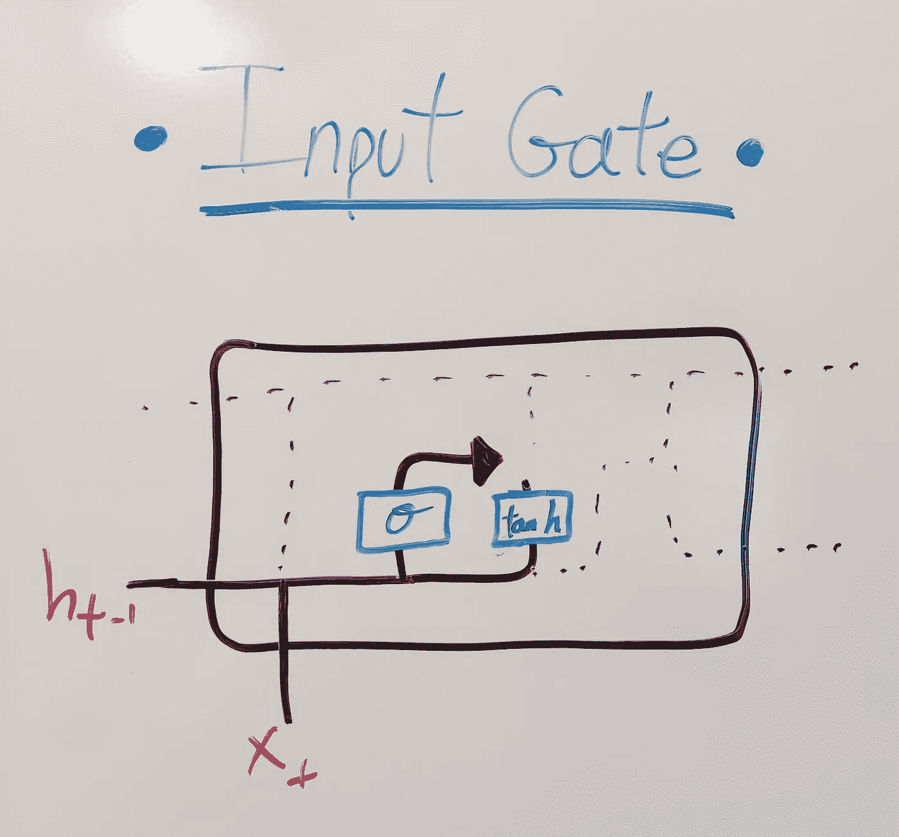
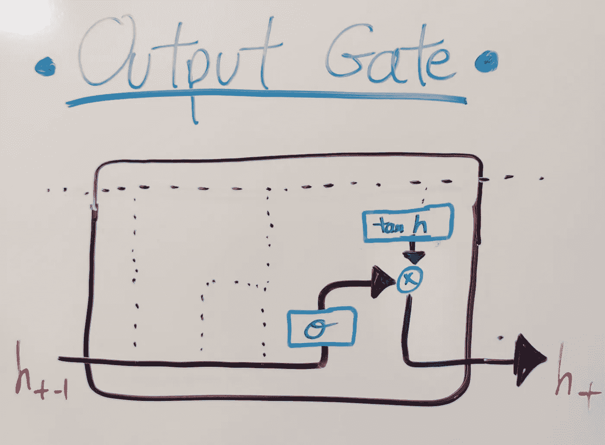
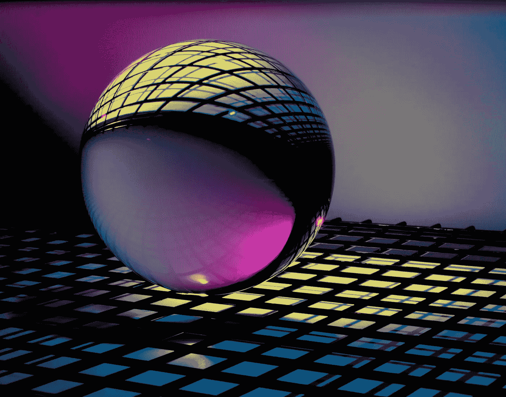

# LSTM 神经网络:基本概念

> 原文：<https://towardsdatascience.com/lstm-neural-network-the-basic-concept-a9ba225616f7?source=collection_archive---------18----------------------->

## 长短期记忆神经网络的高级介绍

艾莉娜·格鲁布尼亚克在 [Unsplash](https://unsplash.com/s/photos/neural-network?utm_source=unsplash&utm_medium=referral&utm_content=creditCopyText) 上的照片

预测未来曾经是猜测和神秘的事情。由于人类的进步，这已经成为一项仅受数据数量和深度限制的任务。

随着我们生活在一个不断以指数速度产生数据的社会，这种预见任务变得越来越容易实现。

你对数据驱动的预测研究得越深入，LSTM 这个词肯定会让人一头雾水。和许多科技概念一样，它是一个首字母缩写词，代表长期短期记忆。

简单地说，它是一个神经网络——一个旨在模仿人类学习模式的机器学习系统——能够“记住”以前的数据和结论，并使用它来更准确地得出最终结论。

> *“……LSTM 为任何顺序处理任务带来了希望，我们怀疑其中可能存在层次分解，但事先不知道这种分解是什么。”*
> ——费利克斯·a·热尔斯等译，《学会遗忘:与 LSTM 的连续预测》，2000 年

LSTM 是深度学习中的一种递归神经网络，专门开发用于处理顺序预测问题。例如:

*   天气预报
*   股票市场预测
*   产品推荐
*   文本/图像/手写生成
*   文本翻译

*需要对整个神经网络进行复习吗？*

 [## 关于神经网络你需要知道的一切

### 感谢:Kailash ahir war(Mate Labs 联合创始人兼首席技术官)

hackernoon.com](https://hackernoon.com/everything-you-need-to-know-about-neural-networks-8988c3ee4491) 

*“由于 LSTMs 可以有效地捕捉长期的时间依赖性，而不会遭受困扰简单递归网络(srn)的优化障碍，因此它们已被用于推进许多困难问题的技术发展水平。这包括手写识别和生成、语言建模和翻译、语音声学建模、语音合成、蛋白质二级结构预测、音频和视频数据分析等。”*
— Klaus Greff 等，LSTM:太空探索之旅，2015 年

像其他神经网络一样，它们包含执行计算的神经元，然而对于 LSTM 来说，它们通常被称为记忆细胞或简称为**细胞**。这些单元格包含权重和门；门是 LSTM 模型的显著特征。每个牢房里有 3 道门。输入门、遗忘门和输出门。

图片来源:[阿莱亚·奈特](http://aleia-knight.medium.com)

# —重要的变量—

图片来源:[阿莱亚骑士](http://aleia-knight.medium.com)

# —LSTM·盖茨—

## 细胞状态

图片来源:[阿莱亚骑士](http://aleia-knight.medium.com)

单元状态有点像传送带，在单元中移动数据。虽然它在技术上不是一个门，但它对于通过每个细胞以及向其他细胞传送数据至关重要。流经它的数据根据来自遗忘门和输入门的结果被改变和更新，并被传递到下一个单元。

## 遗忘之门

图片来源:[阿莱亚骑士](http://aleia-knight.medium.com)

该门在与单元状态合并之前移除不需要的信息。就像人类选择不考虑某些与决策无关或不必要的事件或信息一样。

它接受两个输入，新信息(x_t)和先前单元输出(h_t-1)。它通过 sigmoid 门运行这些输入，以过滤掉不需要的数据，然后通过乘法将其与细胞状态合并。

## 输入门

图片来源:[阿莱亚骑士](http://aleia-knight.medium.com)

这个门向单元状态添加信息。相当于人类在你已有信息的基础上考虑新呈现的信息。

与遗忘门类似，它使用一个 sigmoid 门来确定需要保留的信息量。它使用 tanh 函数来创建要添加的信息的向量。然后，它将 sigmoid gate 和 tanh 函数的结果相乘，并使用加法将有用信息添加到单元状态中。

此时，所有的信息都已经设置好了:开始信息、新信息和删除不需要的信息。这些都已经收集整理好了，决定已经准备好了。

## 输出门

图片来源:[阿莱亚骑士](http://aleia-knight.medium.com)

最后一个门根据单元状态、先前单元输出和新数据选择有用的信息。在输入门和遗忘门合并后，它通过获取单元状态来实现这一点，并通过一个双曲正切函数来创建一个向量。然后，它获取新数据和以前的单元输出，并通过 sigmoid 函数运行它们，以找到需要输出的值。然后，这两个操作的结果相乘，并作为该单元的输出返回。

*关于激活功能(tanh 和 sigmoid)的更多信息:*

 [## 激活功能

### 激活函数是在人工神经网络中使用的函数，它为小输入输出小值…

deepai.org](https://deepai.org/machine-learning-glossary-and-terms/activation-function) 

数据在细胞间移动的整个过程发生在一个细胞中。但是在实际模型中，在得出最终结论之前，无论添加多少层，每层都可以有任意数量的单元。

然后，无论需要多少个时期(迭代),整个模型都会再次运行，以接近更准确的答案。准确度越好；预测越好。

作为人类，我们不断地以惊人的速度进行这一过程。甚至可以追溯到学习走路的时候，通过回顾我们做错了什么，看看别人做对了什么，然后从中调整。像其他神经网络一样，LSTM 过程旨在模拟人类思维。

区别在于它的计算能力。

人类是高度智能的生物，因此我们才能走到这一步，但我们知道我们制造的机器比我们更聪明。尤其是在数学和科学的速度方面。

LSTM 模型能够回顾以前的数据和决策，并据此做出决策。但是他们也要用同样的过程对可能发生的事情做出有根据的猜测/预测。这就是为什么这个模型在连续数据的情况下是最好的。它将发现趋势，并使用这些趋势来预测未来的趋势和结果。

我们能做到吗？是

但是可能没有同样的精确度。更不用说接受数百万个数据点作为输入了。

所以你看，我们可以预测未来，我们甚至不需要一个算命师这样做。

迈克尔·泽兹奇在 [Unsplash](https://unsplash.com/s/photos/crystal-ball?utm_source=unsplash&utm_medium=referral&utm_content=creditCopyText) 上的照片

只是一台强大的计算机，一些数据，和一点数学！

喜欢阅读吗？Co *请告诉我你对这个话题的想法，并关注以获得更多关于机器学习、数据科学、STEM 和职业/个人发展的文章。*