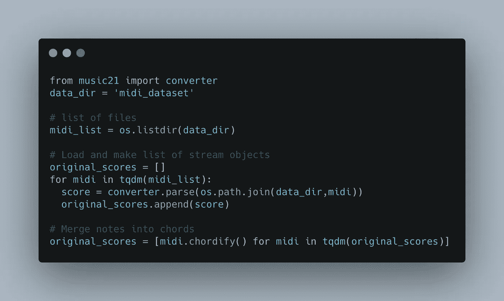
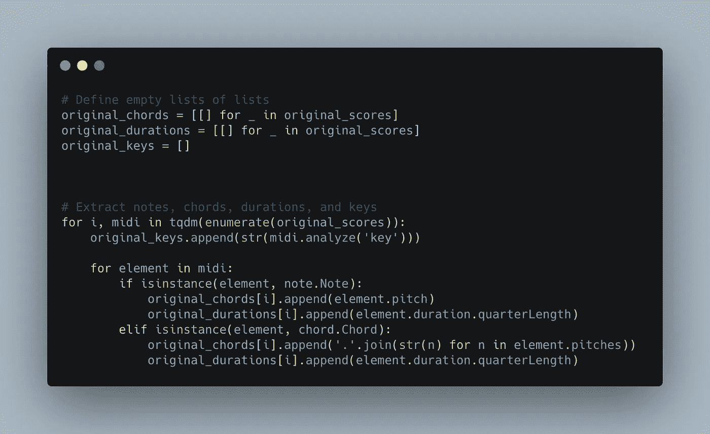
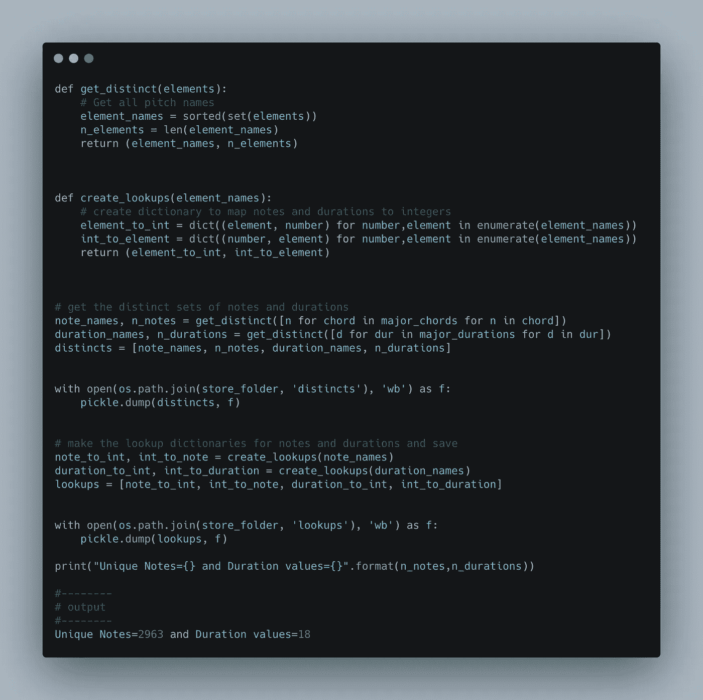
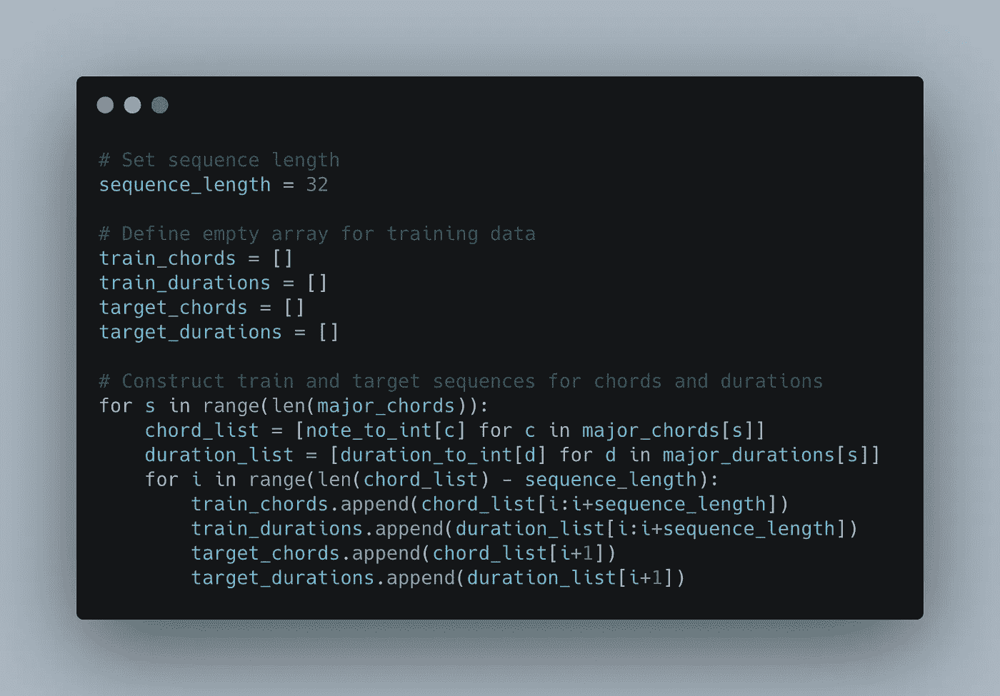
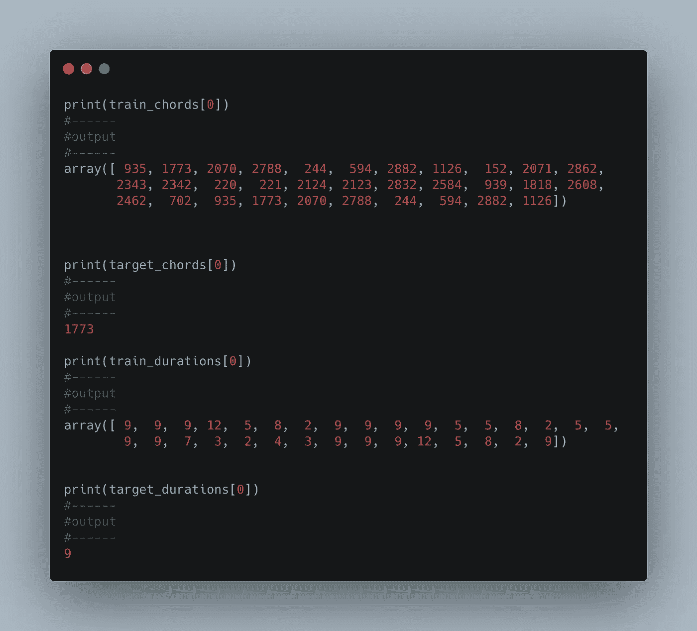
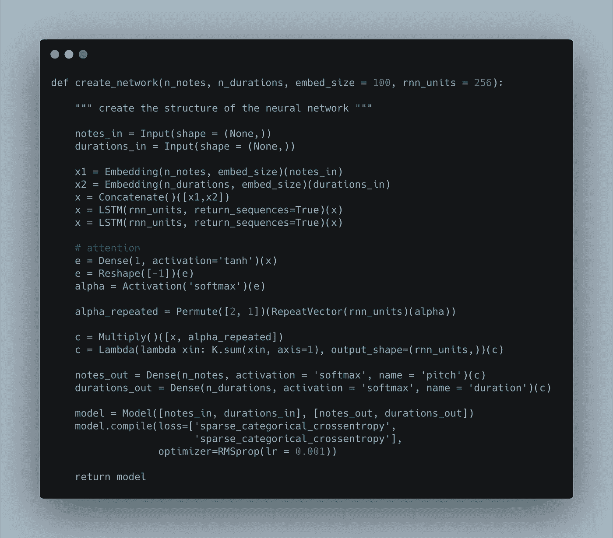
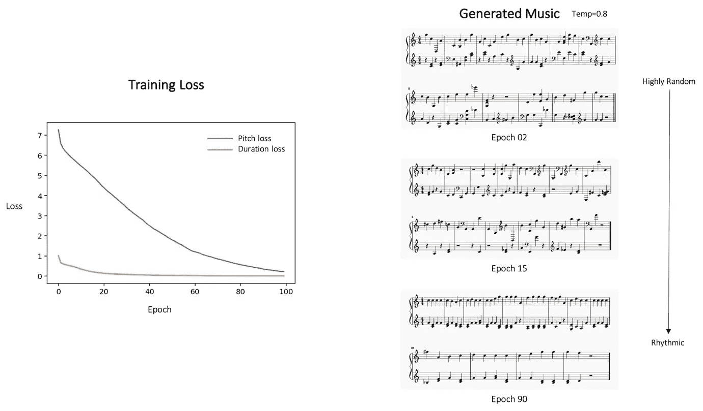

# 音乐生成的 LSTMs

> 原文：<https://towardsdatascience.com/lstms-for-music-generation-8b65c9671d35?source=collection_archive---------29----------------------->

## 让我们随着人工智能产生的音乐跳舞吧

**图片来源:** [安德烈·苏斯洛夫](https://www.istockphoto.com/portfolio/AndSus?mediatype=illustration)上[伊斯托克](https://www.istockphoto.com/vector/smart-speaker-iot-gm1072477006-287004793)

udio 是一个领域，来自计算机视觉和 NLP 领域的思想的交叉融合拓宽了视野。音频生成并不是一个新领域，但多亏了深度学习领域的研究，这个领域近年来也取得了一些巨大的进步。音频生成有几种应用。现在最突出最流行的是一系列智能助手(谷歌助手，苹果 Siri，亚马逊 Alexa，等等)。这些虚拟助手不仅试图理解自然语言查询，还会用非常像人类的声音做出回应。

*本文摘自本书，* [***用 Python 和 TensorFlow 生成 AI 2***](https://www.amazon.com/Generative-AI-Python-TensorFlow-Create/dp/1800200889?maas=maas_adg_6BDCD121BC86911E075F8723702C51F5_afap_abs&ref_=aa_maas)***。这本书是约瑟夫·巴布科克和 Raghav Bali(我自己)*** *写的。我们的目的是为读者创建一个实用的指南，使他们能够用 VAEs、GANs、LSTMs、GPT 模型等创建图像、文本和音乐。这本书帮助了许多 Python 程序员、经验丰富的建模师和机器学习工程师理解深度生成模型背后的理论，并用实际例子进行实验。*

音乐是一个连续的信号，是各种乐器的声音和声音的组合。另一个特征是我们在听的时候注意到的结构性循环模式的存在。换句话说，每首音乐作品都有自己特有的连贯性、节奏和流动。

在这篇文章中，我们将以一种非常简单的方式来处理音乐生成的任务。我们将利用和扩展堆叠的 LSTM 网络来完成音乐创作的任务。这种设置类似于文本生成的情况(这是下一篇文章的主题)。为了使事情简单和易于实现，我们将关注于一个*单乐器/单声道*音乐生成任务。

以下是我们此次演练的工作流程概要:

*   了解数据集
*   为音乐生成准备数据集
*   基于 LSTMs 的音乐生成模型(*我们说注意了*！)
*   模特培训
*   听着节拍！让我们听听我们的模型生成的几个样本

让我们首先了解更多关于数据集的知识，并思考我们将如何为我们的音乐生成任务准备它。

*本文使用的代码可以通过 Github 库*[*【1】*](https://github.com/PacktPublishing/Hands-On-Generative-AI-with-Python-and-TensorFlow-2)*和*[*【2】*](https://github.com/raghavbali/generative_ai_with_tensorflow)*获得。更有趣的是，这被很好地打包在一个****Google-Colab****启用的 jupyter 笔记本中，你可以简单地点击并使用它。*

# 数据集

IDI 是一种易于使用的格式，它帮助我们提取文件中包含的音乐的符号表示。在本次讨论/演练中，我们将利用 reddit 用户 *u/midi_man* 收集和共享的大规模公共 MIDI 数据集的子集，该数据集可通过以下链接获得: [r/WeAreTheMusicMakers](https://www.reddit.com/r/WeAreTheMusicMakers/comments/3ajwe4/the_largest_midi_collection_on_the_internet/)

我们将利用这个数据集本身的一个子集。该子集基于伟大音乐家如贝多芬、巴赫、巴托克等的古典钢琴曲。子集可以在压缩文件夹`midi_dataset.zip`中找到，还有这个 [GitHub 库](https://github.com/PacktPublishing/Hands-On-Generative-AI-with-Python-and-TensorFlow-2/tree/master/Chapter_11/lstm_attention)中的代码。

我们将利用`music21`来处理这个数据集的子集，并为训练模型准备我们的数据。由于音乐是来自各种乐器和人声/歌手的声音的集合，为了这个练习的目的，我们将首先使用`chordify()`功能从歌曲中提取和弦。下面的代码片段帮助我们获得所需格式的 MIDI 乐谱列表。

来自 Google-Colab enabled[**jupyter 笔记本**](https://github.com/PacktPublishing/Hands-On-Generative-AI-with-Python-and-TensorFlow-2/blob/master/Chapter_11/lstm_attention/lstm_attention.ipynb) 的代码片段

一旦我们有了乐谱列表，下一步就是提取音符和它们相应的计时信息。为了提取这些细节，`music21`有简单易用的接口，如`element.pitch`和`element.duration`。下面的代码片段帮助我们从 MIDI 文件中提取这样的信息，并准备两个并行列表。

来自 Google-Colab enabled[**jupyter 笔记本**](https://github.com/PacktPublishing/Hands-On-Generative-AI-with-Python-and-TensorFlow-2/blob/master/Chapter_11/lstm_attention/lstm_attention.ipynb) 的代码片段

我们采取一个额外的步骤来降低维度。虽然这是一个可选步骤，但我们建议这样做，以保持任务的可处理性，并将模型培训要求保持在限制范围内。以下片段将音符/和弦列表和持续时间缩减为只有 *C 大调*(您也可以选择任何其他调)。

来自 Google-Colab enabled[**jupyter 笔记本**](https://github.com/PacktPublishing/Hands-On-Generative-AI-with-Python-and-TensorFlow-2/blob/master/Chapter_11/lstm_attention/lstm_attention.ipynb) 的代码片段

现在我们已经预处理了我们的数据集，下一步是将音符/和弦和持续时间相关的信息转换成可消费的形式。一个简单的方法是创建符号到整数的映射。一旦转换成整数，我们可以将它们作为模型嵌入层的输入，在训练过程中进行微调。下面的代码片段准备了映射，并提供了一个示例输出。

启用 Google-Colab 的代码片段 [**jupyter 笔记本**](https://github.com/PacktPublishing/Hands-On-Generative-AI-with-Python-and-TensorFlow-2/blob/master/Chapter_11/lstm_attention/lstm_attention.ipynb)

我们现在已经准备好了地图。在下面的代码片段中，我们将训练数据集准备为长度为 32 的序列，并将它们对应的目标作为序列中的下一个标记。

来自 Google-Colab enabled[**jupyter 笔记本**](https://github.com/PacktPublishing/Hands-On-Generative-AI-with-Python-and-TensorFlow-2/blob/master/Chapter_11/lstm_attention/lstm_attention.ipynb) 的代码片段

正如我们所看到的，除了与 MIDI 文件处理相关的一些细微差别，数据集准备阶段基本上是简单明了的。生成的序列及其对应的目标显示在下面的输出片段中，以供参考。

代码片段来自 Google-Colab enabled[**jupyter 笔记本**](https://github.com/PacktPublishing/Hands-On-Generative-AI-with-Python-and-TensorFlow-2/blob/master/Chapter_11/lstm_attention/lstm_attention.ipynb)

转换后的数据集现在是一个数字序列，就像文本生成的情况一样。列表上的下一项是模型本身。

# 音乐生成的 LSTM 模型

与文本生成(使用 Char-RNN)一样，我们通常只有少量的输入符号(小写和大写字母、数字)，而音乐生成的符号数量很大(约 500)。在此符号列表中添加一些时间/持续时间相关信息所需的额外符号。对于这个更大的输入符号列表，模型需要更多的训练数据和学习能力(根据 LSTM 单元的数量、嵌入大小等的能力)。

我们需要注意的下一个明显的变化是模型在每个时间步接受两个输入的能力。换句话说，模型应该能够在每个时间步长将音符和持续时间信息作为输入，并生成具有相应持续时间的输出音符。为此，我们利用功能性的`tensorflow.keras` API 来准备一个多输入多输出架构。

堆叠的 LSTM 在能够学习比具有单个 LSTM 层的网络更复杂的特征方面具有明显的优势。除此之外，**注意机制**有助于缓解 RNNs 固有的问题，例如处理远程依赖性的困难。由于音乐是由节奏和连贯性形式的局部和整体结构组成的，注意力机制肯定会产生影响。

以下代码片段以所讨论的方式准备了一个多输入堆叠 LSTM 网络。

启用 Google-Colab 的代码片段 [**jupyter 笔记本**](https://github.com/PacktPublishing/Hands-On-Generative-AI-with-Python-and-TensorFlow-2/blob/master/Chapter_11/lstm_attention/lstm_attention.ipynb)

使用上述片段准备的模型是一个多输入网络(音符和持续时间各一个输入)。下面概括介绍了模型设置:

*   使用各自的嵌入层将每个输入转换成矢量。
*   两个输入被连接
*   级联的输入然后通过几个 LSTM 层，接着是一个简单的注意机制。
*   在这一点之后，模型再次分成两个输出(一个用于下一个音符，另一个用于该音符的持续时间)。鼓励读者使用`keras`实用程序来可视化网络。

# 模型训练和音乐生成

训练这个模型就像在`keras`模型对象上调用`fit()`函数一样简单。我们训练模型大约 100 个时期。下图描述了模型在不同时期的学习进度。

来自 Google-Colab enabled[**jupyter 笔记本**](https://github.com/PacktPublishing/Hands-On-Generative-AI-with-Python-and-TensorFlow-2/blob/master/Chapter_11/lstm_attention/lstm_attention.ipynb) 的代码片段

如图所示，该模型能够在生成的音乐样本中学习一些重复模式。这里，我们使用基于温度的采样作为我们的解码策略[ [*参考链接*](https://github.com/raghavbali/text_generation/blob/master/notebooks/text_generation_02.ipynb) ]。

# 让我们听听艾的声音

以下是我们的模型分别在 5 个和 50 个时期后生成的两个样本。他们并不完美，但肯定很有前途，就像一个即将到来的音乐家。

5 个时期后生成的样本音乐

观察这两个样本之间的改进。50 个时期之后的输出比仅仅 5 个时期之后的输出更加连贯和有节奏。

50 个时代后生成的样本音乐

# **总结**

这是一个使用深度学习模型的音乐生成的非常简单的实现。我们用文本生成的概念进行了类比。在这篇文章所基于的书中，我们进一步使用其他高级技术进行了一些音乐生成，包括 MuseGANs 等生成对抗网络。

# **关于作者**

**Joseph Babcock** 在电子商务、数字流媒体和量化金融领域从事大数据和人工智能工作已经超过十年。在他的职业生涯中，他致力于推荐系统、Pb 级云数据管道、A/B 测试、因果推理和时间序列分析。他在约翰霍普金斯大学完成了博士研究，将机器学习应用于药物发现和基因组学领域。

[**Raghav Bali**](https://raghavbali.github.io/) 是[多部畅销书籍](https://www.amazon.com/Raghav-Bali/e/B07K2PKCT9?ref=sr_ntt_srch_lnk_1&qid=1625124559&sr=8-1)的作者，也是世界上最大的医疗保健组织之一的高级数据科学家。他的工作包括研发基于机器学习、深度学习和自然语言处理的企业级解决方案，用于医疗保健和保险相关的用例。他之前的经历包括在英特尔和美国运通工作。Raghav 拥有孟加拉国国际信息技术学院的硕士学位(金牌获得者)。