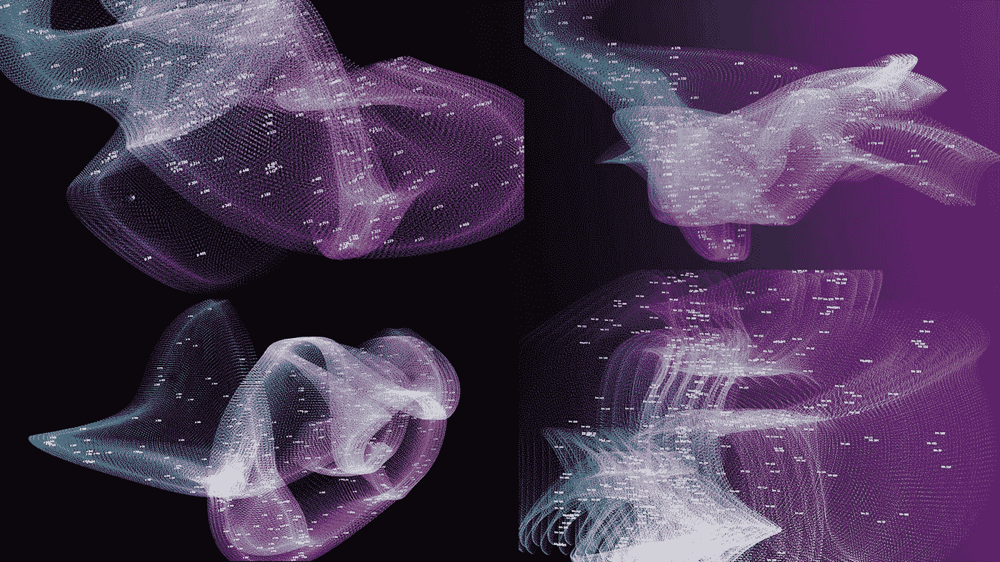
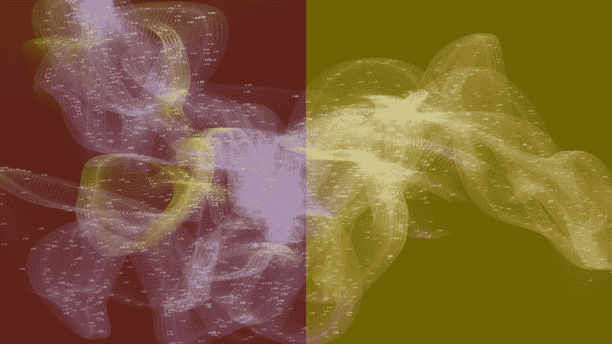
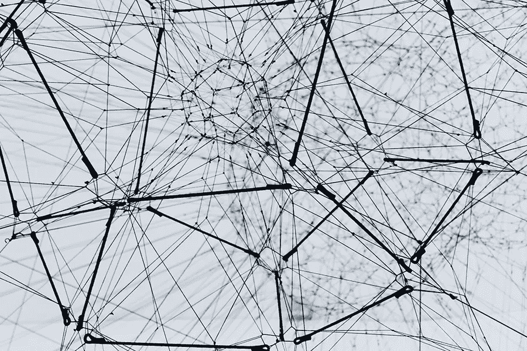
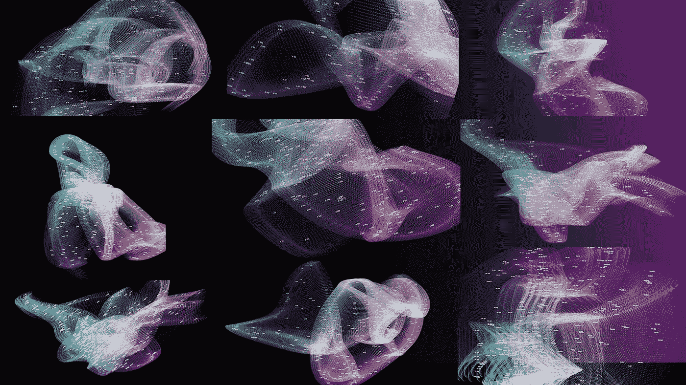
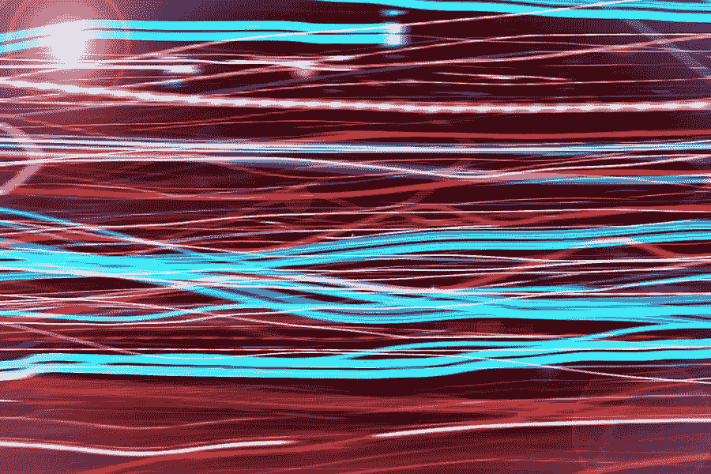
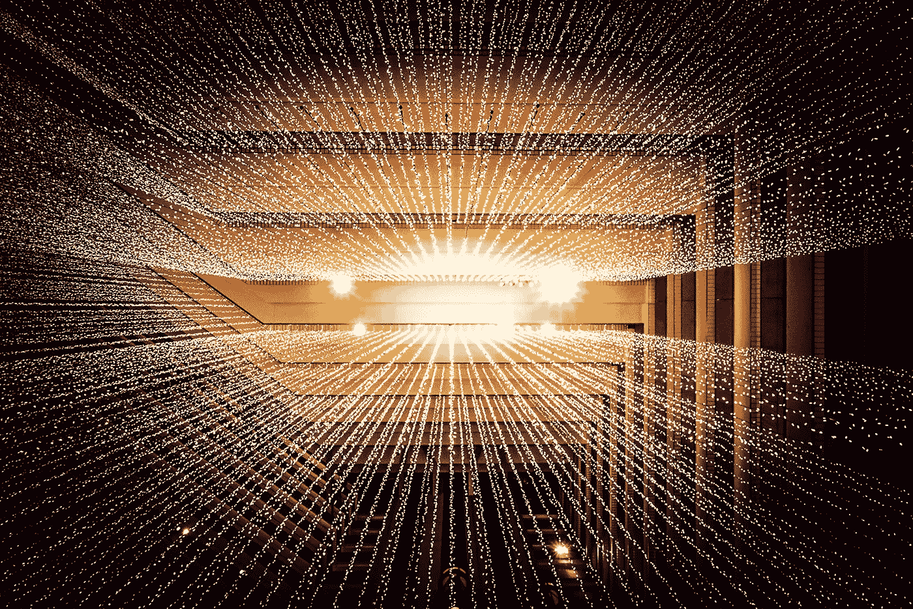
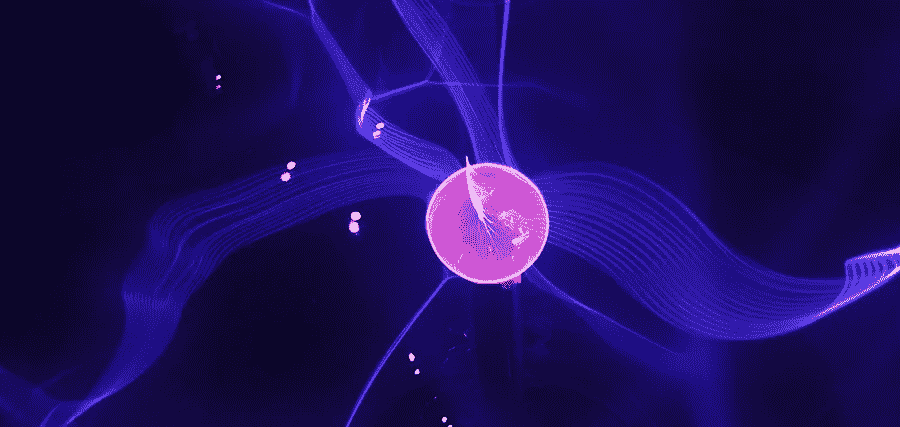

# 露西向 2031 年，AGI 和人工智能的未来问好

> 原文：<https://towardsdatascience.com/lucy-says-hi-2031-agi-and-the-future-of-a-i-28b1e7b373f6?source=collection_archive---------17----------------------->

## 在 2031 年，一款新的 Alexa 出现了，人工智能是它的特点之一。露西是什么做的？

视频作者 Javier Ideami @【https://ideami.com 

露西整天都在预测你的需求和关注，并在那里与你分享美好的时光，安慰你度过艰难的时光。她诞生于深度学习革命之后的下一次革命。**露西是什么做的？**

让我们想象我们在那一年， **2031** (一个象征性的数字，因为 Lucy 可能在那个日期之后的许多年才可行)，让我们考虑关于 Lucy 可能有哪种基质的各种**假设**。我们开始吧！

图片由作者哈维尔·艾达米@ https://ideami.com

# 推断和类比

**AGI** ，**人工通用智能**，指的是一个单一系统的概念，它可以实现类似于我们的通用智能行为，而不是目前的人工智能系统，我们可以将其归类为**狭义人工智能**，并专门从事各种特定领域和任务。

让我们从考虑我们正在寻找的目标的关键部分**开始。让我们思考一个特定的能力，它将是 Lucy 的一个关键部分，也是一个高级和通用智能系统的基本要素。**

我说的是推断 T21 的能力，将相距甚远的概念和领域联系起来的能力，创造类比和隐喻的能力。

当前的**深度学习模型非常擅长插值**。当用大量数据训练时，它们能够在结果空间中导航，通过插值产生新的结果。然而，智力缺失的一个关键特征是:

*   超越原始数据的概率分布持续外推的能力**。**
*   这种外推的缺乏使得类比和隐喻的创造变得复杂，也就是理解从一个领域转移到另一个领域。
*   理解本身深深植根于我们创造类比的能力中。作为人类，我们可以很快理解事物，因为我们可以将它们与我们已经知道的其他概念和领域联系起来。缺乏推断使深刻理解的出现变得更加复杂。

图片由作者哈维尔·艾达米@ https://ideami.com[拍摄](https://ideami.com)

现在，让我们回顾一些可能的互补和重叠的路线，这些路线可能会把我们带到露西那里。

# GPT 联结主义路线

在我们的探索中，由 **OpenAI** 创建的 **GPT** 架构代表了连接主义方法。

*   强大的人工**神经网络**，在这种情况下，使用变压器模型，用大量数据进行**训练。**
*   当前版本能够产生**非常令人印象深刻的结果**,这要归功于它们的**能力，即在所学函数跨越的巨大空间内进行插值**。
*   此时，GPT 模型正被应用于许多不同的领域，从**预测文本的延续，**到填补图像或计算机代码的缺失部分。
*   问题是**产生的模型是脆弱的**。如果你用某些输入来挑战它，你会很快注意到**它没有达到深度“理解”**。从统计学的角度来看，它正在生产任何符合当前提示的东西。

现在，有**人相信****随着你不断增加类似 GPT 的模型**的规模，将会发生质的改进，我们将会看到**外推能力以及其他高级功能的出现。**

还有一些人说人工智能社区一直在改变目标，GPT 模式今天所能取得的成就在几年前会被认为是理解。

这是露西的一条潜在路线。人工智能社区的一部分所信仰的。

照片由 [Alina Grubnyak](https://unsplash.com/@alinnnaaaa?utm_source=unsplash&utm_medium=referral&utm_content=creditCopyText) 在 [Unsplash](https://unsplash.com/s/photos/network?utm_source=unsplash&utm_medium=referral&utm_content=creditCopyText) 上拍摄

# 混合路线

许多人工智能专家正在倡导一种混合解决方案，这种方案结合了连续和离散的方法，我们可以把它与所谓的系统 1 和系统 2 的二元性联系起来。

在他的书《思考，快与慢》中，丹尼尔·卡内曼解释了我们大脑产生思想的两种方式:

*   **系统一**快速、频繁、自动、无意识
*   **系统二**是缓慢的、逻辑的、有意识的、分析的、不频繁的等等

**系统一**与我们对周围环境和信息的**感觉**和**感知**紧密相连。深度学习模型现在做的大部分事情，都可以连接到这种系统上。

系统二与我们的计划、推理、分析和抽象工作的能力联系更紧密，通常与我们的高级认知功能联系更紧密。

缩小:

*   **系统 1** 可以连接到**连续可微空间**。
*   **系统 2** 与**离散流程**联系更紧密。规则、规划、逻辑论证等都有这种离散性。
*   这种二元性，连续与离散可以在其他形式中找到。比如量子力学中的**粒子 vs 波二象性**。

因此，关于人工智能领域:

*   **一种方法是连续方法，使用能够在连续空间轻松学习模式的可微分过程**。这是深度学习擅长的领域。
*   另一个是**离散方法，利用类别、规则和**离散元素的**系统，可以在更高的抽象层次上运行。这是符号人工智能、合成编程等等的领域。**

我们来考虑一下 **DeepMind** 的 **AlphaGo** 项目。这个深度学习架构能够击败**围棋**的世界冠军，这是一个非常复杂并且曾经被认为不可能实现的成就。

**AlphaGo 结合了一个卷积神经网络**和一个蒙特卡洛树搜索，前者学习与游戏板相关的不同视觉模式的价值，后者在上述基础上提供了一个离散过程。

可能活动的空间太大了。**离散蒙特卡罗树搜索有助于缩小可能性的范围**。

这是一个简单的**连续方法和离散方法之间协作的例子**。但是，混合模式的支持者认为这种模式可以走得更远，并设想了一种更强大的离散和连续战略的组合，正如 Franç ois Chollet 所说，这种组合将两种方法结合起来，并在它们之间有必要的重叠。

那些相信纯连接主义方法的人有一些保留意见，他们想知道:

*   人脑中的符号或离散模块在哪里？他们说，到目前为止还没有发现。
*   他们提出，类似符号的实体和更强大的抽象能力可能最终会从纯粹的连接主义方法中出现。

因此，这条路线代表了**超越纯连接主义**方法的需要。就连过去对象征性人工智能颇有微词的 Yoshua Bengio，现在也在倡导有必要探索深度学习和其他方法的结合。

图片由作者哈维尔·艾达米@ ideami.com 提供

# 该实施例路线

可能使用前面两种方法中的任何一种，Lucy 可能仍然无法超越某一点。为了获得更高级的智能，露西**可能需要能够以类似于我们的方式与世界互动**。也就是说，拥有某种形式的“**身体**”和某种感知周围环境并对其做出反应的方式。

当一个孩子与环境隔绝时会发生什么？她/他的认知能力受损。我们与环境的互动似乎是我们高级智能的关键。当然，没有人说**环境**应该是**物理**的样子。也可能是**虚拟**。一切都可能是虚拟的。

然而，环境的详细程度和复杂性非常重要，我们将在下一节中对此进行更多的讨论。这就是为什么“**真实的”世界**，以其巨大的复杂性，在相当长的一段时间内，可能是人工智能实体的理想环境，**直到**我们的**模拟变得足够复杂**。

照片由[莎伦·麦卡琴](https://unsplash.com/@sharonmccutcheon?utm_source=unsplash&utm_medium=referral&utm_content=creditCopyText)在 [Unsplash](https://unsplash.com/s/photos/senses?utm_source=unsplash&utm_medium=referral&utm_content=creditCopyText) 上拍摄

# 强化学习路线

**强化学习**是机器学习的一个领域，其中**一个代理在一个环境**中采取行动，同时试图**最大化某个奖励**。当代理人结合探索和开发策略来建立一个好的行动策略以增加期望的回报时，学习就发生了。

在 David Silver、Satinder Singh、Doina Precup 和 Richard S.Sutton (Rich Sutton 是强化学习的创始人之一)最近发表的论文“**奖励足够了**”中，研究人员指出，当在足够复杂的环境中训练时，**强化学习可能足以达到人工一般智能**。

他们的论文是一篇哲学论文，他们没有提供如何实现这样一个系统的细节。但是他们强烈暗示，当与足够复杂的环境互动时，强化学习可以产生一个 T2 露西。

有些人对这样的假设表示怀疑，并说创造这样一个复杂而详细的环境可能需要非常先进的人工智能系统的存在。无论如何，这是另一条通往露西的路线。

照片由[博夫肖](https://unsplash.com/@hikeshaw?utm_source=unsplash&utm_medium=referral&utm_content=creditCopyText)在 [Unsplash](https://unsplash.com/?utm_source=unsplash&utm_medium=referral&utm_content=creditCopyText) 上拍摄

# 马其顿路线

另一个互补的可能性是，露西将从多种方法的结合中诞生。Pedro Domingos 在他的书**“主算法”** **中写了与学习过程相关的不同范例:**象征主义者、联结主义者、进化论者、贝叶斯主义者和类比者**。**

**Lucy** 可能诞生于**将连续**和**离散**方法与**进化**算法相结合，以及与其他策略如**贝叶斯**相结合，后者允许我们更多地考虑我们周围世界的不确定性。

佩德罗·多明戈斯和他的同事们一直在用这些混合物做实验，产生了有趣的结果。他们的研究正在进行中。

照片由 [Jannis Brandt](https://unsplash.com/@jannisbrandt?utm_source=unsplash&utm_medium=referral&utm_content=creditCopyText) 在 [Unsplash](https://unsplash.com/s/photos/fruit-mix?utm_source=unsplash&utm_medium=referral&utm_content=creditCopyText) 拍摄

# 网络路由

Ben Goertzel 博士是奇点网的创始人。这个项目代表了通过多个人工智能代理的交互来寻找**AGI 出现的方法。在 SingularityNET 中，这是通过利用**区块链**技术以分散的方式实现的，因此人工智能代理可以在没有任何中央监管的情况下合作解决挑战。**

与 SingularityNET 并行的是，Ben Goertzel 博士和他的团队正在开发 **OpenCog** ，这是一个新的 **AGI 架构**，它使用了**超图知识库**和**结合了多种人工智能策略**和算法，从神经网络到进化系统、逻辑引擎等。这些系统根据需要协作并更新知识图。

**超越或补充反向传播** **算法**的使用是 Goertzel 博士强调的要点之一。他想知道:“**有多少神经架构仅仅因为不适合与反向传播算法一起工作而被丢弃？**“作为一个例子，Ben 告诉我们，当使用进化算法时，可以使用适合度估计的推理和其他策略来指导进化学习过程。当我们使用反向传播时，这些策略更难实施。因此， **OpenCog** 结合了多种策略和算法来增强系统的能力。

[Joshua Sortino](https://unsplash.com/@sortino?utm_source=unsplash&utm_medium=referral&utm_content=creditCopyText) 在 [Unsplash](https://unsplash.com/s/photos/network?utm_source=unsplash&utm_medium=referral&utm_content=creditCopyText) 上的照片

# 彭罗斯-哈梅罗夫路线

诺奖得主**罗杰·彭罗斯**和科学家**斯图尔特·哈梅罗夫**是 **Orch-OR(有组织的客观还原)**的创造者，这一理论提出**意识来自我们神经元内的量子过程**(特别是在它们的微管内)，而不是来自那些神经元之间的连接。

尽管意识不是高级智能形式的强制性要求，但这种途径代表了高级人工智能的类型，这种人工智能可能由超越简单架构和算法的**产生，涉及我们现实的更深层次，如上面例子中的量子过程。**

因此，从这个角度来看，要达到一种高级形式的智能，可能需要在这个过程中涉及其他更深层次的难题。

照片由[分形哈桑](https://unsplash.com/@tetromino?utm_source=unsplash&utm_medium=referral&utm_content=creditCopyText)在 [Unsplash](https://unsplash.com/s/photos/quantum?utm_source=unsplash&utm_medium=referral&utm_content=creditCopyText) 上拍摄

所有前面的部分可能会相互重叠。但是**他们每一个人都强调或突出了潜在方程式**的不同部分来接近露西。

很有可能最终的结果会与这些假设完全不同，或者看起来像是它们的部分组合。

但是，**如果接近露西的最佳策略是**一些不同的和**更反直觉的方式**呢？为此，我们求助于肯尼斯·斯坦利教授。

# **无路可走**

在他的优秀著作**“为什么伟大是不可规划的”****中，肯尼斯·斯坦利教授**提供了关于寻找远大目标的深刻见解(比如露西):

*   Kenneth Stanley 告诉我们,**当瞄准接近**我们当前环境的目标和目的时，执行使我们更接近这些目标的优化过程可能会很有效(遵循朝向特定目标的梯度)。
*   但是，**当瞄准真正雄心勃勃的目标**，那些离我们目前的状态真的很远的目标的时候，**这个策略可能会适得其反**。他提供了许多历史上的例子，在这些例子中，最终的成就看起来一点也不像导致它的垫脚石，也不像过程开始时设定的任何目标。当瞄准真正雄心勃勃的目标时，过程的结尾往往看起来一点也不像最初的意图或中间的步骤。
*   总之，通向远大目标的**垫脚石**通常是**非常奇怪的**。这块垫脚石并不像最终产品。因此，当最伟大的目标被设定为目标时，它们就变得更加难以实现。
*   肯尼斯谈到了目标的暴政(当涉及到真正雄心勃勃的目标时)。目标限制了我们的视野，并可能阻止我们找到好的垫脚石，不仅可以带我们达到目标，还可以带我们去其他意想不到的地方，甚至可能比我们想象的更好。
*   那么，我们应该如何实现一个真正雄心勃勃的目标呢？
*   肯尼斯·斯坦利教授说:“**为了实现我们的最高目标，我们必须愿意放弃它们**”并且“**如果你愿意停止要求伟大应该是什么样子的话，伟大是可能的**”。
*   因此，最好的策略是完全没有目标(当瞄准真正雄心勃勃的目标时)。
*   肯尼斯·斯坦利教授提倡**遵循兴趣梯度**，而不是试图朝着一个非常雄心勃勃的目标优化(遵循客观梯度)，也就是说，探索并朝着有趣的、能引起我们共鸣的东西前进。这样的过程让我们发现意想不到的垫脚石。
*   **将这些垫脚石串联起来最终会让我们走得更远。**多远？也许不是我们心目中的精确目标，而是一个更好的目的地。

反直觉，对吧？少即是多。但是这种感觉不熟悉吗？我们在生活中不是已经习惯了吗？**发生在我们身上的许多美好的事情，不都是在我们不经意间发生的吗？**，当我们只是让自己**朝着自己觉得有趣的方向**前进，对了，朝着**前进的时候，是什么引起了我们的共鸣**？

伊恩·杜利在 [Unsplash](https://unsplash.com/s/photos/freedom?utm_source=unsplash&utm_medium=referral&utm_content=creditCopyText) 上拍摄的照片

陪审团已经出来了，露西正在等待。

如果你想**阅读更多关于神经科学**可能帮助我们**到达 AGI** ，**查看**这篇我写的**文章**:

 [## 走向深度学习的终点和 AGI 的起点

### 如何最近的研究指出了战胜对立的例子，并实现更有弹性，一致…

towardsdatascience.com](/towards-the-end-of-deep-learning-and-the-beginning-of-agi-d214d222c4cb)