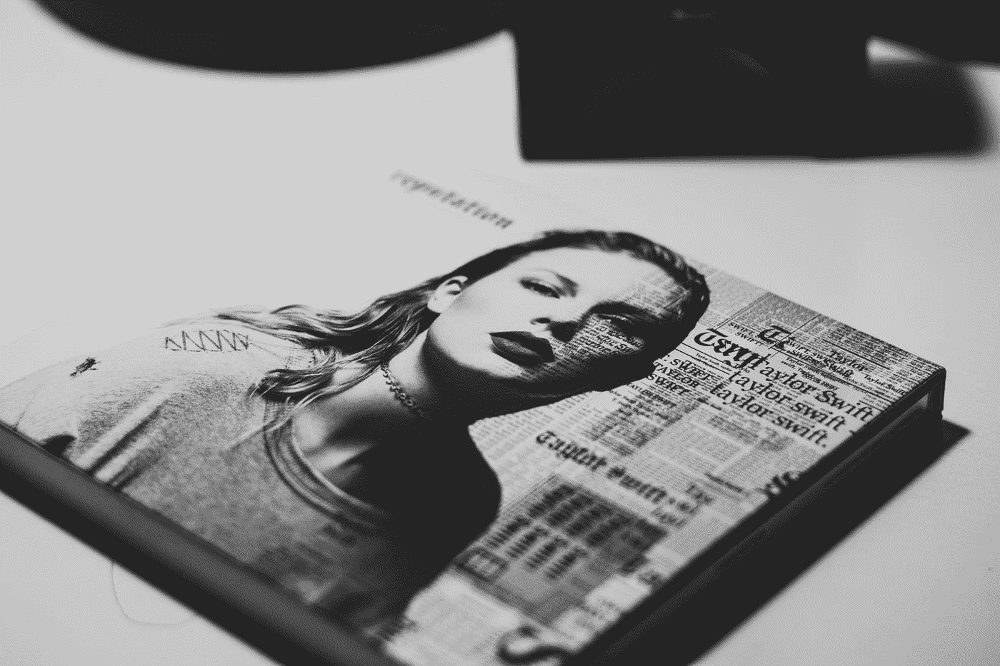
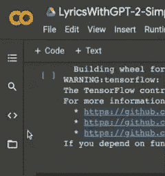

# A.我写泰勒斯威夫特的歌曲。GPT-2

> 原文：<https://towardsdatascience.com/lyrics-by-taylor-swift-ft-a-i-80f69f9dbe14?source=collection_archive---------16----------------------->

## 训练人工智能模型生成泰勒斯威夫特歌词的简单指南



拉斐尔·洛瓦斯基在 [Unsplash](https://unsplash.com?utm_source=medium&utm_medium=referral) 上的照片

没有人能否认泰勒·斯威夫特是多么值得称赞和强大。她的影响深远，超越了几代人。随着她越来越多地出现在公众面前，我们看到她的音乐从乡村音乐到流行音乐到电穿孔音乐，最近又出现了*民谣*和*永恒、*独立音乐和民谣。

九张完整的专辑都有自己的年代，这是一个有趣的数据集。本文将探讨如何使用 [GPT-2](https://openai.com/blog/better-language-models/) 基于她截至 2021 年 2 月发布的所有歌曲生成歌词。我在 [azlyrics](https://www.azlyrics.com/) 的帮助下整理了这些数据，并决定使用 [Google Colaboratory](https://colab.research.google.com/) 和 [GPT-2-simple](https://github.com/minimaxir/gpt-2-simple) python 包来训练这些数据。

# 简要技术背景

[GPT-2](https://openai.com/blog/better-language-models/) (生成式预训练变形金刚 2)是基于[变形金刚架构的开源人工智能。](https://ai.googleblog.com/2017/08/transformer-novel-neural-network.html) [GPT-2-simple](https://github.com/minimaxir/gpt-2-simple) 是一个 python 包，它将[微调](https://github.com/nshepperd/gpt-2)到 GPT-2 的文本生成脚本，使文本生成更容易。Max Woolf 的这个 python 包让 GPT-2 变得非常容易访问，他有一个极好的博客详细介绍了它的工作原理和使用方法。如果你想获得更彻底的技术理解，请查阅最后的*参考文献*部分的阅读资料。

事不宜迟，这些是用 GPT-2 生成新的泰勒斯威夫特歌词的步骤。

# **设置**

*   创建一个新的[谷歌合作实验室](https://colab.research.google.com/)笔记本。你需要一个谷歌账户，而且你必须使用 chrome。
*   转到编辑->笔记本设置。确保为硬件加速器选择了“GPU”。
*   导入依赖项并加载包

```
%tensorflow_version 1.x
!pip install -q gpt-2-simple
import gpt_2_simple as gpt2
from google.colab import files
```

*   下载 GPT-2

```
gpt2.download_gpt2()
```

*   在左侧的“文件”菜单中上传您的 dataset.txt 文件



# 微调和培训

*   下一步将开始根据数据集对模型进行微调和训练。我将它设置为在 124 米的最小模型中运行 1000 步的训练。

```
sess = gpt2.start_tf_sess()gpt2.finetune(sess, dataset=dataset.txt,
model_name='124M',
steps=1000)
```

以下是培训过程中产生的样本中一些有趣的片段:

有一些情感的东西:

```
I'm so sad, so sad, so sad 
I'm so sad, so sad, so sad 
Oh, so sad, so sad  
I'm so sad, so sad, so sad 
I'm so sad, so sad, so sad  
My name is whatever you throw at me 
It's all just a blur 
I'm so sad, so sad, so sad 
I'm so sad, so sad, so sad  
I'm so sad, so sad, so sad 
I'm so sad, so sad, so sad  
**What died didn't stay dead, it died alive,** oh, oh
```

一些温和的激励性的东西:

```
I was throwing stones, trying to stop you 
But you got mine And the long haul is free 
I threw them all at me 
Every day is a choice, even when you aren't a choice 
You're still trying to figure it out, just like I was 
You throw these things at me, but I'm throwing back stones 
You see I'm brave 
And the long haul is free I threw them all at me, yeah 
**Every day is a choice, even when you aren't a choice** 
You're still trying to figure it out, just like I was
```

一些令人困惑的东西:

```
You talked shit, you said sorry, 
you were just kidding 
You were losing it, losing it, losing it 
They said the end is near, 
but we'll mark it with a smile 
We were wrong and come back around here  
So it goes... - You started it - 
**It expired just now -** 
It's been a long time coming, can you tell me now I don't wanna miss you like this
```

一些自爱的东西:

```
Life was a willow and it bent right to your wind 
So you gotta belong somewhere  
Hey, that's my arse 
That's my dress 
Hey, that's my skirt 
Hey, that's my hat 
That's my hat  
It's not that easy in your world 
It's that simple 
**But I got that arse**
```

有些焦虑:

```
I'm sick and tired of your reasons 
I've got no one to follow me 
You tell me that you want me then cut me down 
And I'm sick and tired of your reasons 
I've got no one to follow me 
**You ask me for my love then you lead me to your grave** 
It's your turn, yours is good 
Turn around and find something else 
It's your turn, ours is good
```

到最后，事情开始变得更有意义了:

```
I promise you I'm not a saint 
But I'll do anything to get you 
**Ridiculed by your shapeshifting urges 
And she's passing laws that will make you her end game** 
All that I know is that you're my number one priority 
And I'm starting to see how you feel about me
```

# 歌词生成和结果

最后，训练完成后，您可以通过运行以下命令生成歌词:

```
gpt2.generate(sess)
```

通过反复运行此命令，您可以创建任意多的歌曲。以下是我生成的一些:

1.  我要把这首歌叫做*你还在上学吗？*原因很明显。

```
I'm just another thing for you to roll your eyes at, honey 
You might have him but haven't you heard 
I'm just another thing for you to roll your eyes at, honey 
You might have him but I always get the last word  
Just another day at school, now why are you here? 
Because I, I know, I know.  
Are you still at school? 
Are you still at school? 
Are you still at school? 
Are you still at school? 
Are you still at school? 
Are you still at school? 
Are you still at school? 
Are you still at school? 
Are you still at school? 
Are you still at school? 
Are you still at school? 
Are you still at school? 
Are you still at school? 
Are you still at school? 
Are you still at school? 
Are you still at school? 
Are you still at school? 
Are you still at school? 
Are you still at school? Hey, all you had to do was...  Stay. 
I don't wanna do this to you. 
I don't wanna do this to you. 
I don't wanna do this to you. 
I don't wanna do this to you. 
I don't wanna do this to you. I, I, I... Iculus 
The screen is your screen. 
**I'm your furniture.** 
I'm your skin and my bones. 
I'm my lifeline. 
I'm my queen. 
I'm my new self.  
Reconnect with my family and I'll show you what you know. 
Music starts playin' in the living room. 
Hang up, don't fall into anyone's trap. 
This is our place. 
Let you know that this is not what we had been. 
Music starts playin' in the kitchen. 
Sit and watch what we've been up to. 
Play back what we learned.  
And you'll realize that what you see is what you know. 
In the wildest winter, just know that I've been spending the last eight months "on edge" 
I mean it, I'm just gonna shake it off, I'm just gonna shake it off. I mean it, I'm just gonna shake it off, I'm just gonna shake it off.  **Well, maybe you and I are just a couple of the many nicknames** 
I'm afraid I'm getting 
Just know I'm not letting up until the day I die
```

2.这一次有点像情绪过山车。我想不出一个合适的名字，除了也许，*请不要爱上我，我永远不会离开你。*

```
And there's a dazzling haze, a mysterious way about you 
In dreams I've been yours before  
In wonderland 
Back when we were still changing for the better 
I reached for you like a rarefied love 
You kissed me on the cheek and said we were forever dreaming [In dream sequence:] 
You're in the car on the way to the movies 
You're in the car on the way to the movies 
You're in the car on the way to the movies 
And the fakers run wild Screaming, "Give me a reason" 
Why don't I just drive around 
And see what's under that attitude 
What's under that attitude 
**I don't want you like a patchwork of other people's tears** I don't want you like a prize for me 
I don't want you like a prize for me  
'Cause you're my best friend 
I'm always dreaming about you 
And I'm never leaving you alone 
I'm never leaving you alone  
**So, please don't be in love with me 
I'm never gonna leave you alone** 
I'm never gonna leave you alone 
Nothing's gonna make me run again 
I'm never gonna leave you alone 
I'm never gonna leave you alone  
'Cause, baby, now I'm scared 
I don't know what's down this road 
I don't know what to think about 
I don't know what to say 
I'm never gonna leave you alone 
I'm never gonna leave you alone Singing, baby, sing me down 
Don't know what's down this road 
I don't know what to think about 
I don't know what to say  
Let me hope you never lose me 
Let me hope you never lose me  
You're my best friend 
I'm always dreaming about you 
And I'm never leaving you alone 
I'm never leaving you alone  
Singing, baby, 
sing me down 
Don't know what's down this road 
I don't know what to think about 
I don't know what to say 
I'm never gonna leave you alone[Instrumental] Oh, I remember you taking flight 
Taking off with me, honey 
Just in case you hadn't noticed 
Just in case you hadn't noticed [Instrumental] 
Have you ever thought just maybe would it be nice if I was yours? **Would it be cool if I was theirs?
Would it be cool if I was yours?** 
'Cause it's been years of hoping 
Never seen it this way. 
And we've been walking alone 
We're not speaking to each other, 
no matter what we say. 
It's been years of hoping. It's been years of hoping.
```

3.最后一首可能是悲伤或忧郁的青少年颂歌？我要把这个叫做*看台上的鬼。*

```
This playful trend is gonna keep you laughing 
Ever since I met you Oh, I'm only seventeen 
I don't know anything new to say 
I sit and watch you 
But I know you're making friends And I'm only seventeen 
So, playful thing 
**Play it cool, stay out of your eyes** 
**And I'll poke your fancy car** 
If it's a trend And you're gonna follow suit 
And I promise that nobody's gonna love you like me  
In the winter, in the icy outdoor pool 
**In the dead of night, life was just a dream** 
But you knew it when you saw it,  
I was dancing when the phone rings, 
And I'd show you what you don't see 
I'd hit the ground running, 
And I say, "I'm sorry for that night." **The night we frosted up 
There's a ghost in the stands** 
The one and only me 
Who isn't afraid 
To break my heart 
Be honest with you I'm not afraid at all 
I'm only seventeen 
I don't know anything 
Now I'm walking down the hall 
I should've known from the first look 
That I'm not the only one 
Who feels that way 
So I'm taking this chance to say 
That I'm sorry for that night. 
```

# 结束语

这些都是我用来训练人工智能模型生成泰勒·斯威夫特歌词的步骤。GPT-2-简单是一个伟大的和容易的方式来玩 GPT-2 免费与最小的努力，并有许多方法来定制它。您可以更改模型大小，添加更多步骤，添加各种检查点以重新开始训练，等等。，以在各种文本数据上产生不同类型的结果。

我很开心地阅读了其中的一些歌词，我绝对认为它们有泰勒斯威夫特的感觉，但没有她的抒情深度。虽然里面有一些深刻的台词，但这些人工智能创作的歌词会像 T.S .一样赢得格莱美奖吗？大概不会。

你可以在这里找到数据集和所有使用的代码。

# 参考

[Max Woolf 的博客:如何用 GPT-2 定制人工智能生成的文本](https://minimaxir.com/2019/09/howto-gpt2/)

[GPT-2-简单](https://github.com/minimaxir/gpt-2-simple)

[OpenAI:更好的语言模型及其含义](https://openai.com/blog/better-language-models/)

Transformer:一种用于语言理解的新型神经网络架构