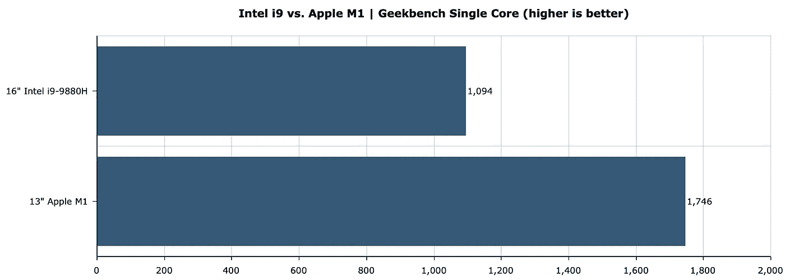
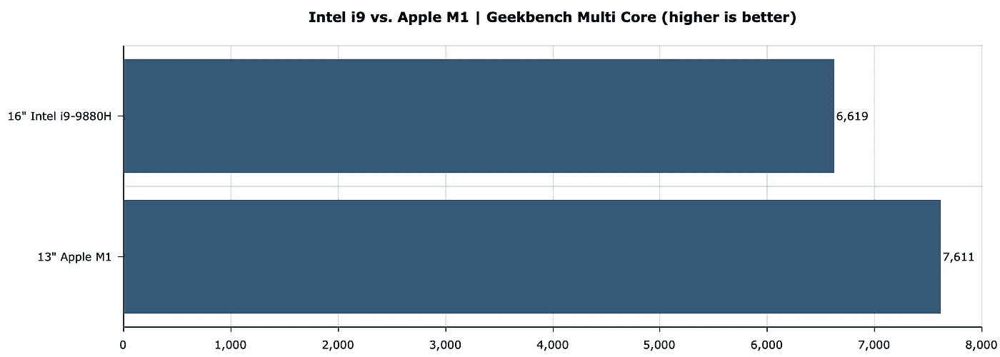
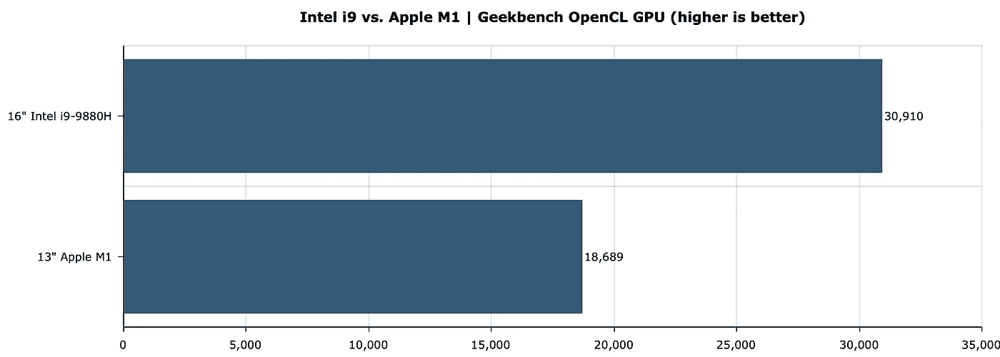
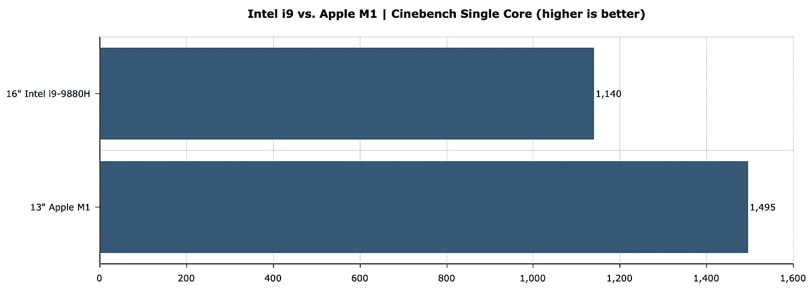
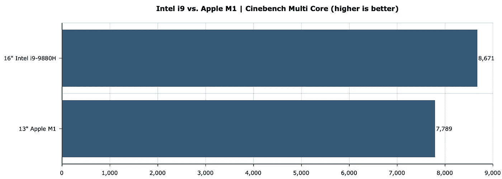
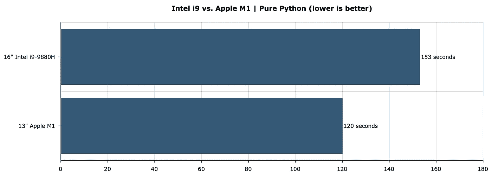
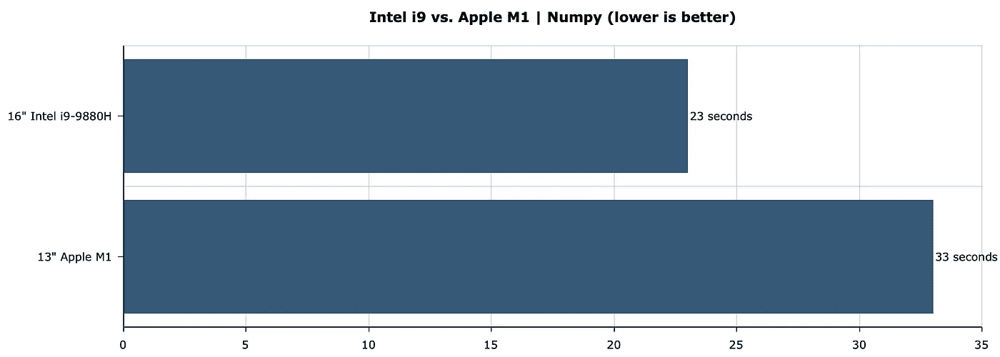
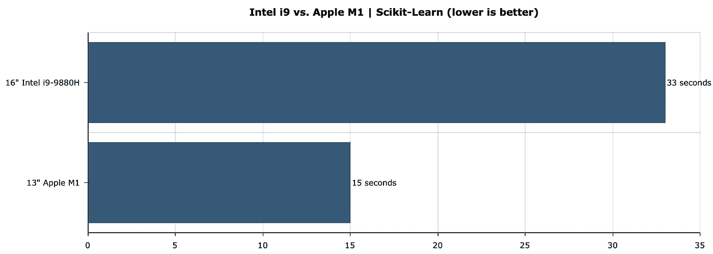

# M1 MacBook Pro 与英特尔 i9 MacBook Pro —终极数据科学比较

> 原文：<https://towardsdatascience.com/m1-macbook-pro-vs-intel-i9-macbook-pro-ultimate-data-science-comparison-dde8fc32b5df?source=collection_archive---------0----------------------->

## M1 vs . i9–9880h—与 synthetic benchmarks、Python、Numpy、Pandas 和 Scikit Learn 的性能比较。

丹尼尔·科尔派在 [Unsplash](https://unsplash.com/s/photos/mac?utm_source=unsplash&utm_medium=referral&utm_content=creditCopyText) 上拍摄的照片

M1 芯片是革命性的。谁能说苹果的第一代芯片会和英特尔几十年的工程技术擦肩而过呢？M1X 和 M2 芯片让未来看起来很有希望，但这一代人仍然有很多东西可以享受。

今天，我们将在综合基准测试中比较两台机器，pure Python、Numpy、Pandas 和 Scikit-Learn 性能:

*   【2019 年的 16 英寸 MacBook Pro—英特尔酷睿 i9–9880h，16GB 内存，AMD 镭龙 Pro 5500M(在美国约为 3K 美元)
*   【2020 年的 13 英寸 M1 MacBook Pro——苹果 M1 芯片，8GB 统一内存，8 个 GPU 核心(在美国约 13000 美元)

请记住，这些只是简单的编程和数据科学基准，在测试的每个领域还可以(也将会)做更多的工作。敬请关注。

今天的文章结构如下:

*   综合基准— Geekbench 和 Cinebench
*   比较纯 Python 性能
*   比较 Numpy 性能
*   比较熊猫的表现
*   比较 Scikit-Learn 性能
*   最后的想法

# 综合基准— Geekbench 和 Cinebench

除了您稍后将看到的性能差异之外，还有一件重要的事情需要注意——基于英特尔技术的 16 英寸 MBP 运行温度很高。非常性感。以至于你不能把它放在膝盖上使用，至少夏天不能。M1·麦克没有这个问题。它的风扇只是在测试的最后几分钟才启动。

让我们从单核中的 Geekbench 分数比较开始:

图 1 —单核中的 Geekbench 比较分数(图片由作者提供)

只是哇。那台价格几乎是三倍的机器根本就不存在。让我们看看这是否同样适用于多核测试。请记住，英特尔 i9–9880h 有 8 个内核:

图 2——多核中的 Geekbench 对比分数(图片由作者提供)

可笑。没什么要补充的了。

让我们回顾一下 Geekbench 中的 GPU 测试。这种比较并不是 100%公平的，因为 M1 Mac 没有专用的 GPU。结果如下:

图 GPU 中的 Geekbench 对比(图片由作者提供)

几乎是专用 GPU 的两倍，但这是意料之中的。接下来，我们来看一下 Cinebench 中单核和多核的比较。这是针对单核的:

图 4 —单核中的 Cinebench 比较分数(图片由作者提供)

M1 芯片再次领先。让我们看看多核测试的结果:

图 5 —多核中的 Cinebench 比较分数(图片由作者提供)

这些机器有点接近，但基于英特尔的 Mac 这次赢了。总之，两者都是非常有能力的机器，但人们会期望 i9 每次都以显著的差异获胜，至少根据价格。

***获胜者——M1 MacBook Pro。*** *它在大多数情况下都是性能更好的机器，不会融化你的裤子。*

# 比较纯 Python 性能

第一次为数据科学配置 M1 芯片可能会很痛苦。这个过程与英特尔芯片不同，至少如果你想在本地运行所有的东西。幸运的是，这里有一个你可以遵循的分步指南:

</how-to-easily-set-up-m1-macbooks-for-data-science-and-machine-learning-cd4f8a6b706d>  

我们将在纯 Python 测试中完成几个相对简单的任务:

*   创建一个包含 100，000，000 个介于 100 和 999 之间的随机整数的列表 l
*   平方 l 中的每一项
*   对 l 中的每一项求平方根
*   乘以相应的平方和平方根
*   划分相应的平方和平方根
*   对相应的平方和平方根执行整数除法

因为这是一个纯 Python 测试，所以不允许使用第三方库。下面是代码片段:

结果如下:

图片 6 —纯 Python 性能比较(图片由作者提供)

这不是一个显著的差异，但仍然是 M1 芯片的一个明显的胜利。

***获胜者——M1 MacBook Pro。*** *以三分之一的价格先完成了。*

# 比较 Numpy 性能

下面您将看到在该基准测试中执行的任务列表:

*   矩阵乘法
*   矢乘法
*   奇异值分解
*   乔莱斯基分解
*   特征分解

最初的基准脚本取自*Github 上的[Markus Beuckelmann](https://gist.github.com/markus-beuckelmann/8bc25531b11158431a5b09a45abd6276)*，并稍作修改，因此开始和结束时间都被捕获。脚本看起来是这样的:

结果如下:

图 7 — Numpy 性能比较(图片由作者提供)

Numpy 是一个不同的故事。测试在英特尔芯片上完成得更快，最可能的原因是在 M1 芯片上找不到的*英特尔数学内核库* (MKL)。

***获胜者——英特尔 i9 MacBook Pro。*** *Numpy 只是工作速度更快。暂时如此。*

# 比较熊猫的表现

这个基准测试与用纯 Python 完成的非常相似。执行了相同的操作，但是结果被合并到单个 Pandas 数据帧中:

*   创建空数据框
*   给它分配一个 100，000，000 个 100 到 999 之间的随机整数的列(X)
*   对 X 中的每一项求平方
*   对 X 中的每一项求平方根
*   乘以相应的平方和平方根
*   划分相应的平方和平方根
*   对相应的平方和平方根执行整数除法

下面是代码片段:

结果如下:

图 8——熊猫性能对比(图片由作者提供)

英特尔 i9–9880h 是一款非常强大的处理器，但在这项任务中，它看起来也无法与 M1 芯片匹敌。

***获胜者——M1 MacBook Pro。*** *它既快又无声。*

# 比较 Scikit-Learn 性能

让我们坚持这里的基本原则，并执行以下任务:

*   从网上获取数据集
*   执行训练/测试分割
*   声明一个决策树模型，找到最优超参数(2400 个组合+ 5 重交叉验证)
*   用最佳参数拟合模型

这或多或少是一个标准的模型训练过程，不考虑测试多种算法、数据准备和特征工程。

下面是测试的代码片段:

结果如下:

图 9-sci kit-Learn 性能比较(图片由作者提供)

结果不言自明。我没有什么要补充的。

***赢家——M1 MacBook Pro****。两倍的速度，三分之一的价格。*

# 最后的想法

M1 芯片绝对是革命性的。我已经完成了你在文章中看到的基准测试，编写并编辑了整篇文章，并播放了 40 分钟的《网飞》——**仍然有 83%的电池剩余！**

M1 MAC 电脑没有专用的 GPU，但这并不是一个问题。很有可能，你不会使用任何笔记本电脑来完成耗费资源和时间的任务，尤其是在我们谈论深度学习的时候。在云中做效率要高得多。

因此，对于日常的数据科学和分析工作，M1 似乎是一个不错的选择——出色的性能，保持凉爽，电池可持续两个工作日。如果你想买一台新的 Mac，并且你需要的一切都与 M1 芯片兼容，我看不出有什么理由再花 2 到 4 倍的钱去买英特尔的产品。

*你有什么想法？您的配置与 M1 芯片相比如何？运行基准并让我知道。*

*喜欢这篇文章吗？成为* [*中等会员*](https://medium.com/@radecicdario/membership) *继续无限制学习。如果你使用下面的链接，我会收到你的一部分会员费，不需要你额外付费。*

<https://medium.com/@radecicdario/membership>  

# 了解更多信息

*   [2021 年学习数据科学的前 5 本书](/top-5-books-to-learn-data-science-in-2020-f43153851f14)
*   [如何使用 Cron 调度 Python 脚本——您需要的唯一指南](/how-to-schedule-python-scripts-with-cron-the-only-guide-youll-ever-need-deea2df63b4e)
*   [Dask 延迟——如何轻松并行化您的 Python 代码](/dask-delayed-how-to-parallelize-your-python-code-with-ease-19382e159849)
*   [如何用 Python 创建 PDF 报告——基本指南](/how-to-create-pdf-reports-with-python-the-essential-guide-c08dd3ebf2ee)
*   [在 2021 年成为一名数据科学家，即使没有大学文凭](/become-a-data-scientist-in-2021-even-without-a-college-degree-e43fa934e55)

# 保持联系

*   在[媒体](https://medium.com/@radecicdario)上关注我，了解更多类似的故事
*   注册我的[简讯](https://mailchi.mp/46a3d2989d9b/bdssubscribe)
*   在 [LinkedIn](https://www.linkedin.com/in/darioradecic/) 上连接