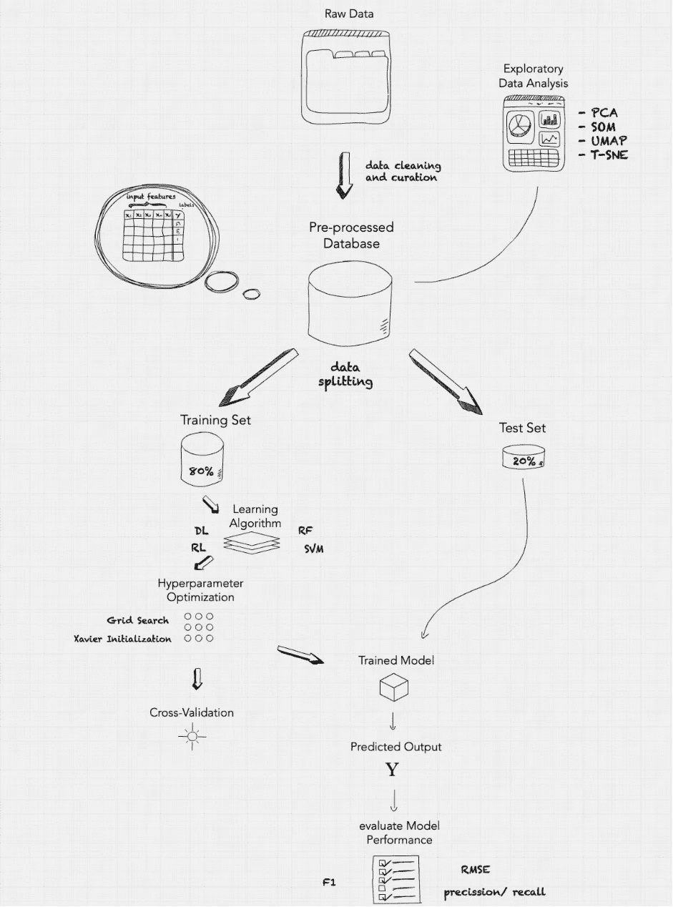
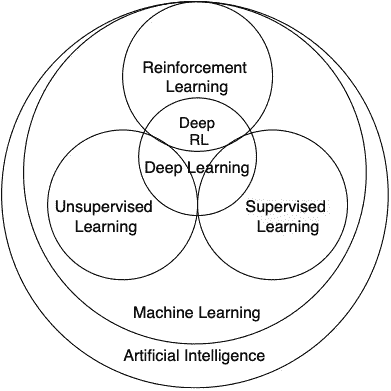

# 系统工程视角下的机器学习

> 原文：<https://towardsdatascience.com/machine-learning-a-systems-engineering-perspective-1be9d13040e7?source=collection_archive---------23----------------------->

## [入门](https://towardsdatascience.com/tagged/getting-started)

## 本文使用基本的系统工程原理对机器学习采取了一种整体的方法。使您能够理解和管理大多数机器学习系统中的基本构件。你将学习如何从数据到预测。

图 1:机器学习系统设计

# 目录

1.  [系统工程原理](#2b31)
2.  [机器学习](#ff73)
3.  [探索性数据分析](#80f9)
4.  [培训子系统](#68b1)
5.  [评估](#016b)
6.  [示例](#d5c8)

## **系统工程原理**

系统工程试图通过将复杂的项目分解成可管理的、定义明确的子系统来理解全局。本文将利用基本的系统工程原理，将机器学习作为一个由交互元素组成的系统来介绍。本文中术语的使用是对系统是由相互作用的部分组成的有目的的整体这一基本思想的阐述。作为这些系统的一部分的每个元素本质上是原子的(即，不可进一步分解),并且使用描述性特征来建模。这降低了复杂性，并通过允许管理当局获得机器学习流水线的高级视角来支持任务独立性。

## **机器学习**

在机器学习中，一切都源于通过数据对真实世界环境的近似表示。因此，正确的数据对于应用的机器学习模型的成功至关重要。尽管“正确”这个术语有些模糊，而且完全依赖于任务，但是在项目启动之前，还是需要考虑一些重要的因素。首先，我是否拥有这些数据，或者我是否可以许可这些数据？越多人能接触到相同的数据流，竞争就越激烈。我只会将这种策略应用于严格的数据保护法下的商业用例。如果数据不是个性化的，并且没有限制，我会推荐开源你的数据，每个人都可以贡献。其次考虑；我可以访问连续的数据流吗？通过根据最新的数据样本重新训练模型，可以不断提高模型的准确性和泛化性能。收集正确数据的整个过程被称为数据挖掘。

后续步骤是数据预处理。为了创建高质量的机器学习系统，提高数据质量和促进有意义的见解的提取至关重要。该过程包括数据点的去重、归一化和变换，以及特征提取和选择。到那时，数据通常被组织在表格结构的数据库中。在我们的例子中，输入特征可以是图像的像素或语音频率，用相应的标签或注释来组织。前面提到的结构描述了一个标准的监督学习场景，它将在本文中用于说明目的。除此之外，机器学习一般包含三类算法；监督学习、非监督学习和强化学习。

图 2:机器学习中的子类

## **探索性数据分析**

在开始开发之前，对于机器学习模型应该从数据中学习什么，你可能只有一个模糊的策略或目标。为了培养你的想法，探索性数据分析(EAD)可以作为一个探索阶段来获得数据的初步解释。通过直观地绘制来总结主要特征有助于理解数据集。这主要是通过从维度上减少数据来推断主要特征和趋势。此外，EDA 是探索性研究和概述范围的重要工具。因此，允许项目经理识别系统需求。

## **培训子系统**

培训子系统可分为三个阶段；选择学习算法，优化超参数，并根据数据训练模型。在第一阶段——选择学习算法——有已经存在几十年的传统机器学习算法，如随机福里斯特(RF)或支持向量机(SVM)。然而，这一系列文章将主要关注基于神经架构的算法。我认为最有前途的两种算法是深度学习(DL)和深度强化学习(DRL)，因为这两种算法都非常适合 GPU 计算和数据量。

选择学习算法和模型架构后，第二步是超参数优化。超参数是不在模型中直接学习的参数。它们用于配置模型(例如，决策树的数量及其深度或深度神经网络的层数等。)或成本函数(梯度下降算法的学习率等。).在训练期间，该算法对数据集进行多批迭代。当模型暴露于数据集中的每个数据点一次以相应地更新内部模型参数(例如权重)时，定义一个时期。

## **评测**

这种迭代持续多个时期，直到达到某个性能分数或时期的目标数量。虽然训练模型是一个关键步骤，但衡量模型在未知数据上的泛化性能也是一个同样重要的方面，应该在每个机器学习管道中加以考虑。泛化是在未观察到的样本(新数据)上表现良好的能力。机器学习的主要挑战是减少泛化误差。可以使用交叉验证来近似计算。它提供了一个框架，其中 80%的数据集专门用于训练，其余 20%分别用于测试和验证。在每个时期之后，模型的性能分数被连续计算。

## **例子**

假设，我们要开发一个自动诊断黑色素瘤皮肤癌的 app。一种方便的患者端解决方案是拍摄受影响皮肤的照片，并将其上传到应用程序。后端机器学习模型然后应该预测给定图像的黑色素瘤皮肤癌的概率。要开发下面的系统，我们可以按照前面提到的步骤。我们用来训练模型的数据集是 SIIM-ISIC 黑色素瘤皮肤癌数据集。它包含 44，000 个黑色素瘤皮肤癌的标记图像。任何预处理和转换步骤都已经完成。我们可以使用 2016 年博览会(脸书)推出的一款 [ResNeXt](https://arxiv.org/abs/1611.05431) -101 模型架构。该架构包含大约 4400 万个参数，这些参数将在 35000 个训练图像上共同学习。在训练期间，模型内部试图最小化损失函数，例如交叉熵损失，其相应地更新参数。诸如误差(精确度/召回率)、精确度、MSE、F1 分数之类的性能分数近似于在 9.000 个看不见的图像/标签上评估的精确度和概括能力。在模型通过验证阶段后，它可以用于对上传的图像进行在线实验推断。我们不会详细讨论我们需要继续进行的进一步步骤，直到我们可以发布该项目，因为我们在这里只关注技术实现。

现在，我们对所涉及的技术构件有了基本的了解。我们将在下一篇文章中使用上述建模技术来设计一个生产就绪的机器学习系统。这涉及到更多的组件，如项目设置、数据管道和关于服务的详细阐述，包括测试、部署和维护。