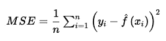

# 在回归设置中评估机器学习模型的准确性

> 原文：<https://towardsdatascience.com/machine-learning-accuracy-regression-59f72c36eeb4?source=collection_archive---------27----------------------->

## 讨论如何在回归设置中评估机器学习模型的性能

戴安娜·波莱希娜在 [Unsplash](https://unsplash.com/s/photos/accuracy?utm_source=unsplash&utm_medium=referral&utm_content=creditCopyText) 上拍摄的照片

## 介绍

在机器学习领域，当应用于不同的环境和问题时，没有一种方法可以保证是最佳的。

一种特定的方法可能最适合一个特定的数据集或问题，但同样的方法应用于不同的数据集时可能就太弱了。选择最合适的方法是机器学习模型开发中最具挑战性的部分之一。

在今天的文章中，我们将讨论在回归设置中评估和选择机器学习模型时，您应该始终牢记的几个概念。

## 如何评估模型性能

为了评估一个特定的模型，我们显然需要某种定量的度量，以某种方式告诉我们模型预测与实际数据相比如何。

最终，这种度量还将帮助我们比较各种模型，以便我们可以根据特定的项目标准选择表现最佳的模型。

现在，根据我们想要评估的具体方法，我们可能需要使用一种能够量化其性能的方法。

## 均方误差

在回归设置中，最常用的测量方法之一是均方误差(MSE ),它由下面给出的公式定义。

均方误差方程

在哪里

*   *n* 是观察次数
*   *y* 是实际值
*   *f(x)* 是第 *i* 次观察的预测值

较低的 MSE 值表示较强的模型性能，这意味着预测值和实际值更接近，而较高的 MSE 表示较弱的模型性能。

## 要考虑哪些观察结果

当计算训练观测值的 MSE 时，我们通常称之为训练 MSE。然而，我们最感兴趣的是评估模型对未知数据进行预测的能力(例如，测试数据包括在模型训练阶段没有观察到的数据)。

因此，在评估回归模型时，我们需要观察**测试 MSE** ，这将从本质上告诉我们模型对未来数据的表现如何。尽管测量训练 MSE 可能仍然有用，但我们需要选择给出**最低测试 MSE** 的模型(假设这是您真正关心的唯一指标)**。**

那么，如果我们只考虑测试 MSE，为什么还要测量训练 MSE 呢？答案相当简单。如果特定模型的训练 MSE 较小，但同时测试 MSE 显著较大，则该模型可能过度拟合。

当模型过于严格地遵循训练观察时，会发生过度拟合，达到甚至学习噪声的程度，从而不能很好地推广到新的、看不见的数据点。

## 最后的想法

模型评估是机器学习模型开发过程中最重要也是最具挑战性的阶段之一。在今天的简短指南中，我们讨论了均方误差，这是在回归设置中评估模型时最常用的测量方法之一。

此外，我们讨论了训练和测试 MSE 之间的差异，以及它们在评估模型性能时各自扮演的角色，以及这些值之间的巨大差距如何可能表明过度拟合。

注意，当我们必须处理大量的观察数据时，我们也可以计算平均误差的平方。

[**成为会员**](https://gmyrianthous.medium.com/membership) **阅读介质上的每一个故事。你的会员费直接支持我和你看的其他作家。你也可以在媒体上看到所有的故事。**

<https://gmyrianthous.medium.com/membership>  

**你可能也会喜欢**

</accuracy-interpretability-trade-off-8d055ed2e445>  </parametric-vs-non-parametric-methods-2cea475da1a>  </inference-vs-prediction-b719da908000> 