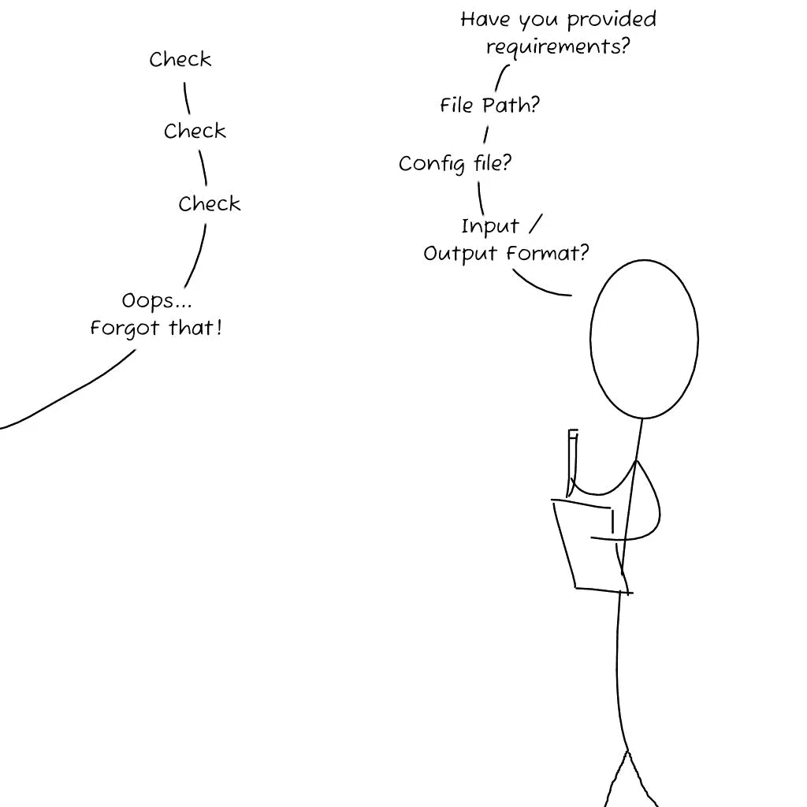
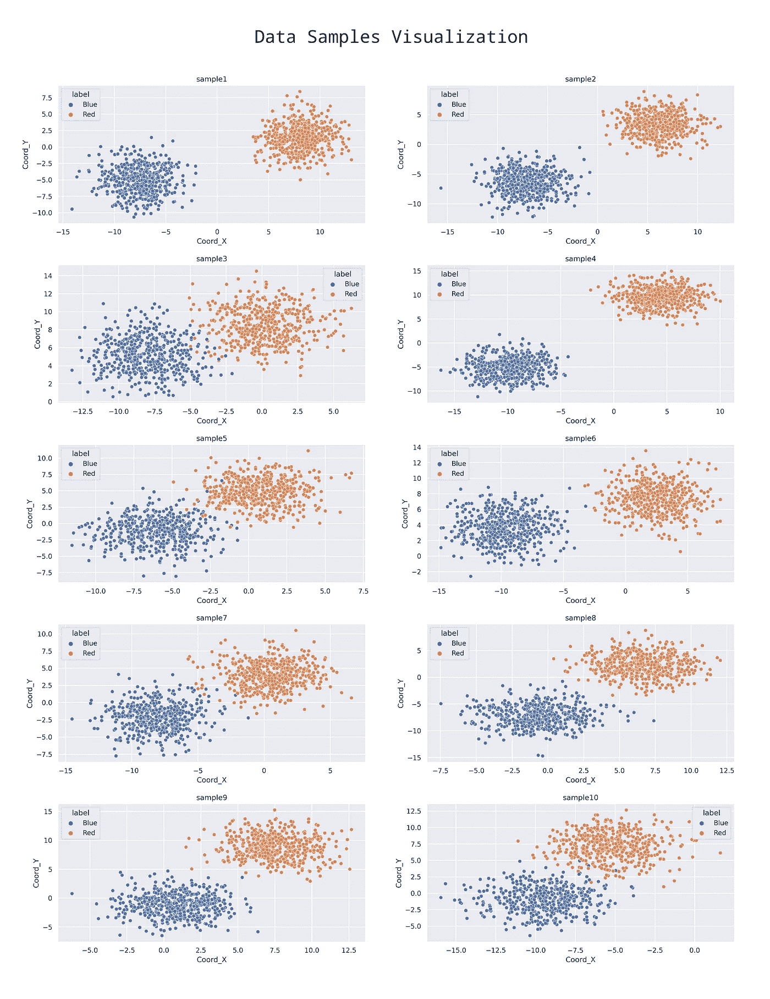
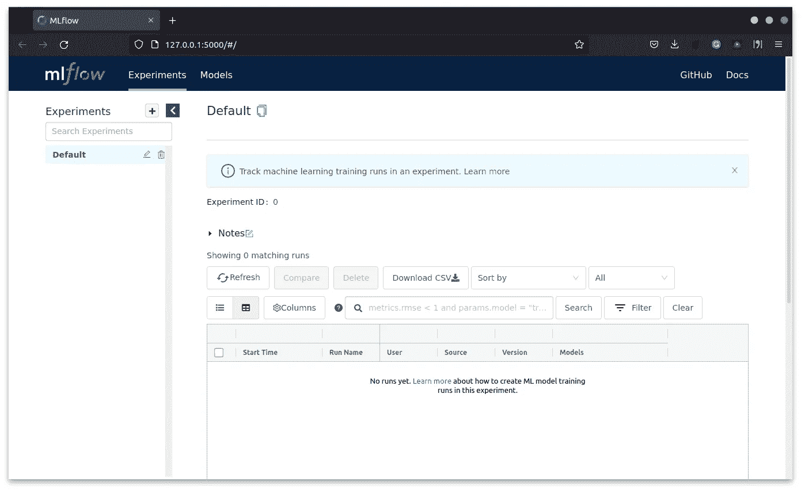
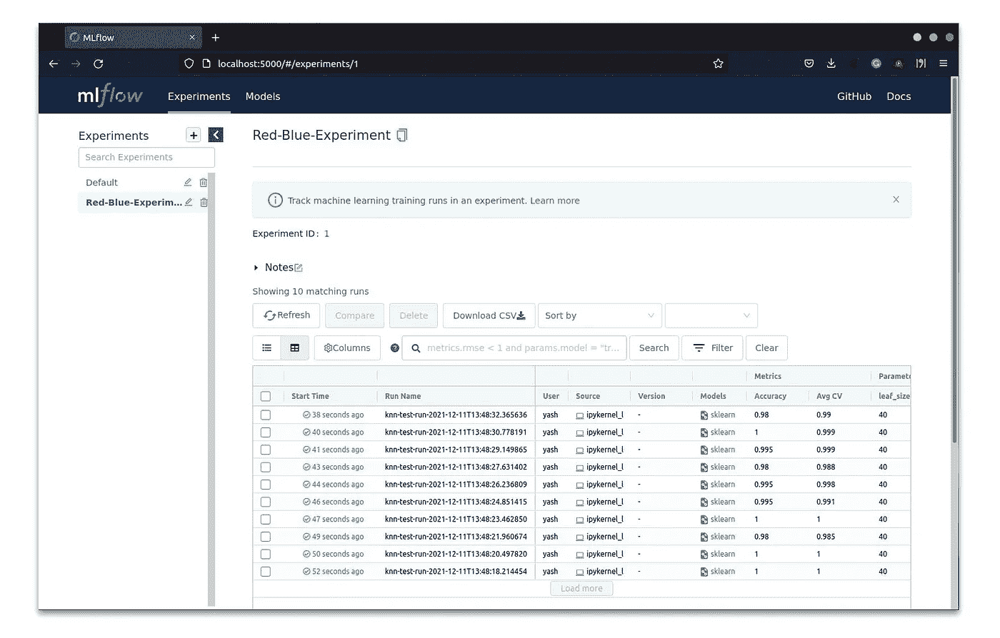
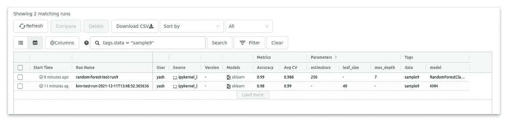
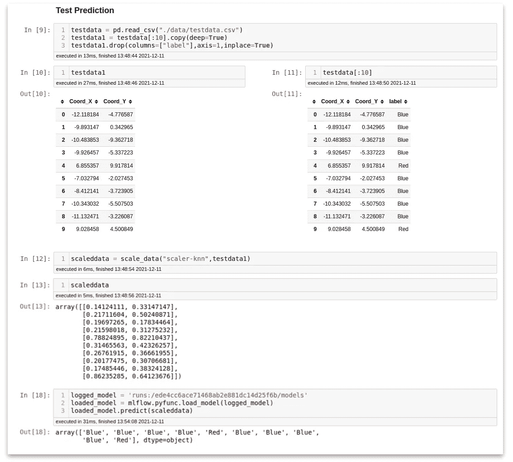
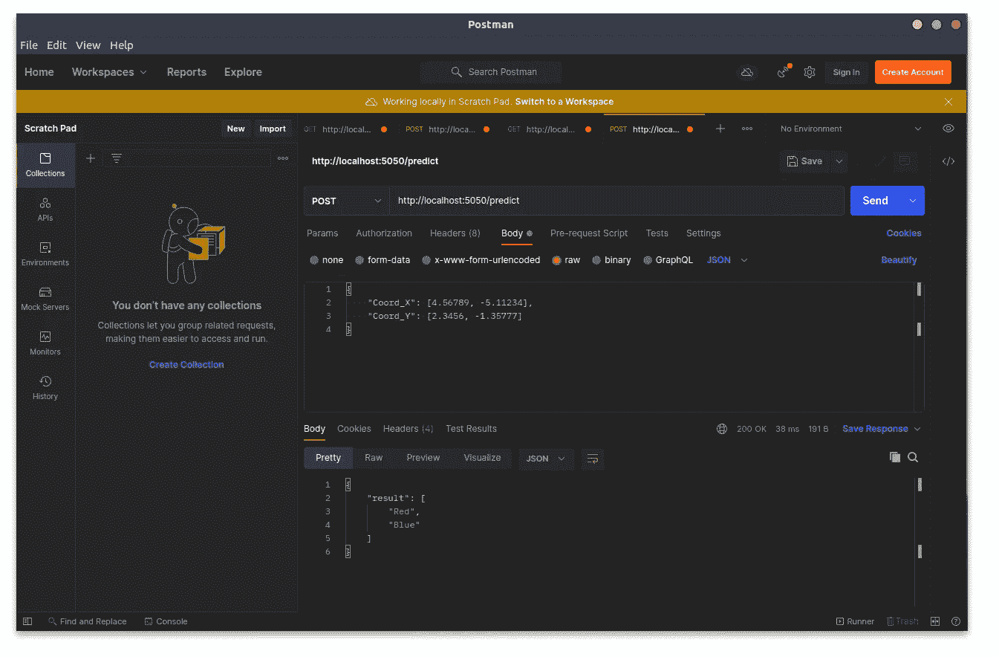
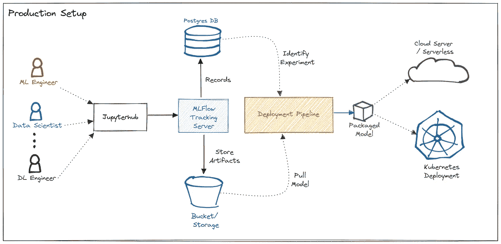

# 使用 MLFlow 的机器学习冒险

> 原文：<https://towardsdatascience.com/machine-learning-adventures-with-mlflow-64127713b0a1?source=collection_archive---------12----------------------->


作者图片

## 在本地系统上构建 ML 工作流

你好。

这篇文章是写给任何想开始使用 MLFlow 的人的。我们将探索 MLFlow 的概念，使用 MLFlow 实现简单的端到端 ML 工作流—从在笔记本中创建模型到打包和部署模型。之后，我将解释如何将这个简单的工作流程转化为生产级别的模型管理。

我们将在工作流程中融入一些 MLOps 概念，如*模型训练、模型评估、打包和模型部署。*要了解 MLOps 及相关概念，可以阅读我的[其他文章](/a-gentle-introduction-to-mlops-7d64a3e890ff)

我们开始吧！

## 什么是 MLFlow？

MLFlow 是一个开源的端到端平台，用于管理 Databricks 提供的机器学习生命周期。还有一个供企业使用的托管 MLFlow 版本。

在本文中，我使用开源版本。

## 好吧！为什么我需要 MLFlow？

大多数数据科学家和 ML 工程师能够在他们的笔记本电脑和台式机上创建一个模型。他们可能使用 Anaconda、Jupyter 或其他 IDE 来编写他们的 ML 模型。当他们必须随着时间的推移提高他们的模型性能时，以及当一个团队的多个成员处理同一个模型时，会出现以下问题

*   跟踪模型中所有调整过的参数。
*   记录输出、准确度和误差分数。
*   维护模型及其相关数据对象(定标器、估算器、编码器等)的记录。)
*   将他们的模型版本化。
*   与团队成员共享模型——其他成员在他们的系统上运行模型需要哪些先决条件/设置。
*   用 API 包装他们的模型并部署它，将需要额外的编码和技术栈知识。

这就是 MLFlow 发挥作用的地方，它减轻了学习全新技术堆栈来维护、跟踪和部署模型的痛苦。提供简单的 API，您可以将它们集成到模型代码中，这样您就可以将模型部署到生产环境中了。

# 好吧！我需要知道哪些概念？

在我们一头扎进编码部分之前，我们需要了解一些关于 MLFlow 的概念。

## **模特跟踪**


我们更新了吗？(图片由作者提供)

作为一名数据科学家或 ML 工程师，您将花费大量时间来改进您创建的模型。跟踪您调整了哪些参数，哪些特定的组合能让您获得更好的性能，以及您需要比较哪些误差指标，这变得很乏味。模型跟踪是一个需要理解的重要概念。当您将所有的指标和度量都制成表格并随时可用时，跟踪模型性能和比较模型就变得更加容易了。

所有这些额外的簿记工作都由 [MLFlow 跟踪 API](https://www.mlflow.org/docs/latest/tracking.html)负责。

## **ML 项目**

所有开发的软件通常都遵循一种设计或架构模式，但机器学习并非如此。ML 模型没有特定的结构或架构模式，每个问题都涉及一组不同的需求和设计。在团队或组织中跨系统共享代码和设置模型变得很困难。

MLFlow 创建了一个标准化的模式和结构，涵盖了大多数 ML 用例，并使代码易于移植。您可以提供目录结构、希望模型运行的环境的详细信息以及模型的入口点，即模型需要什么输入。把它看作是一个 ML 模型的简要总结，它会告诉你这个模型是什么，它需要运行什么，你需要提供什么输入，你会得到什么输出。



检查旅客名单！(图片由作者提供)

## **ML 车型**

一旦您的模型准备好了，您希望您的模型被部署到云或边缘设备上。您需要打包您的模型来部署它。打包一个模型包括指定你的模型需要什么样的环境，你的模型的特征是什么*也就是说，你的模型需要什么样的输入，输入应该以什么格式提供？*一旦您将模型打包，您就可以将它存储为 pickle 格式，并且可以进行部署。

MLFlow 提供了各种内置格式，用于根据库或风格打包模型。例如:Tensorflow，Sklearn，Keras，H20，XGBoost 等。

## **模型注册表**

随着您不断用新数据改进模型，您将拥有不同版本的模型，它们具有不同的准确性、误差水平和其他指标。生产中的模型可能与开发阶段的不同。 [MLflow 模型注册表](https://www.mlflow.org/docs/latest/model-registry.html)帮助您跟踪哪个模型出现在哪个阶段。您甚至可以在不需要时将一些旧型号存档。


啊！困惑(作者图片)

现在我们已经理解了 MLFlow 中的概念，是时候将它们应用到实践中了。我将向您展示如何在您的本地系统中引入简单的机器学习管道，从那里我们将看到它如何扩展到生产系统。

# 示例—红色/蓝色分类器

我们有一组空间点的数据。我们的工作是分类给定的点是属于红队还是蓝队。我们训练一个分类器来帮助我们完成这项任务。我在这个 g [ithub-repo](https://github.com/yashaswi-nayak/mlflow-adventure) 里提供了全套的样本数据和 jupyter 笔记本，这样你就可以跟着做了。

> **注意:**这个例子是为了帮助你理解如何执行和跟踪 ML 实验。我将专注于如何利用 MLFlow 进行训练、跟踪和部署，而不是如何构建或训练最准确的分类器。

***这个例子是在 Linux 系统(Ubuntu)上创建的。只要你安装了 Python 和 Docker 就可以在 Windows 上工作。***

## **让我们从数据开始**

您可以在 repo 的*数据*文件夹中看到数据样本。这是样本的可视化



数据样本可视化(图片由作者提供)

从数据中可以看出，红点多在右侧和右上方区域；蓝色点位于左侧和左下角区域。您还会注意到 x 轴和 y 轴的刻度是如何不断变化的。**因此，我们需要设计一个二元分类器，它能够随着尺度的变化而训练。**

## 在本地启动 MLFlow 服务器

在我们开始构建有史以来最伟大的分类器之前，我们需要在本地系统上启动 MLFlow 服务器。使用 python 下载 mlflow 库

```
$ pip3 install mlflow
```

在您的本地系统上克隆我提供的 github repo，在终端中打开文件夹，运行以下命令启动 mlflow 服务器

```
$ mlflow server --backend-store-uri sqlite://mlruns.db --default-artifact-root file://$PWD/mlruns
```

这个命令做三件事

*   创建一个名为 *mlruns.db* 的 sqlite 文件来记录所有实验和相关数据
*   创建一个本地 *mlruns* 文件夹来存储所有模型及其相关数据
*   在您的系统上启动 [http://127.0.0.1:5000/](http://127.0.0.1:5000/) 上的 MLFlow 服务器

现在，您可以在您最喜爱的浏览器中浏览到该链接，并查看仪表盘。



MLFlow 仪表板(图片由作者提供)

现在我们已经启动并运行了服务器，我们可以开始构建分类器了。

## 训练模型

您可以按顺序运行 Jupyter 笔记本中的代码单元格。我们有 3 个功能— **转换 _ 数据、训练 _ 模型和缩放 _ 数据。**这些函数帮助我们训练分类器。

我们在这里训练两种分类器:

*   k 最近邻分类器
*   随机森林分类器

您可以运行**培训和跟踪**部分下的单元。一旦单元运行，您将在 MLFlow 仪表板中获得条目。



物流跟踪(图片由作者提供)

在这里，我们注意到实验运行是如何整齐地为我们列出来的。仪表板过滤器甚至允许我们搜索和过滤特定的运行。



MLFlow 搜索(图片由作者提供)

你可能会问— **为什么我们没有通过合并样本来使用整个数据集？**

我们可以在整个数据集上运行训练，但我的目标是解释如何在真实场景中使用 MLFlow。

> 现实世界中的数据不是干净的，数据格式不正确，数据不是 100%准确，并且数据永远不会完全可用。

通过将数据分成样本，我们可以复制我们的模型在一段时间内将如何遇到新数据，并用新数据训练我们的模型。

现在我们已经训练了我们的模型，我们可以用它以前从未见过的单独数据来测试它(真实世界的场景)。运行**测试预测**部分下的单元。在这里，我们加载数据，加载我们保存的缩放器，加载模型——您可以选择任何模型，只需替换仪表板中某个实验运行的 *runId* 。



预测结果(图片由作者提供)

看看我们分类器的魔力。

## 打包并部署模型

现在我们手上有了一个很棒的分类器，你想把它分享给你的朋友和队友。有两种方法可以部署您的模型

1.  MLFlow 服务(无代码方法)
2.  模型的自定义包装

## MLFlow 发球

您可以使用命令在本地系统上直接运行该模型

```
$ mlflow models serve --model-uri runs:/ede4cc6ace71468ab2e881dc14d25f6b/models --port 5050
```

要跨服务器或在其他系统上部署它，我们需要打包模型。我已经编写了一个示例 docker 文件，它将帮助我们打包模型。

文档要点

> 注意:您可以在命令和 docker 文件中根据自己的选择更改 runId 和端口号

使用以下方法构建 docker 映像

```
$ docker build -t my-awesome-model .
```

您可以使用运行映像

```
$ docker run -d -p 5050:5000 my-awesome-model:latest
```

您也可以将其发布到 Dockerhub 或您选择的 docker 注册表。

## 自定义包装

您必须明白，您使用 *mlflow serve* 部署的模型假设您已经给出了已缩放的输入，但情况可能并不总是如此。有时我们需要在模型中使用一些额外的 API，比如说`/health` API 或者`/visitors` API 来检查模型被使用了多少次。

为了包含额外的配置，我们编写自定义包装器，通常使用 Flask 或 FastAPI。你可以在`app_wrapper.py`文件和 repo 的 Dockerfile 文件中找到例子。

您可以使用 Postman 应用程序测试该模型，如果使用 mlflow 服务器，发送 POST 请求，如图所示`/invocations`，如果使用自定义包装器，则发送`/predict`。



邮递员中的 API 测试(图片由作者提供)

我们导入数据，构建分类器，在多个数据样本上训练它，并在本地部署它。恭喜你！您已经使用 MLFlow 创建了第一个 ML 管道。👏

# 生产工作流程

现在您已经掌握了工作流是如何在本地系统中实现的，我们将学习工作流是如何在生产中实现的。



示例制作设置(图片由作者提供)

在生产设置中，我们通常包括一个 JupyterHub 服务器，它具有用户访问管理功能，用于对模型进行编码。此 JupyterHub 服务器连接到 MLFlow 跟踪服务器以进行日志记录实验。实验数据记录在 Postgres 数据库中，这是一个功能强大的数据库，具有很高的可靠性和性能。

生成的模型存储在 S3 存储桶或远程 FTP 服务器上。

记录模型和实验记录后，将触发 ML 管道进行部署。可以使用像 Jenkins 或 GoCD 这样的 CI/CD 服务器，这个管道完成包装、构建和打包模型的工作，正如我们在上面看到的。当模型打包就绪后，将部署到所需的公共云或私有云。

# 生产技巧

以下是团队管理大规模模型开发工作流的一些技巧

*   使用**标签识别模型，随着实验列表的增加，更容易编目和搜索**。
*   **记录与模型相关的所有指标**，这有助于我们跟踪模型谱系并评估模型随时间的性能。
*   为培训中使用的数据添加标签，有助于了解数据如何随时间变化。使用 GitLFS 或 DVC 进行标记和版本控制。
*   为每个不同的问题集创建一个新的实验，**不要将所有的实验运行都塞进一个**中，确保实验名称是唯一的。
*   如果一个模型足够好，可以进行测试和部署，在 MLFlow 中注册该模型，这将有助于我们在模型生命的不同阶段跟踪该模型。
*   版本你的模型，简单的版本风格可能是 3 点版本。即`awesome-model:1.2.3`将是`**model-target.performance.pipeline/data**` **模型-目标**将是一个重大变化，如果模型被完全修改或目标数据被完全改变，那么**性能**将是如果模型的性能随着时间的推移而改善，并且**最后一个数字**是不同的数据版本或管道构建号。
*   **尽量保持清晰一致的输入签名和格式**，如果模型需要作为数据框架或张量输入，请指定。由于发送的大多数请求都是 JSON 格式的，所以 MLFlow 确实会隐式转换它，但是如果您正在为模型编写一个自定义包装器，那么开发人员需要了解数据或比例转换。
*   MLFlow 可以将模型直接部署到 Sagemaker 和 Azure，确保您选择了合适的实例进行部署，**不要盲目选择默认选项**(即对于 30Mb 大小的模型，在 AWS 上使用 c5 大实例将会完全浪费计算能力)。
*   如果使用包装器进行模型部署，**确保使用生产就绪包装器，如** [**FastAPI**](https://fastapi.tiangolo.com/) 。如果正在使用烧瓶/ Django，添加[独立 WSGI 容器](https://flask.palletsprojects.com/en/2.0.x/deploying/wsgi-standalone/)。
*   使用 S3 桶或基于 S3 的存储(Minio)来存储模型。这有助于在部署的实例之间维护和转移模型。
*   到目前为止，在使用开源 MLFlow 时，可以在 S3 存储和 Jupyterhub 添加访问限制。受管 MLFlow 提供与笔记本电脑集成的身份验证和 ACL 规则，供企业使用。

这些观察来自我在跟踪和管理模型的个人经验。希望它也能帮到你。😄

跟踪、管理和优化模型是一个缓慢的过程。不断尝试 MLFlow，随着时间的推移，你会在模型管理方面做得更好。

目前就这些。下次见！保重。

再见！👋

## 参考

**ml flow**——【https://www.mlflow.org/docs/latest/index.html 

**KNN 分类器**—[https://sci kit-learn . org/stable/modules/neighbors . html #分类](https://scikit-learn.org/stable/modules/neighbors.html#classification)

**Github 回购示例**—[https://github.com/yashaswi-nayak/mlflow-adventure](https://github.com/yashaswi-nayak/mlflow-adventure)

文章中所有的插图/艺术品都是我用 Krita 创作的。