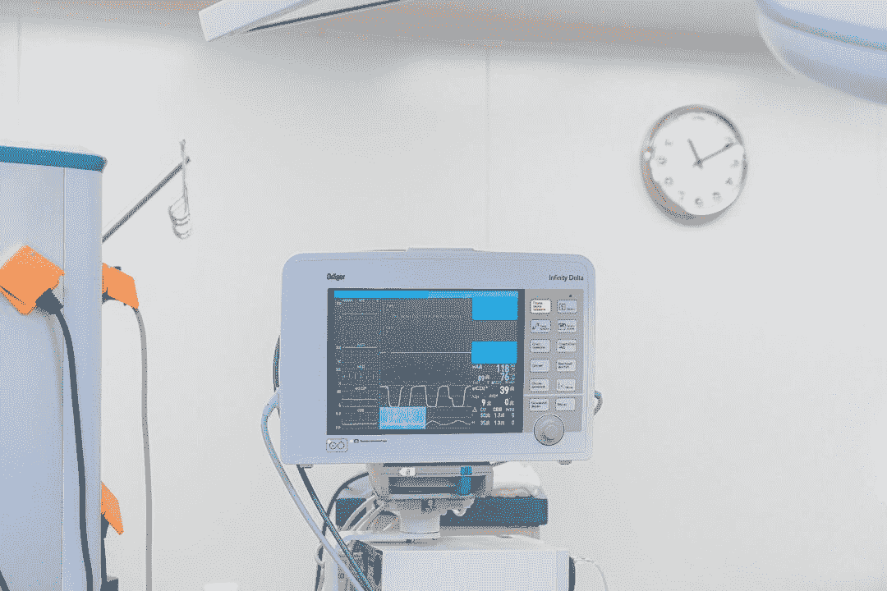
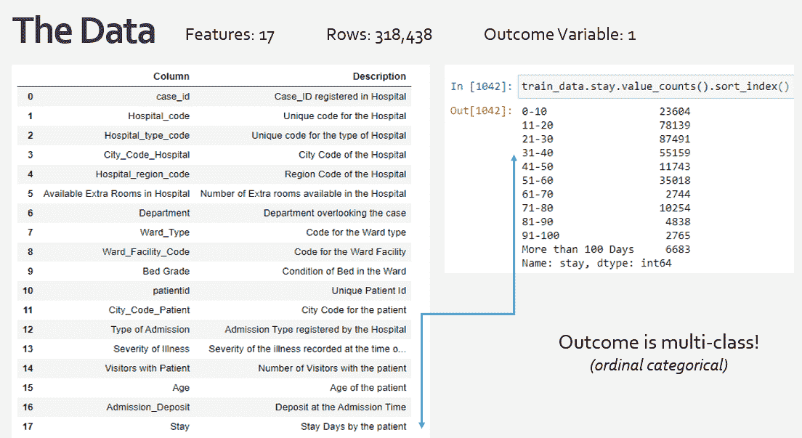
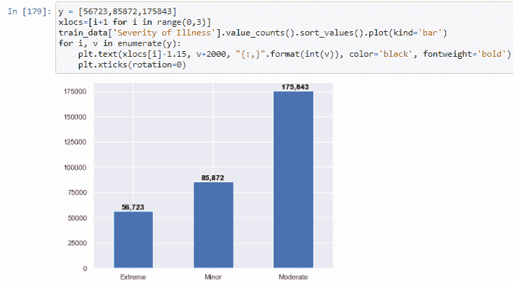
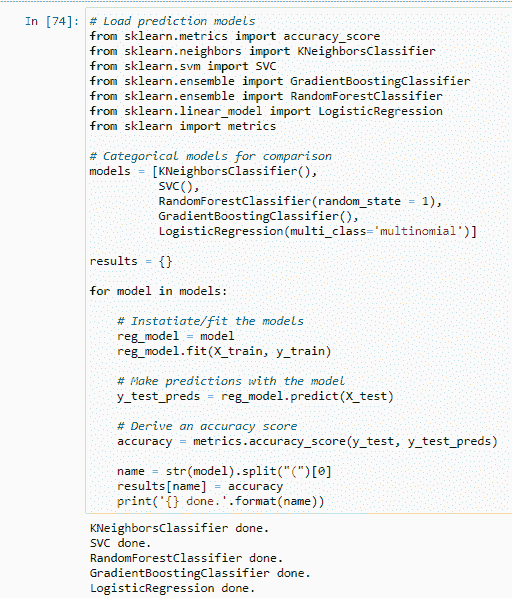
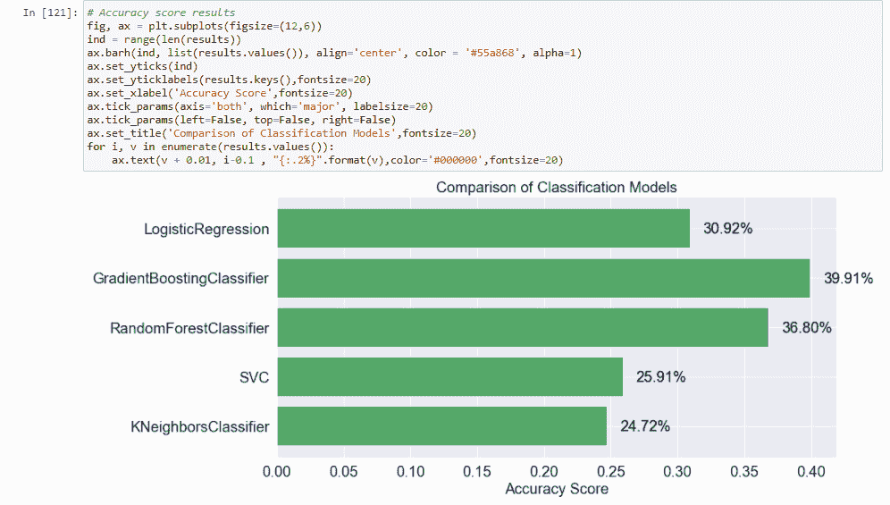

# 机器学习:预测患者住院时间的初步方法

> 原文：<https://towardsdatascience.com/machine-learning-an-initial-approach-to-predict-patient-length-of-stay-350e358ea8cb?source=collection_archive---------24----------------------->

图片由安娜·施韦茨拍摄

## **一些观察:**

患者住院时间(LOS)定义了患者在医疗机构住院的时间。尽管 LOS 的含义非常广泛，但在这里我们将重点关注它与医院环境中以下负面和相关结果的正相关性:

*   更大和意外的医院资源需求；
*   患者获得医疗保健相关感染(HAIs)的可能性；
*   增加付款人拒绝索赔的可能性，使医院面临财务风险

因此，预测损失的能力可能是有利的，因为它允许医院有时间更好地分配资源以满足意外需求，从而改善患者的健康状况，降低成本，并满足保险要求。

在这里，我描述了一个初步的方法来预测医院的杠杆损失。

## **工作方案:**

分析可以利用机器学习来进行 LOS 预测。有两个基本要求:(1)高质量的数据(2)高质量的模型。我们从数据开始。

在我们的模型中使用临床数据似乎是最显而易见的选择，比如提供者记录、治疗细节、实验室、程序等。但是，这些数据中的大部分直到患者已经入院数小时或数天后才可用，这使得这些数据无法用于做出主动决策。

但是，我们可以利用其他特征(即变量)，这些特征虽然看起来不太明显，但在患者入院时就可用。这些变量可能包括初始共付额、患者的邮政编码、入院部门、入院时与患者在一起的探视人数等。

## 训练和测试数据

我将使用 python 的 scikit-learn 库，使用对应于 318，438 名患者的 16 个特征变量来预测 LOS。这些数据在 Kaggle.com 的[公开发布。](https://www.kaggle.com/nehaprabhavalkar/av-healthcare-analytics-ii)

监督机器学习经常利用 python 的 *train_test_split* 包。这个包将我的数据分成 70%用于训练，30%用于测试。对于训练，我将构建一个学习算法来比较我的要素和它们的已知 LOS 结果之间的关系。然后，我将使用剩余的数据进行测试，并使用我的特征通过我的模型来预测 LOS。由于我已经知道这些特征的 LOS 结果，我可以将它们与我的预测进行比较，并得出范围从 0-100%的准确度分数。

注意，LOS 结果变量(下面标记为“Stay ”)实际上是多类序数。每个类的时间跨度从 10 天到“超过 100 天”，所以为了保存这个数据结构，我必须应用分类模型。如果我有入院和出院日期，我可以将这些类重新配置为连续的数据类型(即天数)，这将有助于我使用回归模型的方法。但是没有这方面的信息。

特征和结果变量(图片由作者提供)

从我们的数据来看，很明显外伤病例几乎是急诊病例的三倍。看看哪个类别对停留时间的影响最大将会很有趣。

录取类型(图片由作者提供)

疾病的严重程度显示，中度病例比极端或轻微病例多得多。人们可能期望极端情况与更高的损失正相关。

病情严重程度(作者图片)

接下来，我们需要一个基线准确度分数来评估我们的模型与随机机会相比表现如何。通过检查多数类对所有类的平均值，即 LOS 11–20 天，我确定我们的基线准确性为 27%。

现在，让我们创建一个循环(如下所示),该循环将评估不同的模型及其预测我们的损失结果的准确性。

预测模型的准确性概述(图片由作者提供)

我使用了不同的分类模型，每个模型都有自己的优缺点。例如，随机森林是对决策树模型的改进，它根据每个特征的重要性将患者分为不同的 LOS 类别。分割越大，特性越重要，在某种程度上，该特性被优先考虑。随机森林采用多个决策树的集合来减少方差(即过度拟合的数据)，因此可以更准确地预测新特征。问题是我们无法真正想象随机森林。这是一个“黑盒”模型，它创建了数千种不同的树来最好地预测 LOS。但是，我们可以找出特性的重要性，看看哪些特性对 LOS 的影响最大。

在下面的模型比较中，我们已经可以看到一些模型的表现优于我们开始时 27%的基线精度。

准确度分数(作者图片)

虽然其中三个模型有所改进，但为了达到尽可能高的精度，继续改进它们是很重要的。就目前的情况来看，我们的最佳模型仍会有一半以上的时间对患者 LOS 进行不正确的分类。然而，这第一步告诉我，GradientBoost 和 RandomForest 最有希望预测 LOS。

## 摘要

这里的结果类似于 Kaggle 上的顶级表现者，这是一个不错的开始。如果我现在将这些策略应用于真实的医院数据，我还会:

1.执行更多的数据准备-删除或输入丢失的数据，标记编码类别，分配虚拟变量等。

2.评估任何可能威胁我的准确性的特征相互作用，例如多重共线性、低特征重要性、同方差等。

3.调整模型超参数

感谢阅读！这是将在 GitHub 和 [LinkedIn](https://www.linkedin.com/pulse/machine-learning-initial-approach-predict-patient-verzino-mph/?trackingId=6yvNTaFUTpGkBRc%2FyuvtVQ%3D%3D) 上发布的综合报告的摘录。如果你对医疗保健和数据交叉的其他方式感兴趣，或者如果你有有趣的挑战要分享，请留下评论或 DM。