# 机器学习与慈善捐赠:案例研究

> 原文：<https://towardsdatascience.com/machine-learning-and-charity-donations-a-case-study-ed6e63f18db7?source=collection_archive---------18----------------------->

## 关于 Yemego NGO 如何使用机器学习技术来改善捐赠的深入方法

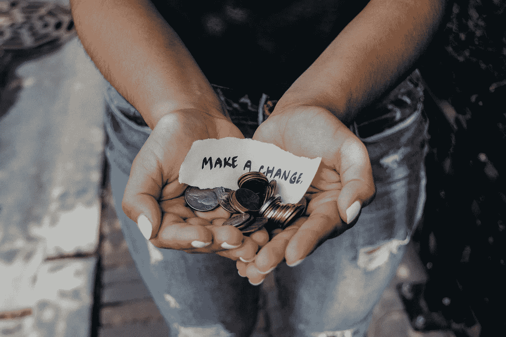

图片鸣谢:Katt Yukawa 不溅

> 为了这个项目的目的，我使用了两种有监督的机器学习方法。我比较了几种分类和回归模型，看它们能够在多大程度上识别未来的捐赠者，并估计他们将捐赠多少。这些模型被用来预测下次竞选的结果。

## 商业理解

Yemego NGO 是一个虚构的慈善组织，为患有脊髓损伤或疾病的退伍军人提供项目和服务。直接邮寄活动被用来为慈善组织筹集资金。利用以前的邮寄活动，慈善组织可以联系过去捐款的人。

这里的挑战是从以前的捐赠历史中吸取经验并做出预测。通过预测谁将捐款和估计捐款人将捐款多少，我们可以帮助节省为照顾弱势群体的实际工作所需的资源。降低 Yemego 成本的一个方法是通过确定最有可能向该组织捐赠的捐赠者来提高捐赠者外联的效率。由于邮寄每个活动捐助者的费用为 5 美元，该项目旨在根据过去的响应数据，只锁定最有可能的潜在捐助者，从而为 Yemego NGO 节省时间和金钱。

## 数据

本项目中使用的数据集是最初在 [KDD 杯’98 比赛](https://kdd.ics.uci.edu/databases/kddcup98/kddcup98.html)中提供的数据的子集。它包含训练和测试数据集。训练数据集包含 19，000 多条记录和 50 个分类、有序和定量变量，而测试数据集包含 2，000 多条记录和 48 个分类、有序或定量变量。此外，数据集包含两个目标变量，一个二进制变量指示一个人是否捐赠(Target_B)，另一个是此人作为对活动的响应而向慈善机构捐赠的金额(Target_D)。这些变量可以用来建立一个模型，以预测捐赠者是否会向慈善组织捐赠，并估计捐赠者会捐赠多少。

## **数据预处理**

我总是从查看数据开始。基本上就是寻找观察总数，特征总数，缺失值，哪些特征应该编码，哪些特征有杂数据等。为了便于分析，我将 Target_B 重命名为 Donated，将 Target_D 重命名为 Amount_donated。

看着训练数据集，我试图解决每个变量，我做了一些观察。在训练和测试中，捐献者年龄、收入组、财富等级和自上次响应以来的月份有缺失值。

捐献者年龄变量的最小年龄为 0，我认为这是不正确的。所以我把 0 岁换成了 nan。在绘制捐献者年龄变量时，我观察到数据是左偏的。所以我用中间值来填补缺失值。

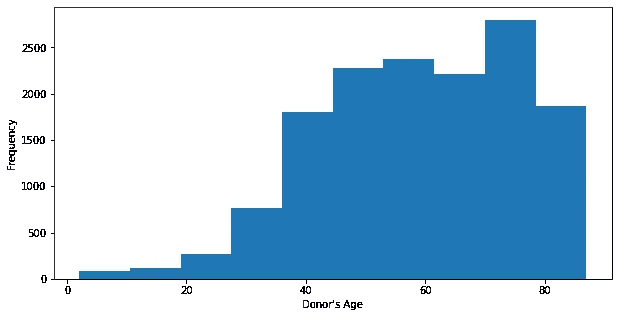

收入群体是绝对的，而且分布均匀。因此，我使用模式来填充缺失的值。

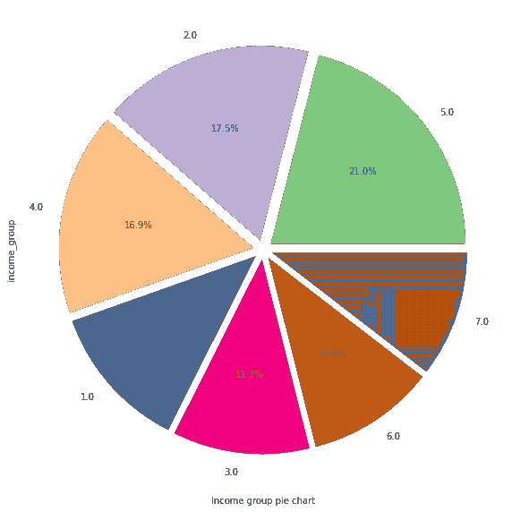

财富评级变量是绝对的。然而，在绘制变量时，我观察到它是左偏的。所以我用中间值来填补缺失值。

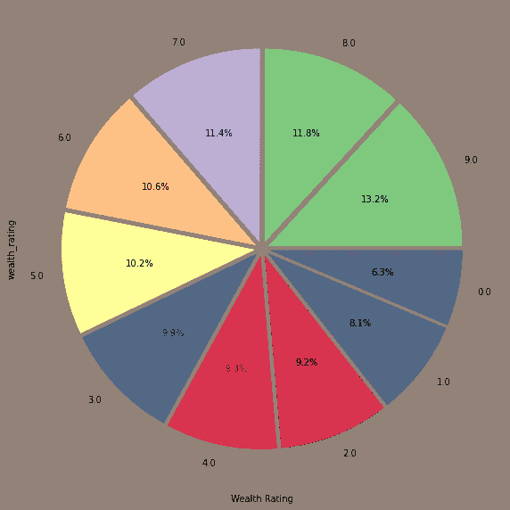

自上次回应以来的几个月是左倾的。因此，我使用中间值来填充缺失值。

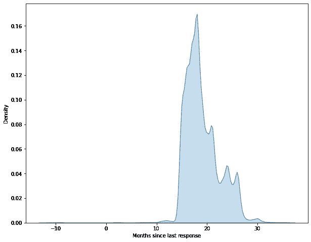

## 杂项数据

覆盖变量意味着从数据字典中取 3 个值；M=Metromail，P=Polk，B =两者都有。但是它需要 4 个值，第 4 个值是“N”，我认为这是一个错误，用值 m 代替了 N。

群代码变量具有带“.”的值。这将被替换为扩展群代码并赋予其值 54。

捐献者性别有 4 个值——男性、女性、未知和 A。我假设 A 值是错误的，因为它只有一个值。因此，这将被替换为一个未知值。

"?"代表未知。无论在哪里发现它，它都将被替换为“未知”值。

# **数据可视化**

显然有必要对原始数据集进行预处理，因为它包含缺失值和杂项数据。在处理可视化时，我总是喜欢将变量分为分类变量和数字变量。这有助于分析和可视化过程。

> 理想的做法是向所有愿意响应的人发送募捐信息，但是以更有可能捐款的人为目标是有用的。这可能有助于锁定与捐献者具有相似特征的新的可能捐献者。

以下是一些可视化:

从下面的数字中，我看到了捐赠变量。据观察，25%的以前的捐赠者进行了捐赠。

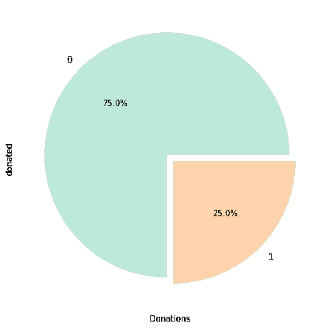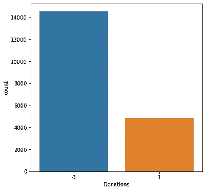

作为探索性分析的一部分，下图显示了捐赠在性别上的差异。同样，女性比其他性别群体捐赠更多。

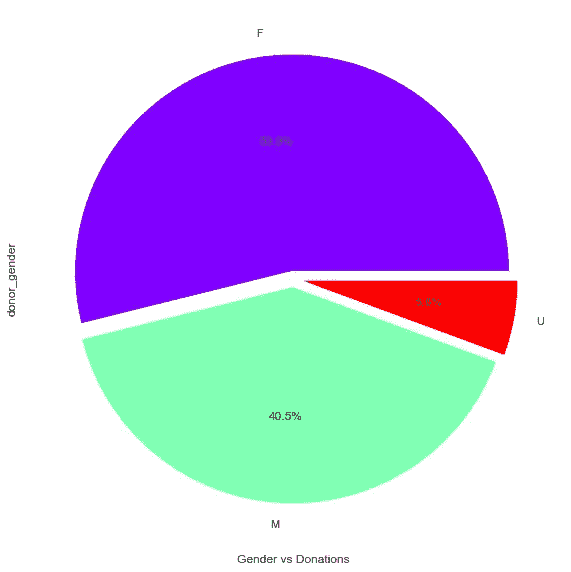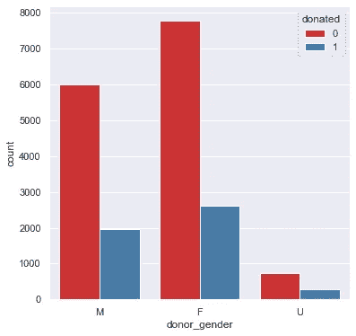

作为探索性分析的一部分，下图显示了不同房主的捐赠情况。同样，房主比其他群体捐赠更多。

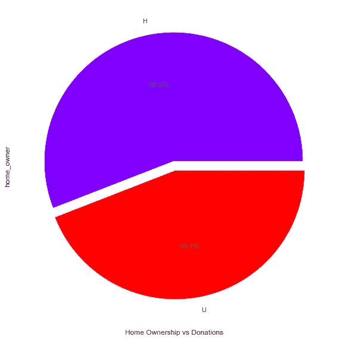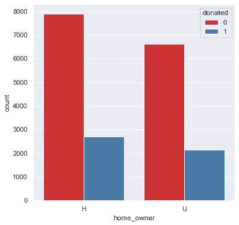

为了更深入的可视化，你可以在这里看到完整的分析[。](https://github.com/jindukwentua/Applying-Machine-Learning-to-Charity-donations)

## **数据建模**

对两个目标输出都进行了特征选择；捐赠金额和捐赠类别。在训练模型之前，我执行了数据预处理技术，例如将分类值转换为数值，移除不需要的特征，选择重要的特征，以及对数据集进行欠采样。

在我进入我为这个项目测试的不同模型之前，我将阐述如何判断一个机器学习模型的质量。当我决定一个模型的性能时，我看什么？分类问题的模型性能的三个主要度量是准确度、精确度和召回率。我关心的是确定积极的结果。用于选择最佳模型的度量是由公式真阳性/(真阳性+假阴性)给出的阳性回忆

**分类模型**

对于分类模型，我使用了

*   逻辑回归
*   决策树
*   集成方法
*   支持向量机(SVM)

我在清理后的供体数据上训练了上述模型。训练后，数据显示出对选择负面结果的高度倾斜，因为在训练数据中主要有负面的目标变量。这导致 0 目标值的高精度，意味着数据集有偏差。为了解决这个问题，对训练集进行了欠采样，以减少训练集中的负目标值。

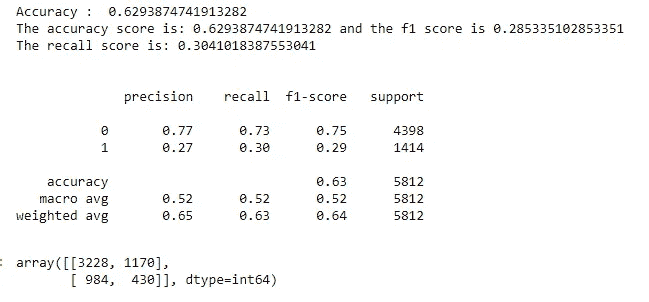

图片来源—金琴科

决策树模型是最适合该问题的模型，因为它返回 0.629 的准确性分数，并且在所有其他模型中具有最高的 0.304 的召回分数。我使用欠采样数据和前 20 个重要特征来训练干净的供体数据，以微调模型。这将模型的准确度降低到 0.528，但将阳性目标的召回率提高到 0.523。

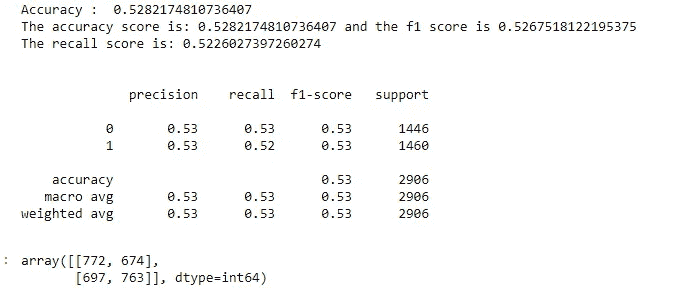

图片来源—金琴科

## 模型调整

我通过使用网格搜索进一步改进了决策树模型。这个想法是对一些参数使用不同的值，如估计器的数量或学习率，以获得更好的性能指标。

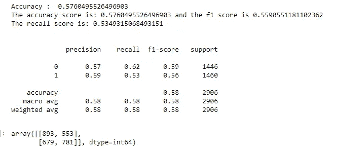

图片来源—金琴科

优化的模型比未优化的模型表现得更好。准确率从 0.528 提高到 0.576，召回率从 0.523 提高到 0.535。但是，可以采取进一步的措施来提高模型的整体性能。

## 回归模型

在训练模型之前，我使用变异膨胀因子(VIF)来检测和处理多重共线性。VIF 分析从训练和测试数据中消除了几个特征，并建立了回归模型。

有几种方法可以评估回归模型的模型性能。我用了 R 和 RMSE。R 给出 0 和 1 之间的值。R 越高，模型越好。RMSE 是误差的均方根。RMSE 越低越好。

对于回归模型，我使用了

*   线性回归
*   Lasso CV 回归
*   岭 CV 回归
*   随机森林回归量

## **车型评测**

我称之为关键时刻。这是你知道你的模型表现如何的地方。

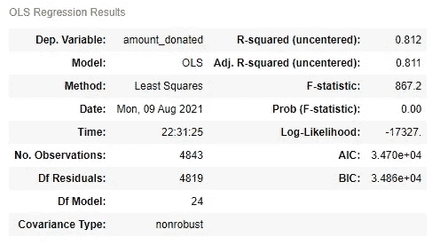

图片来源—金琴科

表现最好的回归模型是岭回归交叉验证模型，训练数据的 R 值为 0.466，测试数据的 R 值为 0.646。这意味着因变量(即捐赠金额)有 64%的变化，这是所选自变量可以解释的。例如，训练数据的 RMSE 值是 9.058，而测试数据的值是 7.474。

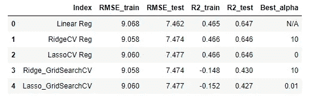

图片来源—金琴科

以下特征的存在决定了捐赠给慈善机构的金额:

> 上次赠与金额、最近平均赠与金额、房屋价值中值、终身最大赠与金额、终身赠与金额、百分比属性 3、百分比属性 4、终身最小赠与金额、财富评级、自起源起的月份。

## **总结**

我做了什么？我试图帮助 Yemego 非政府组织为其即将到来的募捐活动确定其有利可图的捐助者。我得到了慈善机构以前的数据集，并设置了 2 个目标变量。对最有可能捐赠的用户进行分类，并估算捐赠金额。我清理了数据，将必要的变量标准化并转换成数字特征，以建立预测模型。我将我们的数据分成训练集和测试集。我使用了两种受监督的机器学习方法、分类和回归模型来识别未来的捐赠者，并估计他们将捐赠多少。这些模型被用来预测下次竞选的结果。

## **未来工作**

在未来，探索其他模型将是有趣的，例如用于特征选择的单变量卡方方法。可以实现 Smote 上采样方法，并将其与当前结果进行比较，smote 上采样方法在上采样期间干扰了一些特征

## 脚注

你可以在我的 Github 库[这里找到这个项目使用的脚本！](http://www.github.com/jindukwentua)这些脚本在。ipynb 文件，所以你必须使用 Jupyter Notebook 或 Google Colab 打开它们。此外，如果你想讨论我的任何项目和其他研究想法，可以在 [Twitter](http://www.twitter.com/jxndu) 或 [LinkedIn](https://www.linkedin.com/in/jindu-kwentua-52a426156) 上联系我。下次再见！