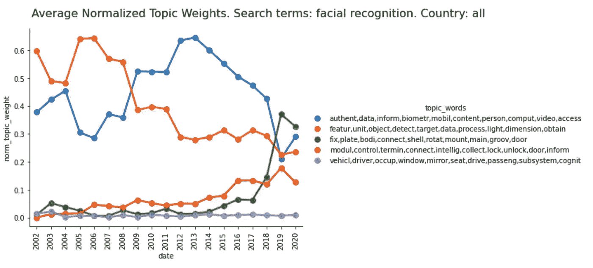
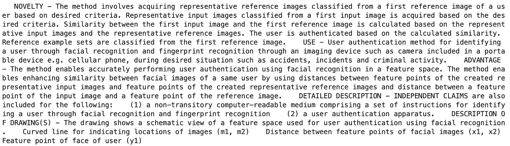
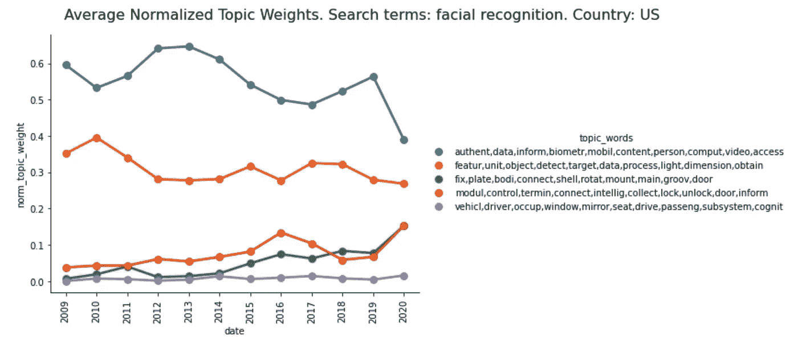
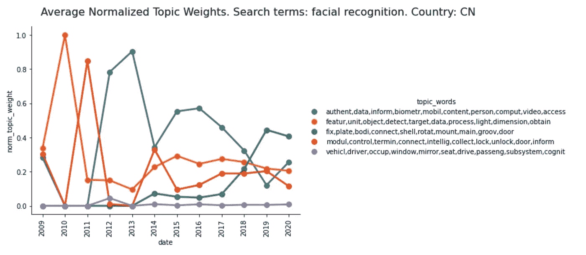

# 基于 LDA 主题建模的人脸识别专利分析

> 原文：<https://towardsdatascience.com/machine-learning-and-nlp-topic-modeling-with-lda-via-python-9ded3ccc963b?source=collection_archive---------31----------------------->

## 使用 Python 将机器学习应用于文本数据

弗拉多·帕诺维奇在 [Unsplash](https://unsplash.com?utm_source=medium&utm_medium=referral) 上拍摄的照片

# 介绍

作为一名数据科学家，文本数据提出了一个独特的挑战:虽然金融、年龄和温度数据可以立即注入线性回归，但单词和语言本身对统计模型毫无意义。有人怎么能模拟或分析一系列随机的、无意义的字母呢？大体上，这种类型的工作属于自然语言处理(NLP)的范畴，这是一项跨越多个领域的研究——计算机科学、语言学、人工智能，当然还有数据科学。

然而，对模型来说，重要的是模式，特别是文本数据语料库中单词的排列。使用机器学习的主题建模的统计方法使用这些模式来识别文本数据语料库中单词之间的关系。然后，它基于“主题”描述语料库，主题是模型推断属于一起的单词组。

在这篇文章中，我将解释主题模型如何使用一种叫做潜在狄利克雷分配(LDA)的机器学习方法来识别这些关系，这种方法比它的名字简单得多。然后，我将在从德温特创新索引数据库中提取的一些示例专利数据上实现这种方法，我通过克莱尔蒙特学院图书馆访问该数据库。最后，我将对模型的结果进行趋势分析并将其可视化。这个演示将使用 Python 来实现，并将在很大程度上依赖于 [Gensim](https://radimrehurek.com/gensim/) 、 [Pandas](https://pandas.pydata.org/) 和[自然语言工具包](https://www.nltk.org/) Python 库。

了解了使用 LDA 进行主题建模之后，您将能够对各种文本数据进行建模——Tweets、研究或专利摘要、报纸文章或任何其他文本数据语料库。

# 基于潜在狄利克雷分配的主题建模

主题建模是如何工作的？它使用了一种叫做“潜在狄利克雷分配”的机器学习方法虽然这种方法听起来令人生畏，但它实际上被它的标题描述得很好:

*   潜在的:这意味着隐藏或未被发现。我们假设主题潜在地存在于语料库中，我们只是发现它们。
*   狄利克雷:你可能在高中的统计中见过这个术语，特别是狄利克雷分布。狄利克雷分布是有限数量事件的概率分布

到这样的程度

每个事件 E 都有自己的概率 P，这些概率的总和总是 1。

*   分配:在主题建模中，我们为多种目的分配狄利克雷分布。我们将一个分配给语料库中的主题分布。此外，我们对每个主题进行分布，每个分布代表该主题中单词的分布。在前一种分布中，事件是主题；在后者中，事件是主题中的单词。

既然您对 LDA 有了一个概念，我们就可以讨论它的实现了。对于 Gensim 的 LDAMulticore 方法，我们指定了我们想要发现的主题的数量。每个主题的狄利克雷概率分布被随机初始化，并且当模型通过语料库时，每个分布中的单词的概率被调整。在这种情况下，模型将传递数据五十次。关于 LDA 的更长的解释，我推荐 Thushan Ganegedara 的《LDA 直观指南》。这和这篇文章的水平差不多，但是有更深入的数学细节。

# 在专利数据上实现主题建模

让我们看一个真实数据集上主题建模的实现。在这种情况下，我想分析一下**成千上万的专利摘要**关于一项具体的新兴技术:**面部识别**。自 1990 年以来，我从世界各地收集了近 3500 份专利摘要。然而，快速的探索性数据分析显示，超过 **65%的摘要发生在 2016 年至 2020 年**，这是有道理的，基于近年来面部识别应用的爆炸式增长。该 EDA 还显示**近 80%的摘要来自美国和中国**，两者几乎平分秋色。代码和数据在本文末尾有链接。

## **拉取数据**

对于我的实现，我为技术专利的摘要建模。我从德温特创新指数数据库中提取了这些数据，特别是使用搜索术语“面部识别”。除了专利申请的日期和专利的来源国，我还对构成我的文本语料库的摘要感兴趣。日期和国家不是用于主题建模过程，而是用于我对主题模型结果进行的趋势分析。

一旦我们有了数据，我们想要导入我们的包。

## **数据清理和预处理**

一如既往，第一步是清理数据集。首先，因为原始数据集中没有“国家”列，所以我解析了以国家代码开头的专利号。接下来，我删除了在我的三列中任何一列中有缺失数据的文档。

与所有文本相关的数据分析一样，第二步是预处理。关于文本预处理的全面介绍，我在这里推荐我的教程。总结一下这个过程，我们从一个由文本字符串组成的数据集开始，其中充满了标点符号和数字。我们希望对这些数据进行预处理，使语料库中的每个文档都是文档的基本部分——词干化、词汇化、小写、有用的单词。这个过程可以概括为五个步骤:

1.  我们去掉标点和数字。我们把所有的单词都变成小写。
2.  我们将每个文档从一个字符串分解成一个单词列表。列表中的每一项都称为“令牌”。
3.  我们过滤掉停用词(介词、冠词等)。).我们过滤掉短词。
4.  我们将单词简化到它们的词根(例如，“runner”和“running”都变成了“run”)——这个过程叫做词干提取。我们对动词也做同样的事情，这个过程叫做词汇化。
5.  我们过滤掉原始的数据库搜索词(在我的例子中是“面部”和“识别”)。

语料库中的每个文档现在都是小写的带词干的标记列表。

## **袋字**

在对文本数据建模时，从某种意义上说，开始使用数字而不是文字是有利的。第一步是为出现在整个语料库中的每个唯一标记编译一个字典，并为每个唯一标记编制索引——这是使用 Gensim 的字典模块完成的。我们还过滤掉非常常见或非常罕见的单词——想法是超级常见的单词(出现在超过 40%的语料库中)对每个文档提供的洞察很少，而非常罕见的单词(出现在近 3500 个文档中的不到 15 个)太罕见了，以至于不能出现在一个主题中。然后，我们保留剩余的 100，000 个最常用的令牌。使用这个字典，每个文档都从标记列表转换为出现在文档中的唯一标记列表以及它们在文档中的频率。语料库的这种表示被称为单词袋。

## **词频-逆文档频率(tf-idf)**

编译我们的模型之前的最后一步是调整词袋的频率测量。虽然频率当然是特定单词在文本语料库中的重要性的度量，但我们假设出现在更多文档中的单词不太有趣。例如，如果我们没有过滤掉“面部”和“识别”这两个术语，它们可能会在我们的语料库中出现很高比例的文档。尽管它们对语料库显然很重要，但它们很少提供我们最感兴趣的语料库中的变化和模式。

出于这个原因，我们没有简单地使用词频来衡量每个词的重要性，而是使用了一种称为“词频-逆文档频率”(tf-idf)的衡量方法。顾名思义，tf-idf 对基本术语频率度量的唯一修改是，当一个单词出现在一个文档中时，它在该文档中的频率除以它在整个语料库中出现的文档数。这导致出现在数千个文档中的单词不如只出现在数百个文档中的单词重要。

## **利用潜在狄利克雷分配的主题建模**

我们现在的目标是研究单词如何在 tf-idf 单词语料库中彼此相关地出现，以辨别“主题”，这些主题只是模型认为可以放在一起的一组单词。我之前解释过，这些主题潜在地存在于语料库中——在这个例子中，我们假设(并希望)我们发现的主题反映了更大的面部识别领域中更微妙的技术领域。

我们使用 Gensim 的 LDAMulticore 模型将我们的 tf-idf 单词语料库放入 LDA 主题模型中。例如，该模型返回从面部识别数据中识别的最受欢迎的主题 LDAMulticore 模型，该主题由“authent、data、inform、biometr、mobil、content、person、comput、video、access”组成(这些单词看起来被截断了，因为它们是词干化和词条化的版本)。这个主题似乎与使用面部识别的生物认证有关。

## **基于话题的语料库趋势分析**

我们已经使用 Gensim 的 LDAMulticore 模型成功地创建了语料库的主题模型。现在，让我们根据这个模型对我们的语料库进行一些有趣的了解。

通过识别一段时间内每个主题在多少文档中出现，我们可以根据其在专利中的受欢迎程度对每个主题进行排名，并跟踪这种受欢迎程度如何随时间变化。这让我们了解了面部识别技术的哪些领域(基于每个主题中的单词)在过去二十年中得到了发展。使用 seaborn 的 catplot，我们可以将这一技术发展可视化。

从 2009 年到 2018 年，最受欢迎的话题(蓝色)似乎与生物认证有关。这并不完全清楚，所以我们可以抽样调查由这个主题构成的前五个专利摘要，以让我们更好地了解这个主题涉及的技术类型。

所讨论主题的专利摘要示例。

正如所料，该专利摘要似乎涉及用于认证目的的面部识别，但也用于识别——可能是罪犯或受伤的受害者。然而，在 2003 年到 2009 年，另一个话题(橙色)，似乎与摄影中的面部检测有关，却相当流行。2017 年以来，一个不一样的话题(绿色)迅速上升。从文字上看并不完全清楚，但看看这个主题的专利就会发现，它与具有面部识别功能的安装式安全摄像头有关。

## **比较国家**

让我们再做一项分析:2009 年以来美国和中国的比较。

美国的面部识别专利显然主要集中在生物认证上，其次才是摄影。这些年来，所有的话题基本保持稳定，尽管最近安全摄像机和家庭安全系统似乎都呈上升趋势。

另一方面，自 2009 年以来，中国的面部识别专利极其不稳定。虽然生物认证一直处于最重要的地位，但也有一些挑战，包括家庭安全系统、摄影以及最近的安全摄像头。

随着进一步的研究，对美国和中国面部识别专利的比较分析可能会得出有趣的结论，即这两个国家的技术发展如何不同以及为什么不同。

# 结论

主题建模是处理大量文本数据的一种很好的自然语言处理方法。潜在狄利克雷分配是一种强大而又可解释的机器学习方法。LDA 的简单和优雅是数据科学家的福音，他们经常要向同事和主管解释他们的方法。LDA 提供了简单和强大的完美结合。

虽然我用专利数据演示了一个实现，但同样的方法也可以应用于许多其他文本数据集，从研究论文摘要到报纸文章或推文。

# 密码

一旦我从科学网上获取了数据，我就使用[这个代码](https://github.com/stgran/personal/blob/master/lda_topic_modeling/jupyter_notebook/web_of_science_data.ipynb)将这些文件合并成一个数据集。

我用于预处理、建模和趋势分析的完整 Jupyter 笔记本位于[这里](https://github.com/stgran/personal/blob/master/lda_topic_modeling/jupyter_notebook/lda_topic_modeling.ipynb)。

包含所有代码文件、我的数据和一个 README.md 的 repo 位于[这里](https://github.com/stgran/personal/tree/master/lda_topic_modeling)。

# 资源

使用的主要软件包:

      

延伸阅读:

<https://en.wikipedia.org/wiki/Latent_Dirichlet_allocation>  </light-on-math-machine-learning-intuitive-guide-to-latent-dirichlet-allocation-437c81220158> 