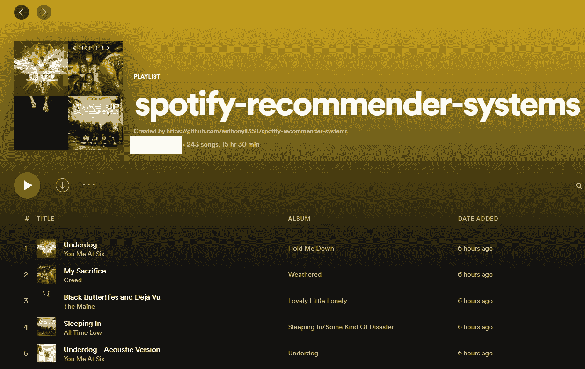

# 使用你自己的 Spotify 数据的机器学习和推荐系统

> 原文：<https://towardsdatascience.com/machine-learning-and-recommender-systems-using-your-own-spotify-data-4918d80632e3?source=collection_archive---------6----------------------->

## 利用数据科学创建 Spotify 推荐



此项目的结果播放列表。(*作者截图)*

# 介绍

作为一个每天都在使用 Spotify 的人，我对我可以用自己的音乐数据做什么分析很感兴趣。Spotify 在通过每日混音和音轨广播推荐音轨方面做得很好，但我们自己如何构建这样的东西呢？这里的目的是使用机器学习和推荐系统技术，根据我最喜欢的播放列表中的曲目推荐新曲目。

**本文对该项目进行了更高层次的概述。代码和结果可以在 GitHub** [**这里**](https://github.com/anthonyli358/spotify-recommender-systems) **找到。**

# Spotify 数据

任何好的数据科学项目首先需要数据，而且是大量的数据。

## 访问 Spotify API


用于设置项目的[仪表板页面](https://developer.spotify.com/dashboard/)。(截图*图片作者)*

为了开始使用我们的音乐数据，我们首先需要访问 Spotify API:

1.  为开发者创建一个[Spotify](https://developer.spotify.com/)账户
2.  从仪表板设置一个项目(API 访问需要)
3.  检索客户端 ID、客户端密码，并设置重定向 URI(作为一个本地项目，我将其设置为[http://localhost:9001/callback](http://localhost:9001/callback))
4.  查看 [API 文件](https://developer.spotify.com/documentation/general/guides/)

## 音乐数据

一旦开发者帐户被设置，我们就可以访问 API 来获取音乐数据。为此，我们可以使用 [spotipy](https://spotipy.readthedocs.io/en/2.18.0/) Python 包，这需要我们之前设置的开发人员详细信息，以便通过 OAuth 授予权限。

```
with open("spotify/spotify_details.yml", 'r') as stream:  
    spotify_details = yaml.safe_load(stream)# [https://developer.spotify.com/web-api/using-scopes/](https://developer.spotify.com/web-api/using-scopes/)
scope = "user-library-read user-follow-read user-top-read playlist-read-private" sp = spotipy.Spotify(auth_manager=SpotifyOAuth(
    client_id=spotify_details['client_id'],
    client_secret=spotify_details['client_secret'],
    redirect_uri=spotify_details['redirect_uri'],    
    scope=scope,)
)
```

我们现在可以从 Spotify 库中的各种来源提取数据。`sp`类具有覆盖这一点的函数，如`sp.current_user_playlists()`和`sp.current_user_top_tracks()`。从这些 API 调用中，我们需要提取曲目的详细信息，如唯一 id、名称、持续时间和流派，以及相关的艺术家、专辑和播放列表属性。为了便于分析，我把这些保存为熊猫数据帧。

Spotify 还可以为一首曲目提供[音频功能](https://developer.spotify.com/documentation/web-api/reference/#endpoint-get-audio-features)。这些是数值(通常在 0 和 1 之间归一化),对分析很有用，但特别是作为传统机器学习方法的特征。


一个有用的音轨和音频功能的例子。

# 推荐系统

## 机器学习

有了上面的表格数据集，通过从 1 到 10 对训练集中的歌曲进行评级，可以相当直接地将其表述为一个经典的回归问题，或者通过尝试推荐与我们最喜欢的歌曲相似的歌曲作为一个分类问题(如果您有一个最喜欢的歌曲的播放列表，这是一个相当简单的方法)。记住从训练和测试数据集中删除重复的轨迹 id，以避免数据泄漏！

**XGBoost 和 RandomForest 分类器在我这里表现不错**<https://github.com/anthonyli358/spotify-recommender-systems/blob/main/recommender_playlists.ipynb>****。****

**然而，上述方法严重依赖于特征工程和用户来提供标签。当用户有一个新帐户或者没有提供任何评级时，它遭受错误标记不准确和冷启动问题，因此经常使用推荐系统方法来代替。**

## **人气推荐器**

**流行度推荐器推荐根据流行度排序的歌曲，而不考虑用户的偏好。这当然取决于用于确定流行度度量的方法(通常是时间、用户交互和用户评级的一些函数)。**

****

**Spotify 已经有了歌曲的流行度指标。**

**由于它没有考虑用户的活动，仅仅根据流行度来推荐歌曲是一种糟糕的方式。然而，正如我们将在后面看到的，这是一个很好的方法来混合多样性和避免冷启动问题。**

## **基于内容的推荐系统**

**基于内容的推荐器利用来自用户已经交互过的项目的属性来推荐相似的项目。这里，流行的 [TF-IDF](https://en.wikipedia.org/wiki/Tf%E2%80%93idf) 方法用于将非结构化文本(流派和歌曲/艺术家/专辑/播放列表名称的单字母组合和双字母组合)转换为稀疏矩阵。用户向量和初始矩阵(所有用户)之间的余弦相似性给出了推荐新曲目的度量。**

****

**朋克摇滚和冷酷？**

****

**那好，你六点钟来见我。**

**看起来流派往往是最强的内容形式，可以作为曲目推荐的基础。**

## **协同推荐器**

**协作推荐器可以是基于记忆的(基于过去的用户交互)或基于模型的(例如聚类)。这里，项目×用户矩阵然后被用于基于相似用户的交互向用户推荐项目。**

****

**🎵请注意，这些是与基于内容的推荐器最相关的标记不同的类型。**

**如果用户集太小或交互次数太低，协作方法可能会遇到稀疏性问题。**

## **混合推荐器**

**混合推荐器结合了基于内容和协作的方法，在许多研究中表现得更好。它避免了高方差，并实现了多样性和加权(例如，流派加权)。我们还可以结合流行度方法来给出混合+流行度推荐器。**

****

**我们的最终建议。**

**从主观上来说，这个推荐者似乎给出了实践中最好的推荐！**

# **最终播放列表和想法**

**我们现在可以将我们的曲目添加到 Spotify 播放列表中进行收听！创建轨道 id 的`tracks_to_add`阵列，其中推荐强度高于某个值。**

```
*# Create a new playlist for tracks to add*
new_playlist = sp.user_playlist_create(
    user=spotify_details['user'], 
    name="spotify-recommender-playlists",
    public=**False**, 
    collaborative=**False**, 
    description="Created by [https://github.com/anthonyli358/spotify-](https://github.com/anthonyli358/spotify-) recommender-systems",
)

*# Add tracks to the new playlist* **for** id **in** tracks_to_add:
    sp.user_playlist_add_tracks(user=spotify_details['user'], 
                                playlist_id=new_playlist['id'], 
                                tracks=[id],
                               )
```

**希望播放列表是🔥。为了进一步改进这些建议，我们可以:**

*   **扩展数据集以包括其他用户**
*   **开发其他评估指标(这里使用了前 N 名准确性指标)**