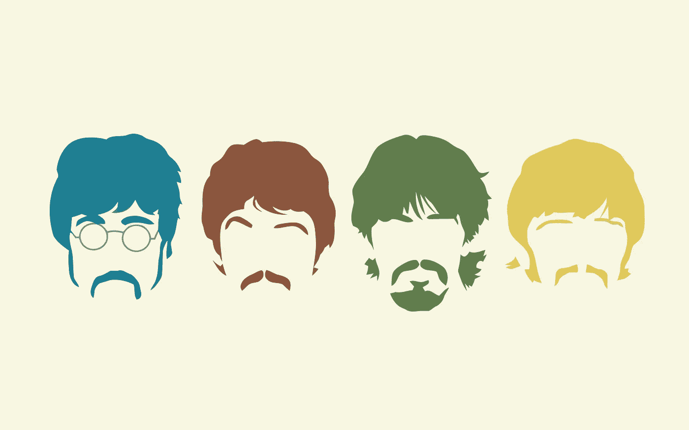

# 机器学习和披头士

> 原文：<https://towardsdatascience.com/machine-learning-and-the-beatles-1fe5ca036871?source=collection_archive---------28----------------------->

## 使用 NLTK 和 GPT-2 分析和生成披头士歌词



图片来自[Pixy.org](https://pixy.org/4222885/)

**介绍🌅**

对于我在 Metis 的最后一个项目，我决定将我对音乐和数据科学的热情结合到一个项目中，这个项目涉及有史以来最好的乐队。整个项目涉及使用 NLTK 库的自然语言处理(NLP)，通过将迁移学习应用于 OpenAI 的 GPT-2 模型的文本生成，以及使用 Steamlit 构建的应用程序。我使用的数据是来自 Genius.com Bealtes 唱片公司的歌词和来自网络的关于谁演唱和创作了每首歌曲的补充数据。在这篇博文中，我将讨论以下话题:

*   数据收集:使用 [lyricsgenius API](https://pypi.org/project/lyricsgenius/) 从 Genius.com[抓取数据](https://genius.com/)
*   NLP:情感分析(我在上一篇[博客文章](/machine-learning-and-veganism-2a1e03e0b262)中讨论了其他主题)
*   文本生成: [GPT-2](https://github.com/openai/gpt-2)
*   App 构建: [Streamlit](https://www.streamlit.io/)

**背景🎵**

起初我认为这个想法很新颖，使用 NLP 来更深入地研究披头士的目录，但谷歌搜索让我知道有多少人已经探索了这个话题。为了使我的项目多样化，我制作了一个应用程序，允许用户选择歌词生成基于哪个披头士。此外，我确保包括一些见解背后的每个披头士和什么使他们的歌曲独一无二。

**数据收集:lyricsgenius API📝**

首先，我想提一下，Genius.com 有自己的 API，但是我发现它很难用于我的目的。它需要你搜索的特定 ID 的知识(艺术家 ID，专辑 ID，歌曲 ID)。当我开始在 Genius.com 的 HTML 脚本中查找与甲壳虫乐队作品相对应的 id 时，我心想，“一定有更简单的方法。”在寻找替代方法时，我发现了 lyricsgenius API。

lyricsgenius API 是一个使用起来相当简单的 API，基本上是 Genius.com API 的包装器，但在搜索没有 ID 信息的歌词时允许更大的灵活性。相应地，你必须从 [Genius](https://genius.com/api-clients) 那里获得一个 API 密匙来输入 lyricsgenius，这样 API 才能正常工作。

为了向您展示使用起来有多简单，让我们快速看一下我的代码:

```
*import* lyricsgeniusgenius = lyricsgenius.Genius("[YOUR KEY HERE]")
```

上面的代码概述了基本的设置:首先，导入 lyricsgenius 其次，将 Genius API 键输入 lyricsgenius API，并赋给 Genius 变量。现在，我们准备好了一些歌词！

```
# Save the album titles to a listalbum_titles = [
   'Please Please Me',
   'With the Beatles',
   "A Hard Day's Night (US)",
   'Beatles for Sale',
   'Help!',
   'Rubber Soul',
   'Revolver',
   "Sgt. Pepper's Lonely Hearts Club Band",
   'Magical Mystery Tour',
   'The Beatles (The White Album)',
   'Yellow Submarine',
   'Abbey Road',
   'Let It Be'
]*# Create a for loop to run through the list of album titles**for* albums *in* album_titles:
   album = genius.search_album(albums, "The Beatles")
   album.save_lyrics()
```

当计算机运行 for 循环时，`album.save_lyrics()`方法会自动将相册的所有元数据保存到当前目录下的. json 文件中。

顺便提一下，`genius.search_album()`方法并不是万无一失的。例如，我必须手动找到“佩珀中士的孤独之心俱乐部乐队”的专辑 ID，并显式地插入它以获得正确的信息。

```
album = genius.search_album(*album_id*=11039, *artist*="The Beatles")
album.save_lyrics()*# Used the Genius API to find the album id for Sgt. Pepper's Lonely Hearts Club Band*
```

包含专辑信息的 json 文件非常密集。出于我的目的，我构建了一个函数来获取每个 json 文件，清理歌词，并只将我想要的信息放入数据帧中，以便于使用。

获取作曲家信息并不有趣。使用 Pandas，我将包含该信息的网页读取到数据帧中，重新构建该数据帧以更相似地匹配包含更深入歌曲信息的数据帧，然后将歌曲标题上的两个数据帧连接起来。像往常一样，有一些必要的数据清理。

**NLP:管道和主题建模🥁**

在我的[前一篇博文](/machine-learning-and-veganism-2a1e03e0b262)中，我提到了 NLP 过程的基本元素(记号化、词干化、矢量化)。我不会太深入，但我为这个项目做了一个非常相似的过程。首先，我创建了一个 NLP 管道来获取所有文档，并对它们进行清理、词干提取、标记化和矢量化。这使得调整 NLP 过程的特定元素来比较您的结果变得非常容易。

在这种情况下，我想在披头士的文集里发掘主题。同样，与我之前的 NLP 项目非常相似，我参与了创建主题、分析这些主题以及操纵 NLP 管道以提取实际有意义的主题的试错过程。有了披头士的文件，我发现了五个一般的主题来将歌曲分类:欲望、现实、关系、家庭和乐趣。

以下是一些例子:

```
**Desire: I Need You – *Help!*** If you can’t see it in the title, it’s all about the narrator needing the subject back in their life**Reality: Drive My Car – *Rubber Soul*** 'Drive my car', 'Working for peanuts' (metaphor, but also talking about life being hard, working for a living, but wanting to be famous)**Relationships: Girl – *Rubber Soul*** All about a girl, how she came into the narrator’s life and was strong women, but the song is about the narrator still falling for her**Home: Golden Slumbers – *Abbey Road*** A song McCartney wrote at home after his mother passed away is all about the concept of home and sleep**Fun: Your Mother Should Know – *Magical Mystery Tour*** A song about hit songs across generations, talking about singing and dancing
```

**自然语言处理:情感分析🎸**

对于情感分析，我使用 NLTK VADER 情感强度分析仪。在这个模块中，我使用了`polarity_scores()`方法，该方法返回四个度量标准:复合、负面、中性和正面。复合测量是在-1(负面情绪)到+1(正面情绪)的范围内测量的，0 是中性情绪，因此将其他三个测量组合成一个度量。利用复合情感测量，人们可以容易地将情感可视化。


作者图片

上图显示了按歌手分组的每张专辑的平均情绪，每条虚线代表一张专辑的发行。

实现 VADER 情绪分析是非常容易的，但是，我对它背后的细节的了解是相当有限的。为了更深入地分析 VADER 情绪，我推荐[这个博客](https://medium.com/analytics-vidhya/simplifying-social-media-sentiment-analysis-using-vader-in-python-f9e6ec6fc52f)。

**文本生成:GPT-2 ⌨️**

现在来看文本生成。首先，不要被文本生成的实现吓倒，因为 GPT-2 不能使生成令人信服的文本变得更容易。GPT-2 本身可以做许多不同的事情，但当具体谈到文本生成时，它有几个简单的步骤可以遵循。我用 Max Woolf 的这个 [Google Colab 笔记本](https://colab.research.google.com/drive/1VLG8e7YSEwypxU-noRNhsv5dW4NfTGce)成功运行了我的第一次迭代，我建议你也这样做。

GPT-2 本身有几个不同大小的预训练模型:

*   小型— 124M 参数/ ~500MB
*   中等— 355M 参数/ ~1.5GB
*   大型— 774M 参数/ ~3GB
*   XL — 1.5B 参数/ >5GB

这就是谷歌 Colab 笔记本真正派上用场的地方。除非你运行的是 GPU，否则你的本地机器不太可能击败哪怕是最低计算能力的谷歌 Colab 笔记本的资源。因此，我建议浏览一下我在上一段中发布的 Google Colab 笔记本。

不管怎样，GPT-2 是什么？它是一个预训练的模型(创成式预训练变压器 2 是全称)，使用深度学习来做许多 NLP 类型的过程。从头开始创建一个神经网络需要大量的数据、时间和计算资源，因此访问 GPT-2 是一种快速有效地解决 NLP 任务的非常显著的方式。这种根据个人需求定制预先训练好的模型的能力被称为迁移学习。关于文本生成，GPT-2 已经准备好生成文本，但是你可以输入一个特定的语料库让它关注，从而生成与我们的语料库更加相似的文本。

关于生成披头士的歌词，我只是输入了语料库，并让模型从披头士那里学习来创作歌曲。现在，GPT-2 非常聪明，所以它会捕捉歌词中的细微差别，如章节标签(“合唱”、“韵文”等)。)或者歌手('哈里森'，'列侬'等。).考虑到这一点，调整您的输入以获得您想要的输出是非常重要的。俗话说，“垃圾进，垃圾出”。

**App Building: Streamlit 🕸**

我无法告诉你我有多喜欢[。这是一种构建 web 应用程序甚至创建仪表板的简单方法。Streamlit 对初学编程的人来说尤其有用，很容易花不到一个小时的时间就能学会一些基本的东西。也就是说，定制是有限的，我不得不使用 HTML 和 CSS 来修改页面，使它看起来像我想要的那样。](https://www.streamlit.io/)

至于代码，我不会深入到每个方面，但有些事情我想指出来。

创建左侧的侧边栏就像下面的代码一样简单。在我的[最终代码](https://github.com/josephpcowell/cowell_proj_5/blob/main/streamlit_app.py)中还有一些导入，但是你只需要导入 Streamlit 来做你的基本应用开发。此外，可以将 selectbox 方法保存到变量中，以便将来对应用程序进行更改。在这种情况下，当您选择不同的歌手时，页面的布局会发生变化，并为该特定歌手加载相应的 GPT-2 模型。

```
*# Import streamlit
import* streamlit *as* st*# Select who will generate the song*singer = st.sidebar.selectbox(
 "Who is singing the song?",
  ("The Beatles",
   "John Lennon",
   "Paul McCartney",
   "George Harrison",
   "Ringo Starr",)
,)
```

我想说的唯一其他代码是关于格式的。Streamlit 允许您很好地定制页面，但我无法找到一个内置的解决方案来使用页面上的图像，所以我搜索并发现 markdown 单元格中的 HTML 可以完成这项工作。我相信 Streamlit 最终会解决这个问题，但是现在，这是唯一的方法。

```
*# Set background image* st.markdown(
  """
  <style>
  .reportview-container {
    background: url("[IMAGE URL]");
    background-position: right;
    background-size: cover;
    background-repeat: no-repeat;
    background-blend-mode: lighten
  }
  </style>
  """,
  *unsafe_allow_html*=True,
) 
```

在 python 文件中，我添加了很多有趣的东西来让这个应用程序工作。本质上，用户选择歌曲的歌手，应用程序选择对应于该歌手的经过训练的 GPT-2 模型(已经根据个人演唱的歌曲的歌词进行了训练)。接下来，您输入一个提示并单击 generate，剩下的工作由 GPT-2 完成。

不幸的是，应用程序需要一点时间来发送输出，所以肯定有改进的空间，但我喜欢它的结局。

**结论:📙**

作为一名有抱负的数据科学家，我希望这个项目有助于巩固我的 NLP 知识，并获得一些关于神经网络和文本生成的经验。在某种程度上，GPT-2 对我来说太容易实现了，所以我不能自信地说我知道如何使用神经网络。然而，与 GPT-2 合作的过程让我明白了神经网络可以有多强大。

至于文本生成，NLTK 是一个非常容易使用的库，一旦你创建了一个基本的管道(随意窃取我的 repo(Metis 为我提供的)中的那个管道)，你就可以将这个管道应用到你未来的任何 NLP 项目中。就我个人而言，我建议学习更多的 NLP 库(我也这样告诉自己)， [spaCy](https://spacy.io/) 似乎在组织中特别受欢迎。

以下是一些基本要点:

*   如果你遇到困难，寻求帮助(我总能找到一个让我的项目运行更顺畅的包)
*   构建一个管道(特别是当你通过试错法进行测试的时候)
*   Streamlit 让创建应用变得简单
*   玩得开心！

查看 [Github 库](https://github.com/josephpcowell/cowell_proj_5)以获得关于该项目的更多信息。这不是我最干净的回购，但我会尝试清理它，以便更好地理解。此外，如果您有任何问题或意见，请联系我们。

由于这是我在 Metis 的最后一个项目，我对在这个项目中的 12 周所学到的一切感到无比惊讶。显然，这是一个很大的信息量，所以我目前正在深入研究所有的主题，以便更好地理解整个数据科学工具包。无论如何，我已经在[媒体](https://josephpcowell.medium.com/)上写了其他三个项目，所以如果你想看我的其他作品，就去看看吧。

伸出手:
[LinkedIn](https://www.linkedin.com/in/josephpcowell/)|[Twitter](https://twitter.com/josephpcowell)