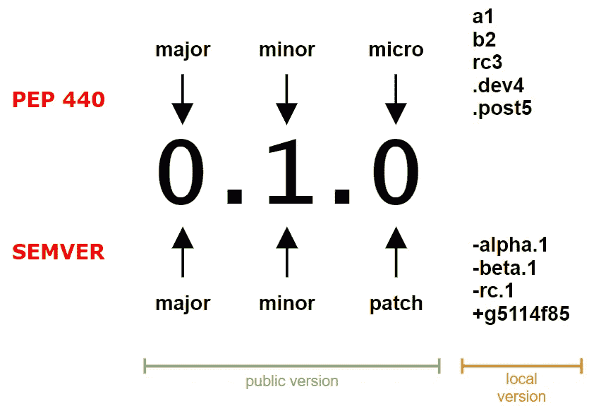
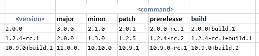
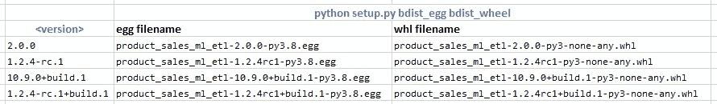
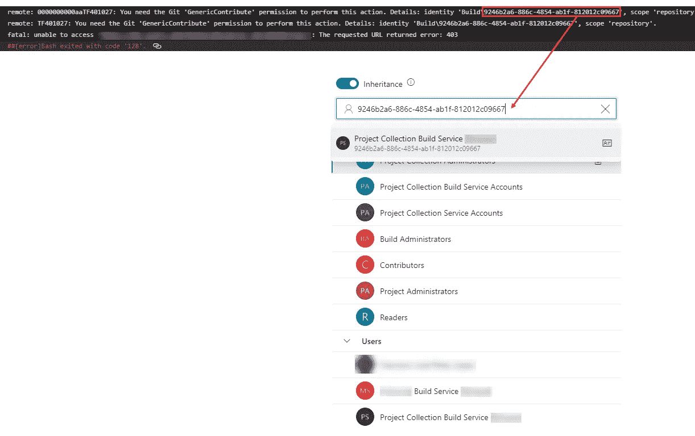
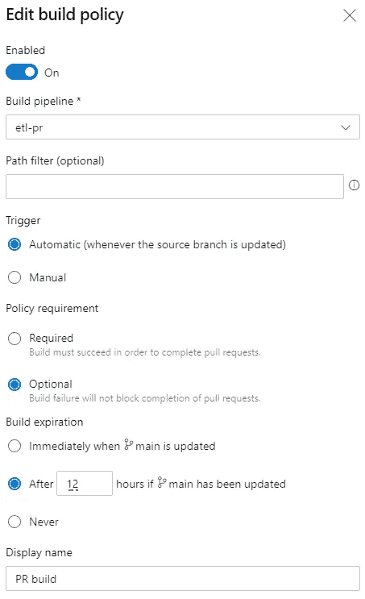

# 机器学习代码再现性

> 原文：<https://towardsdatascience.com/machine-learning-code-reproducibility-using-versioning-9a7ec373173a?source=collection_archive---------44----------------------->

机器学习系统基于 3 个主要部分:数据、代码和模型。这三个组成部分在许多方面是相互关联的，使用依赖控制系统，我们可以最终实现[再现性](/reproducible-machine-learning-cf1841606805)。这个因素非常关键，因为它是在生产中管理 ML 解决方案的主要驱动因素之一。


由[詹姆斯·萨顿](https://unsplash.com/@jamessutton_photography?utm_source=medium&utm_medium=referral)在 [Unsplash](https://unsplash.com?utm_source=medium&utm_medium=referral) 上拍摄的照片

通常，软件依赖和版本控制是艰难而乏味的过程。但是同样地，这些类型的过程是自动化的理想目标。在深入实施之前，让我们回顾一下与这些流程交互的**关键角色**:

## 版本模式

目前，大多数 Linux 发行包都使用一种模式，称为[语义版本](http://semver.org)。另一方面，我们有 Python 来增强它自己的版本控制，由 [PEP 440](https://www.python.org/dev/peps/pep-0440/) ( *版本识别和依赖规范*)来识别。这两种模式有一些共同点，但在某些方面也有所不同。



公共版本和本地版本

如上图所示，两个模式的第一部分( *public* version)几乎是相同的。第二部分(*本地*版本)是 SEMVER 与 PEP440 的区别。每次需要计算版本之间的[优先顺序时，都会评估这两个部分。](https://devhints.io/semver)

鉴于*公共版本*，你应该增加:

1.  主要版本当您进行不兼容的 API 更改时(在 ML 应用程序🡒输入数据/输出响应的情况下)，
2.  以向后兼容的方式添加功能时的次要版本(在 ML 应用程序的情况下，🡒改进特征工程，改变 ML 模型等)
3.  补丁/微版本当你做向后兼容的错误修正

本地版本用于测试尚未准备好供通用的版本*(阿尔法/测试版/预发布/后发布版本、开发者版本等)。*

## *包裹*

*大部分 Python 包都是用`setuptools`打包的*。事实上，方法`setup`有一个`version` [参数](https://docs.python.org/3/distutils/apiref.html#distutils.core.setup)，它又是一个字符串，所以它应该是版本不可知的...对吗？实际上，`setuptools`遵循前面提到的 PEP 440 标准，所以如果您使用语义版本化，您可能会丢失一些关于*本地版本*的信息。稍后当我们回顾`pysemver`时会有更多的介绍。**

## *工件储存库*

*该体系结构中的另一个角色是托管包并将其分发给客户机的地方。但是它也处理其他的*麻烦*:例如，根据客户请求的版本，存储库需要返回(在大多数情况下)最新的版本(这涉及到排序和优先权)。最常用的工件库是 [PyPI](https://pypi.org/) ，但是在私有解决方案的情况下，您也可以使用其他的工件，比如 [Azure 工件](https://azure.microsoft.com/en-us/services/devops/artifacts/)。*

## *持有国家证书的助产士*

*根据我们存储当前包版本的方式，我们可以考虑两种开发版本控制系统的主要策略:*

1.  *第一个策略是添加一个存储软件包版本的文件。例如，[python-version er](https://github.com/python-versioneer/python-versioneer)或 [bump2version](https://github.com/c4urself/bump2version) 就遵循了这一策略。*
2.  *第二个策略依赖于 SCM，因为您将使用 SCM *工件*存储版本。例如，如果您将 GIT 用作 SCM，最普遍的做法是将版本存储为标签；通过这种方式，您可以快速地将包的版本与 git 历史日志关联起来(例如，您可以执行`git checkout 0.1.3`,然后签出在版本 0.1.3 中打包的代码)。在 SCMs 的其他地方，你也可以用树枝。有像 [setuptools_scm](https://github.com/pypa/setuptools_scm/) 这样的工具使用这个策略。*

# *又一个 Python 版本控制*

*我现在和最后要说:没有灵丹妙药。这里给出的解决方案是一个*不知何故* *简单的解决方案*但是足够复杂，所以你可以感觉到与为机器学习应用程序版本化 Python 代码相关的麻烦，所以希望你在实现你自己的版本控制之前测试可能的缺点。*

*对于这个简单的解决方案，我将使用带有标签的 GIT，因为我不喜欢创建 *bump 版本*文件提交或*分离提交*(通常由 CI/CD 编写)。*

*其次，我将使用语义版本，在轻量级 [python-semver](https://github.com/python-semver/python-semver) 的支持下，尽管我将只使用*公共版本*，以保持与 PEP 440 的兼容性。在 PR ( *分支开发*)期间支持*本地版本控制*当然很好，但是目前我会保持事情简单。*

*Python 将包元数据信息(即在`setup`函数中使用的许多[参数](https://docs.python.org/3/distutils/apiref.html#distutils.core.setup)，如`version`和`description`)存储在发行版本身中。我们将使用 Python 3.8 以后内置的对包元数据自省的支持，但如果你想在以前的版本中使用，可以安装包 [importlib-metadata](https://pypi.org/project/importlib-metadata/) 。*

*最后，对于 GIT SCM(存储库)、CI/CD(管道)和工件存储库，我们将依赖于 [Azure Devops](https://azure.microsoft.com/en-us/services/devops/) 。或者，您也可以将 GitHub 用于 SCM 和 CI/CD ( [GitHub Actions](https://github.com/features/actions) )，将 PiPy 用于工件库(至少在 [GitHub 包](https://github.com/features/packages)支持 [Python](https://github.com/github/roadmap/projects/1) 之前)。*

# *简单版本*

*为了这篇文章，让我们创建一个简单的 python 包(一个控制台应用程序)来执行机器学习应用程序的 ETL。在这个阶段，控制台应用程序只是输出包版本，作为我们之前解释过的元数据自省的测试。*

*在应用这个过程之前，需要满足一个要求:您需要推送一个初始标签(第一个版本——这是一个一次性的操作)。只要符合语义版本语法(例如:0.1.0 ),您可以随意命名这个标签*

```
*git tag -a "0.1.0" -m "Release v. 0.1.0"
git push origin "0.1.0"*
```

*那么，要实现上述版本控制，只需执行以下步骤:*

***1。检索最近的标签***

```
*export DESCRIBE=$(git describe --always --tags --long --first-parent)
export VERSION=$(echo $DESCRIBE | cut -d "-" -f 1)*
```

*首先，要创建一个新版本，我们需要知道当前的版本。在使用 GIT 作为 SCM 的情况下，我们将存储(当前)版本作为存储库的标签。因此，在这种情况下，`[git describe](https://git-scm.com/docs/git-describe)`将返回最近的标签，执行该命令的结果可能类似于`0.1.27-3-ge72f11d`。命令响应可以分成不同的部分，例如:*

*   *`0.1.27`:最新标签*
*   *`3`:在`0.1.27`标签后更新(提交次数)*
*   *`e72f11d` : git 提交哈希。这非常方便，因为您可以使用提交散列来检查相关的版本:*

**

*使用散列和标签的 git 检验是等价的*

***2。安装** `**pyton-semver**` **和*凸起*当前版本***

```
*pip install semver==2.13.0
export VERSION=$(pysemver bump patch $VERSION)*
```

*[python-semver](https://github.com/python-semver/python-semver) 是一个透明而简单的库(从不会在源代码中引入任何新工件的意义上来说)。此外，`python-semver`安装`pysemver`命令，该命令可以从 CLI 启动。例如，下表收集了执行`pysemver bump <command> <version>`时返回的数据*

**

*使用 pysemver 的凹凸版本*

*这种方法不需要将`pyton-semver`作为应用程序的包依赖项，因为它只需要在 CI/CD 代理中*提升*当前版本(因此您不需要在您的`requirements.txt`中包含`python-semver`)。*

***3。使用*凸起的*版本**创建一个新标签*

```
*git tag -a "$VERSION" -m "Release v. $VERSION"
git push origin "$VERSION"*
```

*将标签推送到存储库可以避免新提交触发任何 CI/CD 管道。*

*在应用方面，我们需要:*

***1。定义**和`**setup.py**`*

```
*from setuptools import setup, find_packages
​
setup(name=_package_name_,
      packages=find_packages(include=["etl"]),
      version=os.getenv('VERSION','2.0.0'),
      python_requires=">=3.8")*
```

*该方法使用之前已经设置好的环境变量作为`version`参数(该变量包含*碰撞*版本的值)。然后，您可以执行:*

```
*python setup.py bdist_wheel*
```

*并在`dist`文件夹中获得一个名为`product_sales_ml_etl-0.1.2-py3-none-any.whl`的文件。另外，请注意，如果您使用的是*本地版本*，那么*版本*可能会在文件名中出错。例如，在下表中，您可以观察到`-rc.1` *版本*在文件名中被标记之前已被更改:*

**

*使用 setuptools 的包命名*

*这就是为什么不建议从文件名获取文件版本的原因之一，您应该尝试使用其他机制，比如包自省。*

*所描述的步骤可以很容易地打包到一个管道中，并由 CI/CD 执行。在前面解释的第三步中，在推送标记时，您需要授予 building service 权限来完成此类操作。按照[注释的步骤从管道](https://docs.microsoft.com/en-us/azure/devops/pipelines/scripts/git-commands?view=azure-devops&tabs=yaml)运行 git 命令后，我一直有一个错误声明`You need the Git 'GenericContribute' permission to perform this action`。如果是这种情况，我解决这个问题的方法是检查错误中返回的用户 ID，并在 Permissions 选项卡中查找这个用户 ID，如下图所示:*

**

*Azure Devops —存储库权限选项卡*

*对于选定的用户，您应该检查“贡献”、“创建标签”和“读取权限”。*

***2。检查当前版本***

*出于好奇，您可以检查一个名为`product_sales_ml_etl.egg-info`的文件夹，其中包含一个名为`PKG-INFO`的文件，内容与此类似:*

```
*Metadata-Version: 2.1
Name: product-sales-ml-etl
Version: 2.0.0
Requires-Python: >=3.8*
```

*这个文件夹也被打包到你的轮子/鸡蛋文件中，当你依次使用库`importlib-metadata`时，它会检查这些打包的文件:*

```
*from functools import lru_cache
_package_name_ = "product_sales_ml_etl"
​
@lru_cache
def get_version():
    from importlib.metadata import version
    return version(_package_name_)*
```

*最后，可以设置另一个 devops 管道任务来发布和/或使用包:*

***1。发布包***

*管道生成的 python 包可以上传到 PyPI 或任何兼容的 pip 存储库。Azure [工件库](https://docs.microsoft.com/en-us/azure/devops/artifacts/quickstarts/python-packages?view=azure-devops)与 pip 兼容，在设置好之后，您可以使用下面的 devops 模板，该模板使用 [twine](https://pypi.org/project/twine/) 来上传包:*

```
*- task: TwineAuthenticate@0
  inputs:
    artifactFeeds: 'productsalesml/wheel_feed'
    publishPackageMetadata: true
​
- bash: |
    pip install twine
    python -m twine upload --config-file $(PYPIRC_PATH) -r "productsalesml/wheel_feed" dist/*.whl
  displayName: Upload artifacts to feed*
```

*在这个阶段，您开始意识到在处理版本控制时一些令人讨厌的细节:例如，在前面描述的 bash 任务中，我们使用了`dist/*.whl`。正如您之前所检查的，生成的文件名取决于包名+在 set up 函数中设置的版本+ python 版本，因此 this (filename)可能会频繁更改(只要这些参数中的任何一个发生更改)。这就是为什么我们使用模式匹配来匹配任何扩展名为`.whl`的文件，而不使用任何固定的文件名。*

***2。消费包***

*一旦将包上传到提要中，也可以在管道中使用它:*

```
*- task: PipAuthenticate@1
  displayName: Pip Authenticate
  inputs:
    artifactFeeds: 'productsalesml/wheel_feed'
    onlyAddExtraIndex: true
​
- bash: |
    pip install product-sales-ml-etl
    python -m etl.console_main
  displayName: Install package and test it*
```

# *扩展版本*

*有时您需要存储关于版本/构建过程的附加信息(例如，存储整个`git describe`响应和/或`[Build.BuildNumber](https://docs.microsoft.com/en-us/azure/devops/pipelines/build/variables?view=azure-devops&tabs=yaml#build-variables-devops-services)`)。理论上，你可以利用包的元数据来存储这样的信息，但是我找不到任何扩展元数据的*友好的*方式(尽管 [PEP 459](https://www.python.org/dev/peps/pep-0459/%20) 申明是可能的)。最后，我将扩展版本编码到长描述元数据中。*

*首先，我们需要扩展管道执行期间捕获的信息。例如，将以下变量添加到 devops 管道中:*

```
*variables:
- name: buildnumber
  value: $(Build.DefinitionName)_$(Build.Repository.Name)_$(Build.SourceBranchName)_$(Build.BuildNumber)*
```

*这创建了一个名为`buildnumber`的管道变量，它使用[构建预定义变量](https://docs.microsoft.com/en-us/azure/devops/pipelines/build/variables?view=azure-devops&tabs=yaml#build-variables-devops-services)的值进行定义。`buildnumber`的值可能类似于:`cicd-main_etl_testBranch_20201229.18`*

*   *`cicd-main` : `Build.DefinitionName` 🡒 devops 管道名称*
*   *`etl` : `Build.Repository.Name` 🡒仓库名称*
*   *`testBranch` : `Build.SourceBranchName` 🡒分行名称的*末段*(例如`features/testBranch` *末段*为`testBranch`)*
*   *`20201229.18` : `Build.BuildNumber` 🡒构建号基于构建日期+增量 ID*

*现在，setup 方法可以收集先前在管道执行期间设置的环境变量的值(这里我定义了默认值，在本地测试或检查空值时很有用):*

```
*from setuptools import setup, find_packages
import json
​
metadata_custom = {
    'version': os.getenv('VERSION','0.1.2'),
    'revision': os.getenv('DESCRIBE', '0.1.2-1-ge34ce98'),
    'buildNumber': os.getenv('BUILDNUMBER','etl-main_etl_main_20210101.1')
}
​
metadata_custom_as_markdown = \
rf"""```json
{json.dumps(metadata_custom)}
```"""
​
setup(name=_package_name_,
      version=os.getenv('VERSION','0.1.2'),
      packages=find_packages(include=["etl"]),
      long_description=metadata_custom_as_markdown,
      long_description_content_type="text/markdown",
      python_requires=">=3.8")*
```

*如何访问存储在描述元数据字段中的信息？使用`importlib.metadada`的方式与简单版相同。尽管在这种情况下，使用方法`distribution()`，它不仅返回版本，还返回所有元数据属性。然后，在相应地解析描述后，您可以使用以下代码来获取版本元数据:*

```
*@lru_cache
def get_version_metadata():
    from importlib.metadata import distribution
    import json, re
    metadata = distribution(_package_name_).metadata
    description = metadata["Description"] or metadata.get_payload()
    regex = r"^\s```json(.*)^\s```"
    matches = re.findall(regex, description, re.MULTILINE | re.DOTALL)[0]
    return json.loads(matches)*
```

*最后，您可以扩展 main 函数来显示两个版本:*

```
*import argparse
​
def display_version():
    print(f"version: {etl.get_version()}")
    print(f"extended version: {etl.get_version_metadata()}")
​
if __name__ == "__main__":
    parser = argparse.ArgumentParser()
    parser.add_argument('--version', '-v', help="display version", action="store_true")
    args = parser.parse_args()
    if args.version:
        display_version()*
```

# *主分支和其他分支的区别*

*在某些情况下，您对主分支(发布)和特性/修复分支的需求会有所不同。例如，如果您需要从一个特性分支生成一个预发布包，以便在某个阶段环境中测试这个包。在这些情况下，建议不要创建新标签(因为这将触发新版本)，而是生成一个*本地版本*(使用构建、预发布或其他自定义命名)。*

*我们可以使用两种不同的管道来区分两种不同的工作流:*

*   *cicd-main:由对 main 分支的任何提交触发*

```
*trigger:
  batch: True
  branches:
    include:
    - main*
```

*   *cicd-pr:由主分支的拉请求触发。设置略有不同，因为触发器在 YAML 文件中设置为 none:*

```
*trigger:
  none*
```

*虽然 YAML 有一个`pr`模式，但是似乎[只对 GitHub 和 Bitbucket 存储库](https://stackoverflow.com/a/60429765)有效。相反，我们将使用[分支策略](https://docs.microsoft.com/en-us/azure/devops/repos/git/branch-policies?view=azure-devops#build-validation)来触发管道。请考虑下图中描述的配置，1)允许将提交推送到主分支 2)管道不需要成功获得 pr 批准 3)合并 PR 时管道是**而不是**执行的(如果您更改前面的选项，合并 PR 时主管道和 PR 管道**都将执行**)。如果可以使用 YAML 更好地管理这种行为，那就太好了，但是目前，我们需要使用如下所示的 UI:*

**

*Azure Devops —编辑策略选项卡*

*最后，生成了一个更新版本，但是没有将标签推送到存储库，也没有使用 twine 上传 Python 包。但是 Python 包是作为管道的神器上传的，所以以后可以用。*

```
*- bash: |
    ls $(Pipeline.Workspace)/dropArtifacts/*.whl | xargs -I {} pip install {}
    pip list
  displayName: Install package from artifact store
​
- bash: |
    LOGURU_LEVEL=WARNING
    python -m etl.console_main -v
  displayName: Test etl.console_main*
```

*这种方法的一个缺点是，从相同(甚至不同)的特性分支中生成的所有构建将具有相同的版本。如果你需要对这种行为进行更多的控制，我推荐使用*本地版本*。*

# *摘要*

*没有灵丹妙药。这可能看起来是一个令人费解的解决方案，但如果你必须随身携带一件东西，那就是你必须绝对建立一种机制，确保你的机器学习应用程序的可重复性。您可以查看下面的存储库—[https://github.com/franperezlopez/blog_databricks](https://github.com/franperezlopez/blog_databricks)—它展示了这里讨论的技术以及关于部署 Databricks 应用程序的其他方面(如果您有兴趣在以后的帖子中讨论这些方面，请写一篇评论)。此外，欢迎在评论中分享你对这一过程的任何见解。*