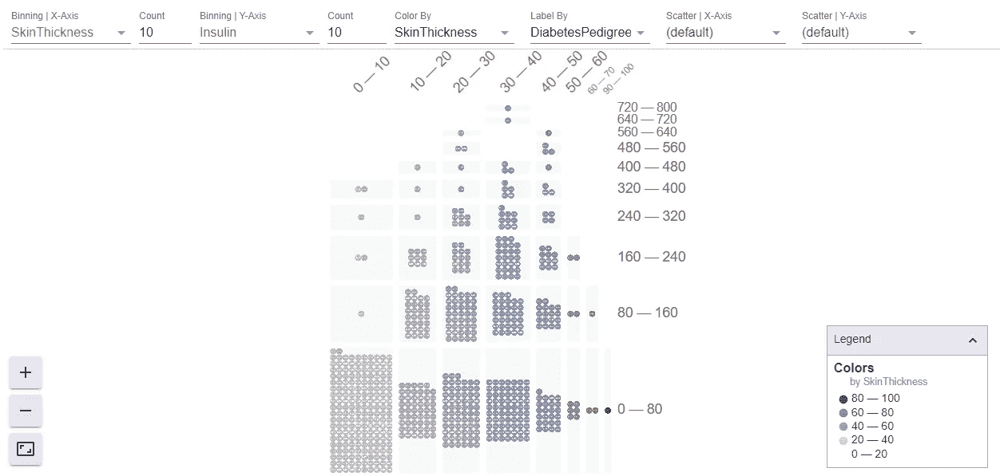
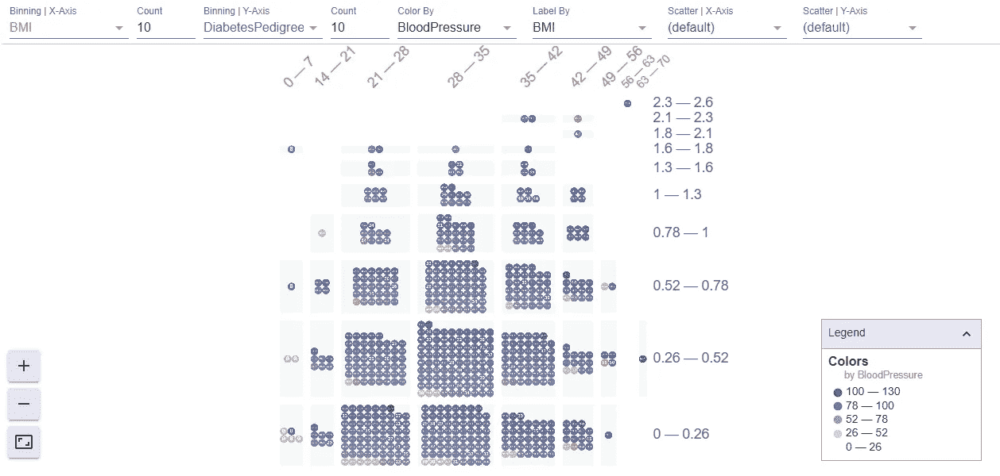

# 机器学习数据可视化

> 原文：<https://towardsdatascience.com/machine-learning-data-visualization-4c386fe3d971?source=collection_archive---------16----------------------->

## 使用方面进行数据分析和可视化



来源:作者

你有没有在从各种图形中寻找洞见的时候纠结过？那么这篇文章就送给你了。如果你是一名数据科学家或数据分析师，你可能已经绘制了许多图表来研究数据，但现在你可以在一个单独的图中做同样的事情。

机器学习数据可视化对于理解数据如何在特定的机器学习模型中使用非常重要，它有助于分析数据。Facets 是一个开源的 python 库，可以用来轻松地可视化和分析数据。

方面由两种不同的可视化组成，一种用于理解我们拥有的数据，另一种用于分析我们拥有的数据。在本文中，我们将探索这两种可视化。

让我们开始吧…

# 安装所需的库

我们将从使用 pip 安装一个 Facets 库开始。下面给出的命令可以做到这一点。

```
!pip install facets-overview
```

# 导入所需的库

在这一步中，我们将导入加载数据集和可视化数据集所需的库。

```
import pandas as pd
from IPython.core.display import display, HTML
```

# 正在加载数据集

在本文中，我们将使用著名的糖尿病数据集，可以从网上下载。

```
train_data = pd.read_csv("/content/train.csv")
test_data = pd.read_csv("/content/test.csv")
```

# 创建前端

为了创建可视化方面，使用预定义的 HTML 模板。在这一步，我们将加载前端并创建可视化。

```
jsonstr = train_data.to_json(orient='records')
HTML_TEMPLATE = """
<script src="https://cdnjs.cloudflare.com/ajax/libs/webcomponentsjs/1.3.3/webcomponents-lite.js"></script>
<link rel="import" href="https://raw.githubusercontent.com/PAIR-code/facets/1.0.0/facets-dist/facets-jupyter.html">
<facets-dive id="elem" height="600"></facets-dive>
<script>var data = {jsonstr};
document.querySelector("#elem").data = data;
</script>"""
html = HTML_TEMPLATE.format(jsonstr=jsonstr)display(HTML(html))
```



来源:作者

在这里，您可以清楚地看到不同轴上的数据。面创建了一个图形用户界面，正如您在这里看到的，我们可以分别选择我们想要可视化的不同列和轴。

我们可以使用这种可视化来理解数据，还可以分析数据的不同特征之间的关联。

继续尝试不同的数据集，并使用 Facets 创建不同的可视化效果。如果您发现任何困难，请在回复部分告诉我。

点击下面的链接，查看不同的机器学习项目。

[](https://www.dezyre.com/article/top-10-machine-learning-projects-for-beginners-in-2021/397/) [## 2021 年面向初学者的 30 大机器学习项目创意

### 立即访问已解决的项目“我可以用机器学习做什么项目？”我们经常被问到这个问题…

www.dezyre.com](https://www.dezyre.com/article/top-10-machine-learning-projects-for-beginners-in-2021/397/) 

本文是与 [Piyush Ingale](https://medium.com/u/40808d551f5a?source=post_page-----4c386fe3d971--------------------------------) 合作完成的。

# 在你走之前

***感谢*** *的阅读！如果你想与我取得联系，请随时通过 hmix13@gmail.com 联系我或我的* [***LinkedIn 个人资料***](http://www.linkedin.com/in/himanshusharmads) *。可以查看我的*[***Github***](https://github.com/hmix13)**简介针对不同的数据科学项目和包教程。还有，随意探索* [***我的简介***](https://medium.com/@hmix13) *，阅读我写过的与数据科学相关的不同文章。**