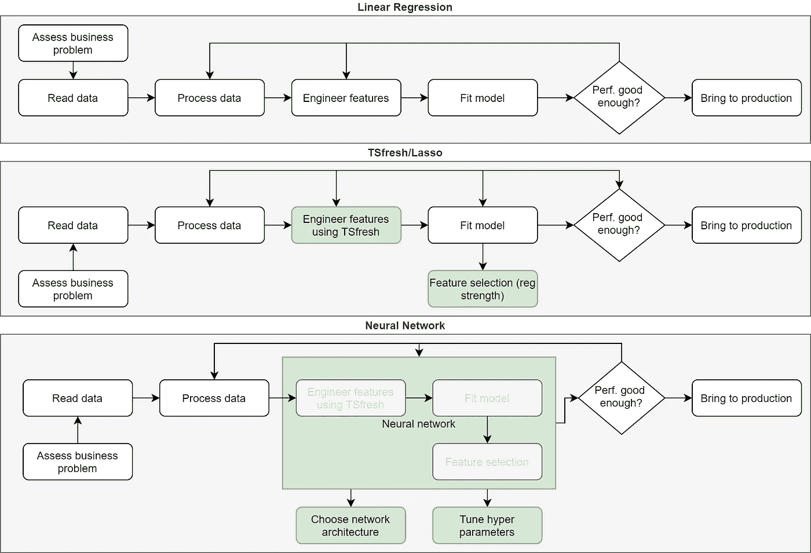

# 机器学习不会神奇地解决你的问题

> 原文：<https://towardsdatascience.com/machine-learning-does-not-magically-solve-your-problems-5ae0bd3269c0?source=collection_archive---------11----------------------->

## *机器学习如何让我们克服不可能的挑战，但仍然需要大量的时间和金钱*

# 介绍

*“我认为 AlphaGo 是基于概率计算的，它只是一台机器。但是当我看到这个举动的时候，我改变了主意。AlphaGo 肯定是有创意的。这步棋真的很有创意，也很漂亮*”([阿尔法围棋纪录片](https://www.youtube.com/watch?v=WXuK6gekU1Y)，52:10–52:40)。在这段引文中，李·塞多尔(Lee Sedol)是有史以来接触围棋最伟大的选手，他在与强化学习代理 AlphaGo 的一场比赛中对臭名昭著的 move 37 做出了反应。这凸显了围绕机器学习尤其是深度学习的那种神奇光环。AlphaGo 的一名开发者后来评论说(56:30)，Alpha Go 是一个“真正简单的程序，离完全人工智能还远着呢”。这种来自非专家的神奇想法与从业者更加现实的观点形成了鲜明对比，在为机器学习项目所需的大规模投资提供支持方面，这是一个真正的挑战。

在这篇文章中，我想剥去一些覆盖机器学习的模糊层。我的目标是提供一个更平衡的观点，说明到底是什么让机器学习变得特别，以及为什么它仍然需要大量的工作。希望下次你讨论为什么你的机器学习项目需要这么长时间时，你可以使用其中的一些想法。

# 创造机器来解决问题

根据我的经验，机器学习项目看起来很像任何其他数据科学项目。我个人认为成功运行数据科学项目需要以下步骤:

*   评估业务需求。根据项目的规模，这涉及到一个或一大群人。
*   阅读我们的数据。这可以来自 csv 文件、SQL 数据库或 Hadoop 集群。
*   处理和理解我们的数据。每列是什么意思？数据质量如何？是否有数据缺失？
*   创建一组特征作为模型的输入。这可以手动完成，或者通过使用某种特征工程套件来完成。
*   符合模型。对于更简单的模型，这仅仅涉及运行一个 Python 函数，但是更高级的技术通常具有超参数，可以调整这些参数以提高性能。
*   评估我们的表现是否令人满意，如果不满意，回到我们之前的任何步骤
*   将模型投入生产

以下三个流程图展示了三个可能模型的这些步骤:多元线性回归、结合 [TSfresh](https://tsfresh.readthedocs.io/en/latest/) 和 Lasso ( [示例](/expanding-your-regression-repertoire-with-regularisation-903d2c9f7b28))以及最后一个神经网络:

三个数据科学工作流(使用 Draw.io 创建)

这些流程图的要点是，从简单的线性回归到神经网络，它们看起来有多相似。在从线性回归到 [TSfresh](https://tsfresh.readthedocs.io/en/latest/) /Lasso 的过程中，我们保持大部分步骤不变，我们只是让 TSfresh 帮助我们生成特征。此外，Lasso 为我们提供了一个很好的方法来选择哪些特性与我们的模型相关。我们自动化了一些步骤，但也增加了调整正则化强度的工作量。TSfresh/Lasso 是一种在*特定情况下*有效的方法，不一定是*快速*或*自动*程序。

观察神经网络方法，我们看到一些手动任务被吸收到神经网络中。具体而言，特征工程和选择由神经网络在内部完成。另一方面，我们必须确定网络架构(层数、互连性、损失函数等)并调整网络的超参数。此外，还需要完成许多其他任务，如评估业务问题。与 TSfresh/Lasso 一样，神经网络是一种在特定情况下工作良好的方法，不是快速或自动化的程序。

将回归转变为神经网络的一个好方法是，不要手动解决问题，**我们建立一个机器来为我们解决问题**。添加这一抽象层使我们能够解决我们从未想过能够解决的问题，但这仍然需要大量的时间和金钱来创造。

# 用机器打败人类

为了扩展建造一台机器来为我们解决问题的概念，我想更仔细地看看 AlphaGo。学习围棋的一个方法是建立一个所谓的专家系统。我们选择世界上最好的围棋手，让他们定义商业规则，告诉我们如何根据棋盘上的状态决定下一步该怎么走。然而，问题是围棋中的许多游戏都无法准确地捕捉到规则，棋手往往根据自己的直觉进行游戏。

或者，Alpha Go 不是通过手动定义玩家应该使用的策略来解决这个问题，而是通过大量玩游戏来学习它们。他们使用的方法称为强化学习，更具体地说是[深度强化学习](https://en.wikipedia.org/wiki/Deep_reinforcement_learning)。该方法的核心是训练一个深度神经网络来获取棋盘的状态，并预测下一步的最佳行动。训练神经网络是通过大量玩游戏来完成的，并根据其表现为网络提供奖励或惩罚。让电脑和自己玩几百万个游戏，让网络慢慢变得越来越聪明。这种方法非常成功，让阿尔法围棋打败了有史以来最好的围棋选手。如果你想了解更多细节，我强烈推荐你去[deep mind 网站](https://deepmind.com/research/case-studies/alphago-the-story-so-far)。

构建 Alpha Go 绝不是一个小壮举，需要机器学习领域最聪明的头脑花费数年时间来解决这个问题。一旦他们建立了深度强化学习机器，机器本身就可以学习围棋。但是制造这台机器仍然是一项艰巨的任务。

# 没有银弹

机器学习有一些神奇而令人敬畏的应用，扩展了我们认为可能使用计算机解决的应用范围。然而，机器学习的可怕潜力并不意味着它自动解决了我们的挑战。

# 我是谁？

我叫 Paul Hiemstra，是荷兰的一名教师和数据科学家。我是科学家和软件工程师的混合体，对与数据科学相关的一切都有广泛的兴趣。你可以在 medium 上关注我，或者在 LinkedIn 上关注 T4。

如果你喜欢这篇文章，你可能也会喜欢我的其他一些文章:

*   [掌握数据科学并不是学习一系列技巧](/mastering-data-science-is-not-learning-a-series-of-tricks-df66d8529c29)
*   [牛郎星图解构:可视化气象数据的关联结构](/altair-plot-deconstruction-visualizing-the-correlation-structure-of-weather-data-38fb5668c5b1)
*   [面向数据科学的高级函数式编程:用函数运算符构建代码架构](/advanced-functional-programming-for-data-science-building-code-architectures-with-function-dd989cc3b0da)
*   [通过规范化扩展您的回归曲目](/expanding-your-regression-repertoire-with-regularisation-903d2c9f7b28)