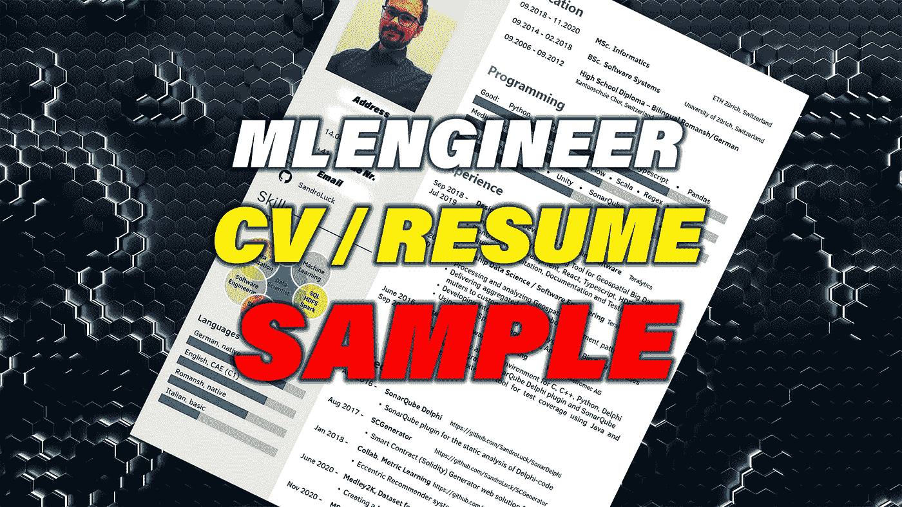
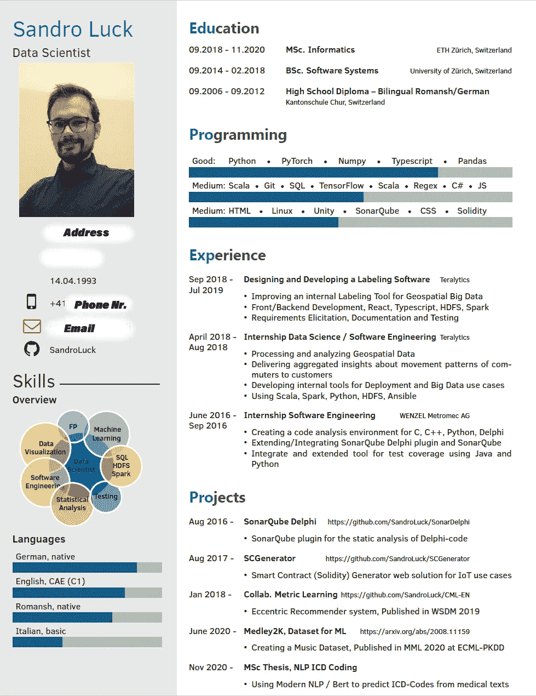
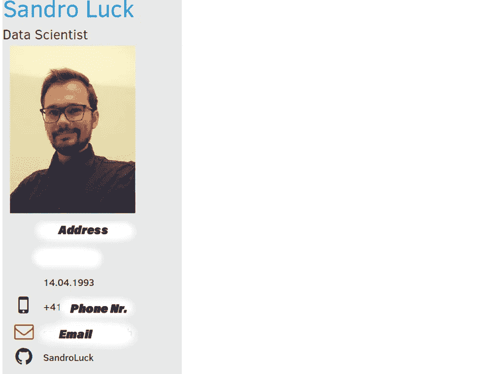
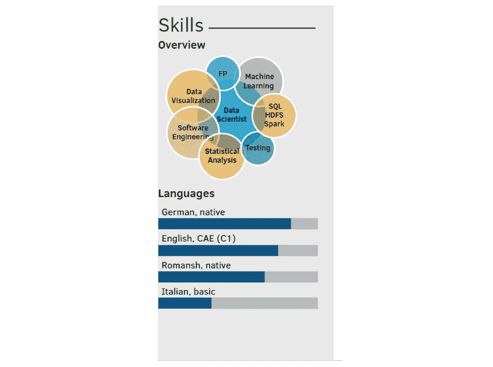
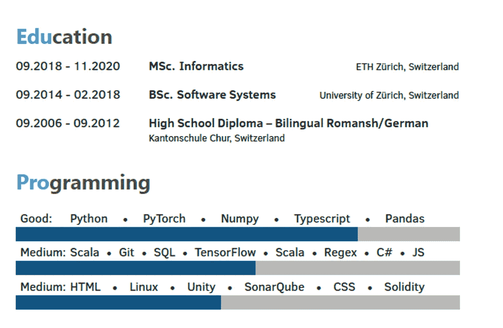
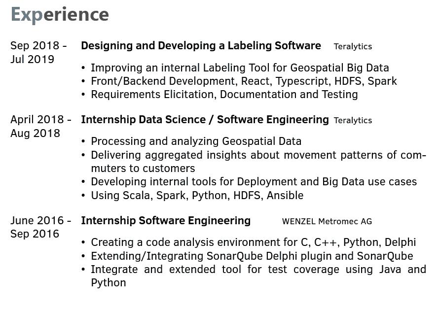
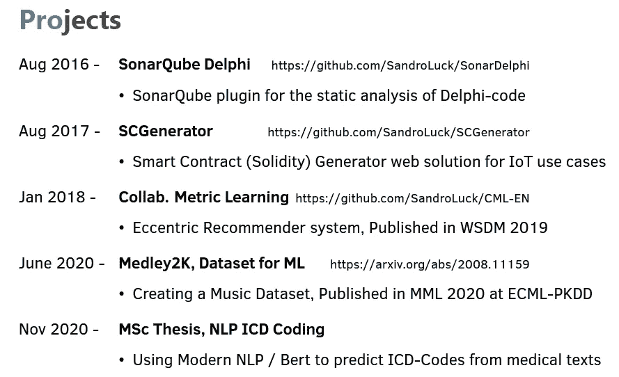

# 机器学习工程师简历示例

> 原文：<https://towardsdatascience.com/machine-learning-engineer-resume-sample-ea7a4951f030?source=collection_archive---------1----------------------->

## 我的个人简历让我得到了几份工作

图片由作者创建，作者的简历背景图片许可证通过 [Envato](https://elements.envato.com/abstract-technological-hexagonal-background-3d-ren-SDF96CS) 持有

找一份新工作甚至是你的第一份工作可能是一个可怕的过程。我可以向你保证，数据科学的世界正在扩大，你也会很快找到工作。

> 信念是迈出第一步，即使你看不到整个楼梯。——小马丁·路德·金

求职的第一步是你的简历。今天，我将向你展示我的个人简历，并向你介绍我写简历时的想法。当你有不太相关的内容时，我也会提到几件你可能想写的事情。

既然我希望你比我更优秀，我也将与你分享不同的潜在雇主在面试中告诉我的关于这一点的信息。

# 简历提交讨论

我的个人简历

# 你的申请完成了吗？

保持简短，保持在一页纸内，不要像脸书用户协议的小字一样填满。我知道你做过和看过的事情足够写几本书了。但是如果你站在大公司招聘人员的立场上，他们会看几百份简历，只想要最精彩的部分。

如果他们觉得你很有趣，他们会在你的求职信和面试中给你足够的时间来享受你的所有福利。

这让我想到了你应该在申请中附上的东西，一封求职信或动机信，你可以在信中更详细地说明为什么你认为自己是这份工作的唯一候选人，是本月的下一个员工。如果你想浏览我的求职信模板，请在评论中告诉我。

另外，附上你的学位和以前雇主的推荐信。许多人不会读它们，但那些真的喜欢你发送它们的人会留下一个完整的好印象。

# 谁看你的简历？

你可能注意到的第一件事是所有的流行语，嗡嗡地飞来飞去，向机器鼓吹你的技能。当你考虑一份简历时，要意识到简历上的第一双眼睛很少是人。这意味着软件会预先扫描你的简历，以减少人力资源人员的工作量。他们通常选择多年的工作经验、技术、教育和行业知识，例如“我们正在寻找一名拥有硕士学位和 3 年 Python 经验的候选人，最好之前有过地理数据工作经验”。

# 基础知识

我们从头到尾过一遍。第一件事应该是你的名字和你要从事的职业，我让数据科学家从一开始就设定正确的基调。个人资料图片并不是在任何地方都很常见，所以如果需要的话可以使用，这张照片相当糟糕，我不得不在“不应该被命名的疾病”的最初锁定期间自己制作，但如果可以的话，请一位合适的摄影师。

联系信息

下面我把所有相关信息联系我。我还写下了我的地址，虽然没什么用，但它告诉了他们你住在哪个城市，有一次我甚至在很短的时间内就接到了面试通知，因为我住在附近，他注意到了，所以细节中有一些好处。

老实说，再看一遍，它可能有点太大了，人们可能还可以放一个 LinkedIn 的链接，许多人喜欢 Linkedin。有时他们甚至在 LinkedIn 上跟踪你，众所周知，跟踪者更有可能再次联系你。电话号码、电子邮件和 GitHub 都是非常值得推荐的，我在面试中被告知这有多好。他们可以立即扫描 Git，我们可以在上面讨论一些项目。

# 技能部分

技能部分可能更像是一个视觉上的惊喜，再次简单明了地展示了我的经历。对于数据科学家来说，语言可能是一件大事，尤其是在处理非英语数据时，所以一定要利用这一点。

技能概述简而言之

# 教育和编程

现在来说说实际的文字和内容。我建议把它分成四个部分:教育、编程、体验和项目。如何排序取决于你认为什么是你最大的优势。如果你有学士或硕士学位，教育是一个必须的部分，我选择把下面的空间留给更相关的项目，但请随意添加你的科目，当然如果你有空间的话。

编程和教育

就我的编程技能而言，我个人喜欢条形图可视化，这也是一个放置更多热门词汇的好地方，如果你想为特定的工作量身定制简历，也相对容易重组。我把我最好的技能从上到下放在这里。Python、Numpy、Typescript、SQL、git，我会确保列出你申请的工作类型所需的最相关的技能，但一般的软件工程技能，如 Git、Sonarqube、SQL 等。应该总有一席之地。

事后看来，我在这里忘记的是 DevOps 工具，如 Jenkins、airflow 和 ansible，以及其他可以成为巨大优势的工具，感觉像是一个开瑞士玩笑的好地方，但我们不在这里开工作玩笑。

# 经验

你最大的部分应该是经历，因为人们通常知道你大学课程的一部分。你的工作经历给了你更多的个人优势。我在这里只写与数据世界相关的工作经验，但是如果你有空间的话，也可以包括学生工作。列出一些要点，简而言之，告诉他们你在做什么，可能还会列出团队规模，因为我被问到这个问题的次数比预期的要多。

事后看来，我也会试着把我从社会角度学到的东西包括进来，比如“必须从各种各样的利益相关者那里获得需求”。或者“为公司客户提供支持”和“在会议上展示技术信息，在会议上我学会了与非技术同事交流统计结果”

简历中我的个人经历部分

# 项目

最后但并非最不重要的项目，就像工作经验一样，这是展示你个人优势的好地方，向他们展示为什么你是这份工作的合适人选。正如你所看到的，我把所有的东西都剪到了一行，因为一个 pdf 文件里真的没有那么多空间。

我的项目部分

我在这里犯的一个错误是我把项目按错误的时间顺序排列，这让一个人感到困惑，实际上你最近的成就应该总是在第一行。

我在学习期间能够合著一些出版物，我认为你应该强调这样的小细节。它向读者展示了你付出了额外的努力，不仅通过了考试，而且对其他人有用。

# 这份简历到底怎么写？

如果你喜欢我的简历模板，我用 Latex 写的，你可以在这里找到这个模板。它是由背页的[这个](https://www.overleaf.com/latex/templates/entry-level-resume-template-latex/jsmpwkcwyntg)模板演变而来。

# 结论

我希望你能从这张小小的纸上学到一些东西，一旦你完成了它，世界就是你的了。那么一旦你出现在面试中，一定要做好准备，如果你想知道我的经历，一定要看看我在机器学习工程师面试过程中的视频和他们肯定会问的问题。

让我在评论中知道这份简历的好和更重要的坏，请问我，它肯定也会帮助别人。

如果你喜欢这篇文章，我会很高兴在 [Twitter](https://twitter.com/san_sluck) 或 [LinkedIn](https://www.linkedin.com/in/sandro-luck-b9293a181/) 上联系你。

一定要看看我的 YouTube 频道，我每周都会在那里发布新视频