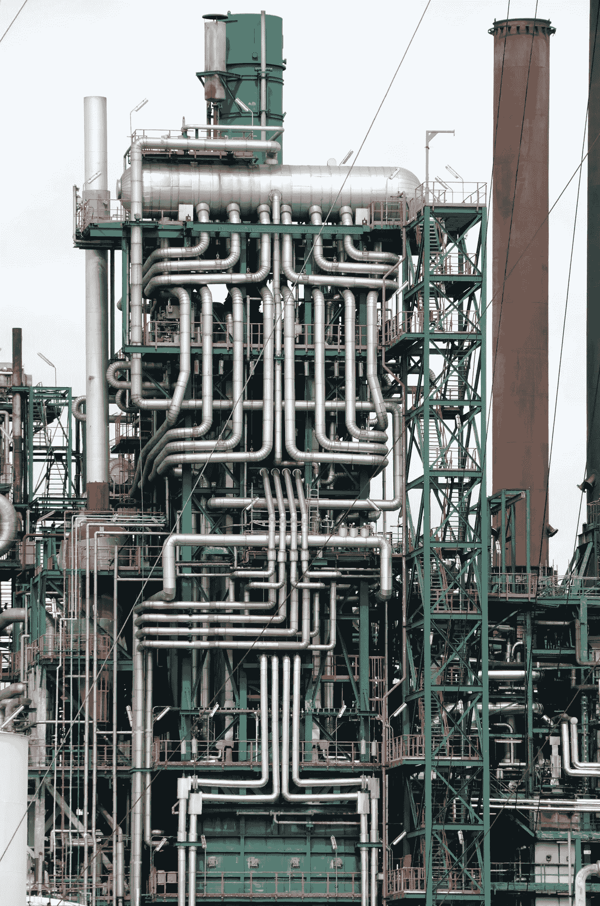
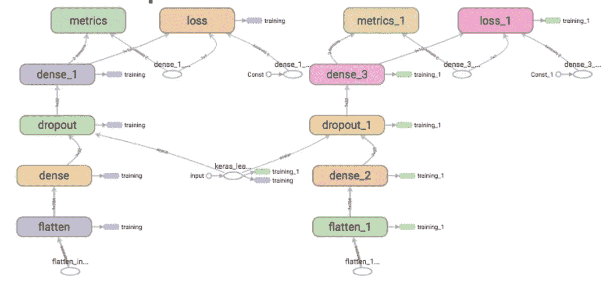
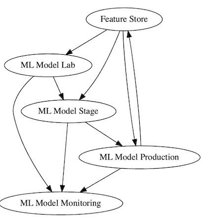
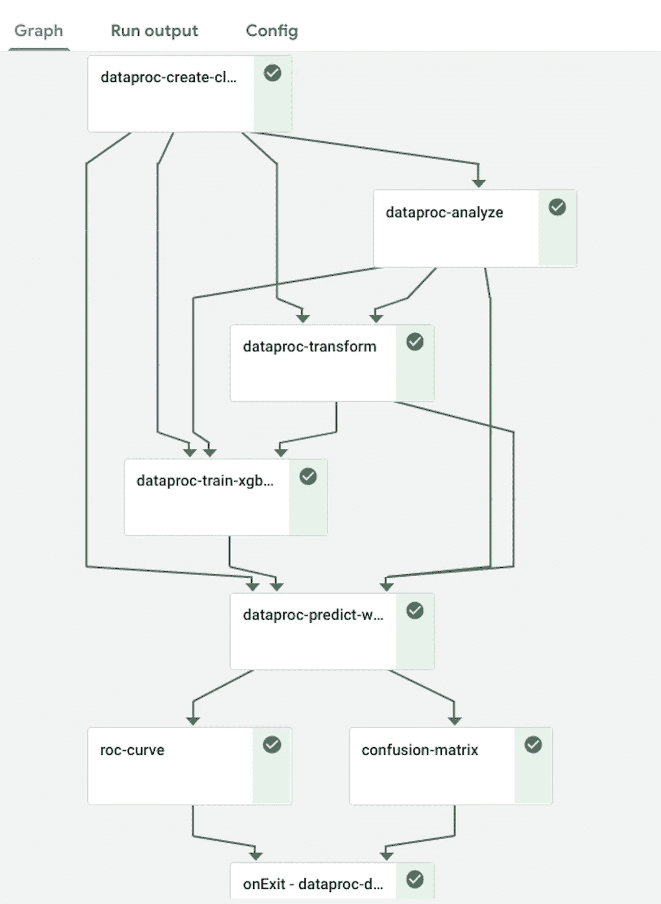
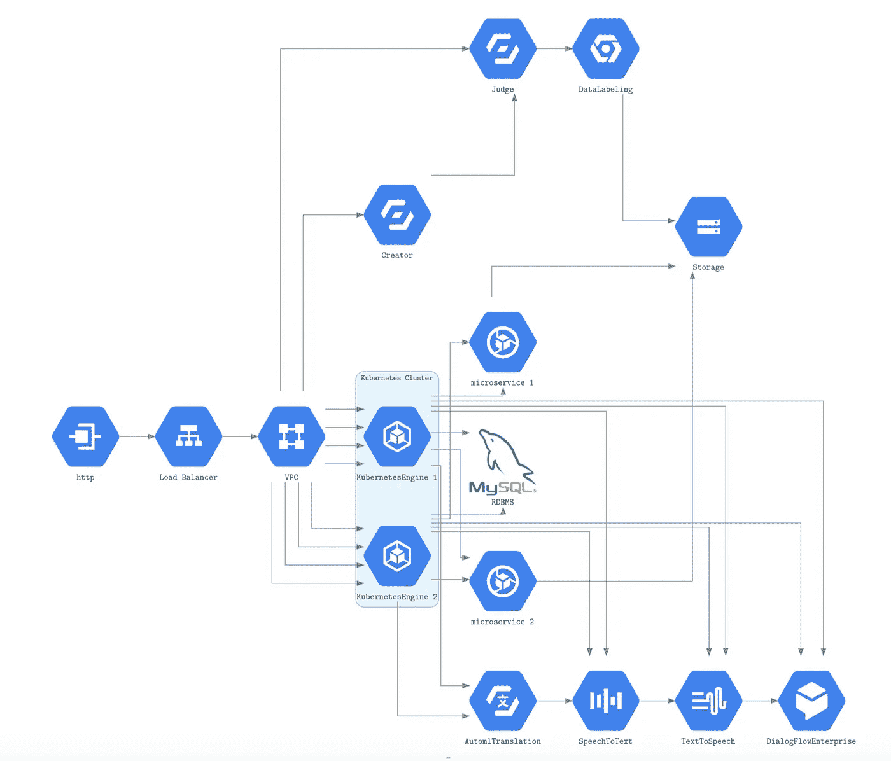
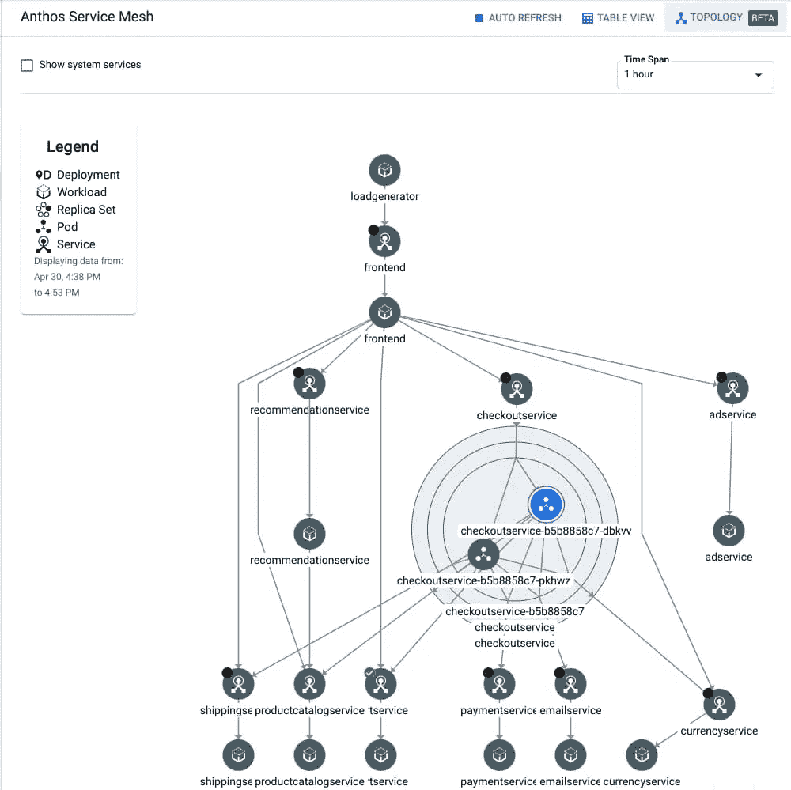

# 机器学习执行是一个有向无环图

> 原文：<https://towardsdatascience.com/machine-learning-execution-is-a-directed-acyclic-graph-211e5e1e6c57?source=collection_archive---------13----------------------->

## 意见

## 机器学习的执行不应该被认为是一个流水线。



图一。复杂的管道网络。是管道吗？保罗·泰森在 [Unsplash](https://unsplash.com/s/photos/pipelines?utm_source=unsplash&utm_medium=referral&utm_content=creditCopyText) 上的照片

随着我们继续开发机器学习操作( **MLOps** ) **，**我们需要把机器学习(ML)开发和部署流程想成一个有向无环图(DAG)。

DAG 是一个可怕的首字母缩写词，但 LTSM、DNN、反向传播、GAN、transformer 和其他许多词也是如此。

我觉得用“*管道*是不对的。

“ *pipeline* 的问题在于它是俚语。但更糟糕的是，它意味着一个线性的步骤过程。

我可以向你保证，人类的大脑不是一个管道

***注*** *:我想不出任何哺乳动物有“管道”。有些昆虫和恐龙有神经节的管道吗？*

也许最可怕的是，没有深厚的数学理论，也没有“*流水线*的伴随算法

Dag 拥有丰富的[算法](https://en.wikipedia.org/wiki/Directed_acyclic_graph)，我们需要这些算法来处理多个卷积神经网络(CNN)的复杂几何结构的非线性步骤。

这就是为什么主要的 CNN 框架，如 Tensorflow、Pytorch、MXNET 等，使用术语 DAG 并且是 DAG。

# 管道的定义是什么？

在机器学习被主流采用之前，计算管道的概念就已经存在了。

> [软件管道](https://en.wikipedia.org/wiki/Pipeline_%28software%29)，由一系列计算[进程](https://en.wikipedia.org/wiki/Process_%28computing%29)(命令、程序运行、任务、线程、程序等)组成。)，概念上并行执行，一个进程的输出流自动作为下一个进程的输入流。被称为[管道](https://en.wikipedia.org/wiki/Pipeline_%28Unix%29)的 [Unix](https://en.wikipedia.org/wiki/Unix) 系统是这一概念的经典例子。—[https://en . Wikipedia . org/wiki/Pipeline _(计算)](https://en.wikipedia.org/wiki/Pipeline_%28computing%29)

你第一次在机器学习的背景下了解管道是在哪里？

我从 sk-learn 机器学习管道中了解了管道。

构想 sk-learn 库的人定义了一个名为`Pipeline`的 Python 类(对象)。

> 顺序应用变换列表和最终估计器。管道的中间步骤必须是“转换”；也就是说，它们必须实现 fit 和 transform 方法。最终的估计器只需要实现 fit。— [sk-learn 管道文档。](https://scikit-learn.org/stable/modules/generated/sklearn.pipeline.Pipeline.html):

一个 sk-learn `Pipeline`的例子:

```
pipe = Pipeline([('scaler', StandardScaler()), ('svc', SVC())])
pipe.fit(X_train, y_train)
```

=>

```
Pipeline(steps=[('scaler', StandardScaler()), ('svc', SVC())])
```

在上面的例子中，pipe 是一个类实例，它将 fit 操作按顺序首先应用到[标准缩放器](https://scikit-learn.org/stable/modules/generated/sklearn.preprocessing.StandardScaler.html) (sk-learn t *转换器*)，然后应用到`[SVC](https://scikit-learn.org/stable/modules/generated/sklearn.svm.SVC.html)` (sk-learn *估算器*)。

我对类 **sk-learn**

## 什么是有向无环图(DAG)？

***注:*** *这篇博客文章并不试图发展大多数计算机科学课程中所要求的图论。*

> [图论](https://en.wikipedia.org/wiki/Graph_theory)中，有向无环图(DAG)是没有[有向圈](https://en.wikipedia.org/wiki/Cycle_graph#Directed_cycle_graph)的[有向图](https://en.wikipedia.org/wiki/Directed_graph)。它由[顶点](https://en.wikipedia.org/wiki/Vertex_%28graph_theory%29)和[边](https://en.wikipedia.org/wiki/Edge_%28graph_theory%29)(也称为*弧*)组成，每条边都从一个顶点指向另一个顶点，这样沿着这些方向永远不会形成一个闭环。—[https://en.wikipedia.org/wiki/Directed_acyclic_graph](https://en.wikipedia.org/wiki/Directed_acyclic_graph)

## 管道像匕首一样混乱

不知何故，从 sk-learn 到现在，流水线和有向无环图(DAG)混淆了。

> 创建、生产和扩展端到端的 ML 管道，并观察这些**管道**产生深远的、改变游戏规则的业务影响。—[https://www . slide share . net/databricks/navigating-the-ml-pipeline-jungle-with-ml flow-notes-from-the-field-with-thunder-Shi viah](https://www.slideshare.net/databricks/navigating-the-ml-pipeline-jungle-with-mlflow-notes-from-the-field-with-thunder-shiviah)
> 
> 管道是对 ML 工作流的描述，包括所有工作流组件以及它们如何在图形中组合。—[https://www . kube flow . org/docs/pipelines/overview/pipelines-overview/](https://www.kubeflow.org/docs/pipelines/overview/pipelines-overview/)

一些人称他们的阶梯网络为 DAG。

> 用于分析 Jenkins 管道(以前的工作流)的插件通过检查组成它们的 FlowNodes 的有向无环图来运行。适用于依赖关系阻止其包含在工作流 API 插件中的情况。— [詹金斯插件](https://plugins.jenkins.io/pipeline-graph-analysis/)

如果我们把一个机器学习模型的执行流程想象成一个 **DAG** ，我们可以使用图论的丰富领域。

## Tensorflow 和 Pytorch 将计算流表示为 DAG。

两个领先的机器学习(深度学习-DL)框架， [Tensorflow](https://www.tensorflow.org/) 和 [Pytorch](https://pytorch.org/) ，构建了 CNN 模型流的 DAG。更重要的是，开发人员社区将这些 CNN 模型称为静态或动态 Dag，而不是管道。

[下面显示的 4 层卷积神经网络(CNN)模型的完整源代码在 GitHub 上。](https://github.com/tensorflow/tensorboard/blob/master/docs/graphs.ipynb)

```
model = keras.models.Sequential([
    keras.layers.Flatten(input_shape=(28, 28)),
    keras.layers.Dense(32, activation='relu'),
    keras.layers.Dropout(0.2),
    keras.layers.Dense(10, activation='softmax')
])
```

Tensorboard 将任何 Tensorflow 或 Pytorch DL 模型的计算流绘制为 DAG。



图二。张量流 CNN 计算流的张量板 DAG。来源: [TensorBoard 文档](https://www.tensorflow.org/tensorboard/graphs)。

## ML 模型用的一些图论算法是什么？

演示“ [*张量流图优化*](https://web.stanford.edu/class/cs245/slides/TFGraphOptimizationsStanford.pdf) ”显示了用于减小 CNN 大小的 DAG 算法，这是因为 CNN 的训练速度更快，但退化不准确。

[用于神经架构搜索的图形超网络](https://openreview.net/forum?id=rkgW0oA9FX)展示了如何使用图论来寻找特定任务的神经网络(NN)拓扑。

所有 CNN DAGs 都具有定义它们可以使用或分析的可能动作和限制的属性。

## 什么是机器学习操作(MLOps)？

MLOps 是自动化机器学习(ML)工作流的实践。MLOps 工作流代表一个 DAG，其节点是 ML 生命周期的总步骤:

*   通过不同的方法输入不同的数据集(FeatureStore)；
*   训练不同的 ML 模型；
*   决定和测试(阶段)将哪个训练好的 ML 模型投入生产；
*   将训练好的 ML 模型部署到生产系统上；
*   监控生产 ML 模型。

这些 MLOps 级在概念上如图 3 所示。



图 3。MLOps 阶段的概念模型。来源:作者。

> 2021 年，我希望我们能够更好地理解机器学习项目的整个周期，构建 MLOps 工具来支持这项工作，以及系统地构建、生产和维护人工智能模型。—吴恩达教授—该批次 2020 年 12 月 30 日

如果我们将机器学习操作流或 **MLOps** 流视为 **DAG** ，我们可以使用图论的丰富领域。

## 这是管道还是 DAG？

Kuberflow 文档显示一系列的 ML 元素(流水线)会导致 DAG 的计算。



图 4:来源: [Kuberflow 文档](https://www.kubeflow.org/docs/pipelines/overview/pipelines-overview/)

这个 Kuberflow [xgboost 示例的代码可以在 Github](https://github.com/kubeflow/pipelines/blob/master/samples/core/xgboost_training_cm/xgboost_training_cm.py) 上找到。

随着部署，机器学习流继续具有更多的元素和更多的分支点。将 ML 流称为管道最多是误导。

我并不是说要停止使用术语*管道。我是说，将图论应用于表示为 DAG 的 MLOps 流有很大的机会。*

## MLOps 用的一些图论算法是什么？

[Cyclone](https://github.com/caicloud/cyclone) 是用于 [Kubernetes](https://kubernetes.io/docs/home/) 资源的工作流引擎。Cyclone 为 DevOps 和 MLOps 工作流元素计划提供了 DAG 模板。

您可以将机器学习(ML)模型的所有元素表示为 DAG。您可以仅为该任务所需的 ML 模型执行简化的子图。图 5 显示了一个例子。



图 5。七种不同的生产 ML 服务的完整架构。来源:作者。

图 5 DAG 的子 DAG 将执行`TextToSpeech`服务。另一个子 DAG 将依次执行`AutoTranslation, SpeechToText, TextToSpeech,`和`DialogFowEnterprise`服务。

用图论算法找到并执行任何连接的子 DAG。

## Git 是版本的 DAG。GitActions 是一个版本上的动作的 DAG。

> [有向非循环图](https://www.techopedia.com/definition/5739/directed-acyclic-graph-dag)可用于 CI/CD 流水线的环境中，以建立作业之间的关系，从而以尽可能最快的方式执行，而不管阶段如何设置。——【https://docs.gitlab.com/ee/ci/directed_acyclic_graph/ 

同样，任何连接的子 DAG 都是用图论算法找到并执行的。

## Anthos 是针对 Kubernetes 混合配置的 MLOps 解决方案。

Anthos 是谷歌精心设计的一个庞大系统，由护目镜云 Kubernetes 服务(GKE)、本地 Kubernetes(企业内部云)和其他供应商的云上的 Kubernetes 组成。Anthos 是一个元 Kubernetes 服务，它将组件及其互连性表示为一个 DAG。Anthos 称 DAG 表示为服务网格。



图 6。Anthos 编排的微服务的 DAG 表示。来源:[谷歌 Anthos 博客。](https://cloud.google.com/blog/topics/anthos/anthos-service-mesh-deep-dive)

> Anthos Service Mesh，Google 的完全托管服务 Mesh，让您轻松管理这些复杂的环境(ed。微服务器集群)并享受其承诺的好处。— [Anthos 服务网](https://cloud.google.com/anthos/service-mesh)

中心点不是你命名的 Anthos 服务网格，而是使用丰富的图论算法集和 DAG 表示。

# 机器学习的 DAG 工具

对于表示为 DAG 的 MLOps 工作流，已经存在具有开放源代码的 DAG 工具:

*   [适用于任何 DAG 的工具集](https://github.com/qri-io/dag)；
*   [气流](https://github.com/epoch8/airflow-dag-tools)(data ops)；
*   [DAG 调度器](https://github.com/haiyanmeng/dagscheduler) : [通用 DAG 调度器](https://github.com/haiyanmeng/dagscheduler)r；
*   [Dagon](https://github.com/stripe/dagon) 支持重写规则在母 DAG 中查找和转换子 DAG。它创建了一个更小、更简单的新 DAG。它消除了冗余的子 Dag，消除了不是可达输入数据的子 Dag，等等。我应该警告你，Dagon 是用 Scala 写的，但是它执行起来很快。请注意，Dagon 由重写规则组成。我认为 Dagon 是一个 DAG 预编译器。向 Dagon 添加一个 Y 后端，其中 Y 是目标介质，这样就有了一个 DAG 到 Y 的编译器。

DAG 工具已为未来的重大 MLOps 执行流程做好准备。

# 摘要

这个博客的中心概念是:

1.  假设我们把 ML 模型的执行流程想象成一个 DAG。我们可以利用图论的丰富领域。
2.  几个不同的 ML 服务创建了重要的 MLOps 执行流。推理 MLOps 工作流的一种方法是将它们表示为 Dag。

直到 20 世纪 80 年代，我们的社交网络只有几十个。如果我们活得够久，有足够的魅力，我们就会拥有数百个社交网络。

现在我们有一个数以千计到数千万计的在线社交网络。你有几个社交网络，有些没有重叠或连接，玩游戏，属于聊天组，有追随者，并关注其他网站。

随着社交网络的发展，机器学习(ML)也将随之发展。我预测在不久的将来，ML 节点和 MLOps DAGs 的网格将在云上支持这些 ML 节点。我预测在电话、机器人和其他边缘设备上会有更小的 ML 服务网。

编码快乐！